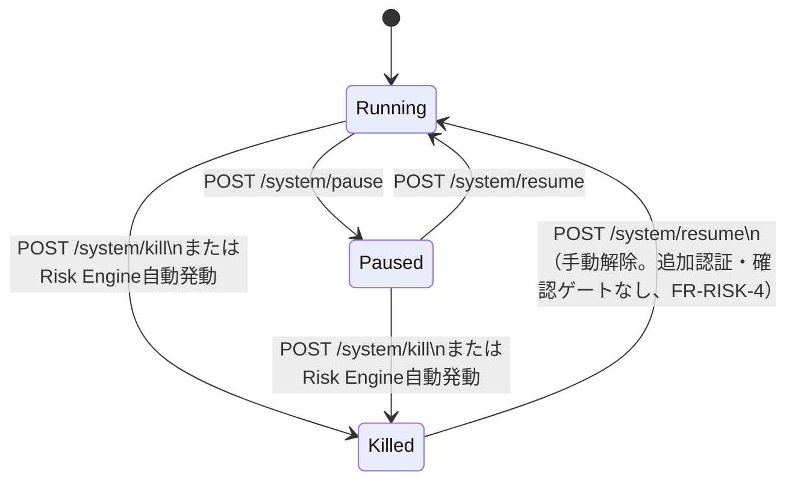

# API 仕様

HALTアーキテクチャの3パターン（ページルート/アクションルート/APIルート）に従う。詳細な設計思想は `components/overview.md` を参照。

## 1. 認証・アクセス制御

- Wailsアプリのページ・APIはWails AssetServer（ネットワークポートなし）経由でのみ配信する。Windows（WebView2）のみ、`/ws/...`のUpgradeだけを受ける専用のループバックリスナー（`127.0.0.1`と`[::1]`の同一ランダムポート。`[::1]`が使えない環境は`127.0.0.1`のみ。他のパスは404）を追加で起動する。いずれもループバックにのみバインドし、外部ネットワークからは到達不能（§6、`requirements/non-functional.md` §4、`cmd/desktop/ws_listener.go`）
  - `cmd/server`の既定待受は`127.0.0.1:48080`。`PITHA_SERVER_ADDR`でloopback以外（`:48080`・`0.0.0.0`・LAN IP等）を指定すると起動を拒否する。意図的に公開する場合のみ`PITHA_SERVER_ALLOW_NON_LOOPBACK=1`を併用する（issue #91/#99）
- 単一ユーザー・単一デスクトップアプリのため、外部IdP連携やユーザーログイン画面は持たない
- 起動時にWailsプロセスがランダムなローカルセッショントークンを生成し、Cookie（`HttpOnly`, `SameSite=Strict`）としてWebViewに設定する。全ての状態変更リクエスト（アクションルート・Huma APIのPOST/PUT/PATCH/DELETE）はこのセッションCookie必須とする
  - 実装（`internal/web/middleware/session.go`）: `RequestLog`・`Recovery`・（後述の）Host検証の**後**、Setup Guardより**前**にGinエンジン全体（`/static`を除く）へ適用する。適用順は`internal/router/router_middleware.go`のとおり `RequestLog → Recovery → HostGuard（許可リスト設定時） → Session → Heartbeat（recorderがあれば） → Setup Guard（secrets storeがあれば） → SystemState`（RequestLog/RecoveryをSessionより前に置くのは、Sessionの403拒否もアクセスログに残し、panicを500として回復するため。issue #109/#122）。プロセス起動ごとにセッショントークンとCSRFトークンを別々に乱数生成し、Cookie（名前`pitha_session`）は有効なCookieを持たない安全なリクエスト（GET/HEAD/OPTIONS、WebSocketアップグレードを除く）の応答で発行する
  - POST/PUT/PATCH/DELETE等の状態変更メソッドは、有効なセッションCookieと、CSRFトークンに一致する`X-CSRF-Token`ヘッダの両方が無ければ403を返す。WebSocketアップグレード（`/ws/...`）は有効なセッションCookieが無ければ403を返す
  - **CSRF拒否の識別（issue #138）**: トークンは起動ごとに再生成されるため、アプリ再起動前に開いたままのページは旧Cookie/旧CSRFトークンを持ち続ける。Cookie無効・CSRFトークン不一致による403には`X-CSRF-Reject: stale`ヘッダを付け、`lib/api.ts`は`StaleSessionError`（Kill Switchパネル等に表示）、`pitha-htmx-errors`は同内容のトーストで「ページを再読み込みしてください」と案内する。再読み込みで新しいCookieとトークンが配布される。ページ遷移（`Accept: text/html`かつ非HTMX・非WebSocket・非`/api/v1`）でのCSRF拒否とpanicによる500は、`router.useMiddleware`が注入する`shared.RenderErrorPage`（`internal/web/handler/shared`）（`pages.ErrorPage`）でHTML本文を返し（`X-CSRF-Reject`ヘッダは維持）、HTMX・fetch・API・WebSocketは従来どおりステータスのみ／プレーンテキストとする（issue #171）
  - **`_csrf`フォームフィールド（issue #142）**: ヘッダを付けられない素のHTMLフォーム送信（JS無効・htmx読込失敗時の`SecretFieldRow`フォールバック）のため、`Content-Type: application/x-www-form-urlencoded`のボディの隠しフィールド`_csrf`も`X-CSRF-Token`ヘッダの代わりに受け付ける（ヘッダがあればヘッダを優先）。セッションCookieは引き続き必須
- **Host/Origin検証（DNS rebinding対策、issue #136）**: `internal/web/middleware/host_guard.go`の`HostGuard`をSessionの前段に置き、Hostヘッダ（ポート・大文字小文字・末尾ドット・IPv6括弧は無視）が許可リストに無いリクエストは`/static`を含め全て403（Cookie・CSRFトークンも発行しない）。状態変更リクエストとWebSocketアップグレードは、`Origin`ヘッダがあれば同じ許可リストに含まれるホストであることも必須（`null`や外部ホストは403、Originなしの非ブラウザクライアントは通す）。許可リストは`router.WithAllowedHosts`で与える
  - `cmd/server`: `localhost`/`127.0.0.1`/`::1`。`PITHA_SERVER_ALLOW_NON_LOOPBACK=1`のときのみ、`PITHA_SERVER_ADDR`のバインドホスト（ワイルドカード以外）と`PITHA_SERVER_ALLOWED_HOSTS`（カンマ区切り）を追加する
  - `cmd/desktop`: Wails AssetServerのHost（`wails.localhost`（Windows）・`wails`（macOS/Linuxの`wails://wails/`））
- HTMXフォームにはCSRFトークンをmetaタグ経由で付与し、`X-CSRF-Token`ヘッダで送信する（`components/overview.md` セキュリティ節）
  - `layout.Shell`/`SetupShell`が`<meta name="csrf-token">`を出力し、`<body hx-headers>`でHTMX全リクエストに`X-CSRF-Token`を付与する。Litコンポーネントは`lib/api.ts`が同metaから読み取って送信する。`SecretFieldRow`のフォームは上記フォールバック用に隠しフィールド`_csrf`も持つ
- 実売買（Phase 7）へ移行しても、Kill Switch解除・発注確定操作に人手の追加認証は要求しない（完全自動運用。`requirements/non-functional.md` §4、FR-RISK-4）。実装（`internal/web/handler/system/system.go`）にも追加認証は無く、`pitha-kill-switch-panel`が確認ダイアログ（`window.confirm`）を出すのはKill操作のみで、Resume（Killedからの手動解除を含む）は確認なしで`POST /api/v1/system/resume`を呼ぶ
- **Setup Guard**: 必須認証情報（JEV_API_KEY/KABU_API_PASSWORD）のいずれかが`secrets`テーブルに未設定の間は、`GET /setup`・`POST`/`DELETE /settings/:key`・静的アセット（`/static/...`）以外の全リクエスト（ページ・アクション・`/api/v1`・WebSocket含む）を`/setup`へ誘導する。誘導方法はリクエスト種別で応答を分ける（ページ遷移: `/setup`へ302、HTMX（`HX-Request: true`）: `204`＋`HX-Redirect: /setup`、`/api/v1`: `503` JSON `{"setup_required":true,"setup_url":"/setup"}`、WebSocketアップグレード: `403`。302をスクリプト系リクエストが追従して`/setup`のHTML全体を受け取らないため、issue #140）。判定はリクエストごとに行うため、3キーが揃った次のリクエストから解除される（issue #80）

## 2. ルーティング概要

| パターン | 例 | HX-Request分岐 | 返却 | 登録先 |
|---------|-----|----------------|------|--------|
| ページルート | `/scanner`, `/symbols/:symbol` | する | フルページ or フラグメント | Gin |
| アクションルート | `/system/update-check` 等 | しない | フラグメントのみ | Gin |
| APIルート | `/api/v1/...` | しない | JSON | Huma |
| WebSocket | `/ws/scanner` 等 | 該当なし | JSONメッセージ | Gin (`github.com/coder/websocket`) |

## 3. ページルート

| メソッド | パス | 説明 |
|---------|------|------|
| GET | `/` | `/scanner` へリダイレクト |
| GET | `/scanner` | Scanner Dashboard。HX-Requestありなら候補テーブルフラグメントのみ返却 |
| GET | `/symbols/:symbol` | Symbol Detail。`<pitha-price-chart>` 等のLitアイランドを埋め込んだフルページ |
| GET | `/performance` | Performance画面。クエリ `from`/`to`（YYYY-MM-DD、JST、`to`含む）・`training_days`/`validation_days`/`forward_days`（既定5/2/1）指定時は記録済みデータでWalk Forwardバックテスト（FR-BT-1〜3）を実行し結果を表示する。不正入力は400。上限: 各 `*_days` は最大366、`from`〜`to` は最大1830日（366×5）、Fold数は最大1000（超過は400）。実行が60秒を超えた場合は503 |
| GET | `/calibration` | Calibration画面 |
| GET | `/settings` | Settings画面。許可キー（`internal/config`のallow-list）ごとに`SecretFieldRow`を表示し、各行が独立した保存・削除フォームを持つ。保存済みの値は再表示せず「設定済み」バッジのみ表示する。エラーログのダウンロード節（`#error-log-panel`、`GET /api/v1/logs/errors`を呼ぶフォーム。FR-ERRLOG-1）を持つ（issue #57/#79/#267） |
| GET | `/setup` | 初回セットアップ画面。必須2キー（JEV_API_KEY/KABU_API_PASSWORD）と任意のSLACK_WEBHOOK_URLを`SecretFieldRow`で表示し、保存・削除は`POST`/`DELETE /settings/:key`を共用する。Setup Guardの例外で、セットアップ完了後も直接アクセスできる（issue #80） |
| GET | `/activity` | System Activity Log画面。`<pitha-activity-feed>`アイランド（SSRフォールバック: キュー状況＋アクティビティ一覧）を埋め込んだフルページ |

## 4. アクションルート

| メソッド | パス | 説明 | 返却 |
|---------|------|------|------|
| GET | `/system/status` | システム状態バッジのフラグメント再取得（Lit→HTMX間接連携: `systemStateChanged`イベント受信時にHeaderが呼び出す）。Kill Switchの操作（pause/resume/kill）はHTMXアクションルートを持たず、`pitha-kill-switch-panel`が§5の`/api/v1/system/*`を呼ぶ（issue #108） | システム状態バッジ |
| GET | `/system/update-status` | 新バージョン検知バナーのフラグメント再取得（Headerの`#update-banner`が`load`・60秒周期・`updateStatusChanged`イベントで呼び出す）。新バージョンが無い/アップデーター未搭載（`cmd/server`）なら空 | `UpdateBanner`（安全ゲート待ち/再起動直前の状態を明示） |
| GET | `/system/update-panel` | Settings画面`#update-panel`のフラグメント取得（現在バージョン・最終確認結果・安全ゲート保留の理由・失敗の種別・確認ボタン）。アップデーター未搭載（`cmd/server`）ではその旨の説明のみ返す（確認ボタンなし） | `UpdatePanel` |
| POST | `/system/update-check` | 「今すぐアップデートを確認」。スケジューラーと同じ`CheckForUpdate`を即時実行し、`HX-Trigger: updateStatusChanged`付きで`UpdatePanel`を返す。確認失敗もパネル内表示（HTTP 200）。アップデーター未搭載なら404 | `UpdatePanel` |
| POST | `/settings/:key` | 単一キーの保存（フォーム項目`value`）。他キーには一切影響しない。`:key`が許可キー一覧（`internal/config`のallow-list: JEV_*/KABU_API_PASSWORD/SLACK_WEBHOOK_URL/LUNA_*/NEWS_FEED_*/SOL_*/OPUS_*）に無い場合、または`value`が前後空白トリム後に空の場合は400（空入力で保存済みの値が消えることはない）。`value`は保存前に前後空白をトリムし、キー別に検証する（URL系6キー: `http`/`https`かつホスト非空、その他: 制御文字・改行を含まない）。違反は400で保存せず、Setup Guardも解除されない。反映はアプリ再起動後（issue #79/#235） | 更新後の`SecretFieldRow`フラグメント |
| DELETE | `/settings/:key` | 単一キーの削除。他キーには一切影響しない。`:key`が許可キー一覧に無い場合は400（issue #79） | 更新後の`SecretFieldRow`フラグメント |
| GET | `/system/secrets-status` | 任意キー（SLACK_WEBHOOK_URL等）の未設定を知らせる全ページ共通バナー（`Header`の`#config-banner`が`load`で取得）のフラグメント。必須2キー（JEV_API_KEY/KABU_API_PASSWORD）はSetup Guardが`/setup`へ誘導するため対象外。全て設定済みなら空 | `SecretsBanner` |
| GET | `/system/marketdata-status` | 市況データ接続エラーを知らせる全ページ共通バナー（`Header`の`#marketdata-banner`が`load`・30秒周期で取得）のフラグメント。kabuステーションAPIのトークン発行が失敗している間だけ、原因（未起動・API未有効 / 未ログイン `4001007`・`4001017` / API利用不可 `4001008` / APIパスワード不正 `4001013`）と対処を表示。トークン取得済みなら空 | `MarketDataBanner` |
| POST | `/positions/:id/close` | 手動決済（成行Paper Exit） | ポジション行フラグメント |

### システム状態遷移（`POST /api/v1/system/*`）

## 5. API ルート（Huma, `/api/v1`）

全文は `docs/api/endpoints/huma-api.md`（§5、節番号・内容は分割前と同一）に分割した。

## 6. WebSocket

データ取得（`engine.State`等）が失敗しても、直ちには接続を閉じない（閉じるとブラウザが再接続を始め、接続自体は生きているのに「接続が切れています」が出るため。issue #266）。サーバーは最初の失敗を`slog`にWarnで記録して次のポーリングで再試行し、連続`MaxConsecutiveTransientErrors`（5）回失敗したら閉じる。回復時はInfoを記録する。書き込み失敗（クライアント切断）と存在しない銘柄（`/ws/symbols/{symbol}`）は即座に接続を終了する（`internal/web/handler/shared/ws_poll.go`の`Transient`）。

デスクトップ版はWindows（WebView2）のみ対応する。Wails AssetServerはWebSocketを扱えず、WebView2は`http(s)://wails.localhost/...`以外（`ws://`）をAssetServerへ回さずネットワークへ直接送るため、待ち受けが無いと接続が失敗する。そこで`cmd/desktop`は`/ws/...`のUpgradeだけを受けるループバックの別リスナー（`router.WebSocketOnly`）をランダムポートで起動し、全画面の`<meta name="ws-base">`でそのアドレス（`ws://wails.localhost:<port>`）をLitコンポーネントに伝える（`lib/ws.ts`の`resolveWsUrl`が参照）。`*.localhost`は`::1`にも解決され得るため、リスナーは`127.0.0.1`と`[::1]`の同一ポートの両方で待ち受ける（IPv6ループバックが無い環境のみIPv4のみ。`::1`側が使用中なら別ポートで再試行）。ホストは`wails.localhost`のためセッションCookie（ポートを区別しない）とHostGuardのOrigin検査（ホスト名のみ比較）はHTTPルートと同じく働き、Origin（`http://wails.localhost`）とHost（`wails.localhost:<port>`）のポート差はws-baseのホスト名に限って許可する（`shared.AcceptWebSocket`）。Windows以外のデスクトップ版（`wails://wails/`）にはこのリスナーがなく、ページ自身のオリジンではWebSocketを張れないためライブ更新は機能しない（未対応）。`cmd/server`ではmetaを出さず、従来どおりページと同じオリジンへ接続する。

| パス | 用途 | 送信メッセージ例 |
|------|------|-----------------|
| `/ws/scanner` | Scanner Dashboardのライブ更新（`pitha-scanner-table`） | `{"type":"scanner_update","items":[...],"as_of":"2026-09-26T10:15:00+09:00"}`（`as_of`は`GET /api/v1/scanner`と同じスキャン時刻・RFC 3339） |
| `/ws/symbols/{symbol}` | Symbol Detailのライブ更新（`pitha-price-chart`, Jev判定パネル） | `{"type":"tick","price":2831.5,...}` / `{"type":"jev_update","direction":"LONG",...}`。`tick`は最新価格が存在する（`price > 0`）間のみ送信し、`pitha-price-chart`は1分足に集約して描画する（issue #183） |
| `/ws/system` | Kill Switch発動等のシステムイベント通知（ヘッダーバッジ用、OOBの代替としてLit非経由でも利用可） | `{"type":"kill_switch","reason":"daily_loss_limit"}`。`reason`は未解決の`kill_switch_events.reason`で、`daily_loss_limit`/`consecutive_losses`/`market_data_down`/`jev_api_down`/`broker_api_error`/`unexpected_position`/`fill_discrepancy`/`db_write_failure`/`operator_heartbeat_timeout`/`operator_manual`（手動Killは`operator_manual`）のいずれか。`kill_switch_events`行の記録に失敗しフラグのみ立った場合のフォールバックは`manual` |
| `/ws/activity` | System Activity Logのライブ更新（`pitha-activity-feed`） | `{"type":"job_update","queue":"jev-scout","pending":2,"running":1,"failed_recent":0}` / `{"type":"activity_event","event":{"type":"jev_scout","timestamp":"...","symbol":"7203"}}`。接続直後の送信はなく、初期状態は`GET /api/v1/activity`から取得する |

WebSocketクライアント実装は `components/overview.md` の `lib/ws.ts`（自動再接続、指数バックオフ）を必ず経由する。

## 7. エラーレスポンス

- Huma APIのバリデーションエラーはRFC 7807 Problem Details形式で自動生成される（`components/overview.md` Huma APIパターン参照）
- 5xx応答は固定メッセージのみを返し、原因エラーは`errors[]`に含めずslogへ記録する（`internal/web/apierror`の`huma.NewError`上書き、issue #215）。4xxのバリデーションメッセージは`errors[]`にそのまま出力し、`ErrInstrumentUnknown`の404は`unknown symbol`固定
- ビジネスエラー（例: Risk Engine拒否によりKill Switch解除不可）はカスタムエラーも同じProblem Details形式に統一する
- アクションルート（HTMX）の失敗（4xx/5xx）は該当ステータスと`atoms.Toast`フラグメントを返し、クライアントが`#toast-region`へ表示する（`components/overview.md` §4「エラー表示」）。SSRページルート（`/scanner`・`/symbols/:symbol`・`/activity`）の失敗は、フルページ遷移には`pages.ErrorPage`（ステータス＋固定メッセージ。`err.Error()`は画面に出さずslogへ）、HTMXには同じトーストフラグメントを返す。`/symbols/:symbol`は`ErrInstrumentUnknown`のみ404、他は500（issue #143）。`POST`/`DELETE /settings/:key`の成功応答は、HTMXリクエスト（`HX-Request: true`）には行フラグメント、それ以外（JS無効のフォーム送信）には送信元画面（`/setup`または`/settings`）への303リダイレクトを返す。失敗応答（400/500）はHTMXリクエストにはトースト、それ以外には`pages.ErrorPage`（完全なHTML）を返す（issue #184）

## 改訂履歴

| 版 | 日付 | 変更内容 | 変更理由 |
|----|------|---------|---------|
| 1.0 | 2026-09-26 | 新規作成 | 初版 |
| 1.1 | 2026-09-28 | §3 `/performance` にWalk Forwardバックテスト実行クエリを追記 | #53 バックテスト実行導線 |
| 1.2 | 2026-09-29 | §4に`/system/update-status`・`/system/update-panel`・`/system/update-check`を追加 | issue #76実装 |
| 1.3 | 2026-09-29 | §5 `/api/v1/activity`・§6 `/ws/activity`を追加（System Activity Log画面向け、`requirements/functional.md` §4.15） | 実行中処理を可視化するログ画面の追加要望 |
| 1.4 | 2026-09-29 | §3に`GET /activity`ページルートを追加 | issue #77実装（System Activity Log） |
| 1.5 | 2026-09-29 | §5に`GET /api/v1/policy-proposals`（Sol/Opus実AI呼び出しの監査用読み取り専用API）を追加 | 現状Jevのみが実AI呼び出しであった状態の是正（AI機能実装フェーズ） |
| 1.6 | 2026-09-29 | §3に`GET /settings`、§4に`POST`/`DELETE /settings/:key`・`GET /system/secrets-status`を追加（一括`POST /settings`は廃止しフィールド単位の保存・削除へ変更） | issue #79実装 |
| 1.7 | 2026-09-29 | §1にSetup Guard、§3に`GET /setup`を追加。§4 `GET /system/secrets-status`を任意キーのみの案内へ縮小 | issue #80実装 |
| 1.8 | 2026-09-29 | §3 `/performance` に入力上限（`*_days`≤366・範囲≤1830日・Fold≤1000で400）と実行タイムアウト（60秒で503）を追記 | issue #128実装 |
| 1.9 | 2026-09-29 | §5 `/symbols/{symbol}/decisions`・`/signals`・`/signals/{symbol}`・`/performance`の出力スキーマ・クエリ・集計定義を追記（実装済み） | issue #92実装 |
| 1.10 | 2026-09-29 | §7 アクションルートのエラー応答を`atoms.Toast`フラグメント＋4xx/5xxステータスに統一、`/settings/:key`の非HTMX成功応答を303リダイレクトと明記 | issue #110/#121実装 |
| 1.11 | 2026-09-29 | §4から未使用の`POST /system/pause\|resume\|kill`を削除。§5に`GET /api/v1/system/status`、アクセスログ（slog）とpanic回復（500）を`internal/web/middleware`に実装。§1 Setup Guardの応答をリクエスト種別別（302/HX-Redirect/503 JSON/403）に変更、§7にSSRページ失敗時の`ErrorPage`を追記 | issue #108/#109/#122/#124/#140/#143 |
| 1.12 | 2026-09-29 | §1のSessionミドルウェア適用順を実装どおり（RequestLog→Recovery→HostGuard→Session→Heartbeat→Setup Guard→SystemState）に訂正。Phase 7の追加認証記述（§1・状態遷移図）を非機能要件§4/FR-RISK-4に合わせて削除。Host/Origin検証（DNS rebinding対策）、CSRF拒否の`X-CSRF-Reject: stale`識別、`_csrf`フォームフィールドを追記 | issue #136/#138/#142/#149 |
| 1.13 | 2026-09-29 | §5を`docs/api/endpoints/huma-api.md`へ分割（300行/ファイル制限）。節番号・内容は変更なし | issue #136/#149 |
| 1.14 | 2026-09-29 | `/calibration`に`by_direction`・バケット別`avg_confidence`/`sample_count`/PnLを追加、`/symbols/{symbol}`の`risk`を実設定連動と明記、`/decisions`・`/signals`の`limit`（1〜500）・`{symbol}`検証を追記 | issue #141/#164/#148/#162実装 |
| 1.15 | 2026-09-29 | §1 Session拒否（403）とRecoveryのpanic 500を、ページ遷移にはErrorPageで返すよう変更（HTMX/API/WebSocketは従来どおり） | issue #171 |
| 1.16 | 2026-09-29 | §7に`/api/v1`の5xx固定メッセージ化（原因はslogへ、`internal/web/apierror`）を反映済みであることを変更履歴へ記録 | issue #215/#219 |
| 1.17 | 2026-09-30 | `/system/update-panel`が保留理由・失敗種別を表示し、アップデーター未搭載時は説明を返すよう変更 | issue #241 |
| 1.18 | 2026-09-30 | ハンドラ分割（#245）に伴い実装パスの参照を更新（Kill Switch操作の実装を`internal/web/handler/system/system.go`へ、CSRF拒否ページの描画を`shared.RenderErrorPage`へ）。API仕様自体は変更なし | issue #245/#249 |
| 1.19 | 2026-09-30 | §6 `/ws/scanner`のメッセージに`as_of`を追加（REST/SSRとキャプションの時刻表記を統一） | issue #239 レビュー指摘 |
| 1.20 | 2026-10-01 | §5に`GET /api/v1/logs/errors`（エラーログのダウンロード）を追加（`api/endpoints/huma-api.md`）。§3の`/settings`にエラーログ節を追記 | issue #267 |
| 1.21 | 2026-10-01 | §6 WebSocketのデータ取得失敗時は即座に閉じず再試行（連続失敗で終了）、デスクトップ版は`ws-base`の別リスナーでWebSocketを提供すると明記 | issue #266 |
| 1.22 | 2026-10-02 | `POST /settings/:key`の許可キーから`UPDATE_GITHUB_TOKEN`を削除（リポジトリのpublic化に伴い更新確認用トークン機能を廃止） | 更新確認用トークン機能の廃止 |
| 1.23 | 2026-10-02 | §4に`GET /system/marketdata-status`を追加 | issue #295 |
| 1.24 | 2026-10-02 | §6 デスクトップ版WebSocketの機構記述を実態に修正（WebView2は`ws://`をAssetServerへ回さず無リスナーで失敗／Windowsのみ対応）、別リスナーが`127.0.0.1`と`::1`の両方で待ち受けること・Originのポート差の扱いを追記 | issue #285/#286 |
| 1.25 | 2026-10-02 | Setup Guardの必須キー（`JEV_API_KEY`/`KABU_API_PASSWORD`の2つ）への変更（`JEV_BASE_URL`は任意の上書き）に合わせ、`/system/secrets-status`の説明に残っていた「必須3キー」表現を更新 | issue #271/#291 |
| 1.27 | 2026-10-02 | §1のWailsアプリのバインド記述を、Windowsのみ`/ws/...`専用ループバックリスナー（`127.0.0.1`と`[::1]`）を起動する実態に合わせて修正（「内蔵HTTPサーバーは`127.0.0.1`にのみバインド」を是正） | issue #300（#266/#285の実装との乖離解消） |
