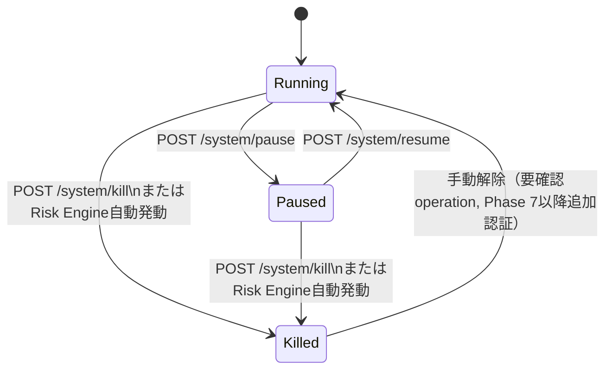

# API 仕様

HALTアーキテクチャの3パターン（ページルート/アクションルート/APIルート）に従う。詳細な設計思想は `components/overview.md` を参照。

## 1. 認証・アクセス制御

- Wailsアプリ内蔵HTTPサーバーは `127.0.0.1` にのみバインドし、外部ネットワークからは到達不能（`requirements/non-functional.md` §4）
- 単一ユーザー・単一デスクトップアプリのため、外部IdP連携やユーザーログイン画面は持たない
- 起動時にWailsプロセスがランダムなローカルセッショントークンを生成し、Cookie（`HttpOnly`, `SameSite=Strict`）としてWebViewに設定する。全ての状態変更リクエスト（アクションルート・Huma APIのPOST/PUT/PATCH/DELETE）はこのセッションCookie必須とする
- HTMXフォームにはCSRFトークンをmetaタグ経由で付与し、`X-CSRF-Token`ヘッダで送信する（`components/overview.md` セキュリティ節）
- 実売買（Phase 7）移行時は、Kill Switch解除・発注確定操作にOS認証の追加確認を導入する（`requirements/non-functional.md` §4）
- **Setup Guard**: 必須認証情報（JEV_API_KEY/JEV_BASE_URL/KABU_API_PASSWORD）のいずれかが`secrets`テーブルに未設定の間は、`GET /setup`・`POST`/`DELETE /settings/:key`・静的アセット（`/static/...`）以外の全リクエスト（ページ・アクション・`/api/v1`・WebSocket含む）を`/setup`へ302リダイレクトする。判定はリクエストごとに行うため、3キーが揃った次のリクエストから解除される（issue #80）

## 2. ルーティング概要

| パターン | 例 | HX-Request分岐 | 返却 | 登録先 |
|---------|-----|----------------|------|--------|
| ページルート | `/scanner`, `/symbols/:symbol` | する | フルページ or フラグメント | Gin |
| アクションルート | `/system/pause` 等 | しない | フラグメントのみ | Gin |
| APIルート | `/api/v1/...` | しない | JSON | Huma |
| WebSocket | `/ws/scanner` 等 | 該当なし | JSONメッセージ | Gin (`github.com/coder/websocket`) |

## 3. ページルート

| メソッド | パス | 説明 |
|---------|------|------|
| GET | `/` | `/scanner` へリダイレクト |
| GET | `/scanner` | Scanner Dashboard。HX-Requestありなら候補テーブルフラグメントのみ返却 |
| GET | `/symbols/:symbol` | Symbol Detail。`<pitha-price-chart>` 等のLitアイランドを埋め込んだフルページ |
| GET | `/performance` | Performance画面。クエリ `from`/`to`（YYYY-MM-DD、JST、`to`含む）・`training_days`/`validation_days`/`forward_days`（既定5/2/1）指定時は記録済みデータでWalk Forwardバックテスト（FR-BT-1〜3）を実行し結果を表示する。不正入力は400。上限: 各 `*_days` は最大366、`from`〜`to` は最大1830日（366×5）、Fold数は最大1000（超過は400）。実行が60秒を超えた場合は503 |
| GET | `/calibration` | Calibration画面 |
| GET | `/settings` | Settings画面。許可キー（`internal/config`のallow-list）ごとに`SecretFieldRow`を表示し、各行が独立した保存・削除フォームを持つ。保存済みの値は再表示せず「設定済み」バッジのみ表示する（issue #57/#79） |
| GET | `/setup` | 初回セットアップ画面。必須3キー（JEV_API_KEY/JEV_BASE_URL/KABU_API_PASSWORD）と任意のSLACK_WEBHOOK_URLを`SecretFieldRow`で表示し、保存・削除は`POST`/`DELETE /settings/:key`を共用する。Setup Guardの例外で、セットアップ完了後も直接アクセスできる（issue #80） |
| GET | `/activity` | System Activity Log画面。`<pitha-activity-feed>`アイランド（SSRフォールバック: キュー状況＋アクティビティ一覧）を埋め込んだフルページ |

## 4. アクションルート

| メソッド | パス | 説明 | 返却 |
|---------|------|------|------|
| POST | `/system/pause` | 新規エントリー一時停止（Kill Switchとは別。手動での一時停止） | システム状態バッジ（OOB） |
| POST | `/system/resume` | 一時停止解除 | システム状態バッジ（OOB） |
| POST | `/system/kill` | Kill Switch手動発動（確認モーダル経由） | システム状態バッジ＋トースト（OOB） |
| GET | `/system/status` | システム状態バッジのフラグメント再取得（Lit→HTMX間接連携: `systemStateChanged`イベント受信時にHeaderが呼び出す） | システム状態バッジ |
| GET | `/system/update-status` | 新バージョン検知バナーのフラグメント再取得（Headerの`#update-banner`が`load`・60秒周期・`updateStatusChanged`イベントで呼び出す）。新バージョンが無い/アップデーター未搭載（`cmd/server`）なら空 | `UpdateBanner`（安全ゲート待ち/再起動直前の状態を明示） |
| GET | `/system/update-panel` | Settings画面`#update-panel`のフラグメント取得（現在バージョン・最終確認結果・確認ボタン） | `UpdatePanel` |
| POST | `/system/update-check` | 「今すぐアップデートを確認」。スケジューラーと同じ`CheckForUpdate`を即時実行し、`HX-Trigger: updateStatusChanged`付きで`UpdatePanel`を返す。確認失敗もパネル内表示（HTTP 200）。アップデーター未搭載なら404 | `UpdatePanel` |
| POST | `/settings/:key` | 単一キーの保存（フォーム項目`value`）。他キーには一切影響しない。`:key`が許可キー一覧（`internal/config`のallow-list: JEV_*/KABU_API_PASSWORD/SLACK_WEBHOOK_URL/LUNA_*/NEWS_FEED_*/SOL_*/OPUS_*）に無い場合、または`value`が空の場合は400（空入力で保存済みの値が消えることはない）。反映はアプリ再起動後（issue #79） | 更新後の`SecretFieldRow`フラグメント |
| DELETE | `/settings/:key` | 単一キーの削除。他キーには一切影響しない。`:key`が許可キー一覧に無い場合は400（issue #79） | 更新後の`SecretFieldRow`フラグメント |
| GET | `/system/secrets-status` | 任意キー（SLACK_WEBHOOK_URL等）の未設定を知らせる全ページ共通バナー（`Header`の`#config-banner`が`load`で取得）のフラグメント。必須3キーはSetup Guardが`/setup`へ誘導するため対象外。全て設定済みなら空 | `SecretsBanner` |
| POST | `/positions/:id/close` | 手動決済（成行Paper Exit） | ポジション行フラグメント |

### システム状態遷移（アクションルート）



## 5. API ルート（Huma, `/api/v1`）

Huma が OpenAPI 3.1 スペックを `/api/v1/openapi.json` に自動生成する。以下は主要エンドポイント。

### GET /api/v1/scanner

Fast Screener通過〜Jev Trader評価済みの候補銘柄一覧を返す。Scanner Dashboardの初期ロード・`pitha-scanner-table`のフォールバック取得に使用（ライブ更新は`/ws/scanner`）。

```json
// Output（抜粋）
{
  "items": [
    {
      "symbol": "7203",
      "price": 2831.5,
      "return_1m": 0.12,
      "return_5m": 0.42,
      "volume_ratio_5m": 3.4,
      "price_vs_vwap_bps": 38,
      "spread_bps": 7,
      "jev_direction": "LONG",
      "jev_confidence": 0.74,
      "entry_quality": "strong",
      "current_position": null
    }
  ],
  "as_of": "2026-09-26T10:15:00+09:00"
}
```

### GET /api/v1/symbols/{symbol}

Symbol Detail向け統合情報（価格・Jev判定・Riskパラメータ）。

```json
// Output（抜粋）
{
  "symbol": "7203",
  "price": 2831.5,
  "vwap": 2823.0,
  "jev": {
    "direction": "LONG",
    "confidence": 0.74,
    "regime": "BREAKOUT",
    "entry_quality": "strong",
    "toxic_flow": 0.18,
    "liquidity_stressed": 0.09
  },
  "risk": {
    "allowed_position_pct": 1.4,
    "stop_loss_pct": 0.6,
    "take_profit_pct": 1.2
  },
  "current_position": null
}
```

### GET /api/v1/symbols/{symbol}/candles

`pitha-price-chart`（lightweight-charts）用ローソク足＋VWAP＋出来高系列。

| クエリ | 型 | 説明 |
|-------|-----|------|
| `from` | string(RFC3339) | 取得開始時刻 |
| `to` | string(RFC3339) | 取得終了時刻（省略時は現在） |
| `interval` | string | `1m` 固定（MVP） |

### GET /api/v1/symbols/{symbol}/decisions

Decision history（`jev_decisions`をJev Scout/Trader別に時系列で返す）。

### GET /api/v1/signals / GET /api/v1/signals/{symbol}

`trade_signals`の一覧・銘柄別履歴（`risk_passed`, `reject_reason`含む）。

### GET /api/v1/positions

現在保有中および直近クローズ済みポジション一覧。

### GET /api/v1/orders

`paper_orders`一覧（ステータスフィルタ `?status=` 対応）。

### GET /api/v1/performance

```json
// Output（抜粋）
{
  "total_pnl": 128340,
  "daily_pnl": 15200,
  "win_rate": 0.57,
  "profit_factor": 1.82,
  "expectancy": 0.34,
  "max_drawdown_pct": 4.1,
  "average_hold_time_minutes": 14.2,
  "sharpe_ref": 1.1,
  "sortino_ref": 1.6,
  "signal_count": 342
}
```

### GET /api/v1/calibration

```json
// Output（抜粋）
{
  "buckets": [
    { "range": "0.50-0.60", "direction_accuracy": 0.51, "avg_future_return_pct": -0.05 },
    { "range": "0.60-0.70", "direction_accuracy": 0.55, "avg_future_return_pct": 0.02 },
    { "range": "0.70-0.80", "direction_accuracy": 0.63, "avg_future_return_pct": 0.11 },
    { "range": "0.80-0.90", "direction_accuracy": 0.71, "avg_future_return_pct": 0.24 },
    { "range": "0.90-1.00", "direction_accuracy": 0.78, "avg_future_return_pct": 0.39 }
  ],
  "brier_score": 0.19,
  "log_loss": 0.52,
  "expected_calibration_error": 0.06
}
```

### GET /api/v1/policy-proposals

Sol/Opus自己改善ループ（`architecture/overview.md` §8）の監査用読み取り専用API。`policy_proposals`の提案・レビュー・適用・ロールバック履歴を返す。UIページは持たず、外部監視・手動確認用に提供する（実際の外部AI API呼び出しの結果を追跡できるようにするため、`requirements/functional.md` FR-SELFIMPROVE-7〜9）。

| クエリ | 型 | 説明 |
|-------|-----|------|
| `status` | string | `pending`/`approved`/`rejected`/`applied`/`rolled_back`でフィルタ（省略時は全件） |
| `limit` | integer | 件数上限（既定50、最大200） |

```json
// Output（抜粋）
{
  "items": [
    {
      "id": 42,
      "proposed_at": "2026-09-28T15:00:00Z",
      "proposed_by": "sol",
      "status": "applied",
      "proposed_changes": { "policy.long.min_confidence": 0.68 },
      "backtest_result": { "expectancy_delta_pct": 2.1, "max_drawdown_delta_pct": -3.4 },
      "reviewed_by": "opus",
      "review": { "verdict": "approve", "reason": "..." },
      "applied_policy_version": "v12"
    }
  ]
}
```

### GET /api/v1/activity

System Activity Log向けの直近アクティビティ・キュー状況スナップショット（`requirements/functional.md` §4.15/§5.5）。`jobs`/`jev_decisions`/`kill_switch_events`を集約する読み取り専用API。新規永続テーブルは持たない。

| クエリ | 型 | 説明 |
|-------|-----|------|
| `limit` | integer | フィード件数（既定200、1〜500。範囲外は422） |
| `queue` | string | `jobs.queue`でフィルタ（省略時は全キュー）。`job`イベントのみが対象で、指定時は`jev_scout`/`jev_trader`/`kill_switch`イベントは含まれない |
| `type` | string | イベント種別でフィルタ: `job` / `jev_scout` / `jev_trader` / `kill_switch`（省略時は全種別） |

```json
// Output（抜粋）
{
  "queues": [
    { "queue": "jev-scout", "pending": 3, "running": 1, "failed_recent": 0 }
  ],
  "events": [
    { "type": "jev_trader", "timestamp": "2026-09-29T01:15:00Z", "symbol": "7203", "detail": "direction=LONG confidence=0.74", "latency_ms": 820 },
    { "type": "kill_switch", "timestamp": "2026-09-29T01:10:00Z", "detail": "reason=daily_loss_limit" }
  ],
  "as_of": "2026-09-29T01:15:03Z"
}
```

### POST /api/v1/system/pause / resume / kill

アクションルート（`/system/...`）のJSON版。外部監視ツール・スクリプトからの操作用に提供する（HTMX UIは同機能をアクションルート経由で呼ぶ）。

### エンドポイント一覧表

| メソッド | パス | 概要 |
|---------|------|------|
| GET | `/api/v1/scanner` | 候補銘柄一覧 |
| GET | `/api/v1/symbols/{symbol}` | 銘柄詳細 |
| GET | `/api/v1/symbols/{symbol}/candles` | チャート用系列データ |
| GET | `/api/v1/symbols/{symbol}/decisions` | Jev判断履歴 |
| GET | `/api/v1/signals` | トレードシグナル一覧 |
| GET | `/api/v1/signals/{symbol}` | 銘柄別シグナル履歴 |
| GET | `/api/v1/positions` | ポジション一覧 |
| GET | `/api/v1/orders` | 注文一覧 |
| GET | `/api/v1/performance` | 実績集計 |
| GET | `/api/v1/calibration` | Calibrationバケット集計 |
| GET | `/api/v1/policy-proposals` | Sol/Opus自己改善ループの提案・レビュー履歴（監査用） |
| POST | `/api/v1/system/pause` | 一時停止 |
| POST | `/api/v1/system/resume` | 再開 |
| POST | `/api/v1/system/kill` | Kill Switch発動 |
| GET | `/api/v1/openapi.json` | OpenAPI 3.1スペック（Huma自動生成） |
| GET | `/api/v1/activity` | System Activity Log向けキュー状況・直近アクティビティ |

## 6. WebSocket

| パス | 用途 | 送信メッセージ例 |
|------|------|-----------------|
| `/ws/scanner` | Scanner Dashboardのライブ更新（`pitha-scanner-table`） | `{"type":"scanner_update","items":[...]}` |
| `/ws/symbols/{symbol}` | Symbol Detailのライブ更新（`pitha-price-chart`, Jev判定パネル） | `{"type":"tick","price":2831.5,...}` / `{"type":"jev_update","direction":"LONG",...}` |
| `/ws/system` | Kill Switch発動等のシステムイベント通知（ヘッダーバッジ用、OOBの代替としてLit非経由でも利用可） | `{"type":"kill_switch","reason":"daily_loss_limit"}` |
| `/ws/activity` | System Activity Logのライブ更新（`pitha-activity-feed`） | `{"type":"job_update","queue":"jev-scout","pending":2,"running":1,"failed_recent":0}` / `{"type":"activity_event","event":{"type":"jev_scout","timestamp":"...","symbol":"7203"}}`。接続直後の送信はなく、初期状態は`GET /api/v1/activity`から取得する |

WebSocketクライアント実装は `components/overview.md` の `lib/ws.ts`（自動再接続、指数バックオフ）を必ず経由する。

## 7. エラーレスポンス

- Huma APIのバリデーションエラーはRFC 7807 Problem Details形式で自動生成される（`components/overview.md` Huma APIパターン参照）
- ビジネスエラー（例: Risk Engine拒否によりKill Switch解除不可）はカスタムエラーも同じProblem Details形式に統一する
- アクションルート（HTMX）のエラーはフォーム再レンダリング（422）またはOOBトースト（403/5xx）で返す（`components/overview.md` エラーハンドリング節）

## 改訂履歴

| 版 | 日付 | 変更内容 | 変更理由 |
|----|------|---------|---------|
| 1.0 | 2026-09-26 | 新規作成 | 初版 |
| 1.1 | 2026-09-28 | §3 `/performance` にWalk Forwardバックテスト実行クエリを追記 | #53 バックテスト実行導線 |
| 1.2 | 2026-09-29 | §4に`/system/update-status`・`/system/update-panel`・`/system/update-check`を追加 | issue #76実装 |
| 1.3 | 2026-09-29 | §5 `/api/v1/activity`・§6 `/ws/activity`を追加（System Activity Log画面向け、`requirements/functional.md` §4.15） | 実行中処理を可視化するログ画面の追加要望 |
| 1.4 | 2026-09-29 | §3に`GET /activity`ページルートを追加 | issue #77実装（System Activity Log） |
| 1.5 | 2026-09-29 | §5に`GET /api/v1/policy-proposals`（Sol/Opus実AI呼び出しの監査用読み取り専用API）を追加 | 現状Jevのみが実AI呼び出しであった状態の是正（AI機能実装フェーズ） |
| 1.6 | 2026-09-29 | §3に`GET /settings`、§4に`POST`/`DELETE /settings/:key`・`GET /system/secrets-status`を追加（一括`POST /settings`は廃止しフィールド単位の保存・削除へ変更） | issue #79実装 |
| 1.7 | 2026-09-29 | §1にSetup Guard、§3に`GET /setup`を追加。§4 `GET /system/secrets-status`を任意キーのみの案内へ縮小 | issue #80実装 |
| 1.8 | 2026-09-29 | §3 `/performance` に入力上限（`*_days`≤366・範囲≤1830日・Fold≤1000で400）と実行タイムアウト（60秒で503）を追記 | issue #128実装 |
