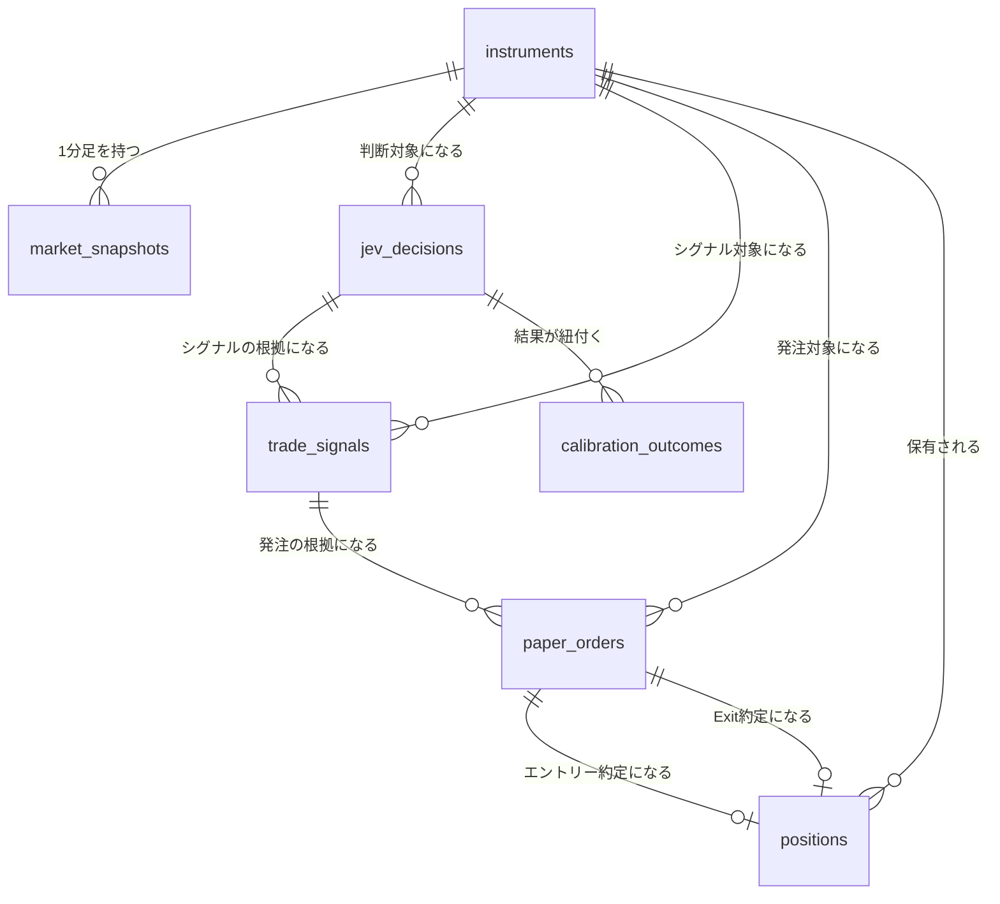
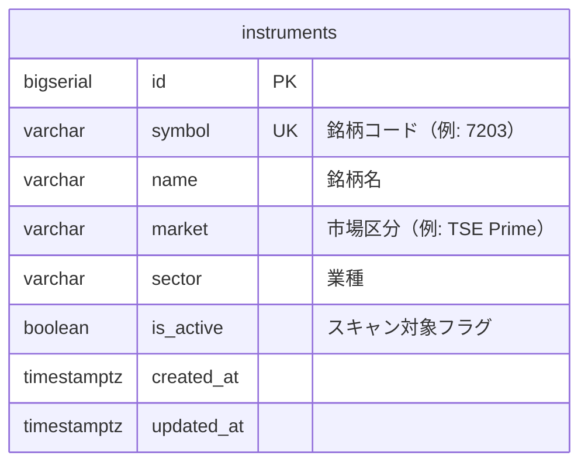
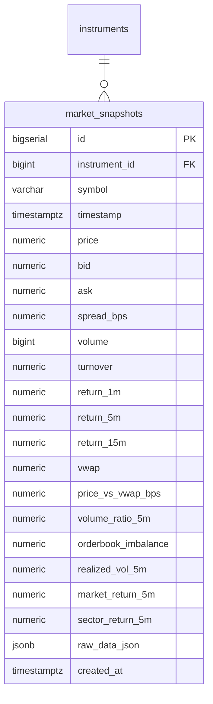
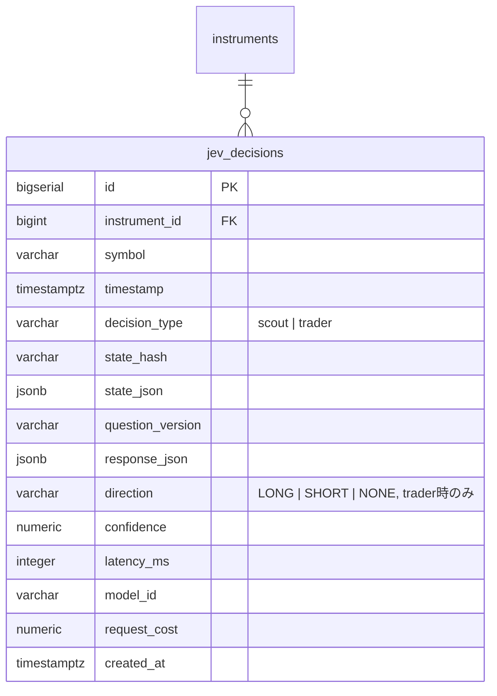
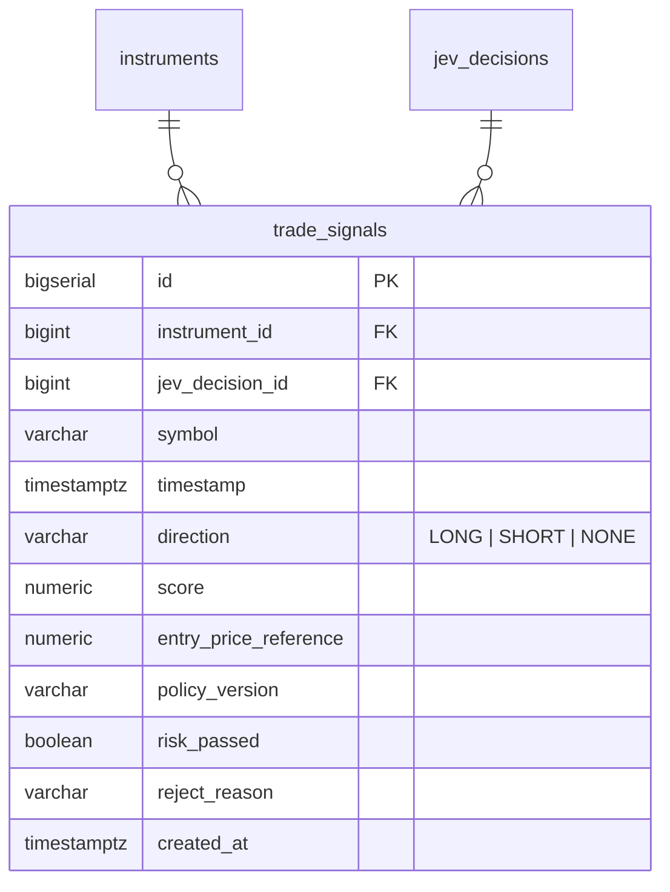
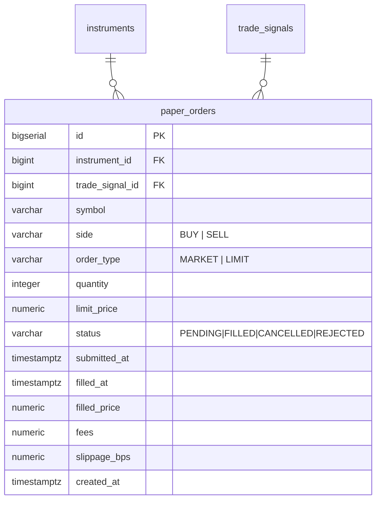
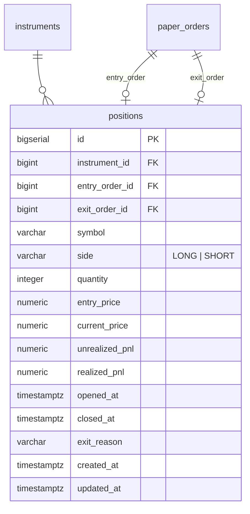
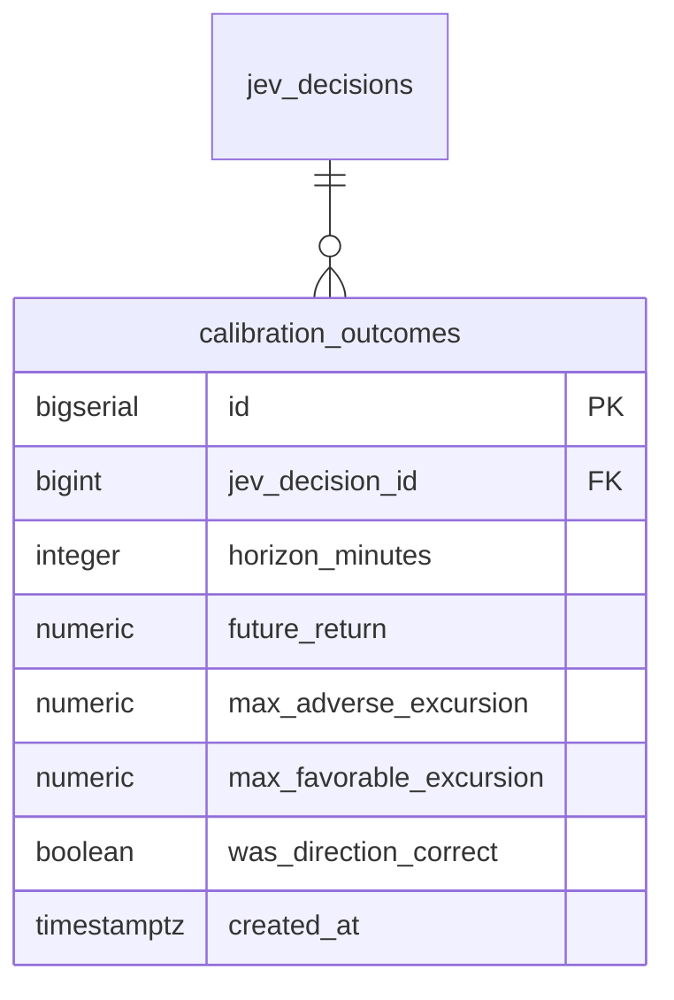
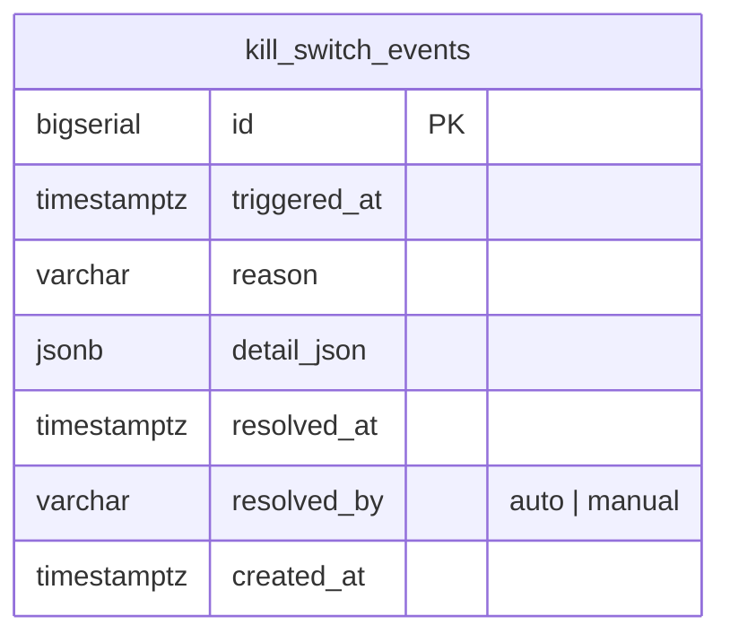
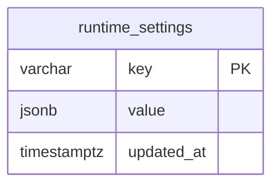

# ER / データモデル

DB: PostgreSQL 16。マイグレーションは `db/migrations`（golang-migrate）で管理する。すべてのテーブルは `bigserial` の `id` を主キーとし、監査用に `created_at` を持つ（更新がありうるテーブルは `updated_at` も持つ）。

## 全体ER図

## テーブル定義

### instruments

対象銘柄マスタ。

| カラム | 型 | 制約 | 説明 |
|-------|-----|------|------|
| id | bigserial | PK | |
| symbol | varchar(10) | UNIQUE, NOT NULL | 証券コード |
| name | varchar(255) | NOT NULL | 銘柄名 |
| market | varchar(50) | NOT NULL | 市場区分 |
| sector | varchar(100) | NULL可 | 業種（sector_return_5m算出に利用） |
| is_active | boolean | NOT NULL, DEFAULT true | falseの場合Fast Screener対象外 |
| created_at | timestamptz | NOT NULL, DEFAULT now() | |
| updated_at | timestamptz | NOT NULL, DEFAULT now() | |

インデックス: `UNIQUE (symbol)`, `INDEX (is_active)`

### market_snapshots

Feature Engineが算出した1分足スナップショット。

| カラム | 型 | 制約 | 説明 |
|-------|-----|------|------|
| id | bigserial | PK | |
| instrument_id | bigint | FK → instruments.id, NOT NULL | |
| symbol | varchar(10) | NOT NULL | 非正規化（クエリ簡略化用） |
| timestamp | timestamptz | NOT NULL | スナップショット時刻（1分足） |
| price | numeric(12,2) | NOT NULL | |
| bid / ask | numeric(12,2) | NULL可 | 板情報取得不可時はNULL |
| spread_bps | numeric(8,2) | NULL可 | |
| volume | bigint | NOT NULL | |
| turnover | numeric(18,2) | NOT NULL | |
| return_1m / return_5m / return_15m | numeric(8,4) | NULL可（起動直後等は算出不可） | |
| vwap | numeric(12,2) | NOT NULL | |
| price_vs_vwap_bps | numeric(8,2) | NOT NULL | |
| volume_ratio_5m | numeric(8,4) | NULL可 | |
| orderbook_imbalance | numeric(6,4) | NULL可 | |
| realized_vol_5m | numeric(8,4) | NULL可 | |
| market_return_5m / sector_return_5m | numeric(8,4) | NULL可 | TOPIX/業種指数から算出 |
| raw_data_json | jsonb | NOT NULL | kabuステーションAPI生レスポンス（再計算・監査用） |
| created_at | timestamptz | NOT NULL, DEFAULT now() | |

インデックス: `UNIQUE (instrument_id, timestamp)`, `INDEX (symbol, timestamp DESC)`

運用上の注意: 高頻度書き込みテーブルのため、`timestamp` による月次パーティショニング（PostgreSQL宣言的パーティション）を運用開始後のデータ量に応じて検討する。

### jev_decisions

Jev Scout/Traderの入出力ログ（Calibrationの基礎データ）。

| カラム | 型 | 制約 | 説明 |
|-------|-----|------|------|
| id | bigserial | PK | |
| instrument_id | bigint | FK → instruments.id, NOT NULL | |
| symbol | varchar(10) | NOT NULL | |
| timestamp | timestamptz | NOT NULL | Jev呼び出し時刻 |
| decision_type | varchar(10) | NOT NULL, CHECK IN ('scout','trader') | |
| state_hash | varchar(64) | NOT NULL | 入力状態のハッシュ。再評価抑制の判定に使用（`functional.md` FR-SCAN-2） |
| state_json | jsonb | NOT NULL | Jevへの入力（`functional.md` §4.4/4.5参照） |
| question_version | varchar(20) | NOT NULL | プロンプト/質問セットのバージョン |
| response_json | jsonb | NOT NULL | Jevからの生レスポンス |
| direction | varchar(10) | NULL可, CHECK IN ('LONG','SHORT','NONE') | decision_type=trader時のみ設定 |
| confidence | numeric(5,4) | NULL可 | |
| latency_ms | integer | NOT NULL | |
| model_id | varchar(100) | NOT NULL | |
| request_cost | numeric(10,6) | NULL可 | API課金額（USD等） |
| created_at | timestamptz | NOT NULL, DEFAULT now() | |

インデックス: `INDEX (instrument_id, timestamp DESC)`, `INDEX (decision_type)`, `INDEX (state_hash)`

### trade_signals

Policy Engineが生成した取引候補。

| カラム | 型 | 制約 | 説明 |
|-------|-----|------|------|
| id | bigserial | PK | |
| instrument_id | bigint | FK → instruments.id, NOT NULL | |
| jev_decision_id | bigint | FK → jev_decisions.id, NULL可 | 根拠となったJev Trader判断 |
| symbol | varchar(10) | NOT NULL | |
| timestamp | timestamptz | NOT NULL | |
| direction | varchar(10) | NOT NULL, CHECK IN ('LONG','SHORT','NONE') | |
| score | numeric(6,4) | NULL可 | Policy Engine内部スコア |
| entry_price_reference | numeric(12,2) | NULL可 | |
| policy_version | varchar(20) | NOT NULL | しきい値バージョン（`functional.md` FR-POLICY-4） |
| risk_passed | boolean | NOT NULL | Risk Engine通過可否 |
| reject_reason | varchar(255) | NULL可 | risk_passed=false時の理由 |
| created_at | timestamptz | NOT NULL, DEFAULT now() | |

インデックス: `INDEX (instrument_id, timestamp DESC)`, `INDEX (risk_passed)`

### paper_orders

Paper Trading（将来は実発注）の注文・約定。

| カラム | 型 | 制約 | 説明 |
|-------|-----|------|------|
| id | bigserial | PK | |
| instrument_id | bigint | FK → instruments.id, NOT NULL | |
| trade_signal_id | bigint | FK → trade_signals.id, NULL可 | |
| symbol | varchar(10) | NOT NULL | |
| side | varchar(10) | NOT NULL, CHECK IN ('BUY','SELL') | |
| order_type | varchar(10) | NOT NULL, CHECK IN ('MARKET','LIMIT') | |
| quantity | integer | NOT NULL | |
| limit_price | numeric(12,2) | NULL可 | order_type=LIMIT時必須（アプリ層で検証） |
| status | varchar(20) | NOT NULL, CHECK IN ('PENDING','FILLED','CANCELLED','REJECTED') | |
| submitted_at | timestamptz | NOT NULL | |
| filled_at | timestamptz | NULL可 | |
| filled_price | numeric(12,2) | NULL可 | |
| fees | numeric(10,2) | NOT NULL, DEFAULT 0 | |
| slippage_bps | numeric(8,2) | NULL可 | |
| created_at | timestamptz | NOT NULL, DEFAULT now() | |

インデックス: `INDEX (instrument_id, submitted_at DESC)`, `INDEX (status)`

### positions

保有ポジション（Entry/Exit紐付き）。

| カラム | 型 | 制約 | 説明 |
|-------|-----|------|------|
| id | bigserial | PK | |
| instrument_id | bigint | FK → instruments.id, NOT NULL | |
| entry_order_id | bigint | FK → paper_orders.id, NOT NULL | |
| exit_order_id | bigint | FK → paper_orders.id, NULL可 | クローズ後に設定 |
| symbol | varchar(10) | NOT NULL | |
| side | varchar(10) | NOT NULL, CHECK IN ('LONG','SHORT') | |
| quantity | integer | NOT NULL | |
| entry_price | numeric(12,2) | NOT NULL | |
| current_price | numeric(12,2) | NOT NULL | 保有中はSchedulerが定期更新 |
| unrealized_pnl | numeric(14,2) | NOT NULL, DEFAULT 0 | |
| realized_pnl | numeric(14,2) | NULL可 | クローズ時に確定 |
| opened_at | timestamptz | NOT NULL | |
| closed_at | timestamptz | NULL可 | |
| exit_reason | varchar(50) | NULL可 | 例: stop_loss/take_profit/trailing_stop/jev_reversal/max_holding/force_close |
| created_at / updated_at | timestamptz | NOT NULL | |

インデックス: `INDEX (instrument_id)`, `UNIQUE (instrument_id) WHERE closed_at IS NULL`（同一銘柄の同時保有は1ポジションに制限し、状態管理§4.9の `position` フィールドと整合させる）

### calibration_outcomes

Jev判断と将来値動きの紐付け結果。

| カラム | 型 | 制約 | 説明 |
|-------|-----|------|------|
| id | bigserial | PK | |
| jev_decision_id | bigint | FK → jev_decisions.id, NOT NULL | decision_type=trader対象 |
| horizon_minutes | integer | NOT NULL | 5 / 10 / 20 等 |
| future_return | numeric(8,4) | NOT NULL | |
| max_adverse_excursion | numeric(8,4) | NOT NULL | |
| max_favorable_excursion | numeric(8,4) | NOT NULL | |
| was_direction_correct | boolean | NULL可 | direction=NONEの場合NULL |
| created_at | timestamptz | NOT NULL, DEFAULT now() | |

インデックス: `UNIQUE (jev_decision_id, horizon_minutes)`

### kill_switch_events

Risk EngineのKill Switch発動・解除履歴（監査ログ）。

| カラム | 型 | 制約 | 説明 |
|-------|-----|------|------|
| id | bigserial | PK | |
| triggered_at | timestamptz | NOT NULL | |
| reason | varchar(100) | NOT NULL, CHECK IN ('daily_loss_limit','consecutive_losses','market_data_down','jev_api_down','broker_api_error','unexpected_position','fill_discrepancy','db_write_failure') | `functional.md` FR-RISK-2 |
| detail_json | jsonb | NOT NULL | 発動時のRisk状態スナップショット |
| resolved_at | timestamptz | NULL可 | |
| resolved_by | varchar(50) | NULL可, CHECK IN ('auto','manual') | |
| created_at | timestamptz | NOT NULL, DEFAULT now() | |

インデックス: `INDEX (triggered_at DESC)`, `INDEX (resolved_at)`

### runtime_settings

Fast Screener/Policy/Risk のしきい値をコード再デプロイなしで変更するためのKey-Valueストア（`config/*.yaml` の初期値をDBへロードし、以降はDBを正とする）。

| カラム | 型 | 制約 | 説明 |
|-------|-----|------|------|
| key | varchar(100) | PK | 例: `screener.min_price`, `policy.long.min_confidence`, `risk.max_daily_loss_pct` |
| value | jsonb | NOT NULL | |
| updated_at | timestamptz | NOT NULL, DEFAULT now() | |

## 改訂履歴

| 版 | 日付 | 変更内容 | 変更理由 |
|----|------|---------|---------|
| 1.0 | 2026-09-26 | 新規作成 | 初版 |
