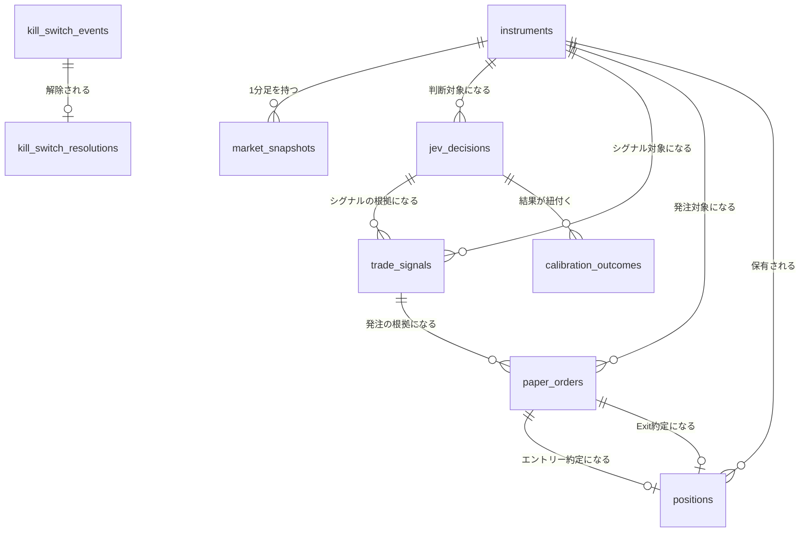

# ER / データモデル

DB: **SQLite**（アプリ内蔵、`modernc.org/sqlite` によるpure Go実装。cgo不要でWailsの単一実行ファイルに同梱する）。マイグレーションは `db/migrations`（golang-migrate、`sqlite3`ドライバ）で管理する。DBファイルはWindowsのアプリデータフォルダ（例: `%APPDATA%\pitha-trador\pitha.db`）に配置する。

## 型・規約（SQLite特有の注意点）

| 項目 | 規約 |
|------|------|
| 主キー | `integer PK` は SQLite の `INTEGER PRIMARY KEY`（rowidエイリアス）として宣言し、自動採番させる。Postgresの`bigserial`に相当 |
| 外部キー | `REFERENCES`句で宣言するが、SQLiteでは接続ごとに `PRAGMA foreign_keys = ON` を有効化しないと強制されない。Goのコネクションプール初期化時に必ず設定する |
| 日時 | `timestamptz`型は存在しないため `text` で宣言し、UTCのRFC3339文字列（例: `2026-09-26T01:15:00Z`）として保存する |
| JSON | `jsonb`型は存在しないため `text` で宣言し、JSON文字列として保存する。クエリ時はSQLiteのJSON1関数（`json_extract`等）を用いる |
| 真偽値 | `boolean`はSQLite上は`integer`（0/1）として格納される。宣言上は`boolean`のまま表記する |
| 数値精度 | `numeric(x,y)`は桁数がDB側で強制されない（SQLiteの動的型付け）。丸め処理はGoアプリケーション層（sqlc生成コードが返す値をハンドリングする箇所）で行う |
| ベクトル検索 | pgvectorに相当する型は無いため、**sqlite-vec**拡張（`vec0`仮想テーブル）を別テーブルとして持つ（`docs/architecture/er/tables-system.md` の「ベクトルインデックス」参照） |
| 同時実行 | WALモード（`PRAGMA journal_mode=WAL`）を有効化する。書き込みはGo単一プロセスからのみ行うため、複数ライターの競合は発生しない |

## 全体ER図

## テーブル定義

テーブル定義は章ごとにファイルを分割している（`.linterly.yml` の300行/ファイル制限のため。見出し名・内容は分割前と同一）。コードコメント等の `er.md §<テーブル名>` は下表の該当ファイル内の同名見出しを指す。

| ファイル | テーブル / セクション |
|----------|----------------------|
| `docs/architecture/er/tables-market.md` | `instruments` / `market_snapshots` / `jev_decisions` / `trade_signals` |
| `docs/architecture/er/tables-trading.md` | `paper_orders` / `positions` / `calibration_outcomes` / `kill_switch_events` / `kill_switch_resolutions` |
| `docs/architecture/er/tables-system.md` | `runtime_settings` / `secrets` / `policy_proposals` / `jobs`、ベクトルインデックス（sqlite-vec） |

## 改訂履歴

| 版 | 日付 | 変更内容 | 変更理由 |
|----|------|---------|---------|
| 1.0 | 2026-09-26 | 新規作成（PostgreSQL 16 + pgvector前提） | 初版 |
| 1.1 | 2026-09-26 | PostgreSQLからSQLite（アプリ内蔵）へ全面移行。pgvector→sqlite-vec仮想テーブル、River→自前`jobs`テーブルに変更 | Wails単一exe配布との整合、外部DBサービス常駐の排除 |
| 1.2 | 2026-09-26 | ベクトル次元を16→14（実際の特徴量数と一致）に修正。`runtime_settings`に`system.last_ui_heartbeat_at`等の例を明記 | レビュー指摘対応 |
| 1.3 | 2026-09-26 | sqlite-vecのGoバインディングを`modernc.org/sqlite/vec`（CGO不要のpure Go移植）と明記 | クロスコンパイル可否の正確化 |
| 1.4 | 2026-09-29 | テーブル定義を`docs/architecture/er/`配下の章別ファイル（tables-market/tables-trading/tables-system）へ分割。内容・見出し名は変更なし | issue #119（300行/ファイル制限の形骸化解消） |
| 1.5 | 2026-09-29 | `kill_switch_events`を追記専用化（UPDATE/DELETE拒否トリガー、マイグレーション000014）し、解除を`kill_switch_resolutions`へ分離。`secrets`テーブル（マイグレーション000013）を追記（`docs/architecture/er/`配下の該当章ファイルへ反映） | 監査ログの追記専用要件（non-functional.md §4）との整合、ER仕様の乖離解消（#102, #104） |
| 1.6 | 2026-09-29 | `jobs`（succeeded 7日/failed 30日）と`market_snapshots`（90日）の保持期間・日次パージを追記し、月次アーカイブ検討の記述を置換 | DB無制限増大の解消（#129） |
| 1.7 | 2026-10-01 | `jev_decisions`の`request_cost`はJev APIが課金額を返さないため常にNULLと明記。`question_version`の例を`scout-v2`/`trader-v2`へ更新。`response_json`は公式APIの生レスポンスではなく変換後の`ScoutResponse`/`TraderResponse`のJSONと明記 | issue #263 |
