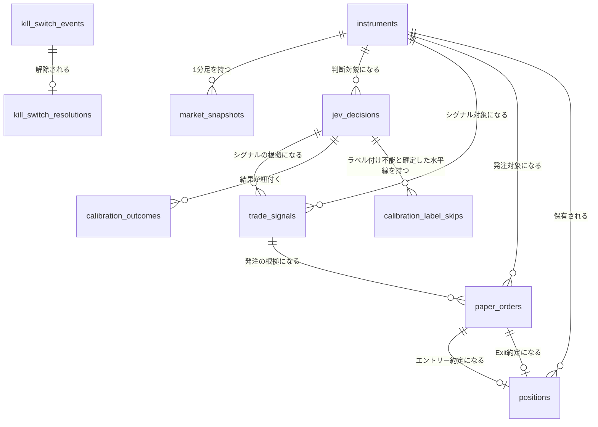

# ER / データモデル

DB: **SQLite**（アプリ内蔵、`modernc.org/sqlite` によるpure Go実装。cgo不要でWailsの単一実行ファイルに同梱する）。マイグレーションは `db/migrations`（golang-migrate、`database/sqlite`ドライバ。`modernc.org/sqlite`上で動作しcgo不要）で管理する。DBファイルはWindowsのアプリデータフォルダ（例: `%APPDATA%\pitha-trador\pitha.db`）に配置する。

## 型・規約（SQLite特有の注意点）

| 項目 | 規約 |
|------|------|
| 主キー | `integer PK` は SQLite の `INTEGER PRIMARY KEY`（rowidエイリアス）として宣言し、自動採番させる。Postgresの`bigserial`に相当 |
| 外部キー | `REFERENCES`句で宣言するが、SQLiteでは接続ごとに `PRAGMA foreign_keys = ON` を有効化しないと強制されない。Goのコネクションプール初期化時に必ず設定する |
| 日時 | `timestamptz`型は存在しないため `text` で宣言し、UTCのRFC3339文字列として保存する。小数秒は**固定9桁**（例: `2026-09-26T01:15:00.000000000Z`、Goの`sqlutil.FormatTime`）で、SQLiteのTEXT比較（辞書順）が時刻順に一致する（`time.RFC3339Nano`は末尾ゼロを切り詰める可変幅で、`…:05Z` > `…:05.5Z`と逆転するため使わない）。読み出し（`sqlutil.ParseTime`）は桁数を問わず受理する。保存済みの可変幅の値はマイグレーション000021で固定幅へ正規化する。比較・`ORDER BY`・窓境界に渡す引数も`FormatTime`で生成する |
| 日時列のDEFAULT | 一部の`created_at`/`updated_at`列にはスキーマ上`DEFAULT (strftime('%Y-%m-%dT%H:%M:%fZ', 'now'))`が残るが、`%f`は**ミリ秒3桁**（長さ24）で上記の固定9桁（長さ30）規約と幅が異なる。DEFAULTは本番経路では使わず、全INSERTで`created_at`/`updated_at`を`sqlutil.FormatTime`で明示する（`kill_switch_resolutions.created_at`を含む）。DEFAULTに依存して新規行を書くと同一テーブル内で幅が混在し、辞書順＝時刻順が崩れる |
| JSON | `jsonb`型は存在しないため `text` で宣言し、JSON文字列として保存する。クエリ時はSQLiteのJSON1関数（`json_extract`等）を用いる |
| 真偽値 | `boolean`はSQLite上は`integer`（0/1）として格納される。宣言上は`boolean`のまま表記する |
| 数値精度 | `numeric(x,y)`は桁数がDB側で強制されない（SQLiteの動的型付け）。宣言桁への丸め処理はアプリケーション層・リポジトリ層（`internal/repository/**`）のどちらにも存在せず、`float64`を無加工で保存・読み出しする（約定価格の呼値丸め`internal/service/fillmodel`は取引ルール上の丸めでDB桁への丸めではない）。宣言の`numeric(x,y)`は想定する値域・精度の目安であり、桁あふれ・桁丸めの強制は行わない |
| ベクトル検索 | pgvectorに相当する型は無いため、**sqlite-vec**拡張（`vec0`仮想テーブル）を別テーブルとして持つ（`docs/architecture/er/tables-system.md` の「ベクトルインデックス」参照） |
| 同時実行 | WALモード（`PRAGMA journal_mode=WAL`）を有効化する。書き込みはGo単一プロセスからのみ行うため、複数ライターの競合は発生しない |

## 全体ER図

## テーブル定義

テーブル定義は章ごとにファイルを分割している（`.linterly.yml` の300行/ファイル制限のため。見出し名・内容は分割前と同一）。コードコメント等の `er.md §<テーブル名>` は下表の該当ファイル内の同名見出しを指す。

| ファイル | テーブル / セクション |
|----------|----------------------|
| `docs/architecture/er/tables-market.md` | `instruments` / `market_snapshots` / `jev_decisions` / `trade_signals` |
| `docs/architecture/er/tables-trading.md` | `paper_orders` / `positions` / `calibration_outcomes` / `calibration_label_skips` / `kill_switch_events` / `kill_switch_resolutions` |
| `docs/architecture/er/tables-system.md` | `runtime_settings` / `secrets` / `policy_proposals` / `jobs`、ベクトルインデックス（sqlite-vec） |

## 改訂履歴

| 版 | 日付 | 変更内容 | 変更理由 |
|----|------|---------|---------|
| 1.0 | 2026-09-26 | 新規作成（PostgreSQL 16 + pgvector前提） | 初版 |
| 1.1 | 2026-09-26 | PostgreSQLからSQLite（アプリ内蔵）へ全面移行。pgvector→sqlite-vec仮想テーブル、River→自前`jobs`テーブルに変更 | Wails単一exe配布との整合、外部DBサービス常駐の排除 |
| 1.2 | 2026-09-26 | ベクトル次元を16→14（実際の特徴量数と一致）に修正。`runtime_settings`に`system.last_ui_heartbeat_at`等の例を明記 | レビュー指摘対応 |
| 1.3 | 2026-09-26 | sqlite-vecのGoバインディングを`modernc.org/sqlite/vec`（CGO不要のpure Go移植）と明記 | クロスコンパイル可否の正確化 |
| 1.4 | 2026-09-29 | テーブル定義を`docs/architecture/er/`配下の章別ファイル（tables-market/tables-trading/tables-system）へ分割。内容・見出し名は変更なし | issue #119（300行/ファイル制限の形骸化解消） |
| 1.5 | 2026-09-29 | `kill_switch_events`を追記専用化（UPDATE/DELETE拒否トリガー、マイグレーション000014）し、解除を`kill_switch_resolutions`へ分離。`secrets`テーブル（マイグレーション000013）を追記（`docs/architecture/er/`配下の該当章ファイルへ反映） | 監査ログの追記専用要件（non-functional.md §4）との整合、ER仕様の乖離解消（#102, #104） |
| 1.6 | 2026-09-29 | `jobs`（succeeded 7日/failed 30日）と`market_snapshots`（90日）の保持期間・日次パージを追記し、月次アーカイブ検討の記述を置換 | DB無制限増大の解消（#129） |
| 1.7 | 2026-10-01 | `jev_decisions`の`request_cost`はJev APIが課金額を返さないため常にNULLと明記。`question_version`の例を`scout-v2`/`trader-v2`へ更新。`response_json`は公式APIの生レスポンスではなく変換後の`ScoutResponse`/`TraderResponse`のJSONと明記 | issue #263 |
| 1.8 | 2026-10-02 | マイグレーション000018を追加し、`secrets`に保存済みの`UPDATE_GITHUB_TOKEN`行を削除（更新確認用トークン機能の廃止。許可キーから外れSettings画面から消せなくなるため） | 更新確認用トークン機能の廃止 |
| 1.9 | 2026-10-03 | 「数値精度」行の丸め処理の担当箇所を、sqlc生成コードから実装どおりのリポジトリ層（`internal/repository/**`）へ訂正 | issue #317 |
| 1.10 | 2026-10-03 | `market_snapshots.return_1m/5m/15m`の単位が小数比であること（%表示・閾値比較時に×100）を明記 | issue #364, #365 |
| 1.11 | 2026-10-05 | マイグレーション000019を追加し、`jobs(queue, status, finished_at)`索引を追加（直近`failed`件数・Jev Scout間引きが完了行を全走査しないため） | issue #392, #394, #395 |
| 1.12 | 2026-10-05 | マイグレーション000020を追加し、`jev_decisions`に`(decision_type, timestamp)`・`(timestamp)`索引を追加（Activity Logの直近判断`ListRecent`が全件走査・整列をしないため）。`jobs`の`finished_at`索引の用途にActivity Logの直近ジョブ`ListRecent`を追記 | issue #419 |
| 1.13 | 2026-10-05 | `jobs`の孤児`running`行の回復を`market-data`のみから全キュー共通（Schedulerが1分ごとに固定10分超を`failed`へ）へ変更 | issue #424, #425 |
| 1.14 | 2026-10-05 | §型・規約「日時」に小数秒の固定9桁（辞書順＝時刻順）を明記。マイグレーション000021を追加し、全TEXT日時列の保存済み可変幅RFC3339Nano値を固定幅へ正規化（`kill_switch_*`は追記専用トリガーを一時的に外して実施し、同一定義で再作成） | issue #430 |
| 1.15 | 2026-10-05 | §型・規約に「日時列のDEFAULT」行を追加（DEFAULTはミリ秒3桁で固定9桁規約と異なるため、INSERTは常に`FormatTime`で明示する）。`KillSwitchRepository.Resolve`が`kill_switch_resolutions.created_at`をDEFAULT任せにしていたのを`FormatTime`の明示指定へ修正（マイグレーション000021は未リリースのため追加の正規化は不要）。`er/tables-market.md`の`DEFAULT (RFC3339 now)`表記を実体（ミリ秒3桁のDEFAULT・本番では使わない）に合わせて訂正し、`er/tables-trading.md`の`kill_switch_resolutions.created_at`に同旨を追記 | issue #433, #434, #435（#430の取りこぼし） |
| 1.16 | 2026-10-05 | `jev_decisions.question_version`の例を`scout-v3`/`trader-v3`へ更新（RAG文脈が`calibration_outcomes`の実結果を含むようになったため、`stateGuide`を改訂） | issue #437 |
| 1.17 | 2026-10-05 | `er/tables-system.md`の類似検索SQL記述を実装に合わせて更新（`LIMIT 5`固定ではなく、`calibration_outcomes`紐付き済みに絞った検索でk件・不足時のみk×4件を取得してアプリ層で再ランクし上位k件を採用、`market_snapshot_vectors`は不足分のみ）。スキーマ変更なし | issue #441, #442, #445 |
| 1.18 | 2026-10-05 | `er/tables-market.md`の`trade_signals.policy_version`を、エンジン版`policy-v1`＋自己改善の適用版（`policy-v1+sol-12`）と明記 | issue #452 |
| 1.19 | 2026-10-05 | `er/tables-market.md`の`bid`/`ask`/`bid_depth`/`ask_depth`/`spread_bps`/`orderbook_imbalance`の意味を一般的な定義（bid=最良買気配・ask=最良売気配、bid < ask、`spread_bps`は正常な板で0以上、買い数量優勢で`orderbook_imbalance`が正）へ書き換え（kabuステーションAPIの売/買逆命名を入れ替えて保存）、修正前に保存された`market_snapshots`のbid/ask系・`spread_bps`・`orderbook_imbalance`・`microprice`は売/買が逆転している旨の注記を追加。スキーマ変更なし | issue #458, #463 |
| 1.20 | 2026-10-05 | `er/tables-market.md`の`market_snapshots.spread_bps`に、逆転板（bid > ask）は欠損（NULL）として扱う旨を追記（`microprice`も同様、`orderbook_imbalance`は数量のみのため対象外） | issue #465 |
| 1.21 | 2026-10-05 | `er/tables-system.md`の`jev_decision_vectors`に、bid/ask入れ替え修正（#458）前の符号反転ベクトルをマイグレーション`000022`で全件削除しRAG検索から除外する旨を追記（`jev_decisions`は不変） | issue #464 |
| 1.22 | 2026-10-05 | `er/tables-system.md`・`er/tables-market.md`に、bid/ask入れ替え修正（#458）前の`market_snapshot_vectors`もマイグレーション`000023`で全件削除しRAG検索から除外する旨を追記（`market_snapshots`は不変） | issue #469, #470 |
| 1.23 | 2026-10-05 | `er/tables-system.md`の類似検索に、問い合わせ対象の状態自身（同一銘柄の現在以降の判断・直近15分のスナップショット）を許可id集合で除外する旨を追記。スキーマ変更なし | issue #476 |
| 1.24 | 2026-10-05 | `er/tables-trading.md`に`calibration_label_skips`（ラベル付け恒久不能ペアの終端マーカー、マイグレーション000024）を追記 | issue #481 |
| 1.25 | 2026-10-05 | 全体ER図と`er/tables-trading.md`の`calibration_label_skips`節に、`jev_decisions`との関係線・`erDiagram`ブロックを追記（#481で追加したFKの図への反映漏れ） | issue #485 |
| 1.26 | 2026-10-05 | `er/tables-market.md`の`jev_decisions`索引説明に、`(decision_type, timestamp)`が`ListRecent`専用ではなく`CalibrationRepository.PendingLabels`の範囲走査（#484）にも必須で、`EXPLAIN QUERY PLAN`テストで固定している旨を追記。`er/tables-trading.md`の`calibration_label_skips`見出しを`###`→`##`へ是正（他テーブルと階層を統一）。スキーマ変更なし | issue #486, #487, #488 |
| 1.27 | 2026-10-05 | `er/tables-market.md`の`jev_decisions`に`(instrument_id, decision_type, timestamp DESC, id DESC)`索引（最新Trader/Scout判断の銘柄駆動seek用）を追記 | issue #498 |
| 1.28 | 2026-10-05 | `er/tables-trading.md`の`paper_orders.fees`/`slippage_bps`に、約定モデル（FR-ENTRY-8）が約定時に記録する値（手数料円・直近価格に対する不利方向bps）と、`positions.realized_pnl`が両約定の手数料控除後であることを追記。スキーマ変更なし | issue #509 |
| 1.29 | 2026-10-05 | `er/tables-market.md`の`market_snapshots`に取引可否カラム`special_quote`/`price_limit`/`lendable`を追加（マイグレーション000026。特別気配・ストップ高安・貸借なしショートをエントリー前に外す） | issue #511 |
| 1.30 | 2026-10-05 | 実装との乖離を是正: 「数値精度」の丸め処理は存在せずfloat64を無加工保存と訂正、マイグレーションドライバを`database/sqlite`（modernc）へ訂正、`secrets`許可キー13個の明記、`market_snapshots`のER図に全列を反映、`calibration_outcomes`の`future_return`/`max_*_excursion`の単位（%）を明記 | issue #565, #569, #574, #575, #576 |
