# ER / データモデル

DB: **SQLite**（アプリ内蔵、`modernc.org/sqlite` によるpure Go実装。cgo不要でWailsの単一実行ファイルに同梱する）。マイグレーションは `db/migrations`（golang-migrate、`sqlite3`ドライバ）で管理する。DBファイルはWindowsのアプリデータフォルダ（例: `%APPDATA%\pitha-trador\pitha.db`）に配置する。

## 型・規約（SQLite特有の注意点）

| 項目 | 規約 |
|------|------|
| 主キー | `integer PK` は SQLite の `INTEGER PRIMARY KEY`（rowidエイリアス）として宣言し、自動採番させる。Postgresの`bigserial`に相当 |
| 外部キー | `REFERENCES`句で宣言するが、SQLiteでは接続ごとに `PRAGMA foreign_keys = ON` を有効化しないと強制されない。Goのコネクションプール初期化時に必ず設定する |
| 日時 | `timestamptz`型は存在しないため `text` で宣言し、UTCのRFC3339文字列（例: `2026-09-26T01:15:00Z`）として保存する |
| JSON | `jsonb`型は存在しないため `text` で宣言し、JSON文字列として保存する。クエリ時はSQLiteのJSON1関数（`json_extract`等）を用いる |
| 真偽値 | `boolean`はSQLite上は`integer`（0/1）として格納される。宣言上は`boolean`のまま表記する |
| 数値精度 | `numeric(x,y)`は桁数がDB側で強制されない（SQLiteの動的型付け）。丸め処理はGoアプリケーション層（sqlc生成コードが返す値をハンドリングする箇所）で行う |
| ベクトル検索 | pgvectorに相当する型は無いため、**sqlite-vec**拡張（`vec0`仮想テーブル）を別テーブルとして持つ（本ドキュメント末尾「ベクトルインデックス」参照） |
| 同時実行 | WALモード（`PRAGMA journal_mode=WAL`）を有効化する。書き込みはGo単一プロセスからのみ行うため、複数ライターの競合は発生しない |

## 全体ER図

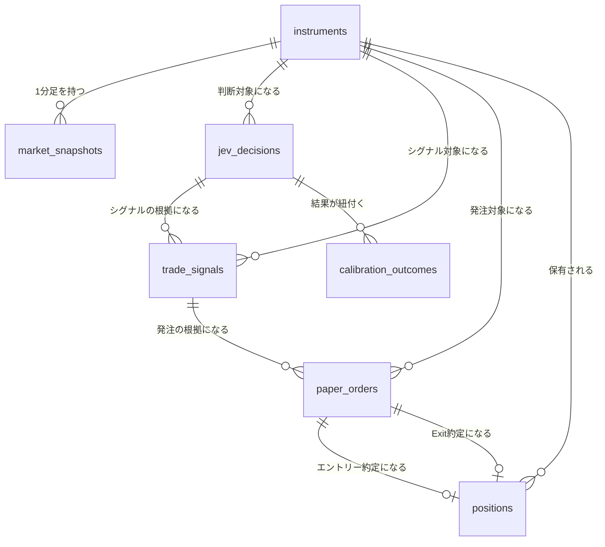

## テーブル定義

### instruments

対象銘柄マスタ。

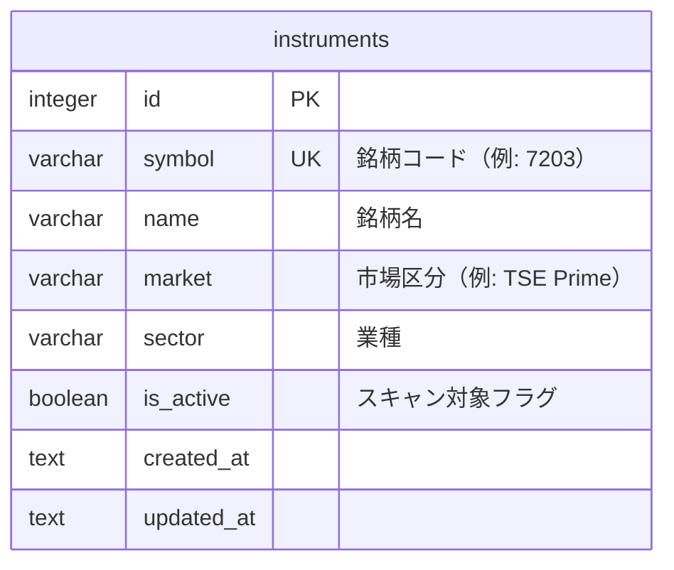

| カラム | 型 | 制約 | 説明 |
|-------|-----|------|------|
| id | integer | PK（AUTOINCREMENT） | |
| symbol | varchar(10) | UNIQUE, NOT NULL | 証券コード |
| name | varchar(255) | NOT NULL | 銘柄名 |
| market | varchar(50) | NOT NULL | 市場区分 |
| sector | varchar(100) | NULL可 | 業種（sector_return_5m算出に利用） |
| is_active | boolean | NOT NULL, DEFAULT 1 | 0の場合Fast Screener対象外 |
| created_at | text | NOT NULL, DEFAULT (RFC3339 now) | |
| updated_at | text | NOT NULL, DEFAULT (RFC3339 now) | |

インデックス: `UNIQUE (symbol)`, `INDEX (is_active)`

### market_snapshots

Feature Engineが算出した1分足スナップショット。

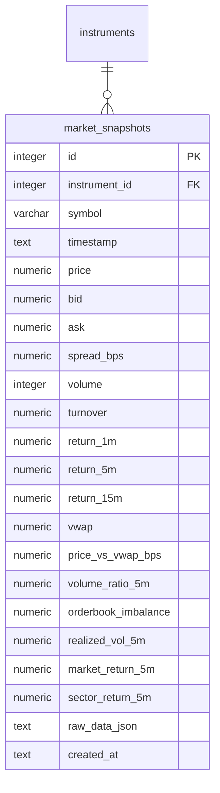

| カラム | 型 | 制約 | 説明 |
|-------|-----|------|------|
| id | integer | PK（AUTOINCREMENT） | |
| instrument_id | integer | FK → instruments.id, NOT NULL | |
| symbol | varchar(10) | NOT NULL | 非正規化（クエリ簡略化用） |
| timestamp | text | NOT NULL | スナップショット時刻（RFC3339、1分足） |
| price | numeric(12,2) | NOT NULL | |
| bid / ask | numeric(12,2) | NULL可 | 板情報取得不可時はNULL |
| spread_bps | numeric(8,2) | NULL可 | |
| volume | integer | NOT NULL | |
| turnover | numeric(18,2) | NOT NULL | |
| return_1m / return_5m / return_15m | numeric(8,4) | NULL可（起動直後等は算出不可） | |
| vwap | numeric(12,2) | NOT NULL | |
| price_vs_vwap_bps | numeric(8,2) | NOT NULL | |
| volume_ratio_5m | numeric(8,4) | NULL可 | |
| orderbook_imbalance | numeric(6,4) | NULL可 | |
| realized_vol_5m | numeric(8,4) | NULL可 | |
| market_return_5m / sector_return_5m | numeric(8,4) | NULL可 | TOPIX/業種指数から算出 |
| raw_data_json | text | NOT NULL | kabuステーションAPI生レスポンス（JSON文字列、再計算・監査用） |
| created_at | text | NOT NULL | |

インデックス: `UNIQUE (instrument_id, timestamp)`, `INDEX (symbol, timestamp DESC)`

ベクトルインデックス: `market_snapshot_vectors`（後述「ベクトルインデックス」参照、`rowid = market_snapshots.id`）

運用上の注意: 高頻度書き込みテーブルのため、周期実行1サイクル分（スクリーニング対象銘柄分）を1トランザクションにまとめて書き込み、SQLiteのWAL書き込みコストを抑える。データ量増大時は`timestamp`月次範囲での論理アーカイブ（古い行を別ファイルへエクスポートし削除）を運用開始後のデータ量に応じて検討する。

### jev_decisions

Jev Scout/Traderの入出力ログ（Calibrationの基礎データ）。

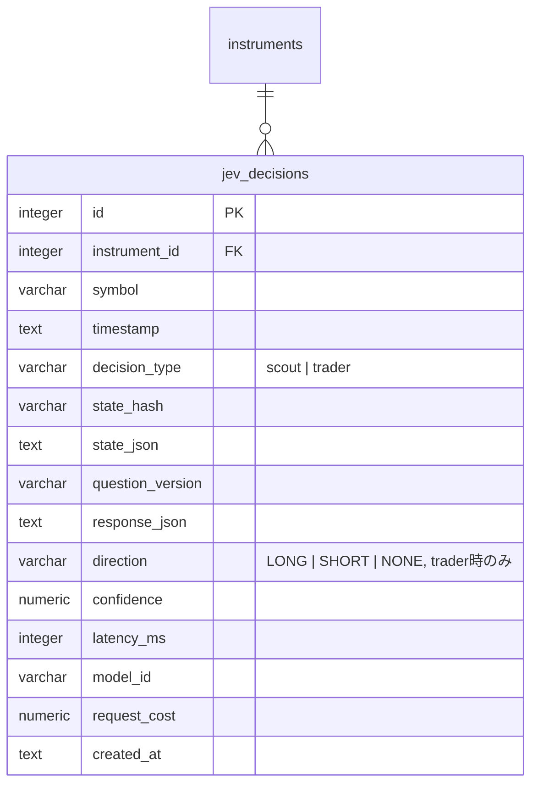

| カラム | 型 | 制約 | 説明 |
|-------|-----|------|------|
| id | integer | PK（AUTOINCREMENT） | |
| instrument_id | integer | FK → instruments.id, NOT NULL | |
| symbol | varchar(10) | NOT NULL | |
| timestamp | text | NOT NULL | Jev呼び出し時刻（RFC3339） |
| decision_type | varchar(10) | NOT NULL, CHECK IN ('scout','trader') | |
| state_hash | varchar(64) | NOT NULL | 入力状態のハッシュ。再評価抑制の判定に使用（`functional.md` FR-SCAN-2） |
| state_json | text | NOT NULL | Jevへの入力（JSON文字列、`functional.md` §4.4/4.5参照） |
| question_version | varchar(20) | NOT NULL | プロンプト/質問セットのバージョン |
| response_json | text | NOT NULL | Jevからの生レスポンス（JSON文字列） |
| direction | varchar(10) | NULL可, CHECK IN ('LONG','SHORT','NONE') | decision_type=trader時のみ設定 |
| confidence | numeric(5,4) | NULL可 | |
| latency_ms | integer | NOT NULL | |
| model_id | varchar(100) | NOT NULL | |
| request_cost | numeric(10,6) | NULL可 | API課金額（USD等） |
| created_at | text | NOT NULL | |

インデックス: `INDEX (instrument_id, timestamp DESC)`, `INDEX (decision_type)`, `INDEX (state_hash)`

ベクトルインデックス: `jev_decision_vectors`（`rowid = jev_decisions.id`）

### trade_signals

Policy Engineが生成した取引候補。

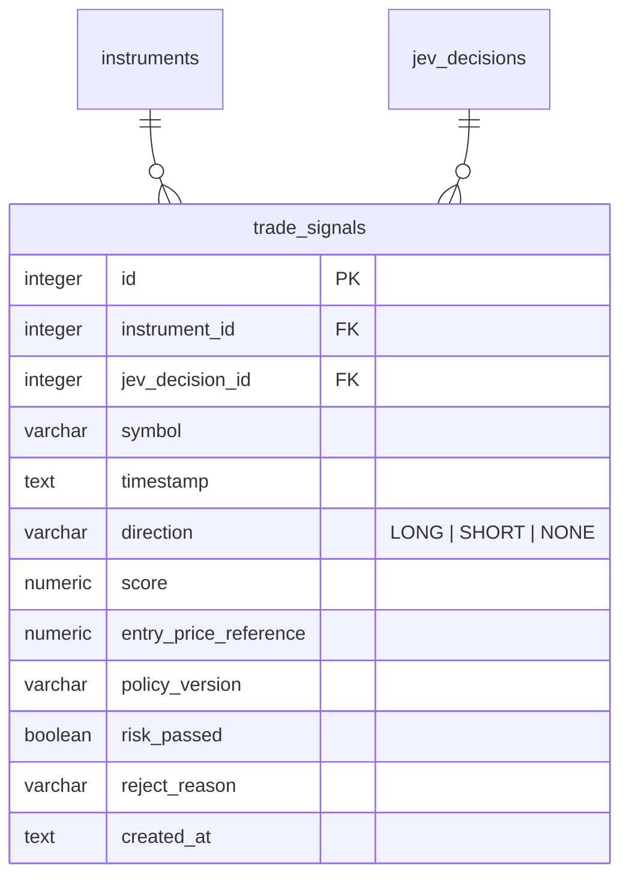

| カラム | 型 | 制約 | 説明 |
|-------|-----|------|------|
| id | integer | PK（AUTOINCREMENT） | |
| instrument_id | integer | FK → instruments.id, NOT NULL | |
| jev_decision_id | integer | FK → jev_decisions.id, NULL可 | 根拠となったJev Trader判断 |
| symbol | varchar(10) | NOT NULL | |
| timestamp | text | NOT NULL | |
| direction | varchar(10) | NOT NULL, CHECK IN ('LONG','SHORT','NONE') | |
| score | numeric(6,4) | NULL可 | Policy Engine内部スコア |
| entry_price_reference | numeric(12,2) | NULL可 | |
| policy_version | varchar(20) | NOT NULL | しきい値バージョン（`functional.md` FR-POLICY-4） |
| risk_passed | boolean | NOT NULL | Risk Engine通過可否 |
| reject_reason | varchar(255) | NULL可 | risk_passed=false時の理由 |
| created_at | text | NOT NULL | |

インデックス: `INDEX (instrument_id, timestamp DESC)`, `INDEX (risk_passed)`

### paper_orders

Paper Trading（将来は実発注）の注文・約定。

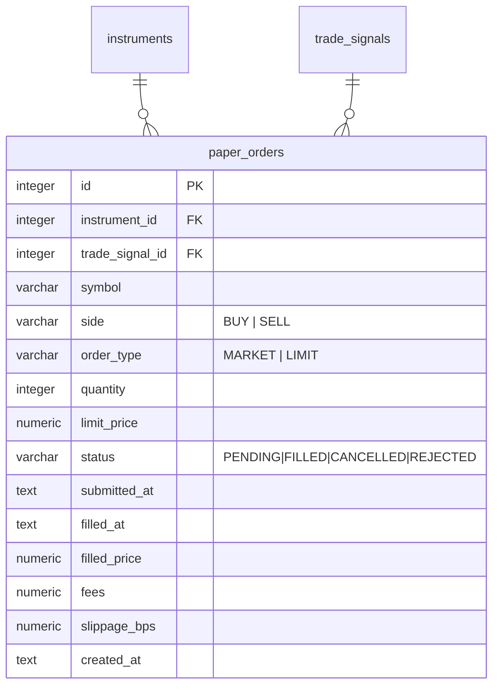

| カラム | 型 | 制約 | 説明 |
|-------|-----|------|------|
| id | integer | PK（AUTOINCREMENT） | |
| instrument_id | integer | FK → instruments.id, NOT NULL | |
| trade_signal_id | integer | FK → trade_signals.id, NULL可 | |
| symbol | varchar(10) | NOT NULL | |
| side | varchar(10) | NOT NULL, CHECK IN ('BUY','SELL') | |
| order_type | varchar(10) | NOT NULL, CHECK IN ('MARKET','LIMIT') | |
| quantity | integer | NOT NULL | |
| limit_price | numeric(12,2) | NULL可 | order_type=LIMIT時必須（アプリ層で検証） |
| status | varchar(20) | NOT NULL, CHECK IN ('PENDING','FILLED','CANCELLED','REJECTED') | |
| submitted_at | text | NOT NULL | |
| filled_at | text | NULL可 | |
| filled_price | numeric(12,2) | NULL可 | |
| fees | numeric(10,2) | NOT NULL, DEFAULT 0 | |
| slippage_bps | numeric(8,2) | NULL可 | |
| created_at | text | NOT NULL | |

インデックス: `INDEX (instrument_id, submitted_at DESC)`, `INDEX (status)`

### positions

保有ポジション（Entry/Exit紐付き）。

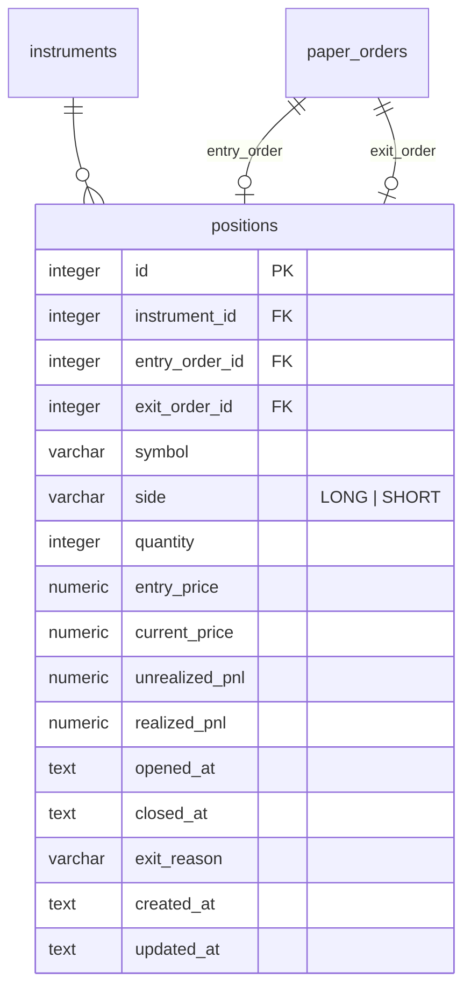

| カラム | 型 | 制約 | 説明 |
|-------|-----|------|------|
| id | integer | PK（AUTOINCREMENT） | |
| instrument_id | integer | FK → instruments.id, NOT NULL | |
| entry_order_id | integer | FK → paper_orders.id, NOT NULL | |
| exit_order_id | integer | FK → paper_orders.id, NULL可 | クローズ後に設定 |
| symbol | varchar(10) | NOT NULL | |
| side | varchar(10) | NOT NULL, CHECK IN ('LONG','SHORT') | |
| quantity | integer | NOT NULL | |
| entry_price | numeric(12,2) | NOT NULL | |
| current_price | numeric(12,2) | NOT NULL | 保有中はSchedulerが定期更新 |
| unrealized_pnl | numeric(14,2) | NOT NULL, DEFAULT 0 | |
| realized_pnl | numeric(14,2) | NULL可 | クローズ時に確定 |
| opened_at | text | NOT NULL | |
| closed_at | text | NULL可 | |
| exit_reason | varchar(50) | NULL可 | 例: stop_loss/take_profit/trailing_stop/jev_reversal/max_holding/force_close |
| created_at / updated_at | text | NOT NULL | |

インデックス: `INDEX (instrument_id)`, `UNIQUE (instrument_id) WHERE closed_at IS NULL`（部分インデックス。SQLite 3.8+対応。同一銘柄の同時保有は1ポジションに制限し、状態管理§4.9の `position` フィールドと整合させる）

### calibration_outcomes

Jev判断と将来値動きの紐付け結果。

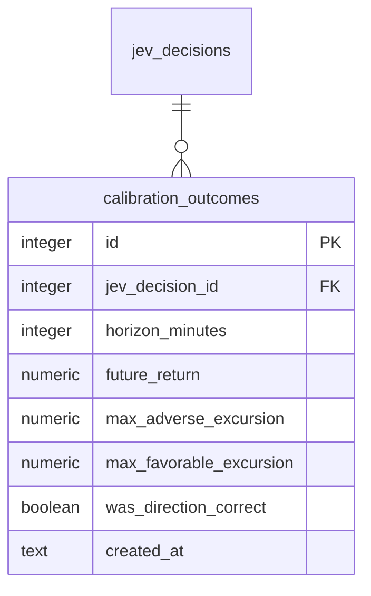

| カラム | 型 | 制約 | 説明 |
|-------|-----|------|------|
| id | integer | PK（AUTOINCREMENT） | |
| jev_decision_id | integer | FK → jev_decisions.id, NOT NULL | decision_type=trader対象 |
| horizon_minutes | integer | NOT NULL | 5 / 10 / 20 等 |
| future_return | numeric(8,4) | NOT NULL | |
| max_adverse_excursion | numeric(8,4) | NOT NULL | |
| max_favorable_excursion | numeric(8,4) | NOT NULL | |
| was_direction_correct | boolean | NULL可 | direction=NONEの場合NULL |
| created_at | text | NOT NULL | |

インデックス: `UNIQUE (jev_decision_id, horizon_minutes)`

### kill_switch_events

Risk EngineのKill Switch発動・解除履歴（監査ログ）。

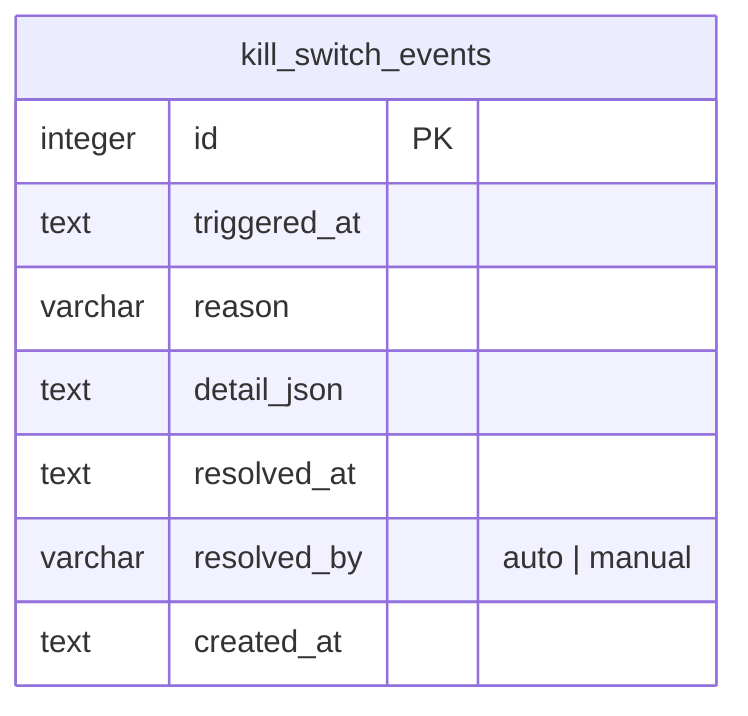

| カラム | 型 | 制約 | 説明 |
|-------|-----|------|------|
| id | integer | PK（AUTOINCREMENT） | |
| triggered_at | text | NOT NULL | |
| reason | varchar(100) | NOT NULL, CHECK IN ('daily_loss_limit','consecutive_losses','market_data_down','jev_api_down','broker_api_error','unexpected_position','fill_discrepancy','db_write_failure','operator_heartbeat_timeout') | `functional.md` FR-RISK-2, FR-RISK-6 |
| detail_json | text | NOT NULL | 発動時のRisk状態スナップショット（JSON文字列） |
| resolved_at | text | NULL可 | |
| resolved_by | varchar(50) | NULL可, CHECK IN ('auto','manual') | |
| created_at | text | NOT NULL | |

インデックス: `INDEX (triggered_at DESC)`, `INDEX (resolved_at)`

### runtime_settings

Fast Screener/Policy/Risk のしきい値をコード再デプロイなしで変更するためのKey-Valueストア（`config/*.yaml` の初期値をDBへロードし、以降はDBを正とする）。

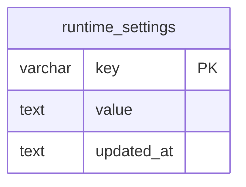

| カラム | 型 | 制約 | 説明 |
|-------|-----|------|------|
| key | varchar(100) | PK | 例: `screener.min_price`, `policy.long.min_confidence`, `risk.max_daily_loss_pct` |
| value | text | NOT NULL | JSON文字列 |
| updated_at | text | NOT NULL | |

### policy_proposals

Sol（Think）が生成しOpus（Govern）がレビューする、Policy Engineしきい値の自己改善提案・審査・適用履歴（`functional.md` §4.14）。

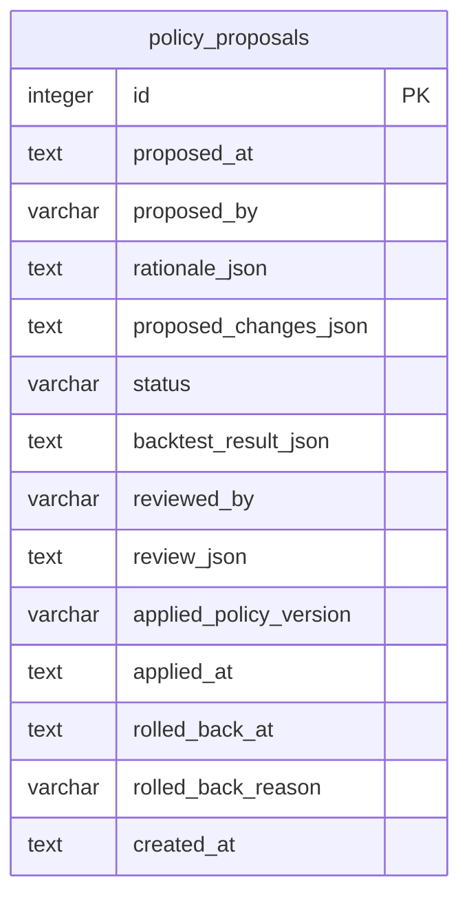

| カラム | 型 | 制約 | 説明 |
|-------|-----|------|------|
| id | integer | PK（AUTOINCREMENT） | |
| proposed_at | text | NOT NULL | |
| proposed_by | varchar(20) | NOT NULL, DEFAULT 'sol' | 提案元 |
| rationale_json | text | NOT NULL | Solによる分析根拠（負けトレード分析・Calibration指標等、JSON文字列） |
| proposed_changes_json | text | NOT NULL | `runtime_settings`の`policy.*`キーに対する変更差分のみ（`risk.*`キーは対象外、`functional.md` FR-SELFIMPROVE-2） |
| status | varchar(20) | NOT NULL, CHECK IN ('pending','approved','rejected','applied','rolled_back'), DEFAULT 'pending' | |
| backtest_result_json | text | NULL可 | Opusによるシャドーバックテスト結果（Expectancy/Max Drawdown比較、FR-SELFIMPROVE-4） |
| reviewed_by | varchar(20) | NULL可, DEFAULT 'opus' | |
| review_json | text | NULL可 | Opusの承認/却下理由 |
| applied_policy_version | varchar(20) | NULL可 | 適用時に採番する`policy_version` |
| applied_at | text | NULL可 | |
| rolled_back_at | text | NULL可 | |
| rolled_back_reason | varchar(255) | NULL可 | FR-SELFIMPROVE-6によるロールバック理由 |
| created_at | text | NOT NULL | |

インデックス: `INDEX (status)`, `INDEX (proposed_at DESC)`

### jobs（自前ワーカーキュー、River代替）

SQLiteはRiver（Postgres専用ジョブキュー）を利用できないため、`market-data`/`feature-calc`/`jev-scout`/`jev-trader`/`risk-check`/`paper-execution`/`outcome-labeling`/`analytics`の8キューをこのテーブルと`internal/service/scheduler`のGoワーカープールで実現する（`architecture/overview.md` §2, §8参照）。

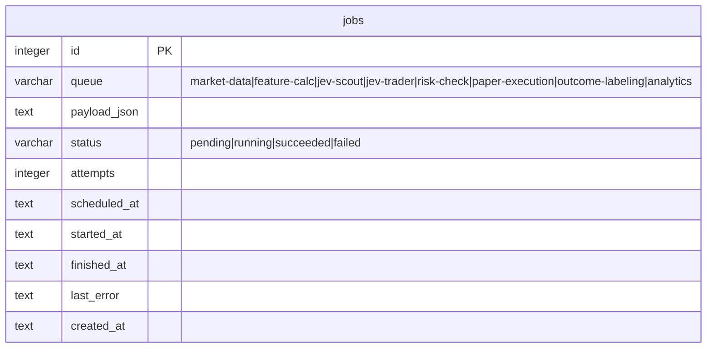

| カラム | 型 | 制約 | 説明 |
|-------|-----|------|------|
| id | integer | PK（AUTOINCREMENT） | |
| queue | varchar(30) | NOT NULL | キュー名 |
| payload_json | text | NOT NULL | ジョブ引数（JSON文字列） |
| status | varchar(20) | NOT NULL, CHECK IN ('pending','running','succeeded','failed'), DEFAULT 'pending' | |
| attempts | integer | NOT NULL, DEFAULT 0 | リトライ回数 |
| scheduled_at | text | NOT NULL | 実行予定時刻 |
| started_at | text | NULL可 | |
| finished_at | text | NULL可 | |
| last_error | text | NULL可 | |
| created_at | text | NOT NULL | |

インデックス: `INDEX (queue, status, scheduled_at)`

再起動時の回復: プロセス起動時に`status='running'`のまま残っている行（クラッシュで中断されたジョブ）を`pending`へ戻し再実行する。

## ベクトルインデックス（sqlite-vec）

RAG類似検索（`functional.md` FR-RAG-1〜3）のため、[sqlite-vec](https://github.com/asg017/sqlite-vec)拡張の`vec0`仮想テーブルを用いる。標準化済み特徴量ベクトルは16次元固定（return_1m/5m/15m, price_vs_vwap_bps, volume_ratio_1m/5m, spread_bps, orderbook_imbalance, realized_vol_5m/15m, volatility_expansion_ratio, market_return_5m, sector_return_5m, stock_vs_sector_relative_strength を標準化し結合）。

```sql
-- 拡張ロード（Go側は sqlite-vec の Go バインディングで自動登録）
-- CREATE VIRTUAL TABLE は golang-migrate のマイグレーションで実行する

CREATE VIRTUAL TABLE market_snapshot_vectors USING vec0(
  snapshot_id INTEGER PRIMARY KEY,
  embedding FLOAT[16]
);

CREATE VIRTUAL TABLE jev_decision_vectors USING vec0(
  decision_id INTEGER PRIMARY KEY,
  embedding FLOAT[16]
);
```

- `snapshot_id` / `decision_id` は `market_snapshots.id` / `jev_decisions.id` を参照する（仮想テーブルのためFK制約は付与できず、アプリ層で整合性を保証する）
- 類似検索は `SELECT decision_id, distance FROM jev_decision_vectors WHERE embedding MATCH ? ORDER BY distance LIMIT 5` の形式で行う（k=5、`functional.md` FR-RAG-2）
- コールドスタート期間（該当テーブルの行数が少ない間）は検索結果0件として扱い、FR-RAG-4の通りRAG文脈なしでJevを呼び出す

## 改訂履歴

| 版 | 日付 | 変更内容 | 変更理由 |
|----|------|---------|---------|
| 1.0 | 2026-09-26 | 新規作成（PostgreSQL 16 + pgvector前提） | 初版 |
| 1.1 | 2026-09-26 | PostgreSQLからSQLite（アプリ内蔵）へ全面移行。pgvector→sqlite-vec仮想テーブル、River→自前`jobs`テーブルに変更 | Wails単一exe配布との整合、外部DBサービス常駐の排除 |
