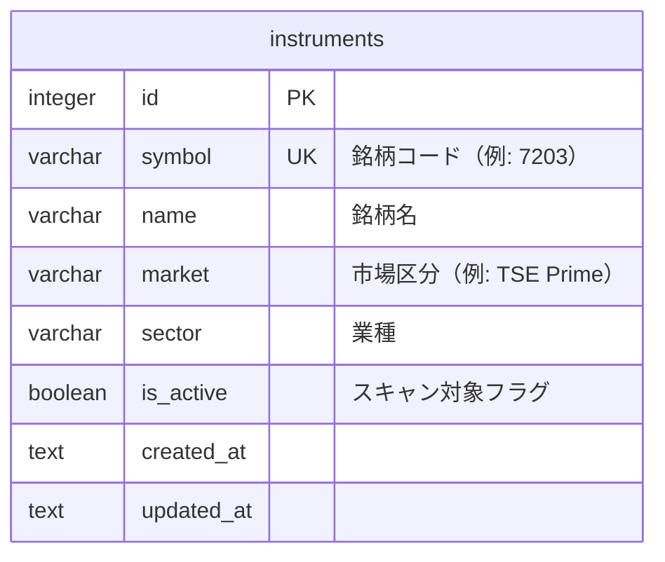
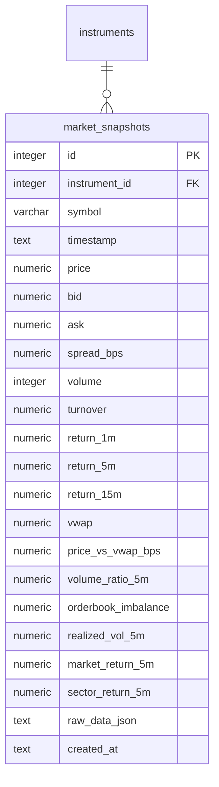
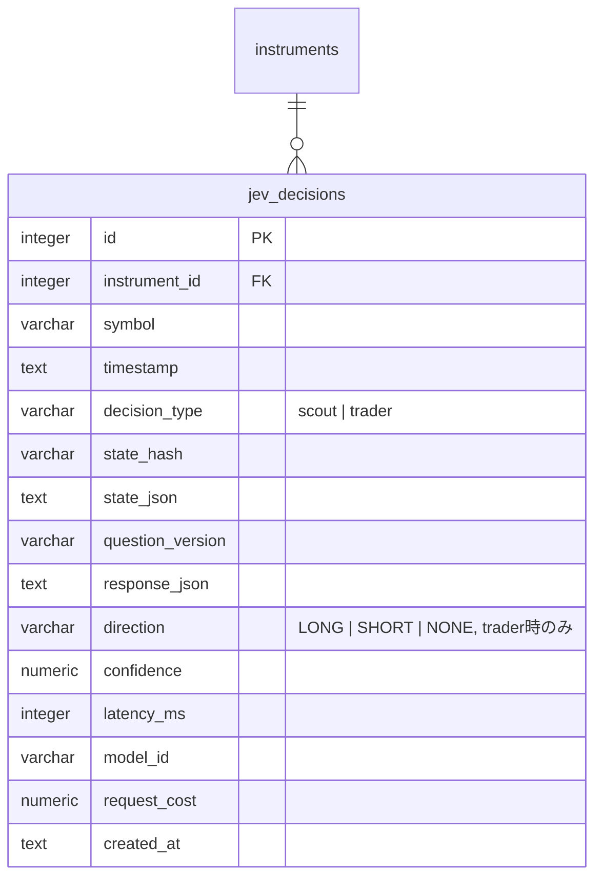
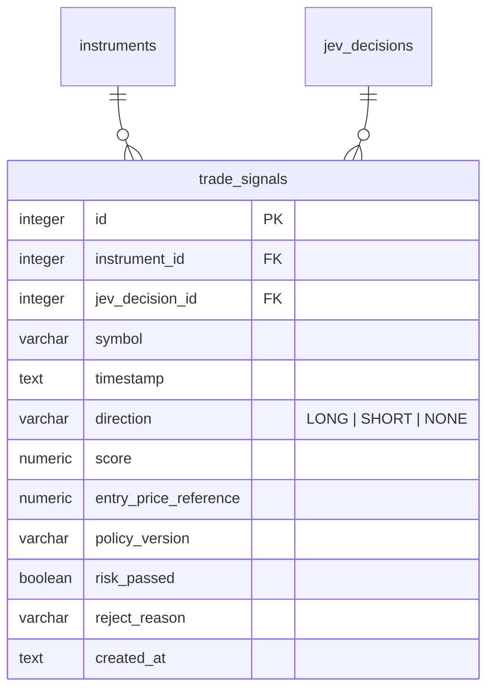

# ER / データモデル: テーブル定義（市場データ・Jev判断）

`docs/architecture/er.md` から分割した章。対象: `instruments` / `market_snapshots` / `jev_decisions` / `trade_signals`。型・規約と全体ER図は `docs/architecture/er.md` を参照。

## instruments

対象銘柄マスタ。

| カラム | 型 | 制約 | 説明 |
|-------|-----|------|------|
| id | integer | PK（AUTOINCREMENT） | |
| symbol | varchar(10) | UNIQUE, NOT NULL | 証券コード |
| name | varchar(255) | NOT NULL | 銘柄名 |
| market | varchar(50) | NOT NULL | 市場区分 |
| sector | varchar(100) | NULL可 | 業種（sector_return_5m算出に利用） |
| is_active | boolean | NOT NULL, DEFAULT 1 | 0の場合Fast Screener対象外 |
| created_at | text | NOT NULL, DEFAULT (RFC3339 now) | |
| updated_at | text | NOT NULL, DEFAULT (RFC3339 now) | |

インデックス: `UNIQUE (symbol)`, `INDEX (is_active)`

## market_snapshots

Feature Engineが算出した1分足スナップショット。

| カラム | 型 | 制約 | 説明 |
|-------|-----|------|------|
| id | integer | PK（AUTOINCREMENT） | |
| instrument_id | integer | FK → instruments.id, NOT NULL | |
| symbol | varchar(10) | NOT NULL | 非正規化（クエリ簡略化用） |
| timestamp | text | NOT NULL | スナップショット時刻（RFC3339、1分足） |
| price | numeric(12,2) | NOT NULL | |
| bid / ask | numeric(12,2) | NULL可 | 板情報取得不可時はNULL |
| spread_bps | numeric(8,2) | NULL可 | |
| volume | integer | NOT NULL | |
| turnover | numeric(18,2) | NOT NULL | |
| return_1m / return_5m / return_15m | numeric(8,4) | NULL可（起動直後等は算出不可） | |
| vwap | numeric(12,2) | NOT NULL | |
| price_vs_vwap_bps | numeric(8,2) | NOT NULL | |
| volume_ratio_5m | numeric(8,4) | NULL可 | |
| orderbook_imbalance | numeric(6,4) | NULL可 | |
| realized_vol_5m | numeric(8,4) | NULL可 | |
| market_return_5m / sector_return_5m | numeric(8,4) | NULL可 | TOPIX/業種指数から算出 |
| raw_data_json | text | NOT NULL | kabuステーションAPI生レスポンス（JSON文字列、再計算・監査用） |
| created_at | text | NOT NULL | |

インデックス: `UNIQUE (instrument_id, timestamp)`, `INDEX (symbol, timestamp DESC)`

ベクトルインデックス: `market_snapshot_vectors`（後述「ベクトルインデックス」参照、`rowid = market_snapshots.id`）

運用上の注意: 高頻度書き込みテーブルのため、周期実行1サイクル分（スクリーニング対象銘柄分）を1トランザクションにまとめて書き込み、SQLiteのWAL書き込みコストを抑える。保持期間は90日で、Schedulerの`@daily`ジョブ（`internal/service/retention`）が`timestamp`が90日より古い行を`market_snapshot_vectors`の対応行とともにバッチ削除する（`non-functional.md` §3）。

## jev_decisions

Jev Scout/Traderの入出力ログ（Calibrationの基礎データ）。

| カラム | 型 | 制約 | 説明 |
|-------|-----|------|------|
| id | integer | PK（AUTOINCREMENT） | |
| instrument_id | integer | FK → instruments.id, NOT NULL | |
| symbol | varchar(10) | NOT NULL | |
| timestamp | text | NOT NULL | Jev呼び出し時刻（RFC3339） |
| decision_type | varchar(10) | NOT NULL, CHECK IN ('scout','trader') | |
| state_hash | varchar(64) | NOT NULL | 入力状態のハッシュ。再評価抑制の判定に使用（`functional.md` FR-SCAN-2） |
| state_json | text | NOT NULL | Jevへの入力（JSON文字列、`functional.md` §4.4/4.5参照） |
| question_version | varchar(20) | NOT NULL | プロンプト/質問セットのバージョン |
| response_json | text | NOT NULL | Jevからの生レスポンス（JSON文字列） |
| direction | varchar(10) | NULL可, CHECK IN ('LONG','SHORT','NONE') | decision_type=trader時のみ設定 |
| confidence | numeric(5,4) | NULL可 | |
| latency_ms | integer | NOT NULL | |
| model_id | varchar(100) | NOT NULL | |
| request_cost | numeric(10,6) | NULL可 | API課金額（USD等） |
| created_at | text | NOT NULL | |

インデックス: `INDEX (instrument_id, timestamp DESC)`, `INDEX (decision_type)`, `INDEX (state_hash)`

ベクトルインデックス: `jev_decision_vectors`（`rowid = jev_decisions.id`）

## trade_signals

Policy Engineが生成した取引候補。

| カラム | 型 | 制約 | 説明 |
|-------|-----|------|------|
| id | integer | PK（AUTOINCREMENT） | |
| instrument_id | integer | FK → instruments.id, NOT NULL | |
| jev_decision_id | integer | FK → jev_decisions.id, NULL可 | 根拠となったJev Trader判断 |
| symbol | varchar(10) | NOT NULL | |
| timestamp | text | NOT NULL | |
| direction | varchar(10) | NOT NULL, CHECK IN ('LONG','SHORT','NONE') | |
| score | numeric(6,4) | NULL可 | Policy Engine内部スコア |
| entry_price_reference | numeric(12,2) | NULL可 | |
| policy_version | varchar(20) | NOT NULL | しきい値バージョン（`functional.md` FR-POLICY-4） |
| risk_passed | boolean | NOT NULL | Risk Engine通過可否 |
| reject_reason | varchar(255) | NULL可 | risk_passed=false時の理由 |
| created_at | text | NOT NULL | |

インデックス: `INDEX (instrument_id, timestamp DESC)`, `INDEX (risk_passed)`
