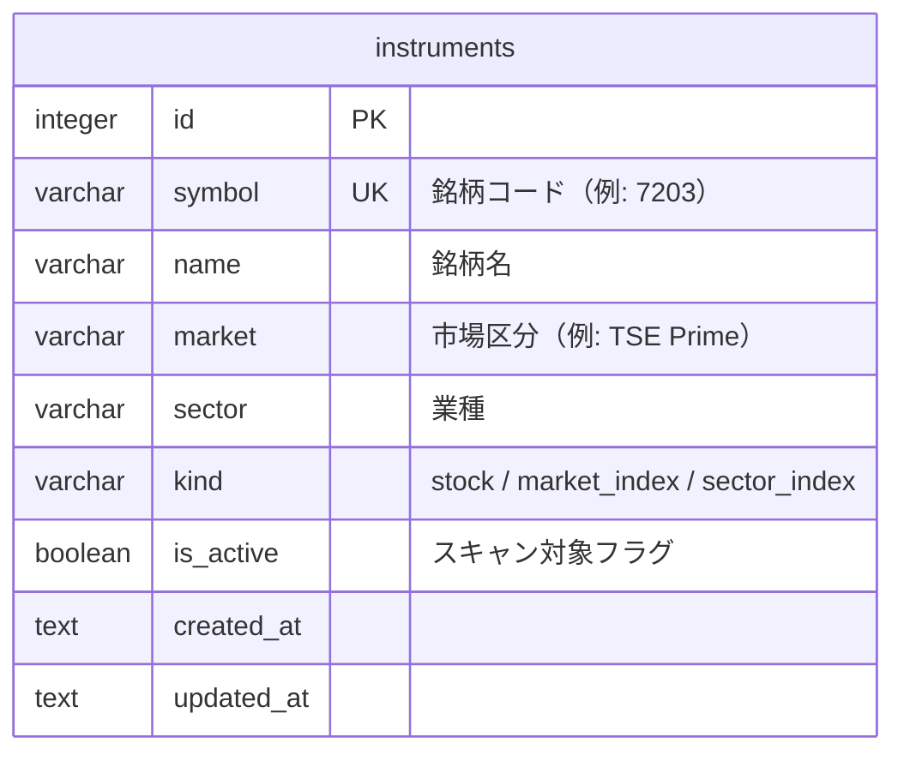
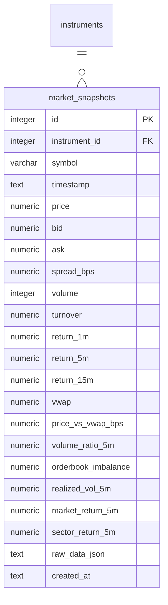
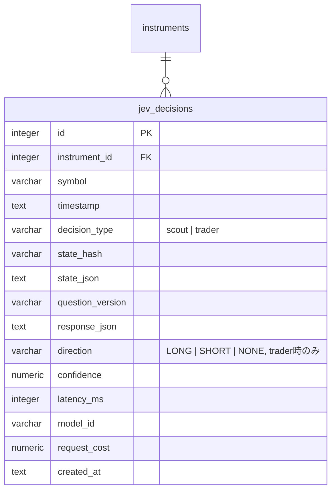
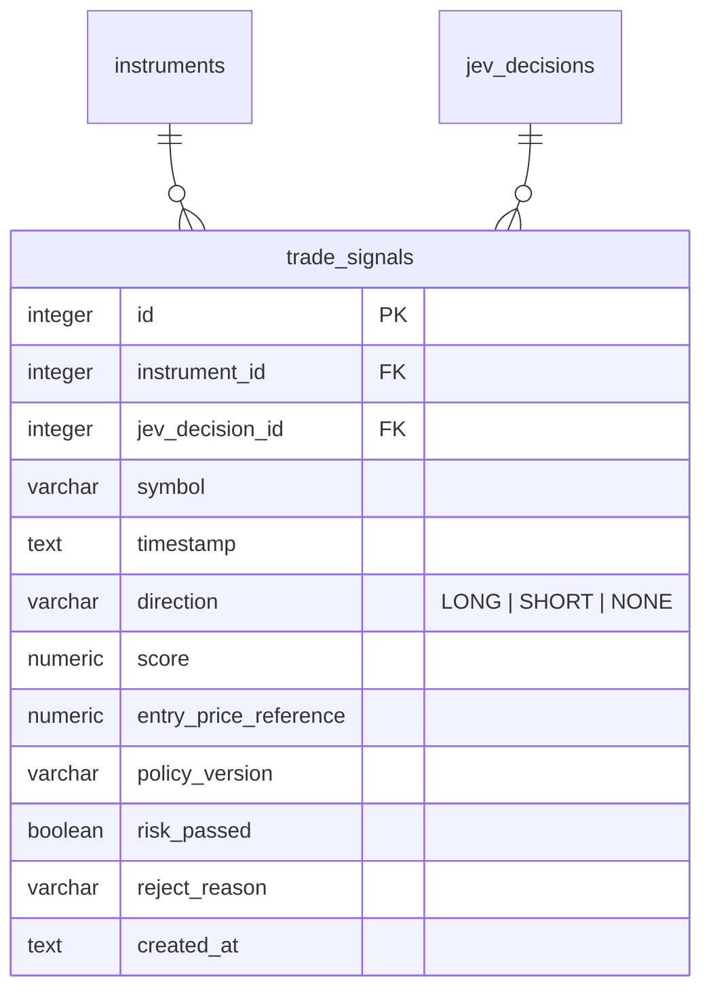

# ER / データモデル: テーブル定義（市場データ・Jev判断）

`docs/architecture/er.md` から分割した章。対象: `instruments` / `market_snapshots` / `jev_decisions` / `trade_signals`。型・規約と全体ER図は `docs/architecture/er.md` を参照。

## instruments

対象銘柄マスタ。

| カラム | 型 | 制約 | 説明 |
|-------|-----|------|------|
| id | integer | PK（AUTOINCREMENT） | |
| symbol | varchar(10) | UNIQUE, NOT NULL | 証券コード |
| name | varchar(255) | NOT NULL | 銘柄名 |
| market | varchar(50) | NOT NULL | 市場区分 |
| sector | varchar(100) | NULL可 | 業種。株式の業種と`kind=sector_index`銘柄の`sector`が一致すると、その指数がsector_return_5m算出に使われる |
| kind | varchar(20) | NOT NULL, DEFAULT 'stock', CHECK IN ('stock','market_index','sector_index') | `stock`のみスクリーニング/売買対象。`market_index`（TOPIX/Nikkei225等）と`sector_index`（業種指数）は市場コンテキスト特徴量（market_return_1m/5m, sector_return_5m）の入力としてだけ追跡し、Fast Screener・バックテスト対象外 |
| is_active | boolean | NOT NULL, DEFAULT 1 | 0の場合Fast Screener対象外 |
| created_at | text | NOT NULL, DEFAULT (strftime ミリ秒3桁) | DEFAULTは本番経路では使わず、`InstrumentRepository`が`sqlutil.FormatTime`（固定9桁）で常に明示する（`er.md`「日時列のDEFAULT」） |
| updated_at | text | NOT NULL, DEFAULT (strftime ミリ秒3桁) | 同上 |

インデックス: `UNIQUE (symbol)`, `INDEX (is_active)`

投入: アプリ起動時に`internal/bootstrap/universe`が銘柄マスタCSVから`symbol`キーでupsertする（`environment/setup.md`「銘柄マスタの投入」）。新規行は`is_active=1`、既存行は`name`/`market`/`sector`/`kind`のみ更新し`is_active`は変更しない。内容が同一の行は更新せず`updated_at`も変わらない（冪等）。

## market_snapshots

Feature Engineが算出した1分足スナップショット。

| カラム | 型 | 制約 | 説明 |
|-------|-----|------|------|
| id | integer | PK（AUTOINCREMENT） | |
| instrument_id | integer | FK → instruments.id, NOT NULL | |
| symbol | varchar(10) | NOT NULL | 非正規化（クエリ簡略化用） |
| timestamp | text | NOT NULL | スナップショット時刻（RFC3339、1分足） |
| price | numeric(12,2) | NOT NULL | |
| bid / ask | numeric(12,2) | NULL可 | 板情報取得不可時はNULL |
| spread_bps | numeric(8,2) | NULL可 | |
| volume | integer | NOT NULL | |
| turnover | numeric(18,2) | NOT NULL | |
| return_1m / return_5m / return_15m | numeric(8,4) | NULL可（起動直後等は算出不可） | **小数比**（0.004 = +0.4%）。Scanner API/画面は×100して%表示し、Fast Screenerの`min_abs_return_5m_pct`（%）との比較も×100して行う（`domain.RatioToPercent`） |
| vwap | numeric(12,2) | NOT NULL | |
| price_vs_vwap_bps | numeric(8,2) | NOT NULL | |
| volume_ratio_5m | numeric(8,4) | NULL可 | |
| orderbook_imbalance | numeric(6,4) | NULL可 | |
| realized_vol_5m | numeric(8,4) | NULL可 | |
| market_return_1m / market_return_5m | numeric | NULL可 | `kind=market_index`銘柄（TOPIX/Nikkei225）のreturnの平均 |
| sector_return_5m | numeric | NULL可 | 銘柄の`sector`と一致する`kind=sector_index`銘柄のreturn。該当指数なしはNULL |
| stock_vs_sector_relative_strength | numeric | NULL可 | return_5m − sector_return_5m |
| market_breadth | numeric | NULL可 | 直近3分以内の全アクティブ株式の最新return_5mのうち（上昇数−下落数）/銘柄数。[-1, 1] |
| return_3m / return_30m | numeric | NULL可 | 履歴不足時はNULL |
| high_distance_5m / low_distance_5m | numeric | NULL可 | 直近5分の高値/安値に対する `price/x − 1` |
| session_high_distance / session_low_distance | numeric | NULL可 | kabuの当日高値/安値（HighPrice/LowPrice）に対する `price/x − 1` |
| vwap_slope | numeric | NULL可 | 5分前のVWAPに対するVWAPの変化率 |
| vwap_cross_direction | integer | NULL可 | 直前の足からVWAPを下→上に抜けた場合+1、上→下は−1、クロスなしは0 |
| volume_1m / volume_5m | integer | NULL可 | 累積`TradingVolume`の差分（窓内出来高） |
| volume_ratio_1m | numeric | NULL可 | volume_ratio_5mと同じ算出の1分版 |
| turnover_1m / turnover_5m | numeric | NULL可 | 累積`turnover`の差分（窓内売買代金・円）。**`turnover`は当日累積値のため合算してはならない**。Fast Screenerの`min_turnover_5m_jpy`とPolicy Engineの「板が薄い」判定は同じturnover_5mを使う（`featureengine.TurnoverOverWindow`） |
| atr_1m / atr_5m | numeric | NULL可 | 真の値幅の平均（円）。サンプリング価格から作った足（1分×5本/5分×3本）に基づく |
| realized_vol_15m / volatility_expansion_ratio | numeric | NULL可 | 後者は realized_vol_5m / realized_vol_15m |
| bid_depth / ask_depth | numeric | NULL可 | 板の`Sell1..10`（bid側）/`Buy1..10`（ask側）の合計数量 |
| buy_trade_ratio / sell_trade_ratio / trade_flow_imbalance | numeric | NULL可 | 直近5分の出来高増分をティックルール（価格上昇=買い、下落=売り、同値=直前方向）で分類した比率と(買−売)/(買+売) |
| microprice | numeric | NULL可 | (bid×askQty + ask×bidQty)/(bidQty+askQty) |
| raw_data_json | text | NOT NULL | kabuステーションAPI生レスポンス（JSON文字列、再計算・監査用） |
| created_at | text | NOT NULL | |

インデックス: `UNIQUE (instrument_id, timestamp)`, `INDEX (symbol, timestamp DESC)`

ベクトルインデックス: `market_snapshot_vectors`（後述「ベクトルインデックス」参照、`rowid = market_snapshots.id`）

運用上の注意: 高頻度書き込みテーブルのため、周期実行1サイクル分（スクリーニング対象銘柄分）を1トランザクションにまとめて書き込み、SQLiteのWAL書き込みコストを抑える。保持期間は90日で、Schedulerの日次（起動時catch-up付き）ジョブ（`internal/service/retention`）が`timestamp`が90日より古い行を`market_snapshot_vectors`の対応行とともにバッチ削除する（`non-functional.md` §3）。

## jev_decisions

Jev Scout/Traderの入出力ログ（Calibrationの基礎データ）。

| カラム | 型 | 制約 | 説明 |
|-------|-----|------|------|
| id | integer | PK（AUTOINCREMENT） | |
| instrument_id | integer | FK → instruments.id, NOT NULL | |
| symbol | varchar(10) | NOT NULL | |
| timestamp | text | NOT NULL | Jev呼び出し時刻（RFC3339） |
| decision_type | varchar(10) | NOT NULL, CHECK IN ('scout','trader') | |
| state_hash | varchar(64) | NOT NULL | 入力状態のハッシュ。再評価抑制の判定に使用（`functional.md` FR-SCAN-2） |
| state_json | text | NOT NULL | Jevへの入力（JSON文字列、`functional.md` §4.4/4.5参照） |
| question_version | varchar(20) | NOT NULL | プロンプト/質問セットのバージョン（例: `scout-v2`/`trader-v2`。`scout-v1`/`trader-v1`は旧独自スキーマ時代の値） |
| response_json | text | NOT NULL | Jev回答を変換した`ScoutResponse`/`TraderResponse`のJSON文字列（公式APIの生レスポンスそのものではない） |
| direction | varchar(10) | NULL可, CHECK IN ('LONG','SHORT','NONE') | decision_type=trader時のみ設定 |
| confidence | numeric(5,4) | NULL可 | |
| latency_ms | integer | NOT NULL | |
| model_id | varchar(100) | NOT NULL | |
| request_cost | numeric(10,6) | NULL可 | API課金額（USD等）。TypeSafe AI公式API（`/v1/systemone`）は課金額を返さず`usage`のトークン数のみのため、現行実装は常にNULL |
| created_at | text | NOT NULL | |

インデックス: `INDEX (instrument_id, timestamp DESC)`, `INDEX (decision_type)`, `INDEX (state_hash)`, `INDEX (decision_type, timestamp)`, `INDEX (timestamp)`（後ろ2本はActivity Logの直近判断`ListRecent`が`ORDER BY timestamp DESC, id DESC LIMIT N`を全走査・整列なしで引くため。マイグレーション000020）

ベクトルインデックス: `jev_decision_vectors`（`rowid = jev_decisions.id`）

## trade_signals

Policy Engineが生成した取引候補。

| カラム | 型 | 制約 | 説明 |
|-------|-----|------|------|
| id | integer | PK（AUTOINCREMENT） | |
| instrument_id | integer | FK → instruments.id, NOT NULL | |
| jev_decision_id | integer | FK → jev_decisions.id, NULL可 | 根拠となったJev Trader判断 |
| symbol | varchar(10) | NOT NULL | |
| timestamp | text | NOT NULL | |
| direction | varchar(10) | NOT NULL, CHECK IN ('LONG','SHORT','NONE') | |
| score | numeric(6,4) | NULL可 | Policy Engine内部スコア |
| entry_price_reference | numeric(12,2) | NULL可 | |
| policy_version | varchar(20) | NOT NULL | しきい値バージョン（`functional.md` FR-POLICY-4） |
| risk_passed | boolean | NOT NULL | Risk Engine通過可否 |
| reject_reason | varchar(255) | NULL可 | risk_passed=false時の理由 |
| created_at | text | NOT NULL | |

インデックス: `INDEX (instrument_id, timestamp DESC)`, `INDEX (risk_passed)`
