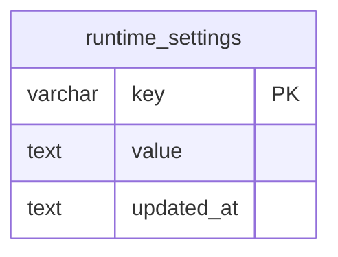
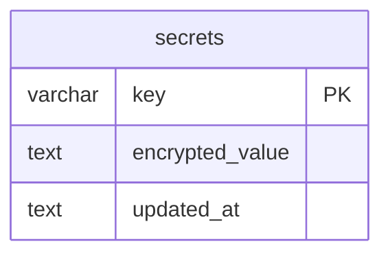
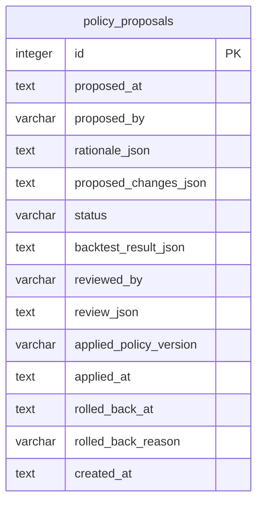
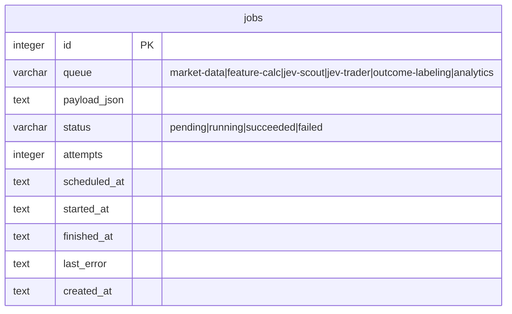

# ER / データモデル: テーブル定義（運用設定・ジョブ・ベクトル）

`docs/architecture/er.md` から分割した章。対象: `runtime_settings` / `secrets` / `policy_proposals` / `jobs` とsqlite-vecベクトルインデックス。型・規約と全体ER図は `docs/architecture/er.md` を参照。

## runtime_settings

Fast Screener（`screener.*`）とPolicy Engine（`policy.*`）のしきい値をコード再デプロイなしで上書きするKey-Valueストア。値は `config/strategy.yaml` < `runtime_settings` の順で読み取り時に重ね合わせる（環境変数による上書き層は無い。`config/*.yaml` の値をDBへロード/シードする処理はなく、行が無ければyamlの値がそのまま使われる）。Settings画面（`/settings`の「運用設定」、`internal/service/opsettings`）が`screener.*`・`policy.{long,short}.*`に加え、`system.backup_dir`（日次バックアップの退避先。未設定で無効）・`system.log_dir`（ログディレクトリ。起動時に読み取り専用で参照するため反映は再起動後）の行を保存・削除する（保存＝upsert、「既定に戻す」＝行の削除）。値は常にJSON文字列/数値。Riskの閾値は対象外（`config/risk.yaml` のみで管理し、`risk.*` キーはもたない）。操作者ハートビート（dead-man's switch、`architecture/overview.md` §10.4）の`system.last_ui_heartbeat_at`のような高頻度更新の単一値もこのテーブルで保持する。



| カラム | 型 | 制約 | 説明 |
|-------|-----|------|------|
| key | varchar(100) | PK | 例: `screener.min_price`（Fast Screener全キー: `screener.{min_price,max_price,min_turnover_5m_jpy,max_spread_bps,min_volume_ratio,min_abs_return_5m_pct,min_realized_volatility,top_n}`、`screener.weights.{volume_ratio,abs_return_5m,breakout_strength,orderbook_imbalance,volatility_expansion}`。値は数値のJSON。DB値は`config/strategy.yaml`より優先し、候補更新ごとに読み込む）, `policy.long.min_probability`（policy.{long,short}.* の許可キーは `internal/domain/policyproposal.go` 参照）, `system.last_ui_heartbeat_at`（認証済みUIリクエストのたびにMiddlewareが更新、FR-RISK-6）, `system.loss_streak_baseline_at` / `system.daily_loss_baseline_at` / `system.fill_discrepancy_baseline_at`（手動Resumeが連敗/日次損失/約定差異のKill Switchを解除した時刻。以後の連敗数・日次実現損失はこれ以降のクローズ分のみ、孤児約定の照合はこれ以降にFILLEDとなった注文のみ対象、FR-RISK-7）, `system.paused` / `system.killed`（Pause/Killの状態そのもの。値は真偽値のJSON、`internal/service/risk`）, `system.daily_loss_warning_notified_at`（日次損失警告の通知重複抑止用に最後に通知した時刻。値はRFC3339のJSON文字列）, `system.maintenance.<task>.last_success_date`（`<task>`は`database_backup` / `data_retention_purge` / `log_rotation`。各メンテナンスタスクの最終成功日で、起動直後・10分ごとの未実行検出（`non-functional.md` §3）の状態保持先。値は`YYYY-MM-DD`のJSON文字列、`internal/service/scheduler/maintenance`）。Riskの閾値（`max_daily_loss_pct`・`heartbeat_timeout_minutes` 等）は `config/risk.yaml` のみで、`risk.*` キーは持たない |
| value | text | NOT NULL | JSON文字列 |
| updated_at | text | NOT NULL | |

## secrets

Settings画面（`/settings`、`functional.md` §4.17）から入力する認証情報（`JEV_API_KEY` / `JEV_BASE_URL` / `KABU_API_PASSWORD` / `SLACK_WEBHOOK_URL` など）のKey-Valueストア（マイグレーション000013）。値は`internal/repository/system.SecretsRepository`が`internal/config.EncryptSecret`（AES-256-GCM）で暗号化して保存し、呼び出し側は平文のみ扱う。鍵はアプリに埋め込みの固定シードから導出されるため、保護対象はDBファイル単体の複製・共有時の平文流出であり、コンパイル済みバイナリを実行・解析できる攻撃者に対する防御ではない（詳細は`config.EncryptSecret`のコメント参照）。



| カラム | 型 | 制約 | 説明 |
|-------|-----|------|------|
| key | varchar(100) | PK | 許可キーは`internal/config/secrets.go`の`AllowedSecretKeys`の14個のみ。必須: `JEV_API_KEY`, `KABU_API_PASSWORD`。任意: `JEV_BASE_URL`, `JEV_MODEL`, `SLACK_WEBHOOK_URL`, `LUNA_API_KEY`, `LUNA_BASE_URL`, `NEWS_FEED_URL`, `NEWS_FEED_API_KEY`, `NEWS_FEED_ENABLED`（`on`/`off`のみ）, `SOL_API_KEY`, `SOL_BASE_URL`, `OPUS_API_KEY`, `OPUS_BASE_URL`（キー一覧の正は`AllowedSecretKeys`） |
| encrypted_value | text | NOT NULL | AES-256-GCMで暗号化した値。先頭にランダムnonceを連結しbase64（StdEncoding）でエンコードした文字列 |
| updated_at | text | NOT NULL | |

## policy_proposals

Sol（Think）が生成しOpus（Govern）がレビューする、Policy Engineしきい値の自己改善提案・審査・適用履歴（`functional.md` §4.14）。



| カラム | 型 | 制約 | 説明 |
|-------|-----|------|------|
| id | integer | PK（AUTOINCREMENT） | |
| proposed_at | text | NOT NULL | |
| proposed_by | varchar(20) | NOT NULL, DEFAULT 'sol' | 提案元 |
| rationale_json | text | NOT NULL | Solによる分析根拠（負けトレード分析・Calibration指標等、JSON文字列） |
| proposed_changes_json | text | NOT NULL | `runtime_settings`の`policy.*`キーに対する変更差分のみ（`risk.*`キーは対象外、`functional.md` FR-SELFIMPROVE-2） |
| status | varchar(20) | NOT NULL, CHECK IN ('pending','approved','rejected','applied','rolled_back'), DEFAULT 'pending' | |
| backtest_result_json | text | NULL可 | Opusによるシャドーバックテスト結果（Expectancy/Max Drawdown比較、FR-SELFIMPROVE-4） |
| reviewed_by | varchar(20) | NULL可, DEFAULT 'opus' | |
| review_json | text | NULL可 | Opusの承認/却下理由 |
| applied_policy_version | varchar(20) | NULL可 | 適用時に採番する`policy_version` |
| applied_at | text | NULL可 | |
| rolled_back_at | text | NULL可 | |
| rolled_back_reason | varchar(255) | NULL可 | FR-SELFIMPROVE-6によるロールバック理由 |
| created_at | text | NOT NULL | |

インデックス: `INDEX (status)`, `INDEX (proposed_at DESC)`

## jobs（自前ワーカーキュー、River代替）

SQLiteはRiver（Postgres専用ジョブキュー）を利用できないため、`market-data`/`feature-calc`/`jev-scout`/`jev-trader`/`outcome-labeling`/`analytics`の6キューをこのテーブルと`internal/service/scheduler`のGoワーカープールで実現する（`architecture/overview.md` §2, §8参照）。`feature-calc`は互換用の空ジョブ（特徴量算出は`market-data`ジョブ内）。Risk判定・Paper発注は`jev-trader`ジョブ内で同期実行され、専用キューは持たない（FR-SCHED-1）。



| カラム | 型 | 制約 | 説明 |
|-------|-----|------|------|
| id | integer | PK（AUTOINCREMENT） | |
| queue | varchar(30) | NOT NULL | キュー名 |
| payload_json | text | NOT NULL | ジョブ引数（JSON文字列） |
| status | varchar(20) | NOT NULL, CHECK IN ('pending','running','succeeded','failed'), DEFAULT 'pending' | |
| attempts | integer | NOT NULL, DEFAULT 0 | リトライ回数 |
| scheduled_at | text | NOT NULL | 実行予定時刻 |
| started_at | text | NULL可 | |
| finished_at | text | NULL可 | |
| last_error | text | NULL可 | |
| created_at | text | NOT NULL | |

インデックス: `INDEX (queue, status, scheduled_at)`（`ClaimNext`・未完了件数`CountOpen`。`ClaimNext`は書き込みロックを取らない読み取りで最古の実行可能ジョブを探し、`status='pending'`条件付き`UPDATE`で確保する。空キューのポーリングが毎回`BEGIN IMMEDIATE`で書き込みロックを奪わないため）, `INDEX (queue, status, finished_at)`（直近`failed`件数`QueueCounts`・Jev Scout間引き`ListOpenOrFinishedSince`・Activity Logの直近ジョブ`ListRecent`。マイグレーション000019）, `INDEX (status, finished_at)`（保持期間パージ`internal/service/retention`の期限切れ完了行のバッチ削除`SELECT id FROM jobs WHERE status = ? AND finished_at < ? LIMIT ?`用。`queue`を条件に含めないため`queue`先頭の上記2本は使えない。マイグレーション000027。issue #533）。保持期間内の完了行は最大で数千万行に達するため、毎サイクル・毎ジョブ遷移で呼ばれるクエリと日次パージは完了行を全走査せず、この3本の索引の範囲検索だけで引く（`EXPLAIN QUERY PLAN`が`SCAN jobs`にならないことをテストで固定している）

再起動時の回復: プロセス起動時に`status='running'`のまま残っている行（クラッシュで中断されたジョブ）を`pending`へ戻し再実行する。起動後に完了書き込みへ失敗して`running`のまま残った行は、全キュー共通でSchedulerが1分ごとに`started_at`から固定10分超のものを`failed`へ回復する（`last_error`＝`orphaned: …`。しきい値は`scan.full_scan_interval_seconds`に連動しない。`market-data`は全体スキャンの未完了判定（`Scheduler.EnqueueFullScan`）の直前にも回復する。`non-functional.md` §2.1）。

保持期間: 完了行のみを対象に、Schedulerの日次（起動時catch-up付き）ジョブ（`internal/service/retention`）が`succeeded`は`finished_at`から7日、`failed`は30日経過後にバッチ削除する（期限切れ行は`INDEX (status, finished_at)`の範囲検索で取得する）。`pending`/`running`は削除しない。`ClaimNext`や`QueueCounts`の集計コストとDBファイルの肥大を抑えるための措置で、Activity Logが参照する直近の行は保持期間内に残る（`non-functional.md` §3）。

## ベクトルインデックス（sqlite-vec）

RAG類似検索（`functional.md` FR-RAG-1〜3）のため、[sqlite-vec](https://github.com/asg017/sqlite-vec)拡張の`vec0`仮想テーブルを用いる。標準化済み特徴量ベクトルは14次元固定（return_1m, return_5m, return_15m, price_vs_vwap_bps, volume_ratio_1m, volume_ratio_5m, spread_bps, orderbook_imbalance, realized_vol_5m, realized_vol_15m, volatility_expansion_ratio, market_return_5m, sector_return_5m, stock_vs_sector_relative_strength の14項目を標準化し結合）。

```sql
-- 拡張ロード: Go側で `modernc.org/sqlite/vec` をblank importするだけで自動登録される（CGO不要、`modernc.org/sqlite`本体との組み合わせ専用）
-- CREATE VIRTUAL TABLE は golang-migrate のマイグレーションで実行する

CREATE VIRTUAL TABLE market_snapshot_vectors USING vec0(
  snapshot_id INTEGER PRIMARY KEY,
  embedding FLOAT[14]
);

CREATE VIRTUAL TABLE jev_decision_vectors USING vec0(
  decision_id INTEGER PRIMARY KEY,
  embedding FLOAT[14]
);
```

- `snapshot_id` / `decision_id` は `market_snapshots.id` / `jev_decisions.id` を参照する（仮想テーブルのためFK制約は付与できず、アプリ層で整合性を保証する）
- 類似検索は `SELECT decision_id, distance FROM jev_decision_vectors WHERE embedding MATCH ? [AND decision_id IN (SELECT jev_decision_id FROM calibration_outcomes)] ORDER BY distance LIMIT ?` の形式で行う（`functional.md` FR-RAG-2）。`jev_decision_vectors`はまず`calibration_outcomes`紐付き済みに絞った検索で最大k（初期値k=5）件を取得し、k件に満たない場合のみ絞り込みなしで k×4 件（既定20）を追加取得して、アプリ層で「紐付き済み→未付与のTrader判断→Scout判断」（各群は距離順）に再ランクし上位k件を採用する。`market_snapshot_vectors`は不足分（k−採用件数）のみ取得する。いずれも問い合わせ対象の状態自身はKNN検索後にアプリ層で除外する（k＋余裕分を取得し、該当idを`jev_decisions`/`market_snapshots`から引いて落とす。履歴全件を返す許可idサブクエリは使わない）（判断は同一銘柄の現在時刻以降、スナップショットは同一銘柄の現在−15分より新しいもの。`functional.md` FR-RAG-4）
- bid/ask入れ替え修正（issue #458）前に索引した`jev_decision_vectors`は、`spread_bps`が常に負・`orderbook_imbalance`が符号反転した特徴量由来で、修正後の問い合わせベクトルとの距離を歪めるため、マイグレーション`000022`で全件削除する。`jev_decisions`（`state_json`・`response_json`・`calibration_outcomes`）は追記専用の監査ログとして書き換えない。履歴の書き換え・再ベクトル化は行わない（旧`state_json`自体が旧符号のため正しいベクトルを再構成できない）。vec0はKNN中の`decision_id >= N`のような範囲条件を扱えないため、検索時の除外ではなく削除で対応する。以降の判断は正しい符号で索引される（issue #464）
- 同じ理由で、修正前に索引した`market_snapshot_vectors`（`spread_bps`/`orderbook_imbalance`が符号反転）も、`jev_decision_vectors`の全件削除後は`rag.Service.Context`の不足分補充枠を占め距離を歪めるため、マイグレーション`000023`で全件削除する（`000022`は書き換えず新番号で追加）。`market_snapshots`本体（`raw_data_json`を含む）は書き換えない。以降のスナップショットは`featureengine`が正しい符号で索引する。これら2つのベクトルテーブルが`spread_bps`/`orderbook_imbalance`由来の派生データを持つ唯一のテーブルで、他に再計算・削除が必要な派生テーブルは無い（issue #469, #470）
- コールドスタート期間（該当テーブルの行数が少ない間）は検索結果0件として扱い、FR-RAG-4の通りRAG文脈なしでJevを呼び出す
