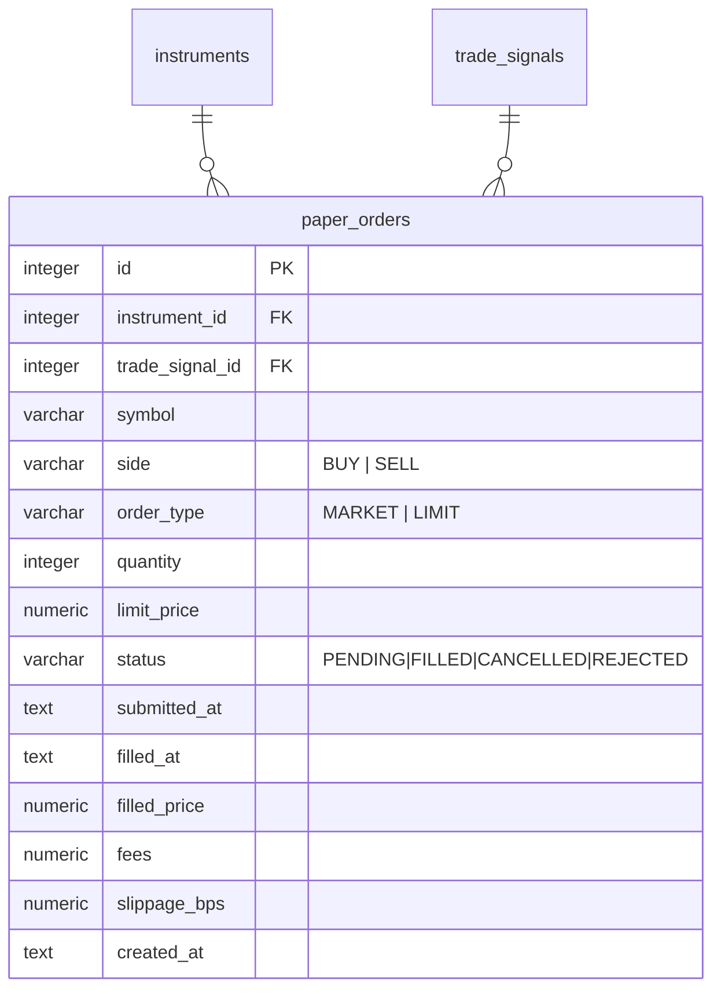
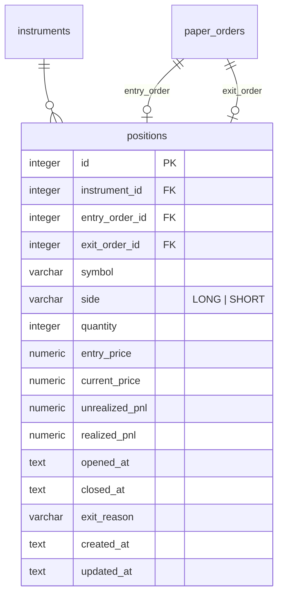
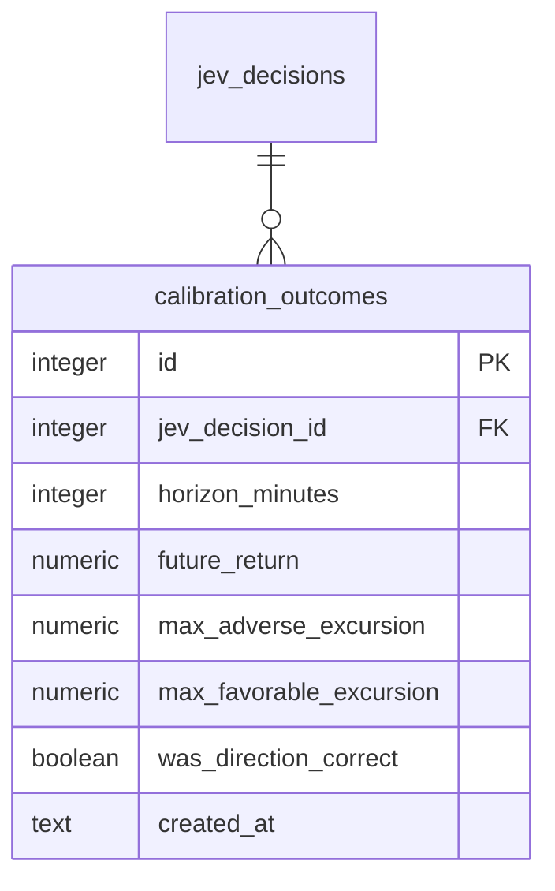
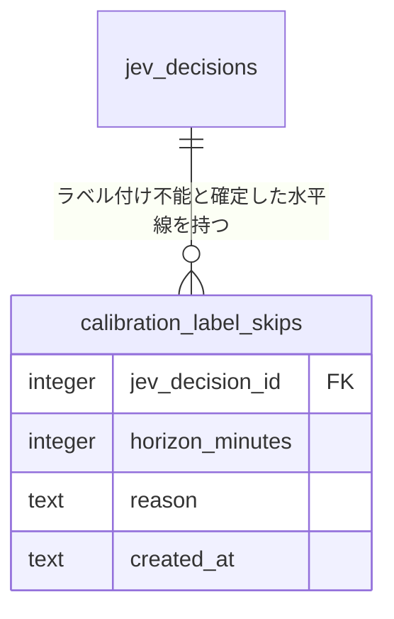
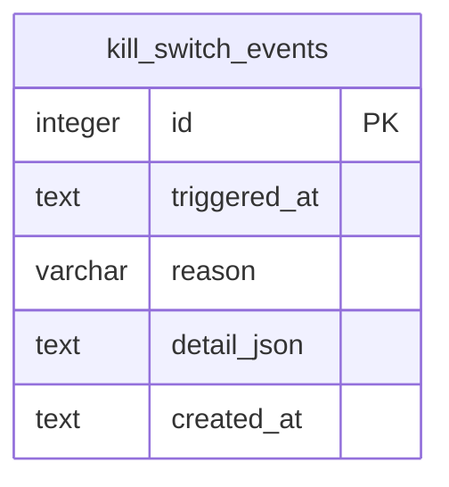
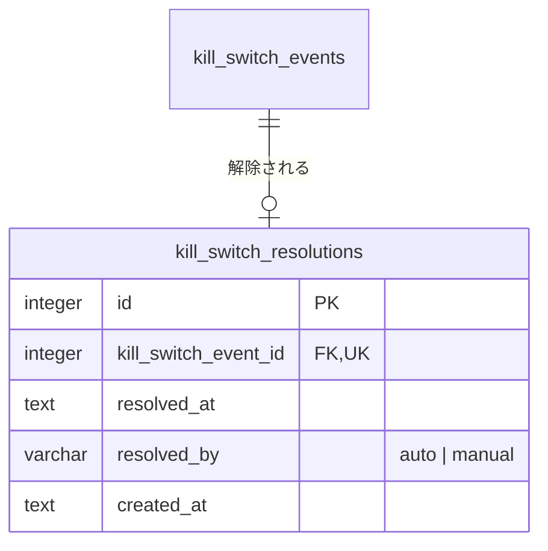

# ER / データモデル: テーブル定義（Paper執行・Kill Switch）

`docs/architecture/er.md` から分割した章。対象: `paper_orders` / `positions` / `calibration_outcomes` / `calibration_label_skips` / `kill_switch_events` / `kill_switch_resolutions`。型・規約と全体ER図は `docs/architecture/er.md` を参照。

## paper_orders

Paper Trading（将来は実発注）の注文・約定。

| カラム | 型 | 制約 | 説明 |
|-------|-----|------|------|
| id | integer | PK（AUTOINCREMENT） | |
| instrument_id | integer | FK → instruments.id, NOT NULL | |
| trade_signal_id | integer | FK → trade_signals.id, NULL可 | |
| symbol | varchar(10) | NOT NULL | |
| side | varchar(10) | NOT NULL, CHECK IN ('BUY','SELL') | |
| order_type | varchar(10) | NOT NULL, CHECK IN ('MARKET','LIMIT') | |
| quantity | integer | NOT NULL | |
| limit_price | numeric(12,2) | NULL可 | order_type=LIMIT時必須（アプリ層で検証） |
| status | varchar(20) | NOT NULL, CHECK IN ('PENDING','FILLED','CANCELLED','REJECTED') | |
| submitted_at | text | NOT NULL | |
| filled_at | text | NULL可 | |
| filled_price | numeric(12,2) | NULL可 | |
| fees | numeric(10,2) | NOT NULL, DEFAULT 0 | 約定手数料（円）。約定時に`fillmodel`の`FeeBps`×約定代金を記録する（既定0bps。FR-ENTRY-8）。`positions.realized_pnl`はエントリー・Exit両注文の`fees`を差し引いた値 |
| slippage_bps | numeric(8,2) | NULL可 | 約定時の直近価格（シグナル価格）に対する不利方向のbps（呼値丸め・スプレッド・滑り込み。負は有利。FR-ENTRY-8） |
| created_at | text | NOT NULL | |

インデックス: `INDEX (instrument_id, submitted_at DESC)`, `INDEX (status)`

## positions

保有ポジション（Entry/Exit紐付き）。

| カラム | 型 | 制約 | 説明 |
|-------|-----|------|------|
| id | integer | PK（AUTOINCREMENT） | |
| instrument_id | integer | FK → instruments.id, NOT NULL | |
| entry_order_id | integer | FK → paper_orders.id, NOT NULL | |
| exit_order_id | integer | FK → paper_orders.id, NULL可 | クローズ後に設定 |
| symbol | varchar(10) | NOT NULL | |
| side | varchar(10) | NOT NULL, CHECK IN ('LONG','SHORT') | |
| quantity | integer | NOT NULL | |
| entry_price | numeric(12,2) | NOT NULL | |
| current_price | numeric(12,2) | NOT NULL | 保有中はSchedulerが定期更新 |
| unrealized_pnl | numeric(14,2) | NOT NULL, DEFAULT 0 | |
| realized_pnl | numeric(14,2) | NULL可 | クローズ時に確定 |
| opened_at | text | NOT NULL | |
| closed_at | text | NULL可 | |
| exit_reason | varchar(50) | NULL可 | 値は `internal/domain/position.go` の `ExitReason*` 定数（`functional.md` FR-EXIT-1 の8条件＋手動決済＋Kill Switch強制クローズ）: `stop_loss`（固定Stop Loss）/ `take_profit`（固定Take Profit）/ `trailing_stop`（Trailing Stop）/ `jev_direction_reversed`（Jev方向反転）/ `continuation_probability_dropped`（continuation_probability低下）/ `vwap_cross`（VWAP逆クロス）/ `max_holding`（最大保有時間到達）/ `force_flat_before_close`（引け前強制決済）/ `manual`（手動決済 `POST /positions/:id/close`）/ `force_close`（Kill Switchによる強制クローズ） |
| created_at / updated_at | text | NOT NULL | |

インデックス: `INDEX (instrument_id)`, `UNIQUE (instrument_id) WHERE closed_at IS NULL`（部分インデックス。SQLite 3.8+対応。同一銘柄の同時保有は1ポジションに制限し、状態管理§4.9の `position` フィールドと整合させる）

## calibration_outcomes

Jev判断と将来値動きの紐付け結果。

| カラム | 型 | 制約 | 説明 |
|-------|-----|------|------|
| id | integer | PK（AUTOINCREMENT） | |
| jev_decision_id | integer | FK → jev_decisions.id, NOT NULL | decision_type=trader対象 |
| horizon_minutes | integer | NOT NULL | 5 / 10 / 20 等 |
| future_return | numeric(8,4) | NOT NULL | |
| max_adverse_excursion | numeric(8,4) | NOT NULL | |
| max_favorable_excursion | numeric(8,4) | NOT NULL | |
| was_direction_correct | boolean | NULL可 | direction=NONEの場合NULL |
| created_at | text | NOT NULL | |

インデックス: `UNIQUE (jev_decision_id, horizon_minutes)`

## calibration_label_skips

水平線まで足が揃わないことが確定した`(jev_decision_id, horizon_minutes)`の終端マーカー（マイグレーション000024、issue #481）。`calibration_outcomes`は作らず（短縮horizonを記録しない）、`PendingLabels`が当該ペアを再投入対象から外すためだけに使う。`internal/service/calibration.Labeler`が、判断時刻+horizon+5分の猶予後も窓が揃わない場合に書き込む（`INSERT OR IGNORE`で冪等）。

| カラム | 型 | 制約 | 説明 |
|-------|-----|------|------|
| jev_decision_id | integer | FK → jev_decisions.id, NOT NULL | |
| horizon_minutes | integer | NOT NULL | |
| reason | text | NOT NULL | 足が揃わなかった理由 |
| created_at | text | NOT NULL | |

インデックス: `PRIMARY KEY (jev_decision_id, horizon_minutes)`

## kill_switch_events

Risk EngineのKill Switch発動履歴（監査ログ）。**追記専用**であり、`UPDATE`/`DELETE`はDBトリガー（`kill_switch_events_no_update` / `kill_switch_events_no_delete`、マイグレーション000014）が`ABORT`で拒否する（`operator_manual`を許すCHECK拡張のためテーブルを作り直したマイグレーション000017でも同トリガーを再作成している）。解除は本テーブルを更新せず、`kill_switch_resolutions`へ行を追記して記録する。

| カラム | 型 | 制約 | 説明 |
|-------|-----|------|------|
| id | integer | PK（AUTOINCREMENT） | |
| triggered_at | text | NOT NULL | |
| reason | varchar(100) | NOT NULL, CHECK IN ('daily_loss_limit','consecutive_losses','market_data_down','jev_api_down','broker_api_error','unexpected_position','fill_discrepancy','db_write_failure','operator_heartbeat_timeout','operator_manual') | `functional.md` FR-RISK-2, FR-RISK-6 |
| detail_json | text | NOT NULL | 発動時のRisk状態スナップショット（JSON文字列） |
| created_at | text | NOT NULL | |

インデックス: `INDEX (triggered_at DESC)`

トリガー: `BEFORE UPDATE` / `BEFORE DELETE` → `RAISE(ABORT, 'kill_switch_events is append-only: ...')`

## kill_switch_resolutions

Kill Switch解除の監査ログ（追記専用）。`kill_switch_events`の1行につき高々1行を追記する。`kill_switch_events`に対応する行が無いイベントは未解除（Kill Switch継続中）を表し、Repositoryは`LEFT JOIN`で`resolved_at`/`resolved_by`を導出する。マイグレーション000014以前に解除済みだった行は本テーブルへ移行済み（旧`kill_switch_events.resolved_at`/`resolved_by`列は廃止）。`UPDATE`/`DELETE`は`kill_switch_resolutions_no_update` / `kill_switch_resolutions_no_delete`トリガーが拒否する。

| カラム | 型 | 制約 | 説明 |
|-------|-----|------|------|
| id | integer | PK（AUTOINCREMENT） | |
| kill_switch_event_id | integer | FK → kill_switch_events.id, UNIQUE, NOT NULL | 1イベントにつき解除は1回のみ |
| resolved_at | text | NOT NULL | |
| resolved_by | varchar(50) | NOT NULL, CHECK IN ('auto','manual') | |
| created_at | text | NOT NULL, DEFAULT (strftime ミリ秒3桁) | DEFAULTは固定9桁ではないため使わず、`KillSwitchRepository.Resolve`が`sqlutil.FormatTime`で常に明示する（`er.md`「日時列のDEFAULT」）。`kill_switch_events.created_at`も同様 |
