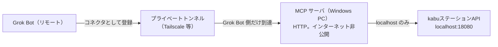

# 読み取り専用 kabu ステータス MCP（Grok Bot コネクタ）

リモートの Grok Bot が、pitha-trador 用の MCP コネクタ経由で、Windows PC 上の kabuステーションAPIの状態を尋ねる仕様。Grok Bot はその PC では動かない。実装・実行ファイル・テスト・MCPサーバーのコードは本仕様の範囲外であり、リポジトリには置かない。

公式のエラーコード表（文言の一次情報）は `docs/architecture/kabu-status-mcp-errors.md`。本ファイルは目的、誰が誰に接続するか、ツール、案内文、パスワードの置き場、コネクタ登録を定める。

## 1. 目的

尋ねるのはリモートの Grok Bot である。Grok Bot は Windows PC の外にあり、kabuステーションの localhost には接続しない。

kabuステーションAPIは、その PC の localhost だけに待受する（既定 `http://localhost:18080/kabusapi`）。別のマシンからは届かない。届ける経路は次だけである。

MCP サーバは kabuステーションと同じ Windows PC で動き、HTTP で話す（stdio ではない）。待受はインターネットへ公開しない。Grok Bot から届く道は、プライベートトンネル（Tailscale または同等のもの）だけである。`localhost:18080` を呼ぶのはこの MCP サーバだけである。検証ポート `18081` は、呼び出しが検証を指定したときだけ使う。Grok Bot は localhost を呼ばない。

将来の MCP が Grok Bot に返すのは、次だけである。

- 指定したポートで何かが待受しているか（接続拒否は待受なし）
- 待受しているとき、保存済みの API パスワードで `POST /token` できるか
- できないとき、公式コードに沿って「未ログイン」「API利用設定未完了」「ログイン済みだがパスワード不一致」のどれかを日本語で案内するか

アプリ本体の市況バナー（`GET /system/marketdata-status`、FR-SETTINGS-5、issue #295）とは別経路である。デスクトップ版はページ用のネットワーク待受を持たないため、MCP は pitha-trador の HTTP を叩かない。見るのは kabuステーションAPIと、パスワードが既に入っている `secrets` テーブルだけ。

## 2. 非目標

- 発注・訂正・取消をしない。注文系のパスは呼ばない
- 銘柄登録・登録解除をしない（板登録の PUT を含む）。板・余力・残高・ランキングも取らない
- APIパスワードをツール引数、戻り値、ログ、標準出力、標準エラー、Grok Bot とのコネクタ記録に出さない。発行されたトークンも同様に出さず、メモリから破棄する
- `KABU_API_PASSWORD` を Grok Bot に送らない。コネクタ URL、コマンド引数、環境変数、コネクタの設定、登録メッセージに入れない。コネクタの API キーは別の値である（§3.3）
- MCP を stdio では話させない。HTTP 待受をインターネットへ公開しない。公開の HTTPS URL をコネクタにしない
- Grok Bot から `localhost` / `127.0.0.1` / `::1` や kabuステーションのポートへ直接接続しない。コネクタに登録する URL を `http://localhost:18080/kabusapi` にしない
- ツール引数で kabu のホストや URL を渡させない。MCP が叩く kabu のホストは localhost 固定
- kabuステーションの起動、ログイン、設定変更を代行しない
- 本リポジトリに MCP の実行ファイル、サーバ実装、テストを追加しない

「APIを利用する」にチェックが入っていることは、ログイン済みの証明ではない（issue #305）。チェックは待受を有効にするための条件の一つで、ログインセッションとは別である。

## 3. 接続先

接続は二段で、呼び手は段ごとに違う。

### 3.1 Grok Bot から MCP コネクタ

Grok Bot が接続するのは、登録済みの MCP コネクタだけである。これは pitha-trador の状態確認用コネクタであり、kabuステーションの URL ではない。

MCP サーバは Windows PC 上で HTTP を話す。stdio ではない。この HTTP 待受はインターネットに出さない。公開の HTTPS URL も置かない。Grok Bot はクラウド側にいるため、PC のループバック（`localhost`、`127.0.0.1`、`::1`）へは届かない。登録する入口をループバックの kabu ポートにしてはならない。

届けるのはプライベートトンネル（Tailscale または同等のもの）だけである。トンネルは Grok Bot の側からその HTTP へ届く道を作り、インターネット全体には開かない。Grok Bot に登録するアドレスは、このトンネル越しの MCP 入口である。トンネルを通っただけでは足りない。入口では §3.3 の API キーを検査する。

### 3.2 MCP サーバから kabuステーション

localhost を呼ぶのは、Windows PC 上の MCP サーバだけである。ホストは `localhost` 固定。ポートは次の二つだけ。

| 環境 | ポート | ベース URL | 既定 |
|------|--------|------------|------|
| 本番 | 18080 | `http://localhost:18080/kabusapi` | 既定。アプリの `marketdata.DefaultBaseURL` と同じ |
| 検証 | 18081 | `http://localhost:18081/kabusapi` | 呼び出しが `verification` を指定したときだけ |

公式の Excel アドイン説明では、本番と検証でポートと API パスワードの組が一致しないと認証エラーになる。アプリが Settings に保存する `KABU_API_PASSWORD` は本番（18080）用として使っている。検証ポートへその値を送ると、検証用パスワードと違えば `4001013` になりうる。ツール結果には、どちらの環境を見たかが必ず入る。

`localhost` は `::1` と `127.0.0.1` のどちらにも解決されうる（issue #295 のログは `[::1]:18080` への接続拒否）。IPv4 だけに固定しない。接続拒否は、名前解決の先に待受が無いという意味であり、ログイン状態はまだ分からない。

公式 FAQ のとおり、kabuステーションAPIは kabuステーションと同一 IP からのリクエストだけを受け付ける。だから MCP プロセスは kabuステーションと同じ PC で動かす。リモートの Grok Bot が `localhost:18080` を直接呼ぶ構成にはしない。

### 3.3 コネクタの API キー

プライベートトンネルは到達経路であり、認証ではない。トンネルを通って MCP の HTTP に届いたリクエストでも、API キーが無ければ拒否する。

- キーは `KABU_API_PASSWORD` ではない。kabu へのリクエスト（`POST /token` の `APIPassword` を含む）に入れない
- 比較する値は Windows PC 上の MCP に設定する。`secrets` の `KABU_API_PASSWORD` 行は使わない
- 同じキーを Grok Bot のコネクタに保存し、MCP の HTTP へ認証ヘッダで提示する。URL、クエリ、パスには置かない
- ログ、標準出力、標準エラー、ツール引数、ツールの戻り値には出さない
- キーが無い、または PC 側の設定と一致しないときは、その場で拒否する。`localhost:18080` にも `18081` にも繋がない。`KABU_API_PASSWORD` も読まない。状態確認のツールは実行しない

## 4. 初期設定と状態の切り分け

利用開始の手順は公式の初期設定（<https://kabucom.github.io/kabusapi/ptal/howto.html>）に従う。MCP はその操作をしない。案内文が指す確認先は次のとおり。

1. メンバーズサイト（PC版）のらくらく電子契約で、kabuステーションAPIが「利用可」である（Professional または Premium。条件を満たさないと「利用不可」）
2. kabuステーションの「APIシステム設定」で「APIを利用する」にチェックし、APIパスワード（英数字 6〜16 桁）を設定して OK し、kabuステーションを再起動する
3. 再起動後、画面右上の API アイコンが緑なら、API の待受は利用可能

緑やチェックはログインの代わりにならない。朝の再ログイン前やセッション切れでは、待受していても `4001007` になる（issue #305）。

| 観測 | 意味 | ログインは分かるか |
|------|------|--------------------|
| 接続拒否（connection refused） | そのポートで何も待受していない。未起動、または「APIを利用する」未チェック／変更後未再起動などで API が開いていない | 分からない。HTTP のエラーコードは無い |
| `4001007` | ログイン認証エラー。kabuステーションにログインしているかを確認する | 未ログイン（またはセッション切れ）として扱う |
| `4001017` | ログイン認証エラー。kabuステーション未ログイン | 未ログイン |
| `4001008` | API利用不可。API利用設定が完了しているかを確認する | ログインの成否ではない |
| `4001013` | ログインしている状態で、APIパスワードが不正 | ログイン済み。パスワード不一致 |

`4001007` を API 設定ミスと混ぜない。API 利用設定の未完了は `4001008`。パスワード不一致は `4001013`。接続拒否のあとでステーションを起動すると、次の確認は別のコードになりうる（issue #295 の refused → `4001013` → `4001007`）。各呼び出しの結果だけを返し、過去の結果と混ぜない。

## 5. ツール

Grok Bot と MCP の間は、プライベートトンネル越しの HTTP コネクタである。stdio ではなく、インターネット公開の HTTPS URL でもない。各リクエストは §3.3 の API キーを通過したあとだけツールに入る。ツールは次の二つだけで、どちらも副作用の無い読み取り。

### 5.1 `kabu_station_status`

Windows PC 上の MCP が、同じ PC の kabuステーションAPIが待受しているか、保存済みパスワードでトークンを発行できるかを確認し、結果だけをリモートの Grok Bot に返す。Grok Bot は localhost を呼ばない。発注も銘柄登録もしない。パスワードとトークンは返さない。

引数は `environment` だけ。省略時は `production`。値は `production` または `verification`。それ以外、ホスト、URL、パスワード、トークンは受け取らない（追加フィールドは拒否）。

手順（§3.3 の API キー検査を通過したリクエストだけ）:

1. 選んだポートへ `localhost` で TCP 接続する
2. 接続拒否なら `issue=not_listening`。HTTP は呼ばない
3. タイムアウトなど、拒否以外で届かないときは `issue=dial_failed`。ログインコードと断定しない
4. 待受しているときだけ、`secrets` の `KABU_API_PASSWORD` を読む（§7）。読めなければ `issue=password_unavailable` とし、`POST /token` はしない
5. 読めたときだけ `POST {base}/token` に `{"APIPassword": ...}` を送る（アプリの `marketdata` のトークン発行と同じ形）。成功時の `Token` は破棄し、`issue=ok`。`ResultCode` が 0 以外、または本文の `Code` がある失敗は `kabu-status-mcp-errors.md` の分類へ渡す

戻り値のフィールドは次だけ。パスワード、トークン、リクエスト本文は含めない。

| フィールド | 内容 |
|------------|------|
| `environment` | `production` または `verification` |
| `port` | 18080 または 18081 |
| `base_url` | 上表のベース URL |
| `listening` | 待受していれば true。接続拒否と dial 失敗は false |
| `issue` | 下表 |
| `http_status` | HTTP ステータス。待受確認で終わったときは null |
| `code` | 公式の `Code`（または非 0 の `ResultCode`）。無ければ null |
| `official_message` | 公式表のエラーメッセージ。表に無ければ null |
| `guidance` | §6 の日本語案内。`ok` のときは空文字 |

| `issue` | 条件 |
|---------|------|
| `ok` | `POST /token` が成功（`ResultCode` 0）。トークンは破棄済み |
| `not_listening` | 接続拒否。待受なし |
| `dial_failed` | 拒否以外で TCP 接続できない |
| `password_unavailable` | 待受はあるが、保存済みパスワードを読めない。トークン発行はしていない |
| `not_logged_in` | `4001007` または `4001017` |
| `api_setup_incomplete` | `4001008` |
| `bad_password` | `4001013` |
| `other` | 上記以外の HTTP 応答または公式コード |

### 5.2 `kabu_api_error_guidance`

ネットワークに接続しない。引数は次のどちらか一方。

- `transport`: `connection_refused` のみ
- `code`: 公式の整数コード

パスワードもポートも受け取らない。戻り値は `code` または `transport`、`official_message`、`guidance`、`issue`。表に無いコードは `issue=other` とし、公式表に無い旨の案内にする。`4001018` 以降（銘柄登録・発注パラメータ）は公式メッセージを返したうえで、この MCP はその API を呼ばない、と案内に添える。

## 6. 日本語の案内文

ツールが返す `guidance` は次の文をそのまま使う。コード番号や環境名を文へ足すのは、この表に書いてある場合だけ。パスワードの値は埋め込まない。

| `issue` | `guidance` |
|---------|------------|
| `ok` | （空文字） |
| `not_listening` | kabuステーションAPIは待受していません（接続が拒否されました）。kabuステーションが起動しているか、選んだポート（本番 18080、検証 18081）で API が開いているかを確認してください。「APIを利用する」にチェックが入っていても、ログイン済みとは限りません。チェックを変えたあとは kabuステーションの再起動が必要です。 |
| `dial_failed` | kabuステーションAPIへ届きませんでした。接続拒否ではないため、未起動とは断定できません。kabuステーションがその PC で起動しているかを確認してください。 |
| `password_unavailable` | APIは待受していますが、保存済みの KABU_API_PASSWORD を読めないためトークン確認はしていません。Settings の kabuステーションに API パスワードが入っているかを確認してください。値は表示しません。 |
| `not_logged_in` | ログイン認証エラーです。kabuステーションにログインしているかを確認してください。「APIを利用する」がオンでも、未ログインやセッション切れではこのエラーになります。 |
| `api_setup_incomplete` | API利用不可です。API利用設定が完了しているかを確認してください。メンバーズサイトで「利用可」か、APIシステム設定の「APIを利用する」と、設定後の再起動を確認してください。 |
| `bad_password` | kabuステーションはログインしていますが、APIパスワードが不正です。Settings の KABU_API_PASSWORD を、kabuステーション「APIシステム設定」のパスワードと一致させてください。本番（18080）と検証（18081）の取り違えにも注意してください。値は表示しません。 |
| `other` | kabuステーションAPIが、状態確認で想定していない応答を返しました。公式のエラーコード表を確認してください。パスワードやトークンは含めていません。 |

`not_logged_in` でコードが `4001017` のときは、上の文の代わりに次を返す。

> ログイン認証エラーです。kabuステーションは未ログインです。ログインしているかを確認してください。

`kabu_api_error_guidance` で `transport=connection_refused` を渡したときは、`not_listening` の文を返す。

## 7. パスワード

`POST /token` を呼ぶ将来実装は、アプリが既に保存している場所だけからパスワードを読む。

- キー名は `KABU_API_PASSWORD`（`internal/config` の許可キー。Settings の kabuステーション）
- 保存先は `secrets` テーブル（`docs/architecture/er/tables-system.md`）。DB ファイルは `%APPDATA%\pitha-trador\pitha.db`
- 値は `internal/repository/system.SecretsRepository` が `internal/config` の AES-256-GCM で暗号化している。将来実装は同じ復号を使い、別の鍵や平文ファイルを新設しない
- SQLite は読み取り専用で開く。アプリが単一ライターである前提（`docs/architecture/er.md`）を壊さない。`secrets` への書き込み、他のテーブルの更新はしない
- 行が無い、DB が無い、復号できない、はいずれも `password_unavailable`。理由がパスワード文字列そのものにならない範囲で区別してよい（未設定 / ファイルが読めない / 復号できない）
- 平文は `POST /token` のボディを作る間だけ、Windows PC 上の MCP プロセスのメモリに置く。ログへ書かない。ツール結果へ書かない。Grok Bot に届くコネクタの記録にも書かない。パニック時の回復ログにも載せない
- 成功・失敗のどちらの応答でも `Token` は返さない。成功時は破棄する
- Grok Bot にパスワードを送らない。コネクタ URL にもコネクタの API キー欄にも入れない。読む場所は PC 上の `secrets` だけである
- コネクタの API キーは §3.3 のとおり `KABU_API_PASSWORD` とは別である。API パスワードをコネクタ認証に使わない。コネクタの API キーを kabu へのリクエストに使わない。どちらもログとツール結果に出さない

## 8. MCP サーバの置き場と Grok Bot への登録

MCP サーバは、kabuステーションと同じ Windows PC、同じユーザーのセッションで動かす。話しかたは HTTP である。stdio ではない。このプロセスだけが kabu へ接続する。既定は `localhost:18080`。`18081` はツール引数で検証を指定したときだけ使う。実行ファイルの例は `pitha-kabu-status-mcp.exe`。このバイナリは今は無く、本仕様では追加しない。

HTTP の待受はインターネットへ公開しない。公開の HTTPS URL は作らない。Grok Bot はリモートなので、PC の localhost も、stdio の子プロセスも、コネクタの入口にはならない。Cursor のローカル `mcp.json` に `command` で exe を書く形は、この接続の登録方法ではない。

Grok Bot へ届ける道はプライベートトンネル（Tailscale または同等のもの）だけである。トンネルは Grok Bot の側から、PC 上の HTTP 待受へ届くようにし、インターネット全体には開かない。登録は Grok Bot のコネクタとして行う。渡すアドレスはトンネル越しの MCP 入口であり、`http://localhost:18080/kabusapi` でも、インターネット公開の URL でもない。

トンネルだけでは認証にならない。Grok Bot はコネクタに保存した API キーを、MCP の HTTP へ認証ヘッダで提示する（§3.3）。そのキーは Windows PC 上の MCP に設定した値と一致しなければならない。`KABU_API_PASSWORD` とは別であり、URL にもログにもツール結果にも kabu へのリクエストにも出さない。無い、または一致しないキーは、localhost へ繋ぐ前に拒否する。kabu のポートの既定は 18080 のままである。

## 9. 関連 issue（文脈のみ）

本仕様は次の issue を実装タスクにしない。アプリのバナーやトークン再試行の挙動も変えない。

- [#295](https://github.com/ousiassllc/pitha-trador/issues/295): 起動時トークン発行が接続拒否、`4001013`、`4001007` と移った観測。接続拒否は待受なし、`4001013` はログイン済みのパスワード不一致、`4001007` はログイン確認
- [#305](https://github.com/ousiassllc/pitha-trador/issues/305): 「APIを利用する」がオンでも `4001007` になる。チェックはログインの証明ではない

## 改訂履歴

| 版 | 日付 | 変更内容 | 変更理由 |
|----|------|---------|---------|
| 1.0 | 2026-10-03 | 新規作成 | 読み取り専用の状態問い合わせの仕様。実装は範囲外 |
| 1.1 | 2026-10-03 | 問い合わせ元をリモートの Grok Bot に改めた。Grok Bot は登録済み MCP コネクタ経由で pitha-trador に接続し、localhost は Windows PC 上の MCP だけが呼ぶ | 同一 PC 上のエージェントが localhost を叩く、という接続の記述が誤りだったため |
| 1.2 | 2026-10-03 | 到達をプライベートトンネル（Tailscale 等）越しの HTTP に定めた。インターネット公開の HTTPS URL と stdio は使わない。コネクタ認証トークンは `KABU_API_PASSWORD` とは別 | 到達経路の決定。MCP は PC 上の HTTP のまま、インターネットには出さない |
| 1.3 | 2026-10-03 | コネクタ API キー認証を追加。キーは PC 上の MCP に設定し、Grok Bot のコネクタに保存する。`KABU_API_PASSWORD` とは別。無い・不一致は localhost へ繋ぐ前に拒否する | プライベートトンネルだけでは認証にならないため |
