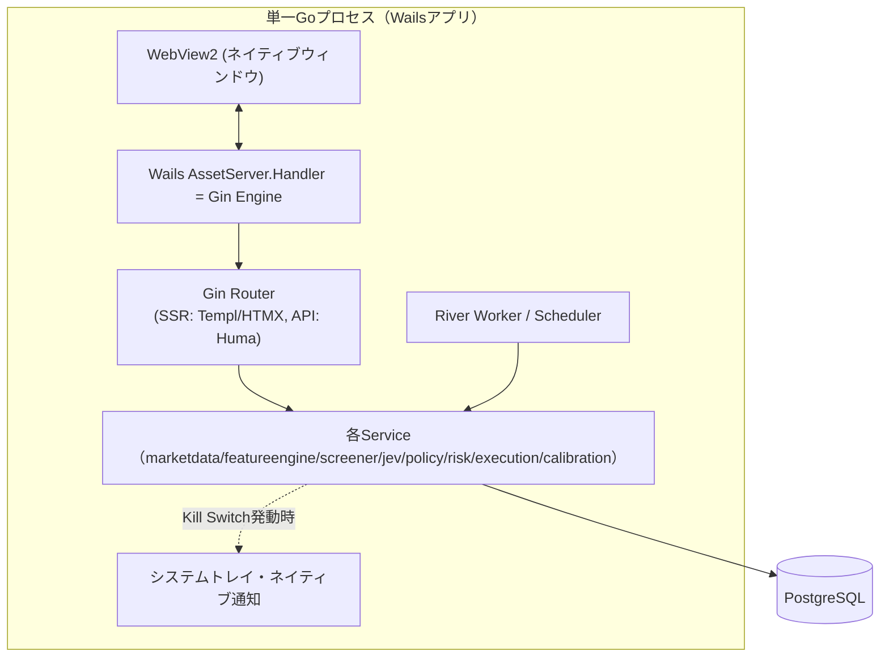
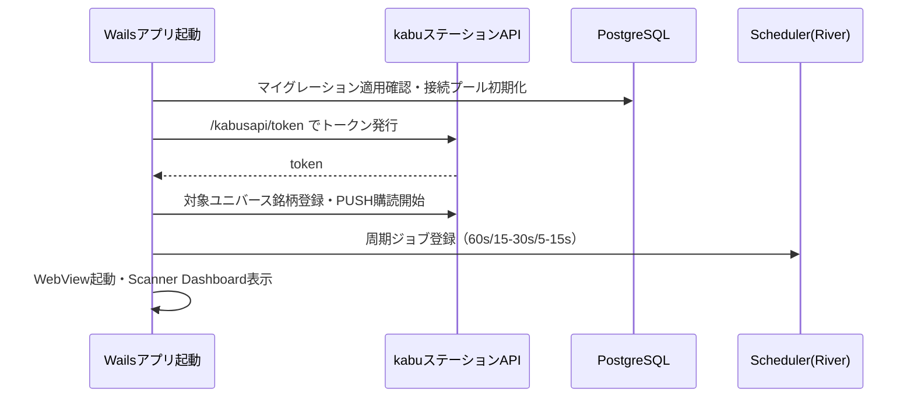
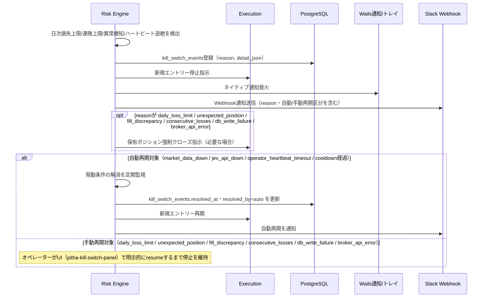
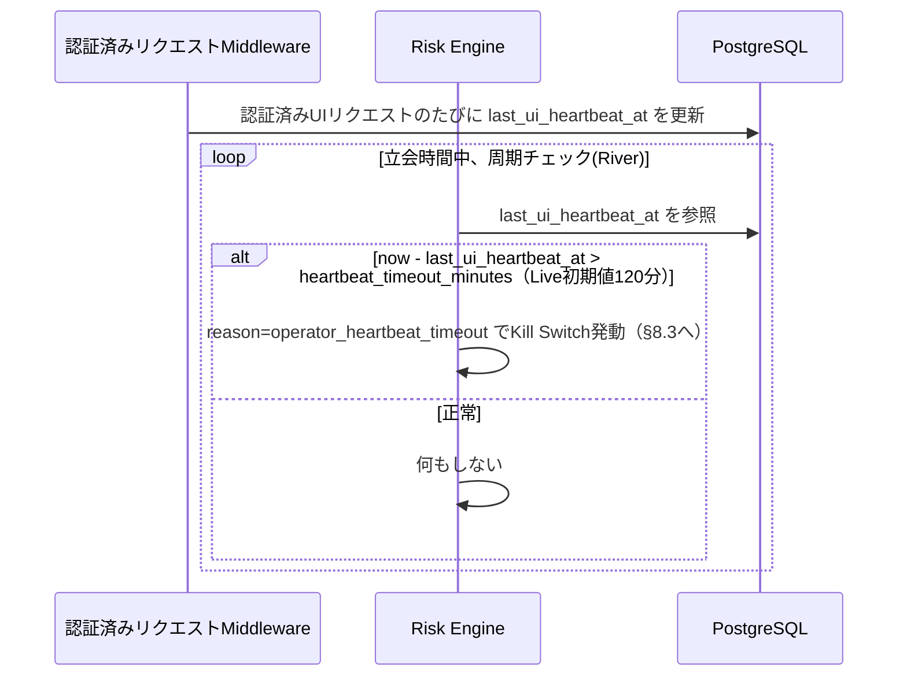

# アーキテクチャ設計

## 1. 設計方針

- **単一プロセス・単一バイナリ**: Wails によりネイティブデスクトップアプリとして単一の Go プロセスに全機能（HTTP/HTMXサーバー、Scheduler/Worker、kabuステーションAPI連携、Jevアダプタ）を同居させる。単一Windowsホスト構成（`requirements/non-functional.md` §1）に合わせ、ネットワーク越しの分散構成は取らない
- **バックエンドファースト（HALT思想）**: フロントエンドはAPIサーバー（Gin）に内蔵し、SPAを作らない。判断に迷ったらサーバー側に寄せる。詳細は `components/overview.md`
- **計算とJev判断の分離**: 価格・リターン・VWAP・ATR・板インバランス等の計算可能な値はGoコードで計算する。Jevは解釈（regime/direction/toxic flow等）のみを担当する（`overview.md` §2.2 最重要原則）
- **Postgres中心のインフラ最小化**: Redis/BullMQ/Celeryのような追加ミドルウェアを持ち込まず、Job Queueは PostgreSQL 上で完結する River を採用する。単一ホスト・単一プロセスの制約下でインフラ構成要素を減らし、障害点を減らす
- **差し替え可能性**: 各レイヤーはインターフェースを介して疎結合にする。`internal/domain`・`internal/repository`・`internal/service` はWailsプロセスの存在を前提にしない。将来スキャン対象拡大や複数戦略運用でプロセス分離が必要になった場合に備える

## 2. 技術スタック

| レイヤー | 技術 | 役割 |
|---------|------|------|
| 言語 | Go 1.23+ | バックエンド・Scheduler・アダプタ全般を単一言語で実装 |
| デスクトップシェル | Wails v2 | ネイティブウィンドウ（WebView2）・システムトレイ・ネイティブ通知・単一実行ファイル配布 |
| サーバーフレームワーク | Gin | ルーティング＋SSR。WailsのAssetServer.Handlerとして注入 |
| APIフレームワーク | Huma | OpenAPI 3.1自動生成、入出力バリデーション（`/api/v1/...`） |
| テンプレートエンジン | Templ | 型安全なGo HTMLテンプレート |
| インタラクション | HTMX | サーバー駆動のDOM更新 |
| リッチUI | Lit (Web Components) | チャート・ライブテーブル等（`components/overview.md`） |
| チャート描画 | lightweight-charts | ローソク足・VWAP・出来高チャート |
| スタイリング | Tailwind CSS | ユーティリティファーストCSS |
| ビルド | esbuild | Lit/TypeScriptバンドル |
| DB | PostgreSQL 16（ローカル常駐） | 全永続データ（§4 ER参照） |
| DBアクセス | pgx + sqlc | 型安全なSQLクエリ生成。ORMは使わずSQLを直接管理 |
| マイグレーション | golang-migrate | `db/migrations` のSQLマイグレーション管理 |
| Job Queue / Scheduler | River（Postgres-backed） | market-data, feature-calc, jev-scout, jev-trader, risk-check, paper-execution, outcome-labeling, analytics の8キュー。追加ミドルウェア（Redis等）不要、DB障害時のクラッシュ耐性を確保 |
| 周期実行 | robfig/cron（River Periodic Jobsで代替可） | 60秒/15-30秒/5-15秒サイクルのトリガー |
| リアルタイムPush | nhooyr.io/websocket | Scanner Dashboard/Symbol DetailへのUI即時反映 |
| 市場データ・発注 | kabuステーションAPI（SBI証券） | 1分足・板・発注（REST + PUSH WebSocket） |
| Jevアダプタ | 独自HTTPクライアント | Jev API（外部LLM判断レイヤー）呼び出し |
| ロギング | slog（構造化JSON） | `requirements/non-functional.md` §5 準拠 |
| アラート | Slack Incoming Webhook | 即時通知（§5.2） |

## 3. ディレクトリ構成・レイヤー構造

```text
pitha-trador/
├── cmd/
│   └── desktop/                  # Wailsエントリーポイント（main.go, wails.json, app.go）
├── internal/
│   ├── domain/                   # ドメインモデル（他レイヤーに非依存）
│   │   ├── instrument.go
│   │   ├── snapshot.go           # market_snapshots相当
│   │   ├── feature.go
│   │   ├── jevdecision.go
│   │   ├── signal.go             # trade_signals相当
│   │   ├── order.go              # paper_orders相当
│   │   ├── position.go
│   │   └── calibration.go
│   ├── repository/               # domainのみに依存。sqlc生成コードを内包
│   │   ├── instrument_repo.go
│   │   ├── snapshot_repo.go
│   │   ├── decision_repo.go
│   │   ├── signal_repo.go
│   │   ├── order_repo.go
│   │   ├── position_repo.go
│   │   └── calibration_repo.go
│   ├── service/                  # domain, repositoryに依存
│   │   ├── marketdata/           # kabuステーションAPIクライアント（REST+PUSH WS）
│   │   ├── featureengine/        # 特徴量算出
│   │   ├── screener/             # Fast Screener・screen_score算出
│   │   ├── jev/                  # Jevアダプタ（client.go, scout.go, trader.go, schemas.go, prompt_version.go）
│   │   ├── policy/                # Policy Engine
│   │   ├── risk/                  # Risk Engine（Kill Switch含む）
│   │   ├── execution/             # Paper/kabu発注実行
│   │   ├── calibration/           # Outcome labeling・Brier/Log Loss算出
│   │   └── scheduler/             # River Worker定義・周期ジョブ登録
│   ├── router/                    # SSR + API ルーティング定義（Huma登録含む）
│   └── web/
│       ├── handler/               # scanner.go, symbol.go, performance.go, calibration.go, system.go
│       ├── middleware/            # CSRF, ロギング, リカバリ, 操作者ハートビート記録（§8.4）
│       ├── atoms/
│       ├── molecules/
│       ├── organisms/
│       ├── pages/
│       └── layout/
├── static/
│   └── src/
│       ├── components/            # Lit Web Components（pitha-* 、詳細は components/overview.md）
│       │   └── lib/               # api.ts, ws.ts, logger.ts
│       ├── css/
│       └── dist/                  # ビルド成果物
├── db/
│   └── migrations/                # golang-migrate SQLマイグレーション
├── config/
│   ├── strategy.yaml               # スキャン頻度・Fast Screenerしきい値・Policy Engineしきい値
│   └── risk.yaml                   # Risk Engine制限値（§7 Risk Engine参照）
└── tests/
```

### レイヤー依存ルール（HALT準拠）

依存は上から下への一方向のみ。逆方向のimportは禁止。

```text
handler → service → repository → domain
   ↓
 Templ テンプレート（atoms/molecules/organisms/pages）
```

- `domain/`: 他レイヤーに依存しない。純粋なビジネスロジック（例: Risk Engineのしきい値判定ロジック自体はdomainに置き、DB/HTTPアクセスはrepository/serviceに分離）
- `repository/`: `domain/` のみに依存
- `service/`: `domain/`, `repository/` に依存。`marketdata`/`jev`など外部I/OはこのレイヤーでHTTPクライアントとして実装する
- `web/handler/`: `service/`, `domain/` に依存。`repository/` を直接使わない
- `router/`: `handler/` を参照してルートを定義

## 4. コンポーネント責務

| コンポーネント | 責務 | 実装場所 |
|---------------|------|---------|
| Market Data Client | kabuステーションAPIからの1分足・板・約定データ取得（REST）、リアルタイム価格のPUSH WebSocket受信、トークン管理 | `internal/service/marketdata` |
| Feature Engine | 価格・VWAP・出来高・ボラティリティ・板/約定・市場コンテキスト特徴量の算出（`requirements/functional.md` §4.1） | `internal/service/featureengine` |
| Fast Screener | 数値フィルター・screen_score算出・上位N銘柄選定（§4.2） | `internal/service/screener` |
| Jev Adapter (Scout/Trader) | 構造化状態をJev APIへ送信し、choice/score/yes-no型の判断を受け取る（§4.4, §4.5） | `internal/service/jev` |
| Policy Engine | Jev出力をトレードシグナルへ変換（§4.6） | `internal/service/policy` |
| Risk Engine | ポジションサイズ・損失上限・Kill Switch（§4.7）。全レイヤーの中で最終拒否権を持つ | `internal/service/risk` |
| Execution | Paper Entry/Exit・kabuステーションAPI発注（実売買移行時） | `internal/service/execution` |
| Calibration | Outcome Labeling、Brier Score/Log Loss/ECE算出（§4.12） | `internal/service/calibration` |
| Scheduler/Worker | Riverキュー登録・周期実行トリガー（§4.10） | `internal/service/scheduler` |
| Web (HTMX/Templ/Lit) | UI提供（`components/overview.md`） | `internal/web` |

## 5. kabuステーションAPI連携

- kabuステーションはSBI証券が提供するWindows常駐アプリで、`http://localhost:18080`（既定）にローカルRESTを公開する。Go側の `internal/service/marketdata` はこれをHTTPクライアントでラップする
- **トークン発行**: アプリ起動時に `/kabusapi/token` へAPIパスワードでPOSTしトークンを取得。トークンは有効期限があるため、Wailsアプリ起動時および定期的に再発行し、メモリ上にのみ保持する（ディスクへは保存しない）
- **銘柄登録・PUSH購読**: スキャン対象銘柄をkabuステーションAPIの銘柄登録エンドポイントに登録し、価格・板情報はPUSH WebSocket（kabuステーションが提供するローカルWebSocket）で受信する。これによりREST側の60秒ポーリングに依存せず、Feature Engineが各サイクル開始時点の最新スナップショットを参照できるようにする
- **発注**: Paper Trading中はExecutionサービス内でシミュレーションのみ行い、kabuステーションAPIへは発注しない。Phase 7（実売買移行）で初めてkabuステーションAPIの注文エンドポイントを呼び出す
- **異常時**: kabuステーションAPI無応答・エラー時は該当銘柄を stale data 判定し新規取引を禁止する（`requirements/functional.md` にある障害対応方針と整合）

## 6. Jev API連携

- Jevアダプタ（`internal/service/jev`）はAPIキーをGoプロセス内のみで保持し、HTTP経由でJev APIを呼び出す
- Scout/Traderそれぞれの質問セット（`requirements/functional.md` §4.4, §4.5）をリクエストスキーマ（`schemas.go`）として定義し、レスポンスをdomainモデルへマッピングする
- `prompt_version.go` でプロンプト/質問セットのバージョンを管理し、`jev_decisions.question_version` に記録する（`architecture/er.md` 参照）
- 失敗時は1回目リトライ、2回目以降exponential backoff、継続失敗でnew entry停止。既存ポジションはRisk Engine/Executionのコードベースルールで管理を継続する

## 7. Wails統合（デスクトップシェル）



- Wails v2 の `options.App.AssetServer.Handler` に Gin の `http.Handler` をそのまま渡し、WebViewは常に `http://wails.localhost/` 相当の内部プロトコル経由でGinが返すHTML/HTMXフラグメント/静的アセットを描画する。外部ネットワークポートを開かない（`requirements/non-functional.md` §4 セキュリティに整合）
- Risk EngineがKill Switchを発動した際は、同一プロセス内であるためネットワーク越しの通知APIを介さず、直接Wailsランタイム（`runtime.EventsEmit` / ネイティブ通知API）を呼び出してOSレベルのトースト通知とシステムトレイアイコン変化を発生させる
- Windows起動時の自動起動は、Wails実行ファイルへのショートカットをWindowsスタートアップフォルダまたはタスクスケジューラに登録することで実現する
- 将来ヘッドレス運用（例: CI・テスト環境）が必要な場合に備え、`cmd/desktop`とは別に`cmd/server`（Wailsを使わずGinのみを`net/http`でリッスンするエントリーポイント）を用意できるよう、`internal/router`はWailsに依存しない形で実装する

## 8. 通信フロー

### 8.1 起動時フロー



### 8.2 スキャン〜発注フロー

`requirements/functional.md` §2 主要処理フロー（シーケンス図）を参照。アーキテクチャ上の要点は以下。

- Scheduler（River）が `market-data` → `feature-calc` → `jev-scout` → `jev-trader` → `risk-check` → `paper-execution` の順にジョブをenqueueし、各Serviceがdomainモデルを介して疎結合に連携する
- `risk-check` は他ジョブと異なり同期的にPolicy Engineの直後で必ず評価され、Risk Engineの承認なしにExecutionへは到達しない
- `outcome-labeling` / `analytics` は約定・Exit後に非同期実行し、UIの応答性に影響を与えない

### 8.3 Kill Switchフロー（発動〜再開）



### 8.4 操作者ハートビート監視（dead-man's switch、Live専用）



- ハートビートはCSRF保護対象の認証済みリクエスト（ページ/アクション/API呼び出し）であれば種類を問わず更新対象とする
- Paper Trading運用中は実資金リスクがないためハートビート監視を適用しない（`requirements/functional.md` §4.7 表の heartbeat_timeout_minutes は Live のみ設定）

## 9. 障害対応方針

| 障害 | 対応 |
|------|------|
| Jev API失敗 | 1回目リトライ→2回目以降exponential backoff→継続失敗でnew entry停止。既存ポジションはコードベースExit Ruleで継続管理 |
| Market Data欠損 | stale data判定→該当銘柄の新規取引禁止 |
| kabuステーションAPI異常 | Kill Switch発動条件に該当。新規取引停止、必要に応じ強制決済 |
| DB書き込み失敗継続 | Kill Switch発動条件に該当 |
| Wailsプロセスクラッシュ | プロセス監視による自動再起動。再起動中は新規エントリー停止（既存ポジションはkabuステーション側の待機注文/手動介入を前提） |

## 改訂履歴

| 版 | 日付 | 変更内容 | 変更理由 |
|----|------|---------|---------|
| 1.0 | 2026-09-26 | 新規作成 | 初版 |
| 1.1 | 2026-09-26 | §8.3を発動〜再開フローに拡張し、§8.4操作者ハートビート監視（dead-man's switch）を追加 | Phase 7も含めた完全自動運用への方針変更 |
