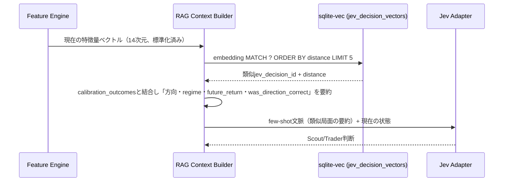
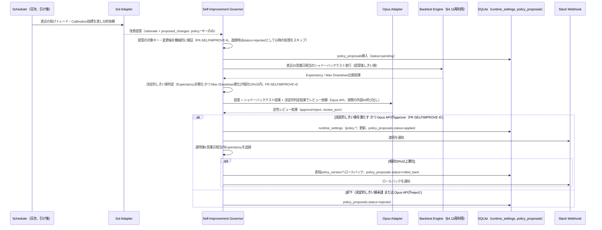
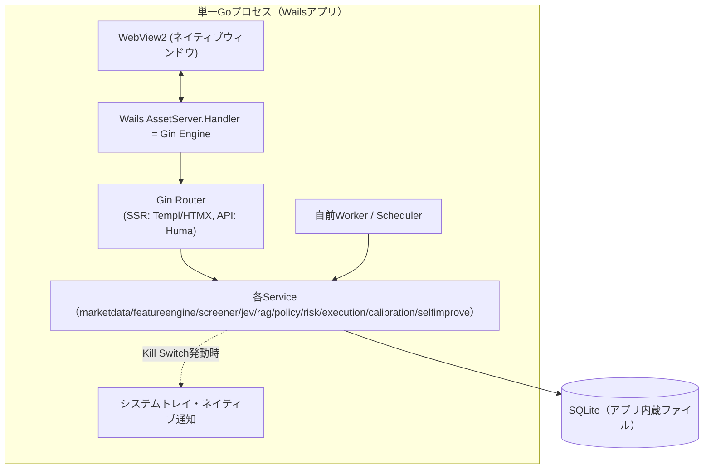
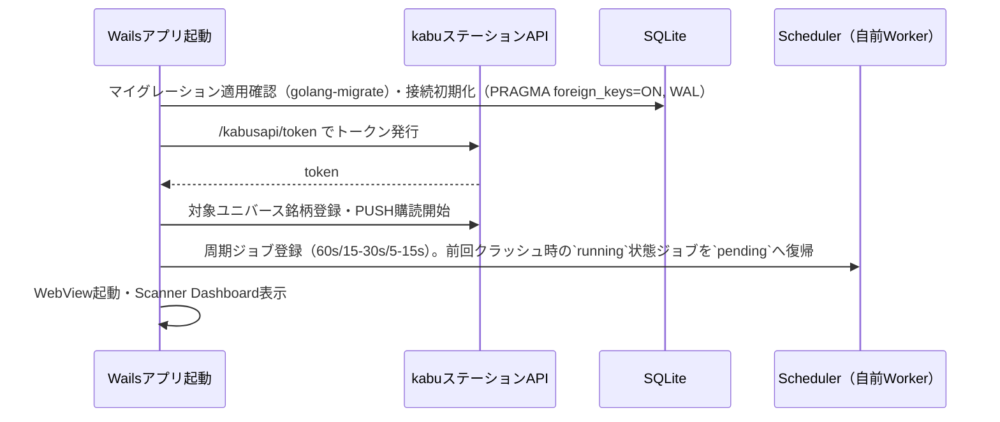
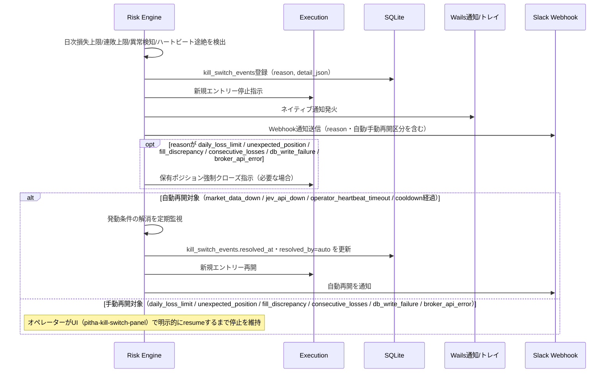
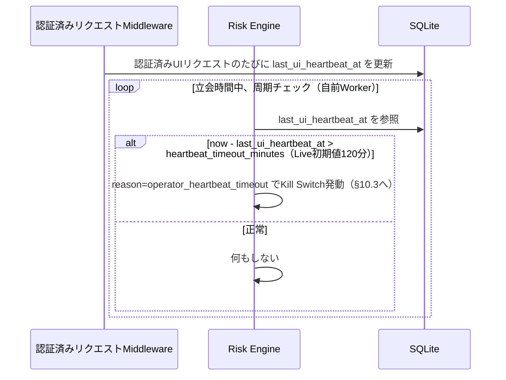
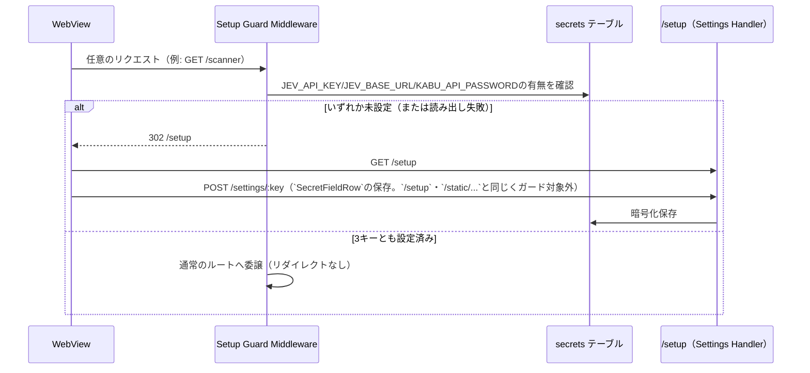
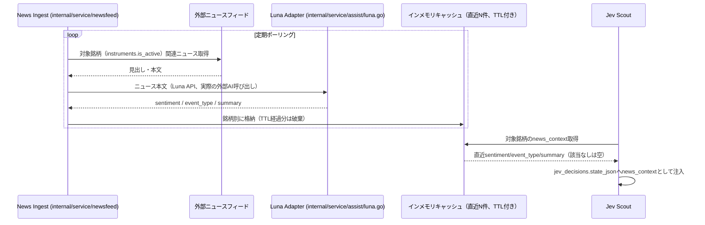

# アーキテクチャ設計

## 1. 設計方針

- **単一プロセス・単一バイナリ**: Wails によりネイティブデスクトップアプリとして単一の Go プロセスに全機能（HTTP/HTMXサーバー、Scheduler/Worker、kabuステーションAPI連携、Jevアダプタ）を同居させる。単一Windowsホスト構成（`requirements/non-functional.md` §1）に合わせ、ネットワーク越しの分散構成は取らない
- **バックエンドファースト（HALT思想）**: フロントエンドはAPIサーバー（Gin）に内蔵し、SPAを作らない。判断に迷ったらサーバー側に寄せる。詳細は `components/overview.md`
- **計算とJev判断の分離**: 価格・リターン・VWAP・ATR・板インバランス等の計算可能な値はGoコードで計算する。Jevは解釈（regime/direction/toxic flow等）のみを担当する（`overview.md` §2.2 最重要原則）
- **SQLite中心のインフラ最小化**: Postgres/Redis/BullMQ/Celeryのような別プロセスのミドルウェアを一切持ち込まず、DB・Job Queue・ベクトル検索インデックスをすべて**単一のSQLiteファイル**（アプリ内蔵）で完結させる。Wailsの単一実行ファイル配布と最も相性がよく、Windowsホストへの事前インストール作業をゼロにする
- **AI自己改善ループの境界**: Sol/Opus（§8）は`runtime_settings`の`policy.*`キー（Policy Engineしきい値）のみ変更可能。`risk.*`キー（Risk Engineのリミット値）およびJevの`prompt_version`/質問セット自体は自己改善ループの対象外とし、人手のみが変更できる。これはアプリケーション層のアクセス制御（governorサービスが`risk.*`への書き込みAPIを持たない）で技術的に強制する（`overview.md` 非目標「AIによるリスクルール変更」を継続遵守）
- **差し替え可能性**: 各レイヤーはインターフェースを介して疎結合にする。`internal/domain`・`internal/repository`・`internal/service` はWailsプロセスの存在を前提にしない。将来スキャン対象拡大や複数戦略運用でプロセス分離が必要になった場合に備える

## 2. 技術スタック

| レイヤー | 技術 | 役割 |
|---------|------|------|
| 言語 | Go 1.23+ | バックエンド・Scheduler・アダプタ全般を単一言語で実装 |
| デスクトップシェル | Wails v2 | ネイティブウィンドウ（WebView2）・システムトレイ・ネイティブ通知・単一実行ファイル配布 |
| サーバーフレームワーク | Gin | ルーティング＋SSR。WailsのAssetServer.Handlerとして注入 |
| APIフレームワーク | Huma | OpenAPI 3.1自動生成、入出力バリデーション（`/api/v1/...`） |
| テンプレートエンジン | Templ | 型安全なGo HTMLテンプレート |
| インタラクション | HTMX | サーバー駆動のDOM更新 |
| リッチUI | Lit (Web Components) | チャート・ライブテーブル等（`components/overview.md`） |
| チャート描画 | lightweight-charts | ローソク足・VWAP・出来高チャート |
| スタイリング | Tailwind CSS | ユーティリティファーストCSS |
| ビルド | esbuild | Lit/TypeScriptバンドル |
| DB | **SQLite**（`modernc.org/sqlite`、アプリ内蔵） | 全永続データ（§4 ER参照）。exeに同梱、外部サービスのインストール不要 |
| DBアクセス | database/sql + sqlc（sqlite3方言） | 型安全なSQLクエリ生成。ORMは使わずSQLを直接管理 |
| マイグレーション | golang-migrate（sqlite3ドライバ） | `db/migrations` のSQLマイグレーション管理 |
| ベクトル検索 | `modernc.org/sqlite/vec`（sqlite-vecのpure Go移植、`vec0`仮想テーブル） | RAG類似検索（§7）。pgvector相当の機能をSQLite上で実現。CGO不要でクロスコンパイル可能（`environment/setup.md` §CI/CD参照） |
| Job Queue / Scheduler | 自前Workerプール（`jobs`テーブル + goroutine） | market-data, feature-calc, jev-scout, jev-trader, risk-check, paper-execution, outcome-labeling, analytics の8キュー。単一プロセス前提のためRedis/River等の外部キューは不要。`architecture/er.md` の`jobs`テーブルで永続化・再起動時リカバリ |
| 周期実行 | robfig/cron | 60秒/15-30秒/5-15秒サイクルのトリガー |
| リアルタイムPush | `github.com/coder/websocket` | Scanner Dashboard/Symbol DetailへのUI即時反映（`nhooyr.io/websocket`はメンテナがcoder/websocketへ移管し非推奨化されたため、フォーク後継のcoder/websocketを採用） |
| 市場データ・発注 | kabuステーションAPI（三菱UFJ eスマート証券、旧auカブコム証券） | 1分足・板・発注（REST + PUSH WebSocket） |
| Jevアダプタ | 独自HTTPクライアント | Jev API（外部LLM判断レイヤー）呼び出し |
| Luna/Sol/Opusアダプタ | 独自HTTPクライアント | ニュース分類（Luna）・振り返り分析（Sol）・改善提案レビュー（Opus）呼び出し（§8） |
| ロギング | slog（構造化JSON） | `requirements/non-functional.md` §5 準拠 |
| アラート | Slack Incoming Webhook | 即時通知（§5.2） |

## 3. ディレクトリ構成・レイヤー構造

```text
pitha-trador/
├── cmd/
│   └── desktop/                  # Wailsエントリーポイント（main.go, wails.json, app.go）
├── internal/
│   ├── domain/                   # ドメインモデル（他レイヤーに非依存）
│   │   ├── instrument.go
│   │   ├── snapshot.go           # market_snapshots相当
│   │   ├── feature.go
│   │   ├── jevdecision.go
│   │   ├── signal.go             # trade_signals相当
│   │   ├── order.go              # paper_orders相当
│   │   ├── position.go
│   │   ├── calibration.go
│   │   └── policyproposal.go     # policy_proposals相当
│   ├── repository/               # domainのみに依存。sqlc生成コードを内包
│   │   ├── instrument_repo.go
│   │   ├── snapshot_repo.go
│   │   ├── decision_repo.go
│   │   ├── signal_repo.go
│   │   ├── order_repo.go
│   │   ├── position_repo.go
│   │   ├── calibration_repo.go
│   │   ├── job_repo.go           # jobsテーブル（自前Worker用）
│   │   └── proposal_repo.go      # policy_proposals
│   ├── service/                  # domain, repositoryに依存
│   │   ├── marketdata/           # kabuステーションAPIクライアント（REST+PUSH WS）
│   │   ├── featureengine/        # 特徴量算出
│   │   ├── screener/             # Fast Screener・screen_score算出
│   │   ├── jev/                  # Jevアダプタ（client.go, scout.go, trader.go, schemas.go, prompt_version.go）
│   │   ├── rag/                  # 埋め込み生成・sqlite-vec類似検索（§7）
│   │   ├── policy/                # Policy Engine
│   │   ├── risk/                  # Risk Engine（Kill Switch含む）
│   │   ├── execution/             # Paper/kabu発注実行
│   │   ├── calibration/           # Outcome labeling・Brier/Log Loss算出
│   │   ├── assist/                # Luna/Sol/Opusアダプタ
│   │   │   ├── luna.go
│   │   │   ├── sol.go
│   │   │   └── opus.go
│   │   ├── newsfeed/              # News Ingest: 外部ニュースフィード定期取得→Luna呼び出し（§13）
│   │   ├── selfimprove/           # Sol提案生成〜Opusレビュー〜適用/ロールバック（§8）
│   │   ├── activityfeed/          # jobs/jev_decisions/kill_switch_events集約の読み取り専用フィード（System Activity Log向け、§12）
│   │   └── scheduler/             # 自前Workerプール定義・周期ジョブ登録
│   ├── router/                    # SSR + API ルーティング定義（Huma登録含む）
│   └── web/
│       ├── handler/               # scanner.go, symbol.go, performance.go, calibration.go, system.go
│       ├── middleware/            # CSRF, ロギング, リカバリ, 操作者ハートビート記録（§10.4）, Setup Guard（§10.5）
│       ├── atoms/
│       ├── molecules/
│       ├── organisms/
│       ├── pages/
│       └── layout/
├── static/
│   └── src/
│       ├── components/            # Lit Web Components（pitha-* 、詳細は components/overview.md）
│       │   └── lib/               # api.ts, ws.ts, logger.ts
│       ├── css/
│       └── dist/                  # ビルド成果物
├── db/
│   └── migrations/                # golang-migrate SQLマイグレーション（SQLite方言、vec0仮想テーブル作成含む）
├── config/
│   ├── strategy.yaml               # スキャン頻度・Fast Screenerしきい値・Policy Engineしきい値
│   └── risk.yaml                   # Risk Engine制限値（§7 Risk Engine参照）
└── tests/
```

### レイヤー依存ルール（HALT準拠）

依存は上から下への一方向のみ。逆方向のimportは禁止。

```text
handler → service → repository → domain
   ↓
 Templ テンプレート（atoms/molecules/organisms/pages）
```

- `domain/`: 他レイヤーに依存しない。純粋なビジネスロジック（例: Risk Engineのしきい値判定ロジック自体はdomainに置き、DB/HTTPアクセスはrepository/serviceに分離）
- `repository/`: `domain/` のみに依存。例外として`SecretsRepository`（issue #57）のみ`internal/config`のAES-256-GCMヘルパー（依存を持たない、`domain`と同格の基盤パッケージ）にも依存する
- `service/`: `domain/`, `repository/` に依存。`marketdata`/`jev`/`assist`など外部I/OはこのレイヤーでHTTPクライアントとして実装する
- `web/handler/`: `service/`, `domain/` に依存。`repository/` を直接使わない（`.golangci.yml` の depguard が `internal/web/**` から `internal/repository` への import を lint で拒否する）。repositoryが返すセンチネルエラーのうちhandlerが分類する必要があるもの（例: `domain.ErrPositionNotFound`）は`domain/`に定義し、repositoryはそれを返す
- `router/`: `handler/` を参照してルートを定義

## 4. コンポーネント責務

| コンポーネント | 責務 | 実装場所 |
|---------------|------|---------|
| Market Data Client | kabuステーションAPIからの1分足・板・約定データ取得（REST）、リアルタイム価格のPUSH WebSocket受信、トークン管理 | `internal/service/marketdata` |
| Feature Engine | 価格・VWAP・出来高・ボラティリティ・板/約定・市場コンテキスト特徴量の算出（`requirements/functional.md` §4.1） | `internal/service/featureengine` |
| Fast Screener | 数値フィルター・screen_score算出・上位N銘柄選定（§4.2） | `internal/service/screener` |
| Jev Adapter (Scout/Trader) | 構造化状態をJev APIへ送信し、choice/score/yes-no型の判断を受け取る（§4.4, §4.5） | `internal/service/jev` |
| RAG Context Builder | 現在の状態ベクトルからsqlite-vecで類似過去局面を検索し、Jevへのfew-shot文脈を構築する（§7、FR-RAG-1〜5） | `internal/service/rag` |
| Policy Engine | Jev出力をトレードシグナルへ変換（§4.6） | `internal/service/policy` |
| Risk Engine | ポジションサイズ・損失上限・Kill Switch（§4.7）。全レイヤーの中で最終拒否権を持つ | `internal/service/risk` |
| Execution | Paper Entry/Exit・kabuステーションAPI発注（実売買移行時） | `internal/service/execution` |
| Calibration | Outcome Labeling、Brier Score/Log Loss/ECE算出（§4.12） | `internal/service/calibration` |
| Self-Improvement Governor | Sol提案の受理、Opusレビュー依頼、シャドーバックテスト実行、`runtime_settings`への適用・ロールバック（§8、FR-SELFIMPROVE-1〜7） | `internal/service/selfimprove` |
| Luna/Sol/Opus Adapter | ニュース分類（Luna）・振り返り分析（Sol）・提案レビュー（Opus）のAPI呼び出し | `internal/service/assist` |
| Scheduler/Worker | `jobs`テーブルを介した自前Workerプールによるキュー処理・周期実行トリガー（§4.10） | `internal/service/scheduler` |
| Activity Feed | `jobs`/`jev_decisions`/`kill_switch_events`を集約し、System Activity Log向けのキュー状況・直近アクティビティを提供（新規永続テーブルなし、§12） | `internal/service/activityfeed` |
| Setup Guard Middleware | 必須認証情報（JEV_API_KEY/JEV_BASE_URL/KABU_API_PASSWORD）が未設定の間、`/setup`・`POST`/`DELETE /settings/:key`・`/static/...`以外の全リクエストを`/setup`へ302リダイレクトする（§10.5、FR-SETUP-1） | `internal/web/middleware` |
| Web (HTMX/Templ/Lit) | UI提供（`components/overview.md`） | `internal/web` |

## 5. kabuステーションAPI連携

- kabuステーションは三菱UFJ eスマート証券（旧auカブコム証券）が提供するWindows常駐アプリで、`http://localhost:18080`（既定）にローカルRESTを公開する。Go側の `internal/service/marketdata` はこれをHTTPクライアントでラップする
- **トークン発行**: アプリ起動時に `/kabusapi/token` へAPIパスワードでPOSTしトークンを取得。トークンは有効期限があるため、Wailsアプリ起動時および定期的に再発行し、メモリ上にのみ保持する（ディスクへは保存しない）
- **銘柄登録・PUSH購読**: スキャン対象銘柄をkabuステーションAPIの銘柄登録エンドポイントに登録し、価格・板情報はPUSH WebSocket（kabuステーションが提供するローカルWebSocket）で受信する。これによりREST側の60秒ポーリングに依存せず、Feature Engineが各サイクル開始時点の最新スナップショットを参照できるようにする
- **発注**: Paper Trading中はExecutionサービス内でシミュレーションのみ行い、kabuステーションAPIへは発注しない。Phase 7（実売買移行）で初めてkabuステーションAPIの注文エンドポイントを呼び出す。それまでは`KABU_API_PASSWORD`（単一キー）は市場データ読み取り専用であり、Production用とPaper Trading用のキー・Base URLの分離（`requirements/non-functional.md` §4）はPhase 7で注文エンドポイントを実装する前に行う
- **異常時**: kabuステーションAPI無応答・エラー時は該当銘柄を stale data 判定し新規取引を禁止する（`requirements/functional.md` にある障害対応方針と整合）
- **認証情報の入力経路**: `APIPassword`は`.env`/環境変数ではなく、アプリ内のSettings画面（`/settings`）から入力し、`secrets`テーブル（`internal/repository.SecretsRepository`、AES-256-GCMで暗号化）にDB保存する（issue #57）。必須3キー（JEV_API_KEY/JEV_BASE_URL/KABU_API_PASSWORD）が未設定でもアプリは起動するが、Setup Guard（§10.5）が全ページを`/setup`へ誘導する。Jev/kabuステーションAPI依存機能はエラーログを出しつつ動作を継続する。入力はキー単位で保存・削除する（`POST`/`DELETE /settings/:key`、`internal/config`のallow-list外のキーは400）ため、あるキーの操作が他キーの値に影響することはない（issue #79）。設定変更はアプリ再起動後に反映される（ホットリロードは範囲外）

## 6. Jev API連携

- Jevアダプタ（`internal/service/jev`）はAPIキーをGoプロセス内のみで保持し、HTTP経由でJev APIを呼び出す
- Scout/Traderそれぞれの質問セット（`requirements/functional.md` §4.4, §4.5）をリクエストスキーマ（`schemas.go`）として定義し、レスポンスをdomainモデルへマッピングする
- `prompt_version.go` でプロンプト/質問セットのバージョンを管理し、`jev_decisions.question_version` に記録する（`architecture/er.md` 参照）
- 失敗時は1回目リトライ、2回目以降exponential backoff、継続失敗でnew entry停止。既存ポジションはRisk Engine/Executionのコードベースルールで管理を継続する
- **認証情報の入力経路**: `APIKey`/`BaseURL`は§5と同じくSettings画面（`/settings`）経由でDB保存する（issue #57）。詳細は§5「認証情報の入力経路」参照

## 7. RAG連携（経験ベース文脈拡張）

`requirements/functional.md` §4.13 の実装詳細。



- 埋め込みはLLM API呼び出しを伴わない標準化済み数値特徴量ベクトル（14次元、`architecture/er.md` ベクトルインデックス節参照）。追加のAPIコスト・レイテンシは発生しない（FR-RAG-3）
- `market_snapshots`保存時・`jev_decisions`保存時にそれぞれ`market_snapshot_vectors`/`jev_decision_vectors`（sqlite-vec仮想テーブル）へ同期書き込みする
- コールドスタート期間（該当データが少ない）は空の検索結果として扱い、Jevは通常通り判断する（FR-RAG-4）

## 8. 自己改善ループ（Sol / Opus 連携）

`requirements/functional.md` §4.14 の実装詳細。Sol/Opusは高頻度の売買判断ループ（§4, §9）とは別の低頻度バッチとして動作し、Policy Engineのしきい値のみを対象に自己改善する。



- Solが変更を提案できる対象は`runtime_settings`の`policy.*`キーに限定する。`risk.*`キーとJevの`prompt_version`は`selfimprove`サービスに書き込みAPIそのものを持たせないことで技術的に強制する（§1 設計方針）
- Luna（Sense）は本ループとは独立し、高頻度側（Feature Engine/Jev呼び出しの前段）でニュース分類等を提供する補助コンポーネントとして`internal/service/assist/luna.go`に実装する
- **外部AI API契約（`internal/service/assist`）**: いずれも`POST {BASE_URL}<path>`（`Authorization: Bearer {API_KEY}`、JSON、200以外はエラー扱い）。Sol `/v1/analyze`（リクエスト: 方向別`thresholds`/`calibration`と`constraints`、レスポンス: `{"rationale":{...},"proposed_changes":[{"key","new_value"}]}`。変更なしは空配列）、Opus `/v1/review`（リクエスト: `proposal`/`backtest`/`deterministic`、レスポンス: `{"verdict":"approve|reject","reason":"..."}`）。決定的しきい値を満たさない提案ではOpus APIを呼ばずに却下する。`policy_proposals.review_json`は`verdict`/`approved`/`deterministic_passed`/`llm_reviewed`/`reason`等を含む。
- 未処理（`pending`）の提案がある日は、Opusレビューの再試行のみ行い新規のSol分析は行わない（同一しきい値への提案の競合防止）
- Sol/Opusはいずれも`internal/service/assist`のHTTPクライアントを介し、Jevアダプタ（§6）と同様の認証情報の入力経路（Settings画面→`secrets`テーブル、`SOL_API_KEY`/`SOL_BASE_URL`、`OPUS_API_KEY`/`OPUS_BASE_URL`）とリトライ/exponential backoff方針に従う実際の外部AI API呼び出しとして実装する。API失敗時は当該日のSol提案生成/Opusレビューをスキップし、Slack通知のうえ翌営業日に再試行する（銘柄単位の売買判断ではないためnew entry停止のような取引影響は発生しない）

## 9. Wails統合（デスクトップシェル）



- Wails v2 の `options.App.AssetServer.Handler` に Gin の `http.Handler` をそのまま渡し、WebViewは常に `http://wails.localhost/` 相当の内部プロトコル経由でGinが返すHTML/HTMXフラグメント/静的アセットを描画する。外部ネットワークポートを開かない（`requirements/non-functional.md` §4 セキュリティに整合）
- Risk EngineがKill Switchを発動した際は、同一プロセス内であるためネットワーク越しの通知APIを介さず、直接Wailsランタイム（`runtime.EventsEmit` / ネイティブ通知API）を呼び出してOSレベルのトースト通知とシステムトレイアイコン変化を発生させる
- Windows起動時の自動起動は、Wails実行ファイルへのショートカットをWindowsスタートアップフォルダまたはタスクスケジューラに登録することで実現する
- SQLiteファイルはWailsアプリの起動時に存在確認・マイグレーション適用を行う。Postgresのような別プロセスの起動待ち合わせは不要
- 将来ヘッドレス運用（例: CI・テスト環境）が必要な場合に備え、`cmd/desktop`とは別に`cmd/server`（Wailsを使わずGinのみを`net/http`でリッスンするエントリーポイント）を用意できるよう、`internal/router`はWailsに依存しない形で実装する
- 自動アップデート（`internal/service/updater`、`cmd/desktop`のみ）は検知結果を`Checker.Status()`（最終確認時刻・新バージョン有無・安全ゲート保留・インストーラー準備済み・直近エラー）として保持し、`bootstrap.Services.Updater`→`router.WithUpdateController`経由でHandlerへ渡す。UIはHeaderの`UpdateBanner`で新バージョンと保留状態を通知し、Settings画面の「今すぐアップデートを確認」（`POST /system/update-check`）でスケジューラーと同じ`CheckForUpdate`を手動実行できる。`CheckForUpdate`は排他制御され、周期実行と手動実行が同時にインストーラーをダウンロード/終了要求することはない。`cmd/server`はアップデーター未搭載のためバナー/パネルは空、確認ルートは404（issue #76）。取得経路はリクエストごとの`context`タイムアウト（リリース確認30秒・ダウンロード全体10分）、ダウンロードサイズ上限（インストーラー512MiB・`checksums.txt`1MiB、GitHubの`asset.size`報告値があればそれに厳格化）、`browser_download_url`が`https://github.com/<owner>/<repo>/releases/download/`配下であることの検証で保護する（issue #126）。`checksums.txt`はインストーラーと同一リリース由来のため転送破損の検知に留まり、リリース差し替えへの真正性検証（コード署名・分離署名）は未実装の既知制約
- `config/strategy.yaml`・`config/risk.yaml`・`/static/...`で配信する静的アセット（`static/src/dist`のesbuild/Tailwindビルド出力＋`static/src/vendor`のhtmx.min.js）は、いずれも`go:embed`でバイナリに埋め込み、`wails build`/`go build ./cmd/server`が生成する単一`.exe`だけで（外部ファイル・ソースツリー一切無しに）起動できる。config 2種は`internal/bootstrap.Run`が (1) 明示パス指定 (2) `PITHA_STRATEGY_PATH`/`PITHA_RISK_PATH`環境変数 (3) 実行ファイルと同じディレクトリの`config/*.yaml`（`os.Executable()`基準。配布先で手編集する運用向け） (4) 埋め込み既定値、の優先順位で解決する（issue #59）。静的アセットは`internal/router.New`が常に埋め込みから配信する
- `make dev`実行時は`Makefile`が`PITHA_STRATEGY_PATH`/`PITHA_RISK_PATH`をリポジトリ内の生ファイルへ設定するため、上記(2)が常に選ばれ、`config/risk.yaml`等を編集して再起動すれば即座に反映される（埋め込みはコンパイル時スナップショットのため、(4)経由では反映されない）

## 10. 通信フロー

### 10.1 起動時フロー



### 10.2 スキャン〜発注フロー

`requirements/functional.md` §2 主要処理フロー（シーケンス図）を参照。アーキテクチャ上の要点は以下。

- Scheduler（自前Worker、`jobs`テーブル）が `market-data` → `feature-calc` → `jev-scout` → `jev-trader` → `risk-check` → `paper-execution` の順にジョブをenqueueし、各Serviceがdomainモデルを介して疎結合に連携する
- `jev-scout`/`jev-trader`の直前にRAG Context Builder（§7）が類似局面を検索し文脈を付与する
- `risk-check` は他ジョブと異なり同期的にPolicy Engineの直後で必ず評価され、Risk Engineの承認なしにExecutionへは到達しない
- `outcome-labeling` / `analytics` は約定・Exit後に非同期実行し、UIの応答性に影響を与えない

### 10.3 Kill Switchフロー（発動〜再開）



検知（市場データ停止・Jev API異常・Broker API異常・想定外ポジション・約定差異・DB書き込み失敗・日次損失接近）と自動再開の解消監視は、SchedulerのCronトリガー（各1分周期、`WithRiskMonitor`/`WithAutoResumer`）が`risk.Engine.RunPeriodicChecks`/`AutoResume`を呼ぶことで実行する。判定基準の詳細は`requirements/functional.md` FR-RISK-2/FR-RISK-7を参照。

### 10.4 操作者ハートビート監視（dead-man's switch、Live専用）



- ハートビートはCSRF保護対象の認証済みリクエスト（ページ/アクション/API呼び出し）であれば種類を問わず更新対象とする
- Paper Trading運用中は実資金リスクがないためハートビート監視を適用しない（`requirements/functional.md` §4.7 表の heartbeat_timeout_minutes は Live のみ設定）

### 10.5 初回セットアップ誘導

`requirements/functional.md` §4.18（FR-SETUP-1〜5）の実装詳細。



- ガードは全ルート（ページ・アクション・`/api/v1`・WebSocket・404含む）の手前に置き、`/setup`・`POST`/`DELETE /settings/:key`・`/static/...`のみ通す。判定はリクエストごとにDBを参照し、状態を保持しないため、3キーが揃った次のリクエストから自動で解除される（アプリ再起動は不要）
- `/setup`はSettings画面と同じ`SecretFieldRow`・同じ`POST`/`DELETE /settings/:key`を使い、専用の保存実装を持たない。完了後も直接アクセスして再設定できる
- `/setup`は`Header`（ガード対象の`hx-get`フラグメントを持つ）を含まない専用レイアウト（`SetupShell`）で描画する
- 各種サービスは従来通り起動時の値を読むため、保存した認証情報の反映にはアプリ再起動が必要（§5）

## 11. 障害対応方針

| 障害 | 対応 |
|------|------|
| Jev API失敗 | 1回目リトライ→2回目以降exponential backoff→継続失敗でnew entry停止。既存ポジションはコードベースExit Ruleで継続管理 |
| Market Data欠損 | stale data判定→該当銘柄の新規取引禁止 |
| kabuステーションAPI異常 | Kill Switch発動条件に該当。新規取引停止、必要に応じ強制決済 |
| DB書き込み失敗継続 | Kill Switch発動条件に該当 |
| Wailsプロセスクラッシュ | プロセス監視による自動再起動。再起動中は新規エントリー停止（既存ポジションはkabuステーション側の待機注文/手動介入を前提）。再起動後、`jobs`テーブルの中断ジョブを`pending`へ復帰させ処理を再開する |

## 12. System Activity Feed連携

`requirements/functional.md` §4.15/§5.5の実装詳細。既存テーブル（`jobs`, `jev_decisions`, `kill_switch_events`）への読み取り専用集約であり、新規の永続テーブル・マイグレーションは追加しない。

- `internal/service/activityfeed`が`internal/repository`の`job_repo`/`decision_repo`/`killswitch_repo`を横断的に参照し、キュー別集計（pending/running/直近failed件数）と時刻順マージ済みイベント一覧を組み立てる
- `internal/web/handler`に`activity.go`を追加し、`GET /api/v1/activity`（`api/endpoints.md` §5）と`/ws/activity`（同§6）を提供する
- 新規イベント（`jobs`の状態遷移、`jev_decisions`挿入、`kill_switch_events`挿入）はrepository層のコミット直後にactivityfeedのイベントバス（プロセス内channel、DB永続化なし）へ通知し、`/ws/activity`購読者へ配信する。プロセス再起動時はイベントバスの未配信分は破棄され、次回`GET /api/v1/activity`のスナップショットから再開する（監査要件はjobs/jev_decisions/kill_switch_events自体が引き続き担う）
- フィード件数上限（既定200、最大500）はAPI/WS配信側の制限であり、参照元テーブルの保持期間・行数（`architecture/er.md`各テーブルの運用注記）には影響しない

## 13. Luna ニュース分類・News Ingest連携

`requirements/functional.md` §4.16（FR-LUNA-1〜5）の実装詳細。



- 永続化は`jev_decisions.state_json`（既存カラム）のみを利用し、新規テーブル・マイグレーションは追加しない（キャッシュはプロセスメモリ内のみでDB非永続）
- **認証情報の入力経路**: `LUNA_API_KEY`/`LUNA_BASE_URL`、`NEWS_FEED_URL`/`NEWS_FEED_API_KEY`は§5・§6と同じくSettings画面（`/settings`）経由で`secrets`テーブルへ保存する
- **外部API契約**: ニュースフィードは`GET {NEWS_FEED_URL}?symbol={銘柄コード}`（`Authorization: Bearer {NEWS_FEED_API_KEY}`）で`{"items":[{"id","headline","body","published_at"}]}`を返す。Lunaは`POST {LUNA_BASE_URL}/v1/classify`（リクエスト: `symbol`/`headline`/`body`/`published_at`、レスポンス: `{"sentiment":"bullish|bearish|neutral","event_type":"決算|業績修正|M&A|規制|その他","summary":"..."}`）。値域外の応答は失敗として扱う
- News Ingestは1分周期でポーリングし、記事ID（無ければ見出し）単位で重複排除して1件ずつLunaへ送信する。キャッシュは銘柄ごと直近5件・TTL 6時間（公開時刻基準）。新規に分類された記事は銘柄単位のニュースフラグを立て、Fast Screener候補であればイベント再評価（FR-SCAN-1）で1回だけ消費される
- LUNA/NEWS_FEEDのどちらかが未設定の間はNews Ingestを起動しない（`news_context`は注入されずニュースフラグも立たない）。SOL/OPUS未設定時は各段階を毎日スキップする
- Luna/News Ingest API失敗時はニュースフラグを立てず、Fast Screener/Jevの通常フローに影響を与えない（FR-LUNA-4、Jevと同様のフェイルセーフ）

## 改訂履歴

| 版 | 日付 | 変更内容 | 変更理由 |
|----|------|---------|---------|
| 1.0 | 2026-09-26 | 新規作成 | 初版 |
| 1.1 | 2026-09-26 | §10.3を発動〜再開フローに拡張し、§10.4操作者ハートビート監視（dead-man's switch）を追加 | Phase 7も含めた完全自動運用への方針変更 |
| 1.2 | 2026-09-26 | §7 RAG連携、§8 自己改善ループ（Sol/Opus連携）を追加。DBをPostgreSQLからSQLiteへ全面移行（Job QueueはRiverから自前Workerへ、pgvectorはsqlite-vecへ） | 自己学習による継続的改善の組み込み、Wails単一exe配布との整合 |
| 1.3 | 2026-09-26 | §7のベクトル次元表記を16→14（`architecture/er.md`と整合）に修正 | レビュー指摘対応 |
| 1.4 | 2026-09-26 | ベクトル検索を`modernc.org/sqlite/vec`と明記し、CGO不要である旨を追記（CIでのWindowsクロスビルド可否の根拠） | レビュー指摘対応 |
| 1.5 | 2026-09-27 | リアルタイムPushライブラリを`nhooyr.io/websocket`から後継の`github.com/coder/websocket`へ変更（旧パッケージはメンテナ自身がdeprecated宣言、APIは互換） | golangci-lint（staticcheck SA1019）指摘対応 |
| 1.6 | 2026-09-28 | §3レイヤー依存ルールに`SecretsRepository`の`internal/config`依存という例外を明記。§5/§6にJEV_API_KEY/JEV_BASE_URL/KABU_API_PASSWORDの入力経路をSettings画面（`/settings`）・DB保存（`secrets`テーブル、AES-256-GCM暗号化）へ変更した旨を追記（issue #57、`.env`/環境変数からの入力を廃止） | issue #57実装 |
| 1.7 | 2026-09-28 | §9に config/strategy.yaml・config/risk.yaml・静的アセットの`go:embed`埋め込みと4段階の解決優先順位（明示パス→環境変数→実行ファイル隣接→埋め込み既定値）を追記。`runtime.Caller(0)`ベースの`repoRoot`/`staticDir`（ビルドマシンの絶対パス依存で配布先では動作しなかった）を廃止 | issue #59実装（配布可能な.exeへの対応） |
| 1.8 | 2026-09-29 | §9に自動アップデートの検知状態（`Checker.Status()`）とUI通知・手動確認導線を追記 | issue #76実装 |
| 1.9 | 2026-09-29 | §4に`Activity Feed`コンポーネント（`internal/service/activityfeed`）を追加、§12 System Activity Feed連携を新設。既存jobs/jev_decisions/kill_switch_eventsの読み取り専用集約で新規テーブルなし | 実行中処理を可視化するログ画面の追加要望 |
| 1.10 | 2026-09-29 | §8のシーケンス図にFR-SELFIMPROVE-8（LLM出力の機械的検証）・FR-SELFIMPROVE-9（決定的しきい値とOpus APIレビューの併用）を反映。§13 Luna ニュース分類・News Ingest連携を新設、`internal/service/newsfeed`を追加 | 現状Jevのみが実AI呼び出しであった状態の是正（AI機能実装フェーズ） |
| 1.11 | 2026-09-29 | §8・§13に外部AI API/ニュースフィードの契約（エンドポイント・リクエスト/レスポンス・キャッシュ/ポーリング仕様・未設定時の挙動）を追記 | #81/#82実装で確定した外部API契約の仕様書反映 |
| 1.12 | 2026-09-29 | §5の認証情報入力経路をキー単位の保存・削除（`POST`/`DELETE /settings/:key`、allow-list外は400）と明記 | issue #79実装 |
| 1.13 | 2026-09-29 | §3 middleware/にSetup Guardを追記、§4にSetup Guard Middleware行、§5の未設定時挙動をSetup Guardへの誘導へ変更、§10.5初回セットアップ誘導を追加 | issue #80実装 |
| 1.14 | 2026-09-29 | §5の発注方針にBroker認証情報のProduction/Paper分離をPhase 7で実施する旨を追記 | issue #103対応 |
