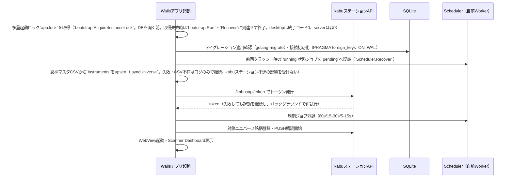
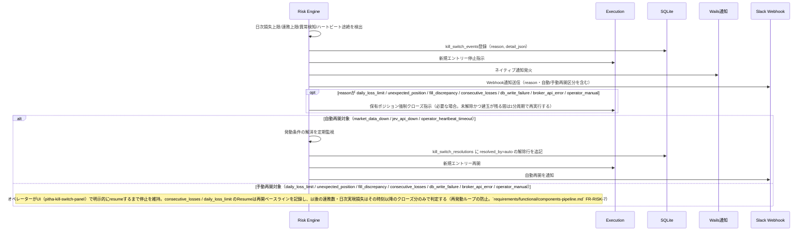
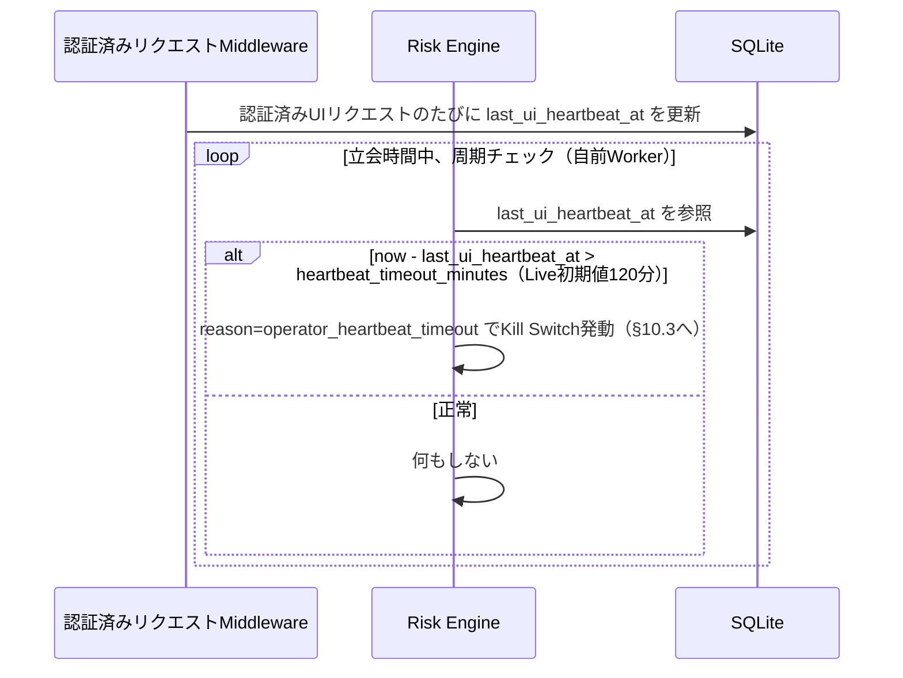
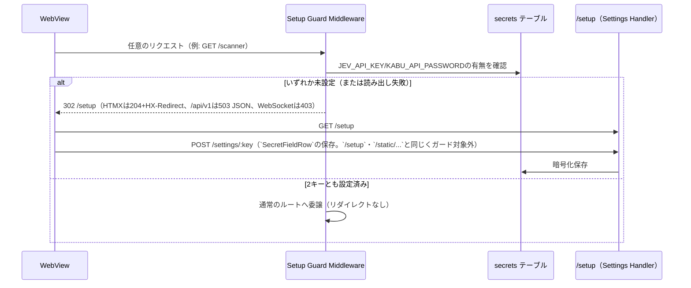
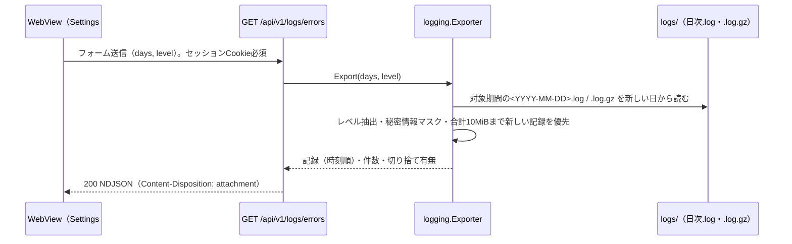

# アーキテクチャ設計: 通信フロー・障害対応（§10〜§11）

`docs/architecture/overview.md` から分割した章。§10 通信フロー（§10.1〜§10.6）/ §11 障害対応方針。節番号は分割前と同一で、コードコメント等の `overview.md §<番号>` は本ファイルの同番号の節を指す。

## 10. 通信フロー

### 10.1 起動時フロー

### 10.2 スキャン〜発注フロー

`requirements/functional.md` §2 主要処理フロー（シーケンス図）を参照。アーキテクチャ上の要点は以下。

- Scheduler（自前Worker、`jobs`テーブル）のフルスキャンが銘柄ごとに `market-data` ジョブをenqueueする。特徴量の算出・永続化は `market-data` ジョブ内で同期実行される。`feature-calc` キューはフルスキャンが投入せず、以前のバージョンが残した未処理ジョブを消化するだけの互換用の空ハンドラとして残っている（`market-data` → `feature-calc` の連鎖ではない。FR-SCHED-1）。`jev-scout` は候補更新サイクル（`bootstrap/candidates`）と、`market-data` ジョブ内のイベント再評価（FR-SCAN-1）からenqueueされ、`jev-trader` は `jev-scout` ジョブがenqueueする。各Serviceはdomainモデルを介して疎結合に連携する
- `jev-scout`/`jev-trader`の直前にRAG Context Builder（§7）が類似局面を検索し文脈を付与する
- Risk判定・Paper発注は独立したキュー（ジョブ）を持たず、`jev-trader`ジョブ内でPolicy Engine → Risk Engine → Execution（Paper）を同期実行する。Risk Engineは必ずPolicy Engineの直後に評価され、Risk Engineの承認なしにExecutionへは到達しない
- `outcome-labeling` は毎分のcron（`@every 1m`）が、判定水平線（5/10/20分）を経過したJev判断を拾ってenqueueする（約定・Exitを契機にはしない）。`analytics` は平日15:40 JSTのSol/Opus自己改善バッチ（`integrations.md` §8）専用のキューである。いずれも売買パスとは独立に非同期実行し、UIの応答性に影響を与えない

### 10.3 Kill Switchフロー（発動〜再開）

検知（市場データ停止・Jev API異常・Broker API異常・想定外ポジション・約定差異・DB書き込み失敗・日次損失上限・連敗上限）と自動再開の解消監視は、SchedulerのCronトリガー（各1分周期、`WithRiskMonitor`/`WithAutoResumer`）が`risk.Engine.RunPeriodicChecks`/`AutoResume`を呼ぶことで実行する。日次損失上限（`daily_loss_limit`、`CheckDailyLossLimit`）・連敗上限（`consecutive_losses`、`CheckConsecutiveLosses`）はシグナル到来を待たずこの周期処理でも評価され、到達時はKill Switch発動＋強制決済を伴う（Policy Engine候補ごとの判定と同一の上限）。「日次損失接近」（`CheckDailyLossWarning`）は警告のみでKill Switchは発動しない。同じ周期処理で、Kill Switch未解除かつ建玉が残る間の強制決済再試行（`RetryForceClose`）も実行する。判定基準の詳細は`requirements/functional.md` FR-RISK-2/FR-RISK-7を参照。

### 10.4 操作者ハートビート監視（dead-man's switch、Live専用）

- 自動再開（解消）は発動時刻より後に記録された本物のハートビートが`heartbeat_timeout_minutes`以内にあることを条件とする。発動判定の寄り付きクランプ（最後のハートビートを当日の寄り付きに切り上げる）は解消判定には使わない（寄り付き前は経過時間が負になり、操作者不在でも毎朝解消されてしまうため）
- ハートビートは有効なセッションCookieを持つ認証済みリクエスト（ページ/アクション/API呼び出し）を更新対象とする（`internal/router.WithHeartbeatRecorder` でSessionミドルウェアの直後に登録）。Cookieを持たないリクエストは対象外とし、外部からの無認証GETでdead-man's switchを延命できないようにする
- 操作者の操作ではないリクエストは更新対象外とする: `/static/...`、WebSocketのUpgrade（画面が自動で再接続する）、画面が自動ポーリングするルート（現状 `GET /system/update-status`（`every 60s`）と `GET /system/marketdata-status`（`every 30s`）。周期ポーリング（`hx-trigger="every Ns"`）を追加するときは必ず `backgroundPollPaths` にも追加する。漏れると認証済みタブ1つでデッドマンスイッチが無効化される）
- 自動発火の再同期リクエストも更新対象外とする（FR-RISK-6）。`pitha-kill-switch-panel` の再同期（初回・`kill_switch` / `state_changed` push受信時・WebSocket再接続後の `GET /api/v1/system/status`）と、`systemStateChanged` を契機とするHeaderの `#header-status`（`GET /system/status`）、`pitha-activity-feed` のWebSocket再接続後のスナップショット再取得（`GET /api/v1/activity`、`?type=kill_switch&limit=10`）は専用ヘッダ `X-Pitha-Background: 1`（`middleware.BackgroundHeader`、Lit側は `lib/api.ts` の `get(path, { background: true })`、htmx側は `hx-headers`）を付け、Heartbeatミドルウェアが除外する。これらは操作者不在でも発火するため、`operator_heartbeat_timeout` のKill Switch発動後のpushが自らハートビートを更新し、`AutoResume` が無人のまま解除してしまうことを防ぐ
- 書き込みはスロットリングする: ミドルウェアが最終記録時刻をメモリ保持し、10秒以内の更新対象リクエストではSQLiteへ書き込まない（タイムアウトは分単位のため精度に影響しない。書き込み失敗時は次のリクエストで即再試行する）
- Paper Trading運用中は実資金リスクがないためハートビート監視を適用しない（`requirements/functional.md` §4.7 表の heartbeat_timeout_minutes は Live のみ設定）

### 10.5 初回セットアップ誘導

`requirements/functional.md` §4.18（FR-SETUP-1〜5）の実装詳細。

- ガードは全ルート（ページ・アクション・`/api/v1`・WebSocket・404含む）の手前に置き、`/setup`・`POST`/`DELETE /settings/:key`・`/static/...`のみ通す。判定はリクエストごとにDBを参照し、状態を保持しないため、2キーが揃った次のリクエストから自動で解除される（アプリ再起動は不要）
- `/setup`はSettings画面と同じ接続先一覧・モーダル（`ConnectionList`）と`SecretFieldRow`・同じ`POST`/`DELETE /settings/:key`を使い、専用の保存実装を持たない。完了後も直接アクセスして再設定できる
- `/setup`は`Header`（ガード対象の`hx-get`フラグメントを持つ）を含まない専用レイアウト（`SetupShell`）で描画する
- 各種サービスは従来通り起動時の値を読むため、保存した認証情報の反映にはアプリ再起動が必要（§5）

### 10.6 エラーログエクスポート

`requirements/functional/components-platform.md` §4.19（FR-ERRLOG-1〜7）の実装詳細。

- `internal/logging`に読み取り専用のExporterを置き、`web/handler/system`がインターフェース越しに呼ぶ（`bootstrap`が`LogDir`を渡して組み立て、`router`のOptionで注入する。`web` → `repository/**`の禁止は変わらない）。書き込み側の`RotatingWriter`・`Archiver`とは独立で、ログファイルを変更しない
- 当日の書き込み中ファイルは読み取り時点までを対象とし、末尾の不完全行は捨てる。`.log.gz`は透過的に展開する
- マスク規則と上限は FR-ERRLOG-3/4 に従う。ダウンロード操作は操作者の操作としてハートビート更新対象（§10.4）

## 11. 障害対応方針

| 障害 | 対応 |
|------|------|
| Jev API失敗 | 1回目リトライ→2回目以降exponential backoff→継続失敗でnew entry停止。既存ポジションはコードベースExit Ruleで継続管理 |
| Market Data欠損 | 現状: 銘柄単位のstale判定による新規取引禁止は未実装（`StatusTracker`は記録のみ）。全体の`market_data_down` Kill Switch（`GetBoard`5回連続失敗）で新規取引を停止する。銘柄単位の禁止はPhase 7移行前に実装する（`overview/integrations.md` §5） |
| kabuステーションAPI異常 | Kill Switch発動条件に該当。新規取引停止、必要に応じ強制決済 |
| DB書き込み失敗継続 | Kill Switch発動条件に該当 |
| Wailsプロセスクラッシュ | `--supervise`起動の監視プロセス（`internal/supervisor`）が自動再起動する（`architecture/overview/integrations.md` §9）。プロセス停止中は新規エントリーも行われない（既存ポジションはkabuステーション側の待機注文/手動介入を前提）。再起動後、`jobs`テーブルの中断ジョブを`pending`へ復帰させ処理を再開する |
