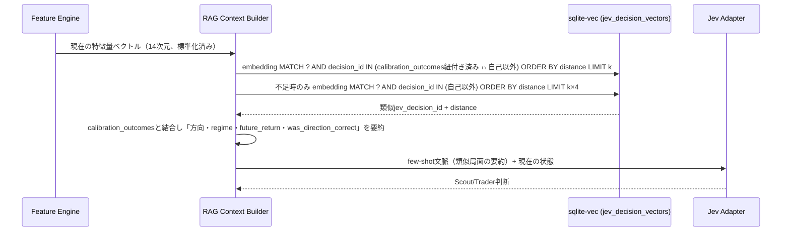
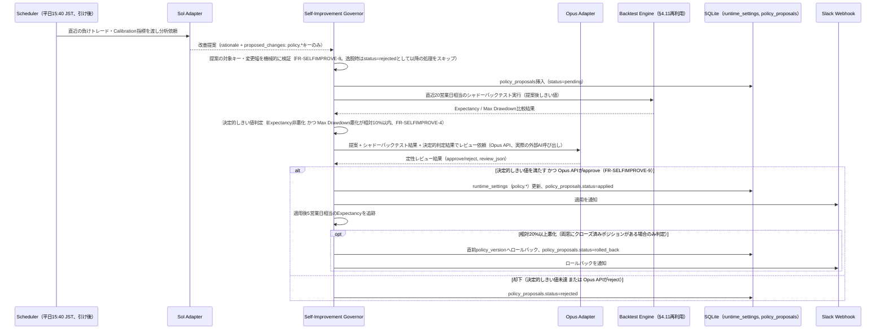
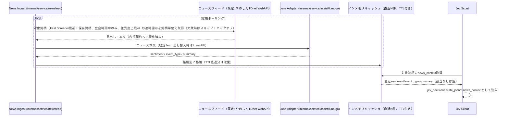

# アーキテクチャ設計: 外部・内部連携（§5〜§9・§12〜§13）

`docs/architecture/overview.md` から分割した章。§5 ブローカー連携（共通境界・kabuアダプタ・立花証券アダプタ・機能比較） / §6 Jev API連携 / §7 RAG連携 / §8 自己改善ループ / §9 Wails統合 / §12 System Activity Feed連携 / §13 Luna ニュース分類・News Ingest連携。節番号は分割前と同一で、コードコメント等の `overview.md §<番号>` は本ファイルの同番号の節を指す。

## 5. ブローカー連携（共通境界・kabuアダプタ・立花証券アダプタ）

### 5.1 共通境界（ブローカーアダプタ）と運用方針

**方針（issue #721。#720の決定）**: ブローカーは**1プロセスで1つ**を選ぶ（Settingsの`broker.provider`。既定`kabu`。#723）。kabuは**フォールバックとして実装と設定を残す**。切替は手動（Settings＋再起動）で、自動フェイルオーバーと2社同時接続は対象外。立花証券はまずデモ環境で検証し（#724・#725）、本番は読み取り（市況データ）のみで検証してから既定切替を判断する。**発注は#55（blocked）まで行わない**（立花の本番の第二暗証番号は保持しない）。背景は、kabuが人手のログインを前提とし、ログインのパスキー必須化（2026年10月末目標）で無人運用がさらに難しくなること。

ブローカー（証券会社API）の差分は1か所に閉じ込める（issue #722。kabu利用時の挙動は変えない）。境界は`internal/service/broker`で、利用側は`marketdatajob`・`heldposition`・`symbolcache`・`rankingwatch`（選択ロジック）・`web/handler/system`（接続バナー）・Risk Engineのヘルスチェックで、いずれもブローカー固有の型を受け渡さずこのパッケージの型だけを使う。

- **中立の型**: `Quote`（現在値・VWAP・累積出来高/売買代金・当日高安・**最良買`Bid`/最良売`Ask`と数量**・買/売の板厚・特別気配フラグ・`Raw`＝ブローカーの応答）、`SymbolInfo`（`Lendable`・値幅上下限、`PriceLimit`判定）、`SessionStatus`（`Issue`・`Code`・`Guidance`・連続失敗`Failures`/`Since`・`Persistent()`。原因は`unreachable`/`not_logged_in`/`api_disabled`/`bad_password`/`unknown`/`rejected`）。`Quote`のBid/Askは一般的な命名で、ブローカーAPIの命名差（kabuの売/買入れ替え）はアダプタが吸収する。`Quote.Raw`のJSONが`market_snapshots.raw_data_json`に保存される（`domain.Snapshot.RawDataJSON`＝ブローカーの応答。スキーマ・保存内容は変更しない）
- **interface**: `Session`（`Start(ctx)`・`Status()`）、`QuoteSource`（RESTスナップショット`Quote`）、`StreamFeed`（`SetWatch`・`UseWatchlist`・`Latest`＝ストリーム優先＋REST補完・`Run`）、`SymbolInfoSource`、`CandidateSource`（`Candidates`＝監視候補を順位順に）、`Health`（`BoardFailures`＝`market_data_down`用、`BrokerFailures`＝`broker_api_error`用の`*domain.FailureStreak`）、`Capabilities`（`Name`・`MaxStreamSymbols`・`Ranking`・`RequestsPerSecond`）。`broker.Broker`はこれらの束で、`broker.MarketDataChecker`が`Health.BoardFailures`の5回連続失敗を`risk.HealthChecker`（`market_data_down`）へ写像する。発注系（`OrderGateway`）は定義しない（#55の範囲）
- **選択**: `bootstrap.newBroker`が唯一のファクトリ（`internal/bootstrap/broker.go`）。Settingsの`broker.provider`（#723）で選んだkabuアダプタまたは立花証券アダプタ（`internal/service/broker/tachibana/adapter`。#724・#727。仕様は§5.3）を返す。立花の認証ID・秘密鍵パスが未設定でも組み立ては成功し、ログインの失敗（秘密鍵が読めない＝`key_mismatch`、認証IDが無い＝`bad_auth_id`）として案内する。`Services.Broker`として配線し、`Start`は`Broker.Start`、PUSH/ストリームは`Broker.Run`、ランキング監視は`Broker.Candidates`/`SetWatch`（件数上限は`Capabilities.MaxStreamSymbols`）を使う
- **依存の向き**: 中立パッケージ（`featureengine`/`execution`/`risk`/`policy`/`screener`/`symbolcache`/`broker`、`bootstrap`配下の`rankingwatch`/`marketdatajob`/`heldposition`）はkabuアダプタ（`internal/service/marketdata`配下すべて）をimportしない。`.golangci.yml`のdepguardルール`broker-neutral-no-adapter`で強制する（テストも同じ）。アダプタをimportするのは`bootstrap`の組み立て役と、kabu専用の`rankingmeasure`（FR-SCHED-8。中立化しない）のみ

### 5.2 kabuアダプタ（kabuステーションAPI連携）

以下はkabuアダプタ（`internal/service/marketdata/kabu`が`marketdata.Client`・`pushfeed`を`broker.Broker`として包む）の内部仕様。`/register`の50枠・RESTの回転（`rotation.go`）、`4002006`、`infolimit`、`4001006`/429のバックオフ、`4001009`/401の再発行、売/買命名の入れ替え（`kabu/quote`）、`/ranking`種別1〜7のインターリーブ（`kabu.Adapter.Candidates`）、原因別の案内文（`kabu.SessionStatusOf`＝`marketdata.TokenStatus.Guidance`）はすべてアダプタ内に閉じる。

- kabuステーションは三菱UFJ eスマート証券（旧auカブコム証券）が提供するWindows常駐アプリで、`http://localhost:18080`（既定）にローカルRESTを公開する。Go側の `internal/service/marketdata` はこれをHTTPクライアントでラップする
- **トークン発行**: アプリ起動時に `/kabusapi/token` へAPIパスワードでPOSTしトークンを取得。トークンは有効期限があるため、Wailsアプリ起動時および定期的に再発行し、メモリ上にのみ保持する（ディスクへは保存しない）。さらに、kabuステーションの再ログイン・再起動や別プロセスの `/token` 呼び出しでトークンが失効した場合に備え、情報系API（板・銘柄情報・銘柄登録）が `401` または `4001009`（APIキー不一致）を返したら、シングルフライトで即時に再発行して元のリクエストを1回だけ新トークンで再試行する（同時に走る複数リクエストは再発行1回に束ね、再発行の連発は10秒以上空ける。再発行に失敗した場合は元のエラーを返し、市場データ停止の連続失敗カウントは従来どおり）。初回発行に失敗してもアプリは継続起動し（kabuステーション未起動の開発機でも他機能を使えるようにする）、トークンを保持するまでバックグラウンドで指数バックオフ再試行する（30秒から再発行間隔まで）。失敗原因は公式エラーコードで区別し（接続不可=kabuステーション未起動 / API未有効、`4001007`・`4001017`=未ログイン（「APIを利用する」オンでも出る。案内はログイン状態の確認と再ログインに限定。issue #305）、`4001008`=API利用不可、`4001013`=APIパスワード不正）、ログと全ページ共通の市況データ接続バナー（`GET /system/marketdata-status`）で対処を示す（issue #295）。`4001007`・`4001017`が連続5回以上または5分以上続く間（`broker.SessionStatus.Persistent`。kabuの`TokenStatus`は`kabu.SessionStatusOf`で写像）、バナーは「再ログインしてから待つ」を促す強調表示（`MarketDataPersistentBanner`）になる。自動GUIログインはスコープ外で、メンテ明け・寄り前の再ログインは操作者が手作業で行い、続くときの確認項目は`requirements/non-functional.md` §3.1に従う（issue #712）。接続先は仕様どおり`localhost:18080`のまま（`localhost`は`::1`・`127.0.0.1`の双方を試行するためIPv4固定にはしない）
- **銘柄マスタ**: kabuステーションAPIには上場銘柄一覧の取得エンドポイントが無いため、スキャン対象ユニバース（`instruments`）は運用者が用意する銘柄マスタCSVから`bootstrap.Services.Start`が起動時に冪等にupsertする（`internal/bootstrap/universe`、手順は`environment/setup.md`「銘柄マスタの投入」）。PUSH購読・スキャンより前に実行する。
- **銘柄マスタの確認付き自動取得**（issue #508）: 有効な`stock`が無い間だけ、Scanner Dashboardの操作（`POST /scanner/universe/import`、`router.WithUniverseImporter`）でJPXの東証上場銘柄一覧（`data_j.xlsx`）を1回取得し、`internal/bootstrap/universe`の`Importer`/`ParseJPX`（excelize）が株式のみをCSVと同じ検証（`checkIdentity`）で1トランザクションにupsertする。起動時・定期の取得はしない。詳細・対象区分・失敗時の扱い・JPXの利用上の注意は`environment/setup.md`「銘柄マスタの投入」
- **銘柄登録・PUSH購読**: スキャン対象銘柄をkabuステーションAPIの銘柄登録エンドポイントに登録し、価格・板情報はPUSH WebSocket（kabuステーションが提供するローカルWebSocket）で受信する。これによりREST側の60秒ポーリングに依存せず、Feature Engineが各サイクル開始時点の最新スナップショットを参照できるようにする。既定（`scan.full_scan_enabled`が`true`でない場合）のPUSH登録はランキング監視（後述「ランキング方式のPUSH登録」・FR-SCHED-9）で、以下のユニバース先頭40件の登録・REST回転の記述は`scan.full_scan_enabled: true`（明示オプトイン）のときだけの挙動である。`full_scan_enabled: true`のとき、実装（`bootstrap.Services.Start` → `pushfeed.Feed.Run`（`internal/service/marketdata/kabu/pushfeed`。`Broker.Run`経由））は起動時（およびPUSH切断後の再接続時）にアクティブな`stock`銘柄を最大40件（kabuステーションAPIの登録上限50のうち`marketdata.RestRotationSlots`=10件をREST用に空ける）登録してPUSHを購読し、直近30秒以内のPUSH板があれば`market-data`ジョブはそれを使い、無ければREST `GetBoard`へフォールバックする。上限超過分・PUSH未着の銘柄はRESTポーリングのみで取得する（`full_scan_enabled: true`では登録対象は`symbol`昇順の先頭40件であり、候補銘柄・保有銘柄の優先はしない。約4,000銘柄ではほとんどがRESTで取得される。既定のランキング監視では登録対象は監視リスト（最大45件）で、保有・注文中は固定枠として優先される）。RESTの`GetBoard`/`GetSymbol`/`RegisterSymbols`は`marketdata/infolimit`のプロセス全体レート制限（既定8件/秒、公式10件/秒未満。`scan.kabu_info_api_max_per_second`）を共有し、`market-data`ワーカー1本の直列実行と合わせて公式上限を超えない（issue #514）。1サイクルでREST板を取れる件数と、取り切れない銘柄（同一サイクル継続・次tickスキップ）は`requirements/non-functional.md` §2.3。429/`4001006`は流量超過として待って再試行し、尽きたジョブは失敗にせず次サイクルへ回す。現在値が0/未取得の板（寄り付き前・未約定）は価格欠損として扱い、`market-data`ジョブは失敗させ（スナップショットを永続化しない）、保有ポジション監視は当該銘柄をスキップする。`execution.Engine`の`OnSnapshot`/`TryFillPending`/`Close`も0以下の価格を`ErrInvalidPrice`で拒否する
- **API登録銘柄リストの50件上限とRESTの回転**: kabuステーションは情報系API（`/board`・`/symbol`）で要求した銘柄を自動でAPI登録銘柄リストへ登録し、その上限はREST/PUSH合算で50銘柄（公式`kabu_STATION_API.yaml` tag `info`/`register`）。超過すると`4002006`（レジスト数エラー）で板が取れず、約4,000銘柄のスキャンが全件失敗する。そのため (1) `scan.full_scan_enabled: true`のとき`pushfeed.Feed.RegisterUniverse`は`PUT /unregister/all`で前回起動の登録（kabuステーションは再起動後も保持する）を空にしてからPUSH用に40件を登録し（既定のランキング監視は`UseWatchlist`により同じく`PUT /unregister/all`のあと監視リスト（最大45件）を登録する。後述）、(2) `marketdata.Client`（`rotation.go`）はRESTで登録された銘柄を記憶し、`GetBoard`/`GetSymbol`が`4002006`を返したらそれらを1回の`PUT /unregister`でまとめて解除して1回だけ再試行する（10銘柄に1回の追加呼び出し。PUSH銘柄は解除しない。`4001020`/`4001021`は解除済みとして扱う）。解除できる銘柄が無い（枠を他が占有している）場合は元の`4002006`を返す。`4002006`は銘柄単位の4xxで`market_data_down`の連続失敗には数えない
- **ランキング方式のPUSH登録（既定、FR-SCHED-9）**: `scan.full_scan_enabled`が`true`でない限り、`pushfeed.Feed`は`UseWatchlist`でユニバース先頭40件の登録をやめ、`bootstrap/rankingwatch`が毎分決める監視リスト（最大45件。保有・注文中は固定枠、入れ替え毎分最大5件・最低5分保持）を`SetWatch`で登録する。`PUT /register`で新リストを登録し、外れた銘柄は`PUT /unregister`（`marketdata.Client.UnregisterSymbols`。未登録の4001020/4001021は成功扱い）で枠を空ける。PUSH再接続時は`PUT /unregister/all`のあと直近の監視リストを再登録する。45件を超える分は無く、残り5件をREST（`/board`・`/symbol`）の回転用に空ける。`GET /ranking`は情報APIのプロセス全体リミッタを共有し、ランキングの価格は一切デコードせず銘柄コードだけを返す（`marketdata.Client.RankingSymbols`）。ランキングが空・失敗のサイクルは監視リストが保有・注文中だけになり、次サイクルで自動復帰する。
- **PUSH/RESTの役割分担とレート逼迫時の方針（issue #709）**: 板の主経路はPUSH、REST `/board`は**PUSH登録済み銘柄に対する薄い補完**に限る。`pushfeed.Feed.Latest`は直近30秒（`pushfeed.BoardMaxAge`）以内のPUSH板があればRESTを呼ばず、古い・未着のときだけ`GetBoard`へフォールバックする。この`Latest`は`market-data`ジョブと保有ポジション監視（`heldposition.Monitor`。保有・注文中は監視リストの固定枠＝PUSH登録済み。5〜15秒周期でも毎回RESTを叩かない）の共通経路である。PUSH対象外のユニバース全件を定期的にRESTで回すことは既定で行わない（60秒フルスキャンは`scan.full_scan_enabled: true`の明示オプトインのみ。FR-SCHED-7）。REST板取得の例外は、PUSH登録できない市場コンテキスト用の`market_index`/`sector_index`行（有効な指数行と監視銘柄の`sector`に一致するものだけ。件数はユニバース規模に比例しない）を毎サイクル取得する分だけである。**レート逼迫（429/`4001006`）への第一手段は流量の平準化（`scan.kabu_info_api_max_per_second`のプロセス全体リミッタ・429/`4001006`のbackoff再試行・尽きたジョブの次サイクル持ち越し。#514）であり、監視リスト件数（最大45件）・ランキング種別（7種別）・ユニバースを減らすことではない**（これらはレート対策では縮めない。縮める判断は#652の実機計測結果を踏まえて別途行う）。補完頻度（`BoardMaxAge`＝30秒、ランキング監視の60秒周期、`scan.kabu_info_api_max_per_second`）の数値は#652の計測結果が出たら見直せる暫定値で、計測待ちで方針自体は保留しない。
- **登録直後の初回板〜5秒は既知制限（現状許容、issue #713）**: 未登録銘柄の`/board`（PUSH登録直後で最初のPUSH板が届く前にRESTへフォールバックする場合を含む）は、kabuステーション側で約5秒かかる（#650の実測p50≒5,006ms、[kabusapi#656](https://github.com/kabucom/kabusapi/issues/656)）。ランキング監視＋PUSH前提では監視リストの入れ替えが毎分最大5銘柄に限られるため、この初回板待ちはkabu側の既知コストとして許容し、いまは最適化の対象にしない（`requirements/non-functional.md` §2.2）。**再検討のトリガー**: (1) 監視リストのchurn（入れ替え頻度）が高く（入れ替え上限に毎サイクル張り付く等）初回板待ちが実害になる、(2) 初回板待ちが`market-data`ワーカー（1本の直列処理）や候補更新・Jev Scoutのスループットを毀損する（`marketdatajob: slow market-data job`の`latest_ms`が常態化する等）、(3) #652の実機計測で未登録`/board`の遅延が変わった、のいずれか。
- **情報系APIの認証拒否のフェイルファスト**: 情報系APIが`401`/`4001009`を返すと再発行して1回再試行する（上記）。再発行したトークンでも拒否される（`/token`は成功するが情報系だけ`4001007`等）間は、認証サーキットブレーカー（`tokenrefresh.go`の`enterInfo`）が30秒間リクエストを送らず即座に同じ`APIError`を返し（約4,000銘柄を毎秒8件で空回りさせない）、30秒ごとに1件だけ再試行する。成功で解除する。この間`GET /system/marketdata-status`のバナーは`rejected`（`TokenStatus.Issue`、`/token`自体の失敗`TokenStatus`が優先）として、ログイン状態の確認・`/token`を呼ぶ他プロセス（二重起動・他のAPIツール）の有無の確認を案内する
- **約定可否の入力**（issue #511）: 特別気配は板の`BidSign`/`AskSign`（`0102`特別気配・`0108`停止前特別気配、`marketdata.Board.IsSpecialQuote`）、ストップ高/安と貸借は銘柄情報（`GET /symbol/{symbol}@{exchange}`の`UpperLimit`/`LowerLimit`/`MarginSell`、`marketdata.Client.GetSymbol`）から得て、`marketdatajob`が`market_snapshots.special_quote`/`price_limit`/`lendable`に保存する。銘柄情報は`symbolcache.Cache`が銘柄ごとに1営業日（JST）1回だけ取得し、取得失敗時はフラグを不明のまま（制限なし）スナップショットを保存して次サイクルで再取得する。
- **板の売/買命名**: kabuステーションAPIの`BidPrice`/`BidQty`は最良**売**気配、`AskPrice`/`AskQty`は最良**買**気配（トレーダー目線の命名で一般的なbid/askと逆。公式`BoardSuccess`のサンプルは`BidPrice 2408.5 > AskPrice 2407.5`）。`marketdata.Board`は生の名前を保持し、入れ替えは`internal/service/marketdata/kabu/quote`の`FromBoard`が**単一定義**として担い、中立`broker.Quote`へ変換する（`Bid`/`BidQty`=`AskPrice`/`AskQty`=最良買気配、`Ask`/`AskQty`=`BidPrice`/`BidQty`=最良売気配、`BidDepth=Buy1..10`、`AskDepth=Sell1..10`）。`marketdatajob.readingFromQuote`は`broker.Quote`を`featureengine.Reading`へ素直に写像するだけで入れ替えは持たない（`kabu/quote`と`marketdatajob`のテストで固定）。保有ポジション監視（`heldposition.Monitor`）の一時スナップショットも同じ`broker.Quote`からBid/Ask/SpreadBps（`featureengine.SpreadBps`。どちらかが無い・板が逆転している場合はnil）を作るため、永続化される1分足とExit評価で約定価格の前提が一致する。これにより`spread_bps`は正常な板で0以上、`orderbook_imbalance`は買い数量優勢で正になり、スプレッド上限ガード（Fast Screener/Risk Engineの`max_spread_bps`）が機能する（issue #458）。修正前に保存された過去分の`market_snapshots`の扱いは`er/tables-market.md`参照
- **発注**: Paper Trading中はExecutionサービス内でシミュレーションのみ行い、kabuステーションAPIへは発注しない。Phase 7（実売買移行）で初めてkabuステーションAPIの注文エンドポイントを呼び出す。それまでは`KABU_API_PASSWORD`（単一キー）は市場データ読み取り専用であり、Production用とPaper Trading用のキー・Base URLの分離（`requirements/non-functional.md` §4）はPhase 7で注文エンドポイントを実装する前に行う
- **異常時**: kabuステーションAPI無応答・エラー時、`marketdata.StatusTracker`が銘柄ごとのstale状態を記録する（`GetBoard`失敗で`MarkStale`、成功で`MarkFresh`）。ただし現状の実装はこの記録を新規取引の可否判定に使わない（`StatusTracker.IsStale`の呼び出し元は無い）。銘柄単位のstale判定（`StatusTracker`）による新規取引禁止は未実装だが、スナップショット`Timestamp`の鮮度は立会中に`domain.MaxSnapshotAge`（3分。ランキング監視の60秒周期の3倍、市況コンテキスト（`marketcontext.Loader`）の指数バー・ブレッドス許容も同じ値を注入する（issue #692）。`scan.full_scan_enabled: true`では全件REST1周が約8分のため`scan.full_scan_max_snapshot_age_seconds`＝同梱620秒）で確認する（issue #685/#686）: `candidates.Refresher`は古い最新足の銘柄を`stale_snapshot`で除外してScannerには残しJev Scoutへ投入せず、Jev Scout/Trader（`HandleJob`）は古い最新足のジョブを再試行なしでスキップし、Paper Entryは`Enter`のセッション判定（足の時刻）に加え壁時計も立会中であることを要求する。Riskは鮮度を見ない。新規取引を止める安全装置として有効なのは、`GetBoard`のフィード側失敗（通信エラー・5xx・認証系4xx。銘柄単位の`4002001`等は除く）の5回連続で発動する全体の`market_data_down` Kill Switch（FR-RISK-7、`requirements/functional/components-pipeline.md`）のみで、他銘柄の取得成功でカウンタがリセットされるため、特定の1銘柄だけ取得できない状態は検知されない。銘柄単位の禁止はPhase 7（実売買）移行前に実装する（鮮度の閾値は取引時間帯を考慮して別途定める）
- **応答ボディの上限**: 応答ボディは`internal/httpbody`の`ReadAll`で4 MiB（`httpbody.DefaultMaxBytes`）まで読み、超過は`httpbody.ErrTooLarge`を含む読み取りエラー（`marketdata: read response body`）として失敗させる（`APIError`にもステータス判定にも進まない）
- **認証情報の入力経路**: `APIPassword`は`.env`/環境変数ではなく、アプリ内のSettings画面（`/settings`）から入力し、`secrets`テーブル（`internal/repository/system.SecretsRepository`、AES-256-GCMで暗号化）にDB保存する（issue #57）。必須2キー（JEV_API_KEY/KABU_API_PASSWORD）が未設定でもアプリは起動するが、Setup Guard（§10.5）が全ページを`/setup`へ誘導する。接続先URL・モデル名などの上書き用キー（JEV_BASE_URL/JEV_MODEL等）は任意で、Settings画面では接続先別のモーダル内に必須キーと並べて任意項目として表示する。空欄（未設定）は既定値を意味し、保存済みの上書き値は項目ごとの削除（`DELETE /settings/:key`）で既定値へ戻せる（issue #271・#272・#302）。`/setup`には必須2キーと任意のSLACK_WEBHOOK_URLだけを表示する。Jev/kabuステーションAPI依存機能はエラーログを出しつつ動作を継続する。入力はキー単位で保存・削除する（`POST`/`DELETE /settings/:key`、`internal/config`のallow-list外のキーは400）ため、あるキーの操作が他キーの値に影響することはない（issue #79）。設定変更はアプリ再起動後に反映される（ホットリロードは範囲外）

### 5.3 立花証券アダプタ（e支店・API。issue #721の仕様。実装は#724〜#726）

立花証券・ｅ支店・APIを`broker.Broker`として包むアダプタ。以下は設計上の制約と運用方針で、一次資料は[API専用ページ](https://www.e-shiten.jp/e_api/mfds_json_api_menu.html)、[v4r9スケジュール告知](https://www.e-shiten.jp/api/20260513.html)、[APIご利用に関するお願い（負荷）](https://www.e-shiten.jp/api/20260310.html)、[Q&A（仮想URL・時刻チェック等）](https://www.e-shiten.jp/QA/answer14.html)、[デモ環境](https://www.e-shiten.jp/Service/demo.html)。kabuと違いアプリのインストールは要らず、インターネット直結（IPv4のみ。IPv6では`10005`）で同一ホストに常駐アプリを要しない。

- **認証**: 認証ID（`sAuthId`）＋秘密鍵の公開鍵暗号化方式（v4r9以降。電話認証は無い。現行はv4r10で、v4r9は2026-09-27に廃止）。事前準備は標準Webでのパスキー登録・API利用設定「利用する」・認証ID取得・秘密鍵作成と公開鍵登録（`environment/setup.md`）。**本番とデモは認証ID・秘密鍵・公開鍵が別セット**。各種書面（金商法交付書面等）が未読だと、応答が正常でも仮想URLが発行されずAPIが使えない（標準Webで既読にする）
- **仮想URLとセッション**: ログインで5種（REQUEST・MASTER・PRICE・EVENT・EVENT-WebSocket）の仮想URLが発行される（1顧客1仮想URL）。失効条件は①ログアウト②多重ログイン（同じ認証IDでの再ログイン。別プロセスや二重起動との取り合い）③03:30の閉局（④API利用設定の「利用しない」／「無効化」、⑤運営側のロックも）。03:30〜05:30はログインできない。**毎朝1回（既定05:35。Settingsで変更可）自動で再認証**し、当日は同じ仮想URLを使い回す。再認証は`p_errno=2`等のセッション失効を受けたときだけで、WebSocket切断は再ログインせず同じ仮想URLで再接続する。再認証の失敗・多重ログインは`SessionStatus`の原因別案内とSlack（`non-functional.md` §5.2）で通知する
- **REQUEST I/F**: 一問一答（直列。同時に1要求）で、流量の設計上限は秒10件（保証値ではない）。要求ごとに`p_no`（ログインの値を初期値に毎回+1以上。前回以下は拒否）と`p_sd_date`（`YYYY.MM.DD-HH:MM:SS.TTT`。サーバ時刻と30秒を超えてずれると`p_errno=8`。PC時計のNTP同期が必須）を付ける。日本語コードはShift-JISで、`sJsonOfmt`に`5`を指定して項目名のJSONで受け、HTTPS POSTを使う（v4r8以降。GETは使わず、URLに認証情報を残さない）
- **EVENT I/F（WebSocket）**: 1接続のみ（後から接続すると先の接続は切られる。切断完了を待って次を接続する）。時価は**最大120銘柄**まで購読でき、購読銘柄の変更は再接続で行う。時価は間引かれ、遅れて届くことがある。通知は`EC`（注文約定）・`SS`（システムステータス）・`US`（運用ステータス）・`KP`（キープアライブ）・時価で、時価と`SS`/`KP`を使う（`EC`は発注が入る#55以降）。時価REST（PRICE。`CLMMfdsGetMarketPrice`）も1要求最大120銘柄だが、ポーリングには使わない
- **マスタ**: 銘柄マスタ等は朝1回（05:30〜08:00。システム更新後で負荷が小さい）取得して日中は取得しない。v4r10は`CLMMfdsGetMasterData`が廃止され、`CLMStkGetIssueMstKabu`等の個別問合取得になった。日足（`CLMMfdsGetMarketPriceHistory`）の最新は取引終了後の18:00〜翌03:30に更新される
- **ランキング・歩み値は無い**: `Capabilities.Ranking`は偽で、FR-SCHED-9のランキング監視は起動しない（歩み値は[Q&A](https://www.e-shiten.jp/QA/answer14.html)のとおり取得できない）。監視銘柄は**夜間（18:00以降）の日足スクリーニングで翌日の120銘柄を選び**、日中はEVENTで常時受信する（#726。`Capabilities.MaxStreamSymbols`＝120）。日中に全銘柄の時価を巡回しない
- **負荷方針**: 日中（8:00〜15:30）に高負荷になる大量・頻繁な時価取得とポーリングを控える（`non-functional.md` §2.3）。REST時価は補完・保有確認だけで既定60秒に1要求以下、EVENTの接続・切断は1日10回程度まで
- **API版数の廃止監視**: ログイン応答の`sUpdateInformAPISpecFunction`／`sUpdateInformWebDocument`の変化を検知して通知する。後続版は並行リリース後に旧版が廃止される（v4r10の並行リリース2026-08-29→v4r9廃止2026-09-27）ため、接頭辞・I/Fの変更に約30日以内に追従する（運用は`non-functional.md` §3）
- **発注**: 本節のアダプタは市況データ（読み取り）のみ。`OrderGateway`は#55まで定義せず、本番の第二暗証番号は保持しない。認証ID・秘密鍵・仮想URLの扱いは`non-functional.md` §4
- **保存**: `Quote.Raw`＝立花の応答を`market_snapshots.raw_data_json`に保存する（自己利用のローカル保存に限る。`architecture/er/tables-market.md`、`non-functional.md` §6）

**実装（issue #727。認証・セッション・REQUEST I/Fクライアント。マスタ・時価は#735、EVENT・Latestは#737）**: `internal/service/broker/tachibana`（クライアント）・`tachibana/session`（ログイン管理）・`tachibana/market`（マスタ・時価。#735）・`tachibana/event`（EVENT I/F。#737）・`tachibana/adapter`（`broker.Broker`）。`.golangci.yml`のdepguard（`broker-neutral-no-tachibana`）で、中立パッケージはこのツリーをimportしない。

- **認証**: `Client.Login`が`{base}/auth/`へ`CLMAuthLoginRequest`をHTTPS POSTする（`{"p_no","p_sd_date","sCLMID","sAuthId","sJsonOfmt":"4"}`。GETは使わない）。応答は`p_errno`→`sResultCode`→`sKinsyouhouMidokuFlg=1`（`ErrDocumentsUnread`。仮想URL未発行）の順に検査する。仮想URL5種（`sUrlRequest`/`sUrlMaster`/`sUrlPrice`/`sUrlEvent`/`sUrlEventWebSocket`）はbase64デコードしRSA-OAEP（ハッシュ・MGF1ともSHA-256）で復号する（鍵はPEMのPKCS#8またはPKCS#1。`LoadPrivateKey`はログインのたびに読み直し、差し替えを再起動なしで反映する）。復号結果はhttp(s)/ws(s)のURLでなければ拒否する
- **仮想URLの秘匿**: 仮想URLはメモリ内の`virtualURLs`にだけ保持し、この型は`String`/`GoString`/`LogValue`で自分自身を`[redacted]`にする（`%v`・`%+v`・`%#v`・slogのどれでも出ない）。`*url.Error`（URL全文を含む）は`transportError`で取り除き、原因だけを`errors.Is/As`で辿れる形で返す。ログ・エラー・`SessionStatus`・通知に認証ID・秘密鍵・仮想URLを含めないことをテストで保証する。第二暗証番号は保持も送信もしない
- **REQUEST I/Fクライアント**: REQUEST/MASTER/PRICEの3仮想URLをまたいで**同時に1要求だけ**（優先度付きゲート。ログイン・ログアウト＞保有銘柄の時価＞監視銘柄の時価＞マスタ（朝1回）＞夜間の日足取得。同優先度はFIFO）。ゲートを`p_no`の採番から応答の受信まで保持するため、送信順＝採番順が保証される。秒間上限は直近1秒の窓で数えて超えない（Settingsの`request_max_per_second`。1〜10、既定1）。夜間の日足取得（`PriorityHistory`）は8:00〜15:30 JSTにはキューから出ず15:30まで待つ。全銘柄の時価を日中に巡回する要求種別は定義しない。発注の`sCLMID`（`CLMKabuNewOrder`等）はコードに存在しない（テストで保証）
- **`p_no`/`p_sd_date`**: `p_no`はログインの1から要求ごとに+1し、再ログイン（成功時）で1に戻る。上限9999999999を超える前に「再ログインが必要」で失敗する。`p_errno=6`は再送せずERRORログ。`p_sd_date`は送信直前のJSTを`YYYY.MM.DD-HH:MM:SS.TTT`（ミリ秒3桁）で付ける。`p_errno=8`は`SessionStatus`にNTP同期の案内（`clock_skew`・Code 8）を出し、次の成功で消える
- **文字コード・接続**: 要求・応答ともShift-JIS（`golang.org/x/text/encoding/japanese`）、応答は`sJsonOfmt=4`（項目名）。応答はREQUEST/PRICEが`httpbody.DefaultMaxBytes`（4 MiB）、MASTERはその4倍まで。接続は`tcp4`ダイヤラでIPv4固定、リダイレクトは追従しない
- **エラー分類**: `tachibana.APIError{Errno, ResultCode, Text}`（`broker.CodedError`）。`Kind()`は セッション失効（`p_errno=2`）／時間外（`-62`）／混雑（`-2`・`-3`。`broker.RateLimitedError`）／停止（`9`・`-12`）／引数（`-1`）／採番（`6`）／時計（`8`）／業務（`sResultCode`≠0）。`market_data_down`は通信失敗・混雑・停止・セッション失効などフィード全体の失敗だけを数え、`-62`・引数エラー・業務エラー・個別銘柄のデータ無し（`ErrNoData`）は数えない。閉局中（03:30〜05:30）の「セッション無し」も数えない。`broker_api_error`はHTTP 5xxの連続（kabuと同じ定義）
- **セッション状態機械**（`session.Session`）: 有効（`phaseActive`。03:30まで待つ）→03:30に閉局（`phaseClosed`。`SessionStatus.Issue=out_of_hours`・案内文・`NextReauth`。仮想URLは`Client`が03:30以降は使わない）→05:35（既定。Settingsの`reauth_time`）に再認証→有効。再認証の失敗（`phaseRetry`）は5秒から倍々で上限5分のバックオフで再試行し、閉局中の`-62`は開局（05:30）まで待つ。8:30を過ぎても成功していなければ`login_overdue`通知（1停止期間に1回）。当日は同じ仮想URLを使い回し、日中の再認証は`p_errno=2`を受けたときだけ（最小間隔30秒・1時間に3回まで。上限超過は次の定時再認証まで待つ。ログイン後2分以内の喪失が2回続くと「別プロセス・別ツールとの取り合い」として`SessionStatus.Issue=session_conflict`＋`contention`通知）。アプリ終了時は`CLMAuthLogoutRequest`で仮想URLを無効化する
- **通知**: `session.Notifier`（`bootstrap/alerts.Channels.BrokerNotices`が実装）。種別は`login_overdue`・`contention`・`documents_unread`・`api_spec_update`・`document_update`。いずれもWARNログに出し、Activity feed（`broker_notice`イベント。インメモリのみ・直近50件。`/api/v1/activity`の`type=broker_notice`）とSlack（`SLACK_WEBHOOK_URL`設定時）へ送る
- **版数・書面の監視**: ログインのたびに`sUpdateInformAPISpecFunction`/`sUpdateInformWebDocument`を前回値と比べ、「予定日≧当日（JST）かつ前回値と異なる」ときだけ通知する（マニュアル【注意２】）。API予定日が当日以降のあいだ`SessionStatus.VersionRetiring`が真になり、全ページ共通の接続バナー（`#marketdata-banner`）が失敗ではない注意として表示する。`sKinsyouhouMidokuFlg=1`は`documents_unread`＋「標準Webで書面を確認してください」（`DocumentsUnread`）。接頭辞（`e_api_v4r10`）はSettingsのbase URLにだけ存在し、コードは版数を持たない（`SessionStatus.APIVersion`はURLの末尾から表示用に取る）
- **マスタ（issue #735。`tachibana/market`の`Master`）**: `CLMStkGetIssueSizyouMstKabu`（株式銘柄市場マスタ）をMASTER仮想URLからマスタ優先度で**JSTの1日に1回だけ**取得してメモリに保持し、`broker.SymbolInfoSource`を実装する（kabuの`/symbol`1銘柄ずつに相当）。取得の契機は**ログイン成功**（`session.Config.OnLogin`。毎朝05:35の再認証が通常の契機）で、当日分を取得済みなら要求を出さない（日中のセッション喪失後の再ログインでも再取得しない）。日中に起動したプロセスもその日1回だけ取得する。失敗時は1分から倍々で上限10分のバックオフで再試行する（再試行ループは1本に集約）。対象は上場市場`sZyouzyouSizyou=00`（東証）の行だけで、`SymbolInfo`は`sSinyouC=1`（貸借銘柄）→`Lendable`、`sNehabaMax`/`sNehabaMin`→`UpperLimit`/`LowerLimit`（空・0以下は不明＝nil）に写像する。当日分が未取得のあいだは`ErrMasterNotLoaded`、マスタに無い銘柄は`tachibana.ErrNoData`を返す（どちらもmarketdatajobが「フラグ不明」として扱い、`symbolcache`はエラーをキャッシュしない）。日付が変わると前日のマスタは使わない。全銘柄マスタ`CLMStkGetIssueMstKabu`は`market.FetchIssues`（`Adapter.Issues`）で取得できるが、ユニバース自動投入への利用は別Issue。マスタの応答は`httpbody.DefaultMaxBytes`の4倍まで読む
- **時価スナップショット（issue #735。`market.FetchQuotes`、`broker.QuoteSource`）**: `CLMMfdsGetMarketPrice`をPRICE仮想URLへ、1要求最大120銘柄（`MaxSymbolsPerRequest`。超過分は複数要求に分割し、重複・空は除く）で送る。`sTargetColumn`は`pDPP,tDPP:T,pDOP,pDHP,pDLP,pDV,pDJ,pVWAP,pPRP,pQAP,pQAS,pQBP,pQBS,pAV,pBV`と板`pGAP1..10`・`pGAV1..10`・`pGBP1..10`・`pGBV1..10`。中立`Quote`への写像: `Price`=`pDPP`、`High`/`Low`=`pDHP`/`pDLP`、`VWAP`=`pVWAP`、`Volume`=`pDV`、`Turnover`=`pDJ`、**`Bid`/`BidQty`=最良買`pQBP`/`pBV`、`Ask`/`AskQty`=最良売`pQAP`/`pAV`（kabuと違い入れ替え不要）**、`BidDepth`/`AskDepth`=`pGBV1..10`/`pGAV1..10`の合計（1本も無ければnil）、`SpecialQuote`=`pQAS`または`pQBS`が`0102`（特別気配）・`0108`（停止前特別気配）、`Raw`=応答の行（`market_snapshots.raw_data_json`）。空・数値でない項目は欠損（nil。0にしない。FR-FE-2）。**現在値`pDPP`が無い行・応答に行が無い銘柄は欠損＝`tachibana.ErrNoData`**で、要求自体は成功しているため`market_data_down`の連続失敗を延ばさず（むしろ0に戻す）、通信失敗・混雑・停止だけがフィード全体の失敗として数えられる。`Adapter.Quote`は1銘柄の要求（監視銘柄の優先度）、`Adapter.Quotes`は複数銘柄を最小の要求数で取る。時価の要求はマスタ・ログインと同じ直列キューに乗り、流量上限と優先度に従う。**全銘柄を日中に巡回する要求種別は存在しない**（呼び出し側が渡した銘柄だけを取得する）
- **EVENT I/F（WebSocket。issue #737。`tachibana/event`の`Feed`、`broker.StreamFeed`）**:
  - **接続**: `Client.EventSession`が返す`sUrlEventWebSocket`（メモリ内のみ）に`?p_rid=22&p_board_no=1000&p_gyou_no=1,…,N&p_issue_code=…&p_mkt_code=00,…&p_eno=<最後に処理したイベント番号>&p_evt_cmd=ST,KP,FD,EC,SS,US`を付けて接続する（最大120銘柄。`p_gyou_no`は購読順の行番号、`p_mkt_code`は東証`00`）。ハンドシェイクは`tachibana.NewHTTPClient`（IPv4固定）。SetWatchが空・セッション無しの間は接続せず、ログインまたは監視リストを待つ
  - **パーサ**: `^A`（項目区切り）`^B`（項目名と値）`^C`（値と値）。`p_no`・`p_date`・`p_cmd`以外の項目は生の値で保持し、時価の`p_<行番号>_<情報コード>`（型文字`p`/`t`/`x`）を行番号ごとに束ねて**REST時価と同じ項目名**（`pDPP`・`tDPP:T`・`pQBP`…）に直す（`market.QuoteFromFields`で中立`Quote`へ。Bid/Ask・特別気配・板10本の合計はREST時価と同じ写像）。日本語項目（`p_IN`・`p_HDL`・`p_TX`）はbase64→Shift-JISで復号する。`FD`は初回スナップショット＋以降は差分なので、銘柄ごとに最新値へマージし、空の値は上書きしない
  - **生死監視と再接続**: `KP`は5秒無通知時に来るため、**15秒無受信で切断扱い**（`ErrKeepAliveTimeout`）。`ST`受信・WebSocket切断・KP途絶のいずれも、**再ログインせず同じ仮想URLで再接続**する（バックオフ2秒〜5分。1分以上続いた接続でリセット）。接続を閉じる際は切断のハンドシェイクの完了を待ってから次を接続する（後勝ちの旧接続の後処理待ち）。再認証に進むのは`ST`の`p_errno=2`（セッション失効）を受けたときだけで、`Client.ReportSessionLost`が仮想URLを捨てて#727のセッション管理へ知らせる。新しいログインがあると（`Client.SessionChanged`）新しい仮想URLへ即座に張り替える。エラー・ログには仮想URLを含めない（`Client.Sanitize`が`*url.Error`のURLと、メッセージ中に残るURL文字列を取り除く）
  - **購読銘柄の変更と接続回数の予算**: 購読銘柄は接続ごとに固定なので、`SetWatch`で**追加**があるときだけ再接続し（複数の追加は1回の再接続にまとめる）、銘柄が外れるだけでは再接続しない（次の接続で落ちる）。接続の試行は**JSTの1日ごとに数え**（初回・入れ替え・障害復旧のいずれも）、`broker.tachibana.event.max_connects_per_day`（既定10。#728の監視銘柄ソース設定。起動時に1回読む）に達した日は入れ替えを止めてWARNを出す。障害復旧の再接続は止めず、予算を超えた旨を1日1回WARNに残す。再接続では`p_eno`に最後に処理した`EC`/`SS`/`US`のイベント番号を引き継ぐ。日中に自動で入れ替える呼び出し元は無く、前夜に確定した監視リストを朝に1回渡す（#726）
  - **EC/SS/US**: `EC`（注文約定通知）は直近100件までメモリに記録するだけ（ログに注文内容は出さない。#55で使用）。`SS`（システムステータス。`p_SS=0`開局）・`US`（運用ステータス）は`Feed.Statuses`に保持し、セッション状態と取引時間判定の補助にする（`SS`だけでは再認証しない）
  - **`Latest`**: EVENT由来の値が30秒（`event.MaxEventAge`）以内ならそれを返す。古い・無いときは、**最小間隔（`broker.tachibana.rest_quote.min_interval_seconds`、既定60秒）が経っていれば**、その銘柄と購読中の他の古い銘柄を**1回の補完（`rest_quote.requests_per_round`要求。既定1＝最大120銘柄）**で`CLMMfdsGetMarketPrice`補完する（監視銘柄の優先度。#727の直列キューに乗る）。間隔内の要求は補完せず`event.ErrStale`（`broker.ErrPriceUnavailable`に一致）で鮮度切れとして返す。補完で価格の無い銘柄は`tachibana.ErrNoData`（`market_data_down`に数えない）
  - **接続元の注意**: `SetWatch`を呼ぶのは`bootstrap/tachibanawatch`の`Monitor`（issue #731。下記）だけで、ランキングが無いため`rankingwatch.Watcher`は起動しない。監視リストが空のあいだ（確定リストが無く保有・注文中の銘柄も無いとき。03:30前・15:30以降を含む）EVENTは接続せず、`Latest`は要求された銘柄1つずつを最小間隔でREST補完するだけになる
- **夜間の日足取得（issue #729。#726の子。`bootstrap/dailybars`の`Runner`、`market.FetchHistory`）**: `broker.tachibana.candidate_source`が`daily_screen`のときだけ、設定時刻（`broker.tachibana.nightly.run_time`。既定18:00。8:00〜15:30は選べず、01:00のような早朝の時刻は前夜の夜として扱う）以降に、1分ごとの確認で起動する。対象は直近に読み込んだ銘柄マスタ（`Master.DailyBarTargets`。上場市場00の銘柄を、上場区分`sZyouzyouKubun`の01/03＝プライム・02/04＝スタンダード・09/11＝グロース・その他＝otherの市場区分と前日終値`sZenzituOwarine`付きで保持）を、Settingsの市場区分・価格下限（前日終値が0＝不明の銘柄は残す）・除外銘柄で絞ったユニバースで、銘柄コード順に1銘柄1要求（`CLMMfdsGetMarketPriceHistory`、PRICE仮想URL、`sSizyouC=00`。応答は最大約20年分の`aCLMMfdsMarketPriceHistory`＝`sDate`・`pDOP/pDHP/pDLP/pDPP/pDV`・分割換算値`…xK`）を送る。要求は#724の直列キューの`PriorityHistory`（最低優先度。キュー側も8:00〜15:30は出さない）に流し、バッチ側でも`max_per_second`以下の間隔を空け、要求のたびに8:00〜15:30に入っていないか確かめて入れば中断する（時刻ガード）。**保存**は`daily_bars`（`architecture/er/tables-market.md`）で、無調整の4本値・出来高と分割換算値を持つ（売買代金は応答に無いので持たない）。初回は全期間、以降は保存済みの最新日より新しい立会日だけを書き、最新日の換算値が変わった銘柄（株式分割）だけ履歴を置き換える。1夜1行の`daily_bar_runs`に`running`/`succeeded`/`failed`・件数・`duration_ms`・再開位置`cursor`を記録し、成功した夜は再実行せず、失敗した夜（セッション失効・03:30の閉局・日中への突入・マスタ未取得・全銘柄失敗）は10分おきに`cursor`の次から再開する。個々の銘柄の失敗は数えて続行する。ログは件数・`duration_ms`・失敗件数だけで価格の生値は出さず、データは自己利用のローカル保存に限り外部へ出す経路は作らない（#720）。`CLMMfdsGetMarketPrice`の引け後取得を既定にする案は#725の実機検証で採否を決める（それまでは日足履歴を使う）。スクリーニングと翌日リストの確定は#726の後続
- **立花の監視リスト確定（issue #730。#726の子。`bootstrap/tachibanawatch`の`Decider`・`Source`・`Viewer`）**: 候補ソースは`broker.tachibana.candidate_source`（`daily_screen`既定｜`fixed`）。`Decider`は`bootstrap`が1分ごとに起動し（立花選択時のみ）、設定は毎回`opsettings.LoadTachibanaSource`で読み直す。`daily_screen`は、#729の`daily_bar_runs`が`succeeded`になった夜に`DailyBarRepository.Recent`（銘柄ごとの直近21本）から`Screen`（指標ごとの順位の合算点数）で候補を選び、`planScreen`が**保有・注文中（`rankingwatch.Held`＝`rankingwatch.Selector`の固定枠と同じ考え方）→手動指定→スクリーニング上位**の順に`Capabilities.MaxStreamSymbols`（120）まで埋めて、翌立会日（`marketcalendar`で休場日を飛ばす）のリストとして`watch_lists`/`watch_list_entries`（マイグレーション`000031`）へ保存する。`fixed`は`fixed_symbols`をそのまま保存する。8:00までに日足の夜が`succeeded`にならない・基準日の日足が無い／ユニバースの半数未満のときは、固定リストがあれば`fixed_fallback`（保有＋固定）、無ければ前営業日のリストを引き継ぐ`carried_over`、それも無ければ保有のみに切り替え、`activityfeed`の`broker_notice`へ1回通知し、`system.MarketDataHandler`のバナー（`WatchNoticeSource`。立会日が変わるまで表示）に理由を出す。`tachibanawatch.Source`は`broker.CandidateSource`として保存済みの現在の立会日（15:30以降・休場日は次の立会日）のリストを返し（無ければ直近の過去のリスト。ブローカーへ問い合わせない）、`GET /watchlist`（`web/handler/watchlist`）は`Viewer`で直近7立会日分と枠の由来・選ばれた指標を表示する。リストをEVENT購読（`SetWatch`）・market-data投入・Fast Screenerへ繋ぐのは#731
- **立花の日中監視（issue #731。#726の子。`bootstrap/tachibanawatch`の`Monitor`、`bootstrap.buildTachibanaMonitor`）**: 立花選択時、`Source`が返す使用中の監視リストを日中の取り込みへ繋ぐ。`Monitor`は1分ごとに、**03:30（閉局後）から立会日の引け（`marketcalendar.TSE.CloseAt`）まで**だけ、保有・注文中の銘柄（`rankingwatch.Held`。先頭の固定枠）→確定リストの順で、ユニバース（`instruments`）にある銘柄を最大`Capabilities.MaxStreamSymbols`（120）件に絞り、①`Registrar`＝アダプタの`SetWatch`（EVENT購読。並べ替えを除いて前回と同じなら呼ばない）、②`rankingwatch.IngestSet`（監視銘柄＋市場指数・業種指数）を`Scheduler.EnqueueMarketData`へ渡して`market-data`ジョブにする、③`rankingwatch.Watchlist`（`candidates.Refresher.Watch`＝Fast Screenerの母集団）を更新する。時間帯の外では何も変えず（15:30〜03:30は夜に確定した翌日のリストを登録しない＝前夜の余計な再接続を避け、朝のログイン後の1回の接続で最終のリストを購読する）、日中に確定リストの銘柄を入れ替えない（保有・注文で新たに必要になった銘柄の先頭追加だけ。1サイクル分は1回の`SetWatch`で、`event.Feed`が1日の接続回数の予算に計上し、使い切れば止めてWARN）。確定リストがまだ無いときは保有・注文中のみを監視し（1時間に1回WARN）、リストの読み取り失敗はそのサイクルを何も変えずに返す。`Monitor`は価格を取得しない（時価はEVENTと`Latest`のREST補完のみ。最小間隔・要求数は`rest_quote.*`）。立花では`scan.full_scan_enabled`にかかわらず`Scheduler`の全銘柄フルスキャンを`WithFullScanDisabled`で常に無効にし（`buildScheduler`）、日中の`CLMMfdsGetMarketPrice`全件取得は行わない。WebSocket切断時は再ログインせず同じ仮想URLで再接続する（上記）。kabu選択時のFR-SCHED-9（`rankingwatch`）は変わらない
- **実機でしか確認できない項目（#725）**: 実サーバでの流量上限の実測、EVENTの実際の通知間隔と間引き・遅延、`ST`の`p_errno`の実際の値、10本板（`pGAP/pGAV/pGBP/pGBV`）がREQUEST I/Fの時価で取れるか（取れなければ`BidDepth`/`AskDepth`が欠損になる）、03:30閉局〜05:30開局の実際の応答コード（`-62`の想定）、`sResultCode`の細かな分類。デモ環境へ接続できない環境では`httptest`のフェイクe支店（Shift-JIS・RSA-OAEP）で検証している

### 5.4 ブローカー機能比較

| 項目 | kabu（既定・フォールバック） | 立花証券（#724〜） |
|------|------------------------------|--------------------|
| 提供形態 | 同一Windows上のkabuステーション（`localhost:18080`） | インターネット直結（IPv4のみ）、アプリ不要 |
| 認証 | APIパスワード→トークン。人手のGUIログインが前提 | 認証ID＋秘密鍵。毎朝自動で再認証（既定05:35） |
| ストリーム | PUSH（WebSocket）。登録上限50（うちREST回転用10） | EVENT WebSocket。最大120銘柄。再接続で購読変更 |
| ランキング | あり（`/ranking`種別1〜7）→ランキング監視（FR-SCHED-9） | なし。夜間の日足スクリーニングで翌日の監視リストを選ぶ（#726） |
| 板・歩み値 | 板あり | 時価（EVENT）。歩み値は取得できない |
| 流量 | 情報API 10件/秒（本システムの既定8件/秒） | 秒10件（設計上限・保証なし）。本システムの既定は秒1件・同時1要求の直列キュー。日中のポーリングを控える |
| 時刻の扱い | 不要 | `p_sd_date`（±30秒、NTP必須）、`p_no`の単調増加 |
| 失効 | `401`/`4001009`で再発行 | ログアウト・多重ログイン・03:30閉局。03:30〜05:30はログイン不可 |
| 文字コード・形式 | UTF-8 JSON | Shift-JIS、`sJsonOfmt`、POST |
| 環境 | 本番 | 本番とデモ（別の認証ID・鍵）。まずデモで検証 |

## 6. Jev API連携

- Jevアダプタ（`internal/service/jev`）はAPIキーをGoプロセス内のみで保持し、TypeSafe AI公式API（<https://docs.typesafe.ai/api>）を呼び出す。`Client`は`POST {BaseURL}/v1/systemone`（`Authorization: Bearer <APIキー>`）の1エンドポイントだけを使い、Scout/Traderとも同じエンドポイントに質問セットだけを変えて送る
- リクエストは`{"state": {"market": <ScoutState>, "similar_past_cases": <RAG文脈>}, "model": <モデル名。既定は"jev-latest">, "questions": {"<id>": {"type", "instructions", "criteria"}}}`。`market`は特徴量由来の状態（`schemas.go`の`ScoutState`）、`similar_past_cases`はRAGの類似過去事例（§7）で、質問文はこの2フィールドをバッククォートで参照する
- 応答は`{"model": "jev-1.13.0", "answers": {"<id>": {...}}, "usage": {"input_tokens", "output_tokens"}}`。`Client`が回答を既存のdomain入口型（`ScoutResponse`/`TraderResponse`）へ変換するため、呼び出し側（Scout/Trader/Policy/RAG/Calibration）はワイヤ形式を知らない。`ModelID`は応答の`model`。応答に課金額は無いため`RequestCost`はnilのまま（`jev_decisions.request_cost`はNULL）
- 質問は型付きで`internal/service/jev/questions.go`（Scout）・`questions_trader.go`（Trader）に定義する（`instructions`と`criteria`の文言はレビュー対象）。ワイヤ層（リクエスト型・応答の検証）は`internal/service/jev/systemone`に分離する

| 用途 | question id | type | 備考 |
|---|---|---|---|
| Scout | `interesting_now` / `liquidity_ok` / `abnormal_activity` | `noul` | 0〜1（yesの確率） |
| Scout | `momentum_quality` | `choice` | `weak`/`moderate`/`strong`/`exceptional` |
| Trader | `direction` | `choice` | `LONG`/`SHORT`/`NONE`。`TraderResponse.Confidence`はこの回答の`confidence`（FR-TRADER-2: 検証済み確率ではない） |
| Trader | `regime` | `choice` | `TREND`/`RANGE`/`BREAKOUT`/`CHAOTIC` |
| Trader | `entry_quality` | `choice` | `poor`/`fair`/`good`/`strong`/`exceptional` |
| Trader | `toxic_flow` / `liquidity_stressed` / `continuation_probability` | `noul` | 0〜1（yesの確率） |

- 応答は厳格に検証する。必須answerの欠落・`type`不一致・`choice`が定義外の値・`noul`/`confidence`が0〜1の範囲外は`systemone.ErrInvalidResponse`として再試行せず失敗させ、`jev_decisions`に保存しない
- 応答ボディは`internal/httpbody`の`ReadAll`で4 MiB（`httpbody.DefaultMaxBytes`）を上限に読む。超過は`httpbody.ErrTooLarge`となり、`systemone.ErrInvalidResponse`と同様に不正な応答として再試行せず即失敗させる（ステータスコードの判定より前に読むため、エラー応答のボディ（`APIError.Body`）にも同じ上限がかかる）
- `prompt_version.go` でプロンプト/質問セットのバージョンを管理し、`jev_decisions.question_version` に記録する（`architecture/er.md` 参照）。質問の文言・構成を変えたら必ず上げる（現行は`scout-v3`/`trader-v3`。`scout-v2`/`trader-v2`はRAG文脈に実結果が無いと案内していた旧プロンプト、v1は旧独自スキーマ）。版は記録・表示（Decision history/Activity）用で、Calibration集計（`calibration_outcomes`の指標・自己改善の日次分析）は`question_version`で分離せず全版の判断を混在して集計する（プロンプト改訂直後は旧版と新版の判断が同じ指標に混ざる）
- 失敗時の再試行: 通信エラーと5xxは1回目リトライ即時、2回目以降exponential backoff、継続失敗でnew entry停止。429（レート制限）と529（過負荷）も再試行するが、即時再試行はせず1回目リトライからbackoffする。401（キー不正）・422（スキーマ違反）・その他の4xx・不正な応答は再試行せず即失敗（`APIError`／`ErrInvalidResponse`）。実装（`client.go`の`defaultMaxAttempts`/`defaultRetryBaseDelay`、`evaluate.go`）は最大4試行（初回＋リトライ3回）、5xxの1回目リトライは即時で2回目・3回目リトライは500ms・1秒のバックオフ（429/529は1〜3回目リトライが500ms・1秒・2秒）、HTTPタイムアウトは1試行あたり5秒（全試行失敗時の最悪所要時間は5xxで21.5秒、429/529で23.5秒、`requirements/non-functional.md` §2.2）。失敗した呼び出し（不正応答を含む）もエラー率の集計（§5.2のJev APIエラー率・`Healthy`）に数える。既存ポジションはRisk Engine/Executionのコードベースルールで管理を継続する
- **認証情報の入力経路**: `APIKey`/`BaseURL`/`Model`は§5と同じくSettings画面（`/settings`）経由でDB保存する（issue #57）。必須は`APIKey`（`JEV_API_KEY`。<https://console.typesafe.ai>で発行したキー）のみで、`BaseURL`（`JEV_BASE_URL`）と`Model`（`JEV_MODEL`）は任意の上書き（Settings画面のJev接続先モーダル内の任意項目）
- **既定値**: 未設定・空文字の`BaseURL`は`jev.DefaultBaseURL`（`https://api.typesafe.ai`）、`Model`は`jev.DefaultModel`（`jev-latest`）になる（kabuステーションの`marketdata.DefaultBaseURL`と同じ方針）。保存済みの値は既定値より優先され、削除すると既定値へ戻る。`BaseURL`はホスト名のみ（`/v1/systemone`などのパスは付けない）。`Model`はリクエストの`model`としてScout/Traderの両方に送る。保存済みの既存値は移行処理なしでそのまま有効（issue #271・#274）

## 7. RAG連携（経験ベース文脈拡張）

`requirements/functional.md` §4.13 の実装詳細。



- 埋め込みはLLM API呼び出しを伴わない標準化済み数値特徴量ベクトル（14次元、`architecture/er.md` ベクトルインデックス節参照）。追加のAPIコスト・レイテンシは発生しない（FR-RAG-3）
- `market_snapshots`保存時・`jev_decisions`保存時にそれぞれ`market_snapshot_vectors`/`jev_decision_vectors`（sqlite-vec仮想テーブル）へ同期書き込みする
- 検索は`jev_decision_vectors`に対し、まず`calibration_outcomes`が紐付いた判断だけを対象にした近傍検索（`decision_id IN (SELECT jev_decision_id FROM calibration_outcomes)`、最大k件）を行う。Scout判断はラベル付与不能で全候補×毎サイクル索引されるため、距離順の候補プールだけでは最近傍がScout判断で埋まり、紐付き済み判断が候補に入らない。紐付き済みがk件に満たない場合のみ、制限なしの距離順k×4件を追加で取得して補い（紐付き済みとの重複は除く）、`calibration_outcomes`が紐付いた判断を先頭に、次いで未付与のTrader判断、Scout判断の順（各群は距離順）に並べ替えて上位k件を採用し、不足分を`market_snapshot_vectors`の類似局面で補う（FR-RAG-2）。候補判断の本体は`jev_decisions`から`WHERE id IN (...)`の1クエリ、`calibration_outcomes`も1クエリで一括取得する（候補数に依らず固定クエリ数）
- 問い合わせ対象の状態自身は類似事例から除外する（`rag.Subject{Symbol, Timestamp}`、FR-RAG-2/4）。判断は同一銘柄で`timestamp`が現在時刻以降のもの（Trader呼び出し直前に保存された同一状態のScout判断を含む）、補充枠の`market_snapshot_vectors`は同一銘柄で現在時刻−15分（`SnapshotRecencyGuard`、特徴量ベクトルの最長ルックバック）より新しいスナップショットを除く。判断側に15分ガードは掛けない。sqlite-vecはKNN走査中のidに等価・`IN`制約しか使えず、「ほぼ全行の許可id集合」を渡すサブクエリは呼び出しごとに履歴全件を実体化する（10万行で約6倍遅い。issue #528）。そのため除外はSQLの制約にせず、KNNをk＋余裕分（`selfMargin`=32）で取得し、同一銘柄の該当行（判断は`symbol = ? AND timestamp >= ?`、スナップショットは`symbol = ? AND timestamp > ?`）をidで引いて落とし、上位k件に切り詰める。除外対象が余裕分を超えて残りがk件に満たない場合は取得件数を4倍ずつ広げて再検索する。ラベル付き判断への限定（`calibration_outcomes`紐付き）だけは小さな集合なのでSQLの`IN`制約のまま残す。`Symbol`が空のSubjectは何も除外しない
- 各事例は方向・confidence・regime（`response_json`由来）に加え、紐付き済みなら最短horizonの`horizon_minutes`・`future_return`（%単位、1.0=+1%）・`was_direction_correct`（NONE判断はnull）をJSONへ載せる。未付与の判断は方向・confidence・regimeのみ（FR-RAG-3）
- 質問文末尾の共通ガイド（`stateGuide`）は、実結果付きの事例を小標本の弱い文脈として扱い、`market`の現在の根拠を上回らせないようJevに指示する（`question_version`は`scout-v3`/`trader-v3`）
- コールドスタート期間（該当データが少ない）は空の検索結果として扱い、Jevは通常通り判断する（FR-RAG-4）。現在のスナップショット自身・直近の足・同一状態のScout判断は上記の自己除外で類似事例に返らないため、過去の蓄積が無い間は文脈が空になる

## 8. 自己改善ループ（Sol / Opus 連携）

`requirements/functional.md` §4.14 の実装詳細。Sol/Opusは高頻度の売買判断ループ（§4, §9）とは別の低頻度バッチとして動作し、Policy Engineのしきい値のみを対象に自己改善する。



- Solが変更を提案できる対象は`runtime_settings`の`policy.*`キーに限定する。`risk.*`キーとJevの`prompt_version`は`selfimprove`サービスに書き込みAPIそのものを持たせないことで技術的に強制する（§1 設計方針）
- **運用者によるSettings画面からの編集（issue #708）**: 同じ`policy.{long,short}.*`キーと`screener.*`キーは、運用者がSettings画面（`/settings`の「運用設定」、`internal/service/opsettings`・`POST`/`DELETE /ops-settings/:key`）から直接編集できる。優先順位は`config/strategy.yaml` < `runtime_settings`（環境変数`PITHA_POLICY_*`/`PITHA_FAST_SCREENER_*`の上書き層は廃止）。保存時に`config.ValidatePolicyOverrides`/`config.ValidateFastScreenerOverrides`で検証し、不正値は400で保存しない。Policy Engine・候補更新は評価ごとに`runtime_settings`を読むため再起動不要。自己改善ループとは同じ行を共有し、運用者の編集には±0.05/1段階の上限を適用しない（上限はSol/Opusの提案にのみ適用）。ロールバックは現在値が提案の適用値のままの場合のみ書き戻す（上記FR-SELFIMPROVE-6）ため、運用者が後から変更した値は上書きされない。同画面は`system.backup_dir`（日次バックアップ先。`internal/service/backup`、再起動不要）と`system.log_dir`（ログディレクトリ。`startup.LogDir`が起動前にDBを読み取り専用で参照、反映は再起動後）も同じ`runtime_settings`に保存する
- Luna（Sense）は本ループとは独立し、高頻度側（Feature Engine/Jev呼び出しの前段）でニュース分類等を提供する補助コンポーネントとして`internal/service/assist/luna.go`に実装する
- **既定はJev（issue #273）**: Sol・Opus・Lunaは追加のキー入力なしで`JEV_API_KEY`（`JEV_BASE_URL`/`JEV_MODEL`も流用。既定`https://api.typesafe.ai`/`jev-latest`、§6）だけで動く。Jevは自由文を返さない契約（`noul`/`choice`）のため、各役は構造化質問のみを使う: **Sol**はしきい値変更の**候補生成をコード側**が行い（`policy.*`の各キーをFR-SELFIMPROVE-3の1ステップ上下、値域でクランプ、ラベル付きサンプルが0件の方向は除外）、Jevは1つの`choice`質問（`best_change`、選択肢=候補ID`<key>=<新値>`＋`none`）で最も有望な候補を選ぶ（`none`は提案なし。提案文・値はJevに生成させず、`rationale_json`もコードが`{"source":"jev",...}`として組み立てる。候補は常にFR-SELFIMPROVE-2/3の範囲内）。**Opus**は決定的しきい値（FR-SELFIMPROVE-4）を通過した提案についてのみ`adopt`の`noul`（採用してよい確率。0.5以上でapprove、未満はreject。Jevは却下側にしか効かず、決定的未達を覆せない）を問う。**Luna**は§13。呼び出しは`jev.Client.Ask`（Scout/Traderと同じ再試行・応答検証）で、補助役の失敗が`jev_api_down` Kill Switchを誘発しないよう、`Healthy`・Slackエラー率アラートの集計には算入しない。`JEV_API_KEY`が未設定ならこれらの役は無効（`assist.ErrNotConfigured`、当日スキップ）で、起動は失敗しない
- **役ごとの差し替え（任意）**: `SOL_BASE_URL`/`OPUS_BASE_URL`/`LUNA_BASE_URL`（とBearer用の`*_API_KEY`）をSettings画面のSol/Opus/Luna接続先モーダルで入力した役だけが、その外部AI API（下記契約）に切り替わる。未入力の役はJevにフォールバックする（役ごとに独立）。差し替え先の契約（`/v1/analyze`・`/v1/review`・`/v1/classify`）はモデル名を受け取らないため、モデル名の上書き項目は設けない（受け取る契約の役が現れるまで対象外）
- **差し替え時の外部AI API契約（`internal/service/assist`）**: いずれも`POST {BASE_URL}<path>`（`Authorization: Bearer {API_KEY}`、JSON、200以外はエラー扱い。再試行はJevと同じ分類で、通信エラー・5xx・429は最大4試行（429/529は1回目リトライからbackoff、それ以外は1回目リトライ即時）、401・422・その他の4xx・不正なJSON（`assist.ErrInvalidResponse`）・応答上限超過（`httpbody.ErrTooLarge`）は再試行せず即失敗）。Sol `/v1/analyze`（リクエスト: 方向別`thresholds`/`calibration`と`constraints`、レスポンス: `{"rationale":{...},"proposed_changes":[{"key","new_value"}]}`。変更なしは空配列）、Opus `/v1/review`（リクエスト: `proposal`/`backtest`/`deterministic`、レスポンス: `{"verdict":"approve|reject","reason":"..."}`）。決定的しきい値を満たさない提案ではOpus APIを呼ばずに却下する。`policy_proposals.review_json`は`verdict`/`approved`/`deterministic_passed`/`llm_reviewed`/`reason`等を含む。
- 未処理（`pending`）の提案、または適用が途中で失敗して`approved`のまま残った提案がある日は、Opusレビューの再試行／適用の再実行のみ行い新規のSol分析は行わない（同一しきい値への提案の競合防止）。`approved`の提案は日次バッチ冒頭（ロールバック判定より前）で`runtime_settings`へのSetを冪等（upsert）に再実行して`applied`へ収束させ、以後`applied`としてロールバック追跡の対象にする
- Slack通知（適用・ロールバック・AI段階スキップ）はbest-effort。DB更新の完了後に通知が失敗してもログ記録のみで、適用/ロールバックは成功として`DailyResult`（`Applied`/`RetriedApplied`/`RolledBack`）に反映する（再送はしない）
- **ロールバックの書き戻し（FR-SELFIMPROVE-6）**: 各キーは`runtime_settings`の現在値がその提案の適用値（NewValue）のままの場合のみOldValueへ戻す。後続提案・手動変更で値が変わっていれば上書きせず、`rolled_back_reason`にそのキー名を残す。OldValueが直前のロールバック済み提案の適用値なら、その提案の適用前の値まで遡る
- **`trade_signals.policy_version`**: `RuntimePolicy.AppliedPolicyVersion`（最も新しく適用された`status=applied`提案の`applied_policy_version`、無ければ空）をPolicy Engineが`policy-v1+sol-12`の形で記録する（`varchar(20)`に収まる）。ロールバック後は直前の適用版、無ければ`policy-v1`に戻る
- **ロールバック判定の境界（FR-SELFIMPROVE-6）**: 適用前/適用後の5営業日窓それぞれでクローズ済みポジションの`realized_pnl`平均（Expectancy）を求め、`post < pre`かつ`pre - post >= |pre| × 0.20`のときだけロールバックする（適用前が負でも`|pre|`基準。`pre == 0`では`post < 0`のみ。`post >= pre`では常に非ロールバック）。どちらかの窓にクローズ済みポジションが0件なら判定不能としてロールバックせず、`status=applied`のまま追跡窓の終了後も打ち切らず日次実行ごとに再評価する（`internal/service/selfimprove/rollback.go`）
- Sol/Opusはいずれも既定でJev（上記）に問い合わせ、`SOL_*`/`OPUS_*`を入力した役のみ`internal/service/assist`のHTTPクライアントを介した外部AI API呼び出しに切り替わる（Jevアダプタ（§6）と同様の認証情報の入力経路（Settings画面→`secrets`テーブル）とリトライ/exponential backoff方針に従う）。API失敗時は当該日のSol提案生成/Opusレビューをスキップし、Slack通知のうえ翌営業日に再試行する（銘柄単位の売買判断ではないためnew entry停止のような取引影響は発生しない）
- **シャドーバックテストの再現範囲**: `BT`（バックテストエンジン）は`market_snapshots`と`jev_decisions`をPolicy Engineで再生するが、Exitは固定Stop Loss/Take Profit/最大保有時間のみ（Trailing Stop・Jev方向反転・continuation_probability低下・VWAP逆クロス・引け前強制決済は未評価）、Risk Engineは適用せず（max_open_positions・同方向ポジション上限・市場逆行・日次損失上限・連敗上限・クールダウン・サイジングによる抑制は再現しない）、Jev判断は1件につき高々1回のエントリーにのみ使い（Exit後の再利用なし。保有足の無いエントリーは取引に計上しない）、約定はPaper Tradingと同じ約定モデル`fillmodel.Default`（呼値単位・スプレッド・滑りザラ場2bps/寄り引け5bps・手数料0bps・昼休みは約定しない・寄り引けは板寄せの別約定。FR-ENTRY-8）で価格付けする（`requirements/functional/components-platform.md` FR-BT-4）。決定的しきい値判定（FR-SELFIMPROVE-4）のExpectancy/Max Drawdownはこの前提での既存/提案後しきい値の相対比較であり、ライブ運用の絶対値ではない

## 9. Wails統合（デスクトップシェル）

```mermaid
graph TD
    subgraph Process["単一Goプロセス（Wailsアプリ）"]
        WV["WebView2 (ネイティブウィンドウ)"]
        AS["Wails AssetServer.Handler = Gin Engine"]
        WSL["WebSocket専用ループバックリスナー\n(Windowsのみ・router.WebSocketOnly・/ws/... のみ)"]
        GIN["Gin Router\n(SSR: Templ/HTMX, API: Huma)"]
        SCHED["自前Worker / Scheduler"]
        SVC["各Service（marketdata/featureengine/screener/jev/rag/policy/risk/execution/calibration/selfimprove）"]
        TRAY["ネイティブ通知（cmd/desktop/notify.go）"]
    end
    WV <--> AS
    WV <-.ws://wails.localhost:port (ws-base).-> WSL
    AS --> GIN
    WSL --> GIN
    GIN --> SVC
    SCHED --> SVC
    SVC -.Kill Switch発動時.-> TRAY
    SVC --> SQLITE[("SQLite（アプリ内蔵ファイル）")]
```

- Wails v2 の `options.App.AssetServer.Handler` に Gin の `http.Handler` をそのまま渡し、WebViewは常に `http://wails.localhost/` 相当の内部プロトコル経由でGinが返すHTML/HTMXフラグメント/静的アセットを描画する。外部ネットワークポートを開かない（`requirements/non-functional.md` §4 セキュリティに整合）。例外として、Wails AssetServerはWebSocketを扱えずWebView2が`ws://`をネットワークへ直接送るため、Windows版は`/ws/...`のUpgradeだけを受けるループバック専用リスナー（`127.0.0.1`と`[::1]`のランダムポート、`router.WebSocketOnly`、アドレスは`<meta name="ws-base">`でLitへ伝える）を別に開く。WebViewの接続先はAssetServerと、このWebSocket専用リスナーの2つである（`api/endpoints.md` §6、`components/runtime.md` §7）
- Risk EngineがKill Switchを発動した際は、同一プロセス内であるためネットワーク越しの通知APIを介さず、`cmd/desktop/notify.go`の`App`（`risk.Notifier`実装）が直接Wailsランタイム（`runtime.SendNotification` / `runtime.EventsEmit`）を呼び出してOSレベルのトースト通知とウィンドウ内インジケータ用イベントを発生させる。OSシステムトレイのアイコン変化は未対応（Wails v2にトレイAPIが無く、Wails v3または外部systrayが必要）
- Windowsログイン時の自動起動とクラッシュ時の自動再起動は、インストーラーがスタートアップフォルダへ作成する`pitha-trador.exe --supervise`のショートカットで実現する。`--supervise`付きで起動したプロセスは`internal/supervisor`により自身（`--supervise`なし）を子プロセスとして起動・監視し、非0終了/killでは指数バックオフ付きで再起動、終了コード0（操作者の終了・自動更新）では監視を終了する。ログはWailsアプリと同じ日次JSONログへ追記する（`requirements/non-functional.md` §3）
- SQLiteファイルはWailsアプリの起動時に存在確認・マイグレーション適用を行う。Postgresのような別プロセスの起動待ち合わせは不要
- ヘッドレス運用（例: CI・テスト環境）向けに、`cmd/desktop`とは別に`cmd/server`（Wailsを使わずGinのみを`net/http`でリッスンするエントリーポイント。`PITHA_SERVER_ADDR`で待受アドレスを指定、既定はループバック）が実在する。`internal/router`はWailsに依存しない形で実装しており、`cmd/server`ではページ自身のoriginでWebSocketも扱うため`ws-base`リスナーは持たない
- 自動アップデート（`internal/service/updater`、`cmd/desktop`のみ）は検知結果を`Checker.Status()`（最終確認時刻・新バージョン有無・安全ゲート保留とその条件種別`BlockedKind`・インストーラー準備済み・直近エラーとその種別`ErrorKind`。UIは種別を文言化し、生のエラー文言は表示しない）として保持し、`bootstrap.Services.Updater`→`router.WithUpdateController`経由でHandlerへ渡す。UIはHeaderの`UpdateBanner`で新バージョンと保留状態を通知し、Settings画面の「今すぐアップデートを確認」（`POST /system/update-check`）でスケジューラーと同じ`CheckForUpdate`を手動実行できる。`CheckForUpdate`は排他制御され、周期実行と手動実行が同時にインストーラーをダウンロード/終了要求することはない。`cmd/server`はアップデーター未搭載のためバナー/パネルは空、確認ルートは404（issue #76）。取得経路はリクエストごとの`context`タイムアウト（リリース確認30秒・ダウンロード全体10分）、ダウンロードサイズ上限（インストーラー512MiB・`checksums.txt`1MiB、GitHubの`asset.size`報告値があればそれに厳格化）、`browser_download_url`が`https://github.com/<owner>/<repo>/releases/download/`配下であることの検証で保護する（issue #126）。`checksums.txt`はインストーラーと同一リリース由来のためSHA256照合だけでは転送破損しか検知できず、リリース差し替えに対する真正性は`checksums.txt.sig`（`checksums.txt`のed25519分離署名、base64）で検証する（issue #376）。署名鍵はGitHub Actionsシークレット`RELEASE_SIGNING_KEY`、検証用公開鍵はリポジトリ変数`RELEASE_SIGNING_PUBLIC_KEY`から`-ldflags`で`internal/version.ReleasePublicKey`へ埋め込み、`updater.Config.PublicKey`で上書きできる。公開鍵を埋め込んだビルドでは、署名アセット欠落・形式不正・署名不一致を`ErrorVerification`（Permanent、再試行しない）として扱い、インストーラーをダウンロードせず一時ファイルも削除する。公開鍵が空のビルド（鍵未発行の環境）では署名検証を行わずWarnログを出して従来のSHA256照合のみとなる既知制約があり、鍵の発行手順は`docs/environment/setup.md`に従う。Authenticodeコード署名は未導入
- 自動アップデートのインストーラー（`os.TempDir()`配下の`pitha-trador-update-*`）は、更新後にアプリを終了しインストーラーを切り離して起動するため実行中に削除できない。次回の`cmd/desktop`起動時に`updater/tempcleanup.CleanupStale`が起動時刻より古い同名ディレクトリを削除する（失敗はログのみで起動を妨げない）。
- 自動アップデートの周期確認はスケジューラー起動直後に1回＋`@every 6h`。起動直後の取得失敗（ネットワーク未接続・GitHub APIレート制限等）と、新版検知後の安全ゲート保留（`Status.Blocked`）は、次の6時間周期を待たず指数バックオフ（1分から倍々、上限1時間）で再試行し、失敗も保留も無くなった時点（最新である／インストーラー検証済み）で止まる。ただし、リリース情報の内容不正・アセット検証失敗・リリース情報取得への拒否（401/403）・アセット取得への拒否（401/403/404。`ErrorRelease`/`ErrorVerification`/`ErrorAccess`。エラーの`Permanent()`で判別）は自然に直らないため即時再試行せず、次の6時間周期に委ねる（インストーラー全体の再ダウンロードの繰り返しを避ける、issue #259）。Settings画面の「自動で再試行します」系の文言は手動確認後にも成り立つ「6時間ごとの定期確認」を案内する（issue #258）。リリース取得はリポジトリが公開である前提で認証なしに行い（アセットは`browser_download_url`を直接取得）、リリース取得の404（リリース未公開、または非公開リポジトリ等でアクセス不可）はエラーではなく`Status.NoRelease`として成功扱いにし（Infoログのみ・バックオフ再試行なし。Settings画面には「公開されているリリースが見つかりませんでした（リリースが未公開か、リポジトリにアクセスできません）」と表示、issue #296）、リリース取得の401/403とアセット取得の401/403/404は`ErrorAccess`（「リリースにアクセスできない」という事実のみを案内し、再試行しない）として「内容不正」（`ErrorRelease`）と区別する。`Retry-After`付き403・429はレート制限（`ErrorRateLimit`、一時エラー）として扱い再試行する（issue #265）。再試行中は周期実行をスキップして二重実行しない（`internal/service/scheduler/updatecheck`、issue #240）。`dev`ビルド（`internal/version.Version`がsemverでないブランチ/PRビルド）は確認自体をスキップし、Settings画面にその旨を表示する
- `config/strategy.yaml`・`config/risk.yaml`・`/static/...`で配信する静的アセット（`static/src/dist`のesbuild/Tailwindビルド出力＋`static/src/vendor`のhtmx.min.js）は、いずれも`go:embed`でバイナリに埋め込み、`wails build`/`go build ./cmd/server`が生成する単一`.exe`だけで（外部ファイル・ソースツリー一切無しに）起動できる。config 2種は`internal/bootstrap.Run`が (1) 明示パス指定 (2) `PITHA_STRATEGY_PATH`/`PITHA_RISK_PATH`環境変数 (3) 実行ファイルと同じディレクトリの`config/*.yaml`（`os.Executable()`基準。配布先で手編集する運用向け） (4) 埋め込み既定値、の優先順位で解決する（issue #59）。静的アセットは`internal/router.New`が常に埋め込みから配信する
- `make dev`実行時は`Makefile`が`PITHA_STRATEGY_PATH`/`PITHA_RISK_PATH`をリポジトリ内の生ファイルへ設定するため、上記(2)が常に選ばれ、`config/risk.yaml`等を編集して再起動すれば即座に反映される（埋め込みはコンパイル時スナップショットのため、(4)経由では反映されない）

## 12. System Activity Feed連携

`requirements/functional.md` §4.15/§5.5の実装詳細。既存テーブル（`jobs`, `jev_decisions`, `kill_switch_events`）への読み取り専用集約であり、新規の永続テーブル・マイグレーションは追加しない。

- `internal/service/activityfeed`が`internal/repository`配下の`jobqueue`（`job_repo`）・`judgement`（`decision_repo`）・`system`（`killswitch_repo`）を横断的に参照し、キュー別集計（pending/running/直近failed件数。直近は過去1時間固定）と時刻順マージ済みイベント一覧を組み立てる
- `internal/web/handler/activity`に`activity.go`を追加し、`GET /api/v1/activity`（`api/endpoints.md` §5）と`/ws/activity`（同§6）を提供する
- 新規イベント（`jobs`の状態遷移、`jev_decisions`挿入、`kill_switch_events`挿入）はrepository層のコミット直後にactivityfeedのイベントバス（プロセス内channel、DB永続化なし）へ通知し、`/ws/activity`購読者へ配信する。プロセス再起動時はイベントバスの未配信分は破棄され、次回`GET /api/v1/activity`のスナップショットから再開する（監査要件はjobs/jev_decisions/kill_switch_events自体が引き続き担う）
- フィード件数上限（既定200、最大500）はAPI/WS配信側の制限であり、参照元テーブルの保持期間・行数（`architecture/er.md`各テーブルの運用注記）には影響しない

## 13. Luna ニュース分類・News Ingest連携

`requirements/functional.md` §4.16（FR-LUNA-1〜5）の実装詳細。



- 永続化は`jev_decisions.state_json`（既存カラム）のみを利用し、新規テーブル・マイグレーションは追加しない（キャッシュはプロセスメモリ内のみでDB非永続）
- **認証情報の入力経路**: `LUNA_API_KEY`/`LUNA_BASE_URL`（Jevへの差し替え）、`NEWS_FEED_URL`/`NEWS_FEED_API_KEY`/`NEWS_FEED_ENABLED`（既定フィードの差し替え・停止）は§5・§6と同じくSettings画面（`/settings`）経由で`secrets`テーブルへ保存する。いずれも任意で、未入力なら既定（Luna=Jev、フィード=やのしん）で動く（issue #273）
- **既定のニュースフィード = やのしんTDnet WebAPI（issue #273）**: 非公式の適時開示インデックス（<https://webapi.yanoshin.jp/tdnet/>、APIキー不要）を`GET https://webapi.yanoshin.jp/webapi/tdnet/list/{銘柄コード}.json?limit=10`で**監視中の銘柄（News Ingestの対象定義＝Fast Screener候補＋保有）のみ**・銘柄単位（既存の並列度上限4）で取得する。`internal/service/newsfeed/yanoshin.go`のアダプタが応答を内部契約`{"items":[{"id","headline","body","published_at"}]}`へ正規化する: `items[].Tdnet.id`（`TDnet`表記・ネスト無しの`json2`形式も受理）→`id`、`title`→`headline`、`document_url`→`body`（`TDnet 適時開示: <URL>`。開示PDFの本文は取得せず、リンクのみ）、`pubdate`（`2026-10-05 15:30:00`、JST）→`published_at`（UTCへ正規化）。銘柄はリクエストの銘柄を優先し`company_code`（5桁）は使わない。`release.tdnet.info`のスクレイピングやPDFのダウンロードは行わない。明示的なレート制限は無い（やのしんの`llms.txt`）が節度を守り、1分周期・銘柄単位の重複排除・直近10件までの取得に留める
- **ニュースフィードの切り替え**: `NEWS_FEED_URL`を入力すると下記の汎用契約のフィード（ユーザー指定の取得先）に差し替わる。`NEWS_FEED_ENABLED`に`off`を保存するとNews Ingestを起動しない（未設定・`on`は有効。再起動後に反映）
- **汎用フィード契約（`NEWS_FEED_URL`）**: ニュースフィードは`GET {NEWS_FEED_URL}?symbol={銘柄コード}`（`Authorization: Bearer {NEWS_FEED_API_KEY}`）で`{"items":[{"id","headline","body","published_at"}]}`を返す。Luna差し替え時は`POST {LUNA_BASE_URL}/v1/classify`（リクエスト: `symbol`/`headline`/`body`/`published_at`、レスポンス: `{"sentiment":"bullish|bearish|neutral","event_type":"決算|業績修正|M&A|規制|その他","summary":"..."}`）。値域外の応答は失敗として扱う
- News Ingestは1分周期でポーリングし、記事ID（無ければ見出し）単位で重複排除して1件ずつLunaへ送信する。キャッシュは銘柄ごと直近5件・TTL 6時間（公開時刻基準）。新規に分類された記事は銘柄単位のニュースフラグを立て、Fast Screener候補であればイベント再評価（FR-SCAN-1）で1回だけ消費される
- 既定ではJevキーだけでLuna（Jev）とやのしんが有効になりNews Ingestが動く。Jevが使えず`LUNA_BASE_URL`も無い場合、または`NEWS_FEED_ENABLED=off`の間はNews Ingestを起動しない（`news_context`は注入されずニュースフラグも立たない。`Services`自体は構築され起動は失敗しない）。Sol/Opusは、Jevも`SOL_*`/`OPUS_*`も使えない間は各段階を毎日スキップする
- Lunaの既定（Jev）は`choice`質問2つ: `sentiment`（`bullish`/`bearish`/`neutral`）と`event_type`（`決算`/`業績修正`/`M&A`/`規制`/`その他`）。Jevは自由文を返さないため`summary`は見出し（コード側）とする
- **フェイルセーフ（非公式サービス前提、issue #273）**: やのしんの停止・遅延・タイムアウトがFast Screener・Jev・発注フロー・起動に波及しない。(1) 取得のHTTPタイムアウトは5秒（汎用フィードは15秒）。(2) 取得失敗はニュースフラグを立てずその銘柄をスキップする（FR-LUNA-4）。(3) `newsfeed.GuardedFeed`が失敗後に問い合わせを止めるバックオフ（2分から倍々、上限30分。1回の取得で同時に失敗した複数銘柄は1回の失敗として数える。成功で解除）を掛け、連続失敗中は問い合わせ頻度を落とす。(4) 起動はやのしんの到達性に依存しない（ポーリングはバックグラウンドgoroutine）。(5) エラーはアプリのログ（slogの`ERROR`/`WARN`。Settings画面の「エラーログ」から出力できる、FR-ERRLOG-1）に出し、System Activity Feed（§12）にも`news_feed`イベント（`newsfeed.WithErrorObserver`→`activityfeed.ObserveNewsFeedError`。直近50件のインメモリのみで、新規テーブルは追加しない）として流す。バックオフ中のスキップはログ・イベントとも出さない（連続失敗の通知は`WARN`の1行）
- Luna/News Ingest API失敗時はニュースフラグを立てず、Fast Screener/Jevの通常フローに影響を与えない（FR-LUNA-4、Jevと同様のフェイルセーフ）
