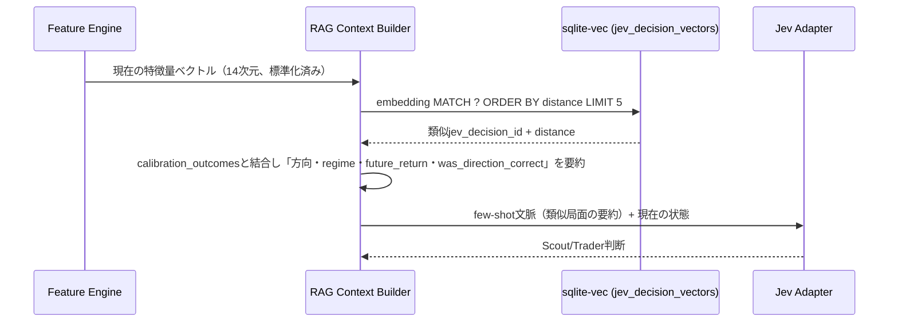
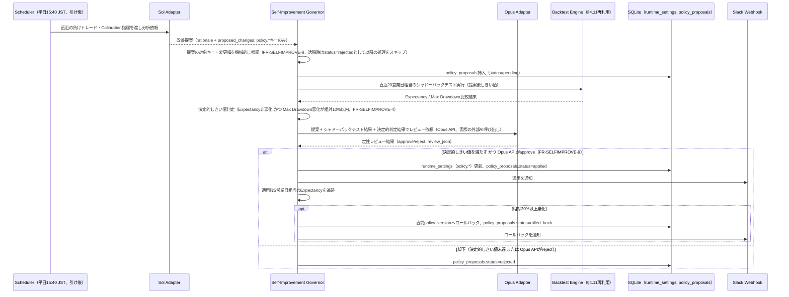
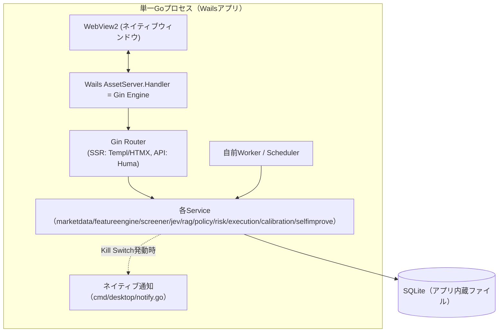
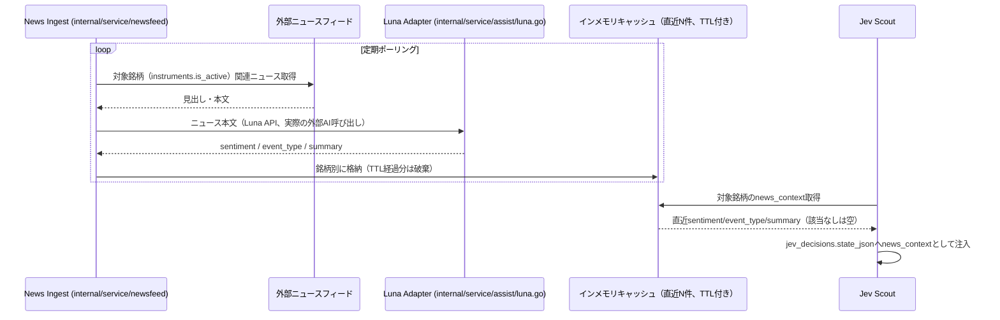

# アーキテクチャ設計: 外部・内部連携（§5〜§9・§12〜§13）

`docs/architecture/overview.md` から分割した章。§5 kabuステーションAPI連携 / §6 Jev API連携 / §7 RAG連携 / §8 自己改善ループ / §9 Wails統合 / §12 System Activity Feed連携 / §13 Luna ニュース分類・News Ingest連携。節番号は分割前と同一で、コードコメント等の `overview.md §<番号>` は本ファイルの同番号の節を指す。

## 5. kabuステーションAPI連携

- kabuステーションは三菱UFJ eスマート証券（旧auカブコム証券）が提供するWindows常駐アプリで、`http://localhost:18080`（既定）にローカルRESTを公開する。Go側の `internal/service/marketdata` はこれをHTTPクライアントでラップする
- **トークン発行**: アプリ起動時に `/kabusapi/token` へAPIパスワードでPOSTしトークンを取得。トークンは有効期限があるため、Wailsアプリ起動時および定期的に再発行し、メモリ上にのみ保持する（ディスクへは保存しない）
- **銘柄登録・PUSH購読**: スキャン対象銘柄をkabuステーションAPIの銘柄登録エンドポイントに登録し、価格・板情報はPUSH WebSocket（kabuステーションが提供するローカルWebSocket）で受信する。これによりREST側の60秒ポーリングに依存せず、Feature Engineが各サイクル開始時点の最新スナップショットを参照できるようにする。実装（`bootstrap.Services.Start` → `pushfeed.Feed.Run`（`internal/service/pushfeed`））は起動時（およびPUSH切断後の再接続時）にアクティブな`stock`銘柄を最大50件（kabuステーションAPIの登録上限）登録してPUSHを購読し、直近30秒以内のPUSH板があれば`market-data`ジョブはそれを使い、無ければREST `GetBoard`へフォールバックする。上限超過分・PUSH未着の銘柄はRESTポーリングのみで取得する。現在値が0/未取得の板（寄り付き前・未約定）は価格欠損として扱い、`market-data`ジョブは失敗させ（スナップショットを永続化しない）、保有ポジション監視は当該銘柄をスキップする。`execution.Engine`の`OnSnapshot`/`TryFillPending`/`Close`も0以下の価格を`ErrInvalidPrice`で拒否する
- **発注**: Paper Trading中はExecutionサービス内でシミュレーションのみ行い、kabuステーションAPIへは発注しない。Phase 7（実売買移行）で初めてkabuステーションAPIの注文エンドポイントを呼び出す。それまでは`KABU_API_PASSWORD`（単一キー）は市場データ読み取り専用であり、Production用とPaper Trading用のキー・Base URLの分離（`requirements/non-functional.md` §4）はPhase 7で注文エンドポイントを実装する前に行う
- **異常時**: kabuステーションAPI無応答・エラー時は該当銘柄を stale data 判定し新規取引を禁止する（`requirements/functional.md` にある障害対応方針と整合）
- **認証情報の入力経路**: `APIPassword`は`.env`/環境変数ではなく、アプリ内のSettings画面（`/settings`）から入力し、`secrets`テーブル（`internal/repository.SecretsRepository`、AES-256-GCMで暗号化）にDB保存する（issue #57）。必須3キー（JEV_API_KEY/JEV_BASE_URL/KABU_API_PASSWORD）が未設定でもアプリは起動するが、Setup Guard（§10.5）が全ページを`/setup`へ誘導する。Jev/kabuステーションAPI依存機能はエラーログを出しつつ動作を継続する。入力はキー単位で保存・削除する（`POST`/`DELETE /settings/:key`、`internal/config`のallow-list外のキーは400）ため、あるキーの操作が他キーの値に影響することはない（issue #79）。設定変更はアプリ再起動後に反映される（ホットリロードは範囲外）

## 6. Jev API連携

- Jevアダプタ（`internal/service/jev`）はAPIキーをGoプロセス内のみで保持し、HTTP経由でJev APIを呼び出す
- Scout/Traderそれぞれの質問セット（`requirements/functional.md` §4.4, §4.5）をリクエストスキーマ（`schemas.go`）として定義し、レスポンスをdomainモデルへマッピングする
- `prompt_version.go` でプロンプト/質問セットのバージョンを管理し、`jev_decisions.question_version` に記録する（`architecture/er.md` 参照）
- 失敗時は1回目リトライ、2回目以降exponential backoff、継続失敗でnew entry停止。既存ポジションはRisk Engine/Executionのコードベースルールで管理を継続する
- **認証情報の入力経路**: `APIKey`/`BaseURL`は§5と同じくSettings画面（`/settings`）経由でDB保存する（issue #57）。詳細は§5「認証情報の入力経路」参照

## 7. RAG連携（経験ベース文脈拡張）

`requirements/functional.md` §4.13 の実装詳細。

- 埋め込みはLLM API呼び出しを伴わない標準化済み数値特徴量ベクトル（14次元、`architecture/er.md` ベクトルインデックス節参照）。追加のAPIコスト・レイテンシは発生しない（FR-RAG-3）
- `market_snapshots`保存時・`jev_decisions`保存時にそれぞれ`market_snapshot_vectors`/`jev_decision_vectors`（sqlite-vec仮想テーブル）へ同期書き込みする
- コールドスタート期間（該当データが少ない）は空の検索結果として扱い、Jevは通常通り判断する（FR-RAG-4）

## 8. 自己改善ループ（Sol / Opus 連携）

`requirements/functional.md` §4.14 の実装詳細。Sol/Opusは高頻度の売買判断ループ（§4, §9）とは別の低頻度バッチとして動作し、Policy Engineのしきい値のみを対象に自己改善する。

- Solが変更を提案できる対象は`runtime_settings`の`policy.*`キーに限定する。`risk.*`キーとJevの`prompt_version`は`selfimprove`サービスに書き込みAPIそのものを持たせないことで技術的に強制する（§1 設計方針）
- Luna（Sense）は本ループとは独立し、高頻度側（Feature Engine/Jev呼び出しの前段）でニュース分類等を提供する補助コンポーネントとして`internal/service/assist/luna.go`に実装する
- **外部AI API契約（`internal/service/assist`）**: いずれも`POST {BASE_URL}<path>`（`Authorization: Bearer {API_KEY}`、JSON、200以外はエラー扱い）。Sol `/v1/analyze`（リクエスト: 方向別`thresholds`/`calibration`と`constraints`、レスポンス: `{"rationale":{...},"proposed_changes":[{"key","new_value"}]}`。変更なしは空配列）、Opus `/v1/review`（リクエスト: `proposal`/`backtest`/`deterministic`、レスポンス: `{"verdict":"approve|reject","reason":"..."}`）。決定的しきい値を満たさない提案ではOpus APIを呼ばずに却下する。`policy_proposals.review_json`は`verdict`/`approved`/`deterministic_passed`/`llm_reviewed`/`reason`等を含む。
- 未処理（`pending`）の提案がある日は、Opusレビューの再試行のみ行い新規のSol分析は行わない（同一しきい値への提案の競合防止）
- Sol/Opusはいずれも`internal/service/assist`のHTTPクライアントを介し、Jevアダプタ（§6）と同様の認証情報の入力経路（Settings画面→`secrets`テーブル、`SOL_API_KEY`/`SOL_BASE_URL`、`OPUS_API_KEY`/`OPUS_BASE_URL`）とリトライ/exponential backoff方針に従う実際の外部AI API呼び出しとして実装する。API失敗時は当該日のSol提案生成/Opusレビューをスキップし、Slack通知のうえ翌営業日に再試行する（銘柄単位の売買判断ではないためnew entry停止のような取引影響は発生しない）

## 9. Wails統合（デスクトップシェル）

- Wails v2 の `options.App.AssetServer.Handler` に Gin の `http.Handler` をそのまま渡し、WebViewは常に `http://wails.localhost/` 相当の内部プロトコル経由でGinが返すHTML/HTMXフラグメント/静的アセットを描画する。外部ネットワークポートを開かない（`requirements/non-functional.md` §4 セキュリティに整合）
- Risk EngineがKill Switchを発動した際は、同一プロセス内であるためネットワーク越しの通知APIを介さず、`cmd/desktop/notify.go`の`App`（`risk.Notifier`実装）が直接Wailsランタイム（`runtime.SendNotification` / `runtime.EventsEmit`）を呼び出してOSレベルのトースト通知とウィンドウ内インジケータ用イベントを発生させる。OSシステムトレイのアイコン変化は未対応（Wails v2にトレイAPIが無く、Wails v3または外部systrayが必要）
- Windowsログイン時の自動起動とクラッシュ時の自動再起動は、インストーラーがスタートアップフォルダへ作成する`pitha-trador.exe --supervise`のショートカットで実現する。`--supervise`付きで起動したプロセスは`internal/supervisor`により自身（`--supervise`なし）を子プロセスとして起動・監視し、非0終了/killでは指数バックオフ付きで再起動、終了コード0（操作者の終了・自動更新）では監視を終了する。ログはWailsアプリと同じ日次JSONログへ追記する（`requirements/non-functional.md` §3）
- SQLiteファイルはWailsアプリの起動時に存在確認・マイグレーション適用を行う。Postgresのような別プロセスの起動待ち合わせは不要
- 将来ヘッドレス運用（例: CI・テスト環境）が必要な場合に備え、`cmd/desktop`とは別に`cmd/server`（Wailsを使わずGinのみを`net/http`でリッスンするエントリーポイント）を用意できるよう、`internal/router`はWailsに依存しない形で実装する
- 自動アップデート（`internal/service/updater`、`cmd/desktop`のみ）は検知結果を`Checker.Status()`（最終確認時刻・新バージョン有無・安全ゲート保留・インストーラー準備済み・直近エラー）として保持し、`bootstrap.Services.Updater`→`router.WithUpdateController`経由でHandlerへ渡す。UIはHeaderの`UpdateBanner`で新バージョンと保留状態を通知し、Settings画面の「今すぐアップデートを確認」（`POST /system/update-check`）でスケジューラーと同じ`CheckForUpdate`を手動実行できる。`CheckForUpdate`は排他制御され、周期実行と手動実行が同時にインストーラーをダウンロード/終了要求することはない。`cmd/server`はアップデーター未搭載のためバナー/パネルは空、確認ルートは404（issue #76）。取得経路はリクエストごとの`context`タイムアウト（リリース確認30秒・ダウンロード全体10分）、ダウンロードサイズ上限（インストーラー512MiB・`checksums.txt`1MiB、GitHubの`asset.size`報告値があればそれに厳格化）、`browser_download_url`が`https://github.com/<owner>/<repo>/releases/download/`配下であることの検証で保護する（issue #126）。`checksums.txt`はインストーラーと同一リリース由来のため転送破損の検知に留まり、リリース差し替えへの真正性検証（コード署名・分離署名）は未実装の既知制約
- `config/strategy.yaml`・`config/risk.yaml`・`/static/...`で配信する静的アセット（`static/src/dist`のesbuild/Tailwindビルド出力＋`static/src/vendor`のhtmx.min.js）は、いずれも`go:embed`でバイナリに埋め込み、`wails build`/`go build ./cmd/server`が生成する単一`.exe`だけで（外部ファイル・ソースツリー一切無しに）起動できる。config 2種は`internal/bootstrap.Run`が (1) 明示パス指定 (2) `PITHA_STRATEGY_PATH`/`PITHA_RISK_PATH`環境変数 (3) 実行ファイルと同じディレクトリの`config/*.yaml`（`os.Executable()`基準。配布先で手編集する運用向け） (4) 埋め込み既定値、の優先順位で解決する（issue #59）。静的アセットは`internal/router.New`が常に埋め込みから配信する
- `make dev`実行時は`Makefile`が`PITHA_STRATEGY_PATH`/`PITHA_RISK_PATH`をリポジトリ内の生ファイルへ設定するため、上記(2)が常に選ばれ、`config/risk.yaml`等を編集して再起動すれば即座に反映される（埋め込みはコンパイル時スナップショットのため、(4)経由では反映されない）

## 12. System Activity Feed連携

`requirements/functional.md` §4.15/§5.5の実装詳細。既存テーブル（`jobs`, `jev_decisions`, `kill_switch_events`）への読み取り専用集約であり、新規の永続テーブル・マイグレーションは追加しない。

- `internal/service/activityfeed`が`internal/repository`の`job_repo`/`decision_repo`/`killswitch_repo`を横断的に参照し、キュー別集計（pending/running/直近failed件数）と時刻順マージ済みイベント一覧を組み立てる
- `internal/web/handler`に`activity.go`を追加し、`GET /api/v1/activity`（`api/endpoints.md` §5）と`/ws/activity`（同§6）を提供する
- 新規イベント（`jobs`の状態遷移、`jev_decisions`挿入、`kill_switch_events`挿入）はrepository層のコミット直後にactivityfeedのイベントバス（プロセス内channel、DB永続化なし）へ通知し、`/ws/activity`購読者へ配信する。プロセス再起動時はイベントバスの未配信分は破棄され、次回`GET /api/v1/activity`のスナップショットから再開する（監査要件はjobs/jev_decisions/kill_switch_events自体が引き続き担う）
- フィード件数上限（既定200、最大500）はAPI/WS配信側の制限であり、参照元テーブルの保持期間・行数（`architecture/er.md`各テーブルの運用注記）には影響しない

## 13. Luna ニュース分類・News Ingest連携

`requirements/functional.md` §4.16（FR-LUNA-1〜5）の実装詳細。

- 永続化は`jev_decisions.state_json`（既存カラム）のみを利用し、新規テーブル・マイグレーションは追加しない（キャッシュはプロセスメモリ内のみでDB非永続）
- **認証情報の入力経路**: `LUNA_API_KEY`/`LUNA_BASE_URL`、`NEWS_FEED_URL`/`NEWS_FEED_API_KEY`は§5・§6と同じくSettings画面（`/settings`）経由で`secrets`テーブルへ保存する
- **外部API契約**: ニュースフィードは`GET {NEWS_FEED_URL}?symbol={銘柄コード}`（`Authorization: Bearer {NEWS_FEED_API_KEY}`）で`{"items":[{"id","headline","body","published_at"}]}`を返す。Lunaは`POST {LUNA_BASE_URL}/v1/classify`（リクエスト: `symbol`/`headline`/`body`/`published_at`、レスポンス: `{"sentiment":"bullish|bearish|neutral","event_type":"決算|業績修正|M&A|規制|その他","summary":"..."}`）。値域外の応答は失敗として扱う
- News Ingestは1分周期でポーリングし、記事ID（無ければ見出し）単位で重複排除して1件ずつLunaへ送信する。キャッシュは銘柄ごと直近5件・TTL 6時間（公開時刻基準）。新規に分類された記事は銘柄単位のニュースフラグを立て、Fast Screener候補であればイベント再評価（FR-SCAN-1）で1回だけ消費される
- LUNA/NEWS_FEEDのどちらかが未設定の間はNews Ingestを起動しない（`news_context`は注入されずニュースフラグも立たない）。SOL/OPUS未設定時は各段階を毎日スキップする
- Luna/News Ingest API失敗時はニュースフラグを立てず、Fast Screener/Jevの通常フローに影響を与えない（FR-LUNA-4、Jevと同様のフェイルセーフ）
