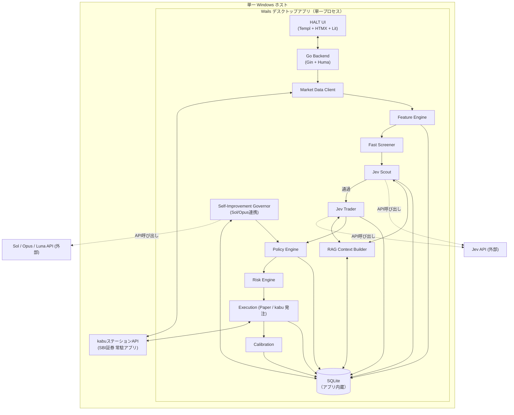

# プロジェクト概要

## 目的

日本株（東証上場銘柄）を対象に、短期売買候補を継続的にスキャンし、Jev（LLM 判断レイヤー）を用いて売買方向・モメンタム品質・流動性・異常フローを評価するトレーディング支援アプリを構築する。全銘柄を LLM で逐次分析するのではなく、コードベースの高速フィルターで候補を絞り込んだ後に Jev へ構造化された市場状態を渡すことで、API コストとレイテンシを抑えつつ意思決定品質を担保する。初期フェーズでは実売買を行わず、Paper Trading で有効性を検証する。

## 背景

短期売買は判断すべき変数（価格・出来高・板・モメンタム・相場環境）が多く、ルールベースだけでは相場状態の質的判断（トレンドかレンジか、フローが有害か等）が難しい。一方で LLM に売買システム全体を委任すると、価格計算やポジションサイジングのような機械的に正しく計算できる領域まで不安定な判断に晒されるリスクがある。

本プロジェクトは「計算可能な値はコードが計算し、Jev は解釈のみを担当し、Risk Engine が最終拒否権を持つ」という役割分離を前提に設計する。開発者本人が個人の自己資金で運用することを前提とし、まず「Jev を通した銘柄群は通していない銘柄群より将来リターン分布が改善するか」を検証することを最初の成功基準とする。

## スコープ

### 含むもの

- 東証上場銘柄・1 分足を基本時間軸とした市場データ取得（kabu ステーション API 経由）
- Feature Engine による価格・VWAP・出来高・ボラティリティ・板/約定・市場コンテキスト特徴量の算出
- Fast Screener による段階的候補絞り込み（全銘柄 → 50〜200 → Jev Scout）
- Jev Scout（深掘り価値判定）・Jev Trader（方向・レジーム・エントリー品質判定）
- Policy Engine（Jev 出力 → 取引候補への変換）・Risk Engine（ポジションサイズ／損失上限／Kill Switch）
- Paper Trading による Entry/Exit・ポジション管理・PnL 集計
- Jev 判断と将来値動きの紐付け・Calibration（Brier Score 等）
- Wails によるネイティブデスクトップアプリ化（Scanner Dashboard・Symbol Detail・Performance・Calibration 画面）
- Jev RAG（過去の類似局面を sqlite-vec で検索し Jev への文脈として注入）による判断品質の継続的な底上げ
- Sol（振り返り分析）・Opus（改善提案レビュー）による Policy Engine しきい値の自己改善ループ（Risk Engine のリミット値は対象外）
- 短期モメンタム・出来高急増・ブレイクアウト・VWAP 乖離継続/反転の 4 戦略

### 含まないもの

- HFT レベルのマイクロ秒売買
- 完全自律型の資金運用（Risk Engine を経由しない発注。Phase 7 の実売買も Risk Engine 経由であれば人手承認なしの自動運用を許容する）
- AI（Jev/Sol/Opus）による Risk Engine のリミット値そのものの変更（Policy Engine しきい値の自己改善は対象内）
- Jev の confidence をそのまま実勝率として扱うこと
- 最初から全資金を投入した Live Trading
- LLM への価格計算・ポジションサイズ計算の委任
- 平均回帰・ニュースイベント・ペアトレード等の追加戦略（後続フェーズ）
- 日跨ぎポジション（原則として保有しない）
- 第三者資金の運用・金融商品取引業登録を前提とした機能（個人の自己資金運用のみを前提）

## ステークホルダー / 想定ユーザー

| 区分 | 役割 | 備考 |
|------|------|------|
| エンドユーザー（個人トレーダー） | アプリを操作し Paper Trading／将来の小口 Live を行う | 開発者本人。単一ユーザー・単一 Windows ホストを前提 |
| 運用者（開発者兼任） | システムの監視・Kill Switch 対応・Calibration に基づくポリシー調整 | エンドユーザーと同一人物。ログ + Slack Webhook で異常を検知する |

## システム全体像

詳細なコンポーネント構成・レイヤー構造は `architecture/overview.md`、フロントエンド（HALT/Wails）詳細は `components/overview.md` を参照。

## ドキュメントマップ

このプロジェクトの仕様は以下のドキュメントで構成される。実装時はそれぞれ参照すること。

| ドキュメント | パス | 概要 |
|------------|------|------|
| 機能要件 | `docs/requirements/functional.md` | スキャン〜Jev判定〜Policy/Risk〜Paper執行〜Calibrationのユースケースと画面別機能一覧 |
| 非機能要件 | `docs/requirements/non-functional.md` | 性能・可用性(24/365目標)・セキュリティ・監視(ログ+Slack)・コンプライアンス前提 |
| アーキテクチャ設計 | `docs/architecture/overview.md` | Go レイヤードアーキテクチャ、kabuステーションAPI/RAG/自己改善ループ連携、Wails単一プロセス構成、SQLite上の自前Scheduler/Worker設計 |
| ER / データモデル | `docs/architecture/er.md` | instruments/market_snapshots/jev_decisions/trade_signals/paper_orders/positions/calibration_outcomes/kill_switch_events/runtime_settings/policy_proposals/jobs のSQLiteテーブル定義とsqlite-vecベクトルインデックス |
| API 仕様 | `docs/api/endpoints.md` | Huma JSON API（/api/v1/...）と HTMX ページ/アクションルートの仕様 |
| コンポーネント設計 | `docs/components/overview.md` | HALT（HTMX+Atomic+Lit+Templ）構成、Wails統合、Lit Web Components（チャート/Scannerテーブル等） |

## マイルストーン / リリース計画

具体的な日付は未定。フェーズ順序を計画とする（詳細は `requirements/functional.md` の MVP フェーズ節を参照）。

- Phase 0: Data — 市場データ取得（kabuステーションAPI接続）、1分足保存、Feature Engine構築
- Phase 1: Scanner — Fast Screener、Scanner Dashboard、Top候補表示
- Phase 2: Jev Scout — Jev API接続、Scout Questions実装、Decision Log保存
- Phase 3: Jev Trader — LONG/SHORT/NONE判定、Policy Engine
- Phase 4: Paper Trading — Entry/Exit、Position管理、Paper約定、PnL
- Phase 5: Calibration — Outcome Labeling、Confidence bucket分析、Brier/Log Loss、RAG用embedding索引構築
- Phase 6: Continuous Loop — Event-driven refresh、Open position monitoring、Kill Switch、Alert、Sol/Opusによる自己改善ループ
- Phase 7: Small Live — 十分な検証後、法令・証券会社API規約を確認した上でごく小さなサイズから検討

## 用語集

| 用語 | 定義 |
|------|------|
| Jev | 構造化された市場状態を入力に、choice/score/yes-no 型の判断を返す外部 LLM 判断レイヤー |
| Jev Scout | 大量の候補銘柄から「今深掘りする価値があるか」を高速判定するJev呼び出し |
| Jev Trader | Scout通過銘柄に対し方向（LONG/SHORT/NONE）・レジーム・エントリー品質等を判定するJev呼び出し |
| Fast Screener | Jev呼び出し前に、価格・流動性・出来高・ボラティリティ条件で機械的に対象外銘柄を除外する処理 |
| Feature Engine | 市場データから価格・VWAP・出来高・ボラティリティ・板/約定・市場コンテキスト特徴量を算出する処理 |
| Policy Engine | Jev出力を実際の取引候補（トレードシグナル）に変換するルールエンジン |
| Risk Engine | ポジションサイズ・損失上限・取引禁止条件を強制し、Jevより優先される最終拒否権を持つ処理 |
| Regime | Jev Traderが判定する相場状態（TREND / RANGE / BREAKOUT / CHAOTIC） |
| Toxic Flow | 現在の板/約定フローがエントリーに対して不利・不安定であることを示す指標 |
| Calibration | Jevのconfidence/probabilityと実際の市場結果の対応関係を検証するプロセス（Brier Score等） |
| kabuステーションAPI | SBI証券が提供する、Windows常駐アプリ経由のローカルREST API。市場データ取得・発注に使用 |
| HALT | HTMX + Atomic Design + Lit + Templ によるサーバー内蔵型フロントエンドアーキテクチャ |
| Wails | Goバックエンドと Web 技術によるUIを単一のネイティブデスクトップアプリとしてパッケージするフレームワーク |
| Paper Trading | 実資金を用いず注文・約定を模擬する検証運用 |
| VWAP | Volume Weighted Average Price（出来高加重平均価格） |
| ATR | Average True Range（平均真の値幅、ボラティリティ指標） |
| RAG | Retrieval-Augmented Generation。過去の類似局面をsqlite-vecで検索しJevへのfew-shot文脈として注入する仕組み |
| sqlite-vec | SQLite上でベクトル類似検索を行う拡張（`vec0`仮想テーブル）。pgvectorのSQLite版に相当 |
| Luna | ニュース分類・決算要約等を担うリアルタイム補助レイヤー（Sense） |
| Sol | 負けトレード・Calibration指標を分析しPolicy Engineしきい値の改善提案を生成するレイヤー（Think） |
| Opus | Solの改善提案をシャドーバックテストで検証し承認/却下するレイヤー（Govern） |
| dead-man's switch | 操作者のUI操作（ハートビート）が一定時間途絶した場合に新規エントリーを自動停止する安全機構（Live専用） |
| SQLite | アプリに内蔵される単一ファイルDB。Wailsの単一実行ファイル配布に合わせ採用（外部DBサービス常駐が不要） |

## 改訂履歴

| 版 | 日付 | 変更内容 | 変更理由 |
|----|------|---------|---------|
| 1.0 | 2026-09-26 | 新規作成 | 初版 |
| 1.1 | 2026-09-26 | RAG（sqlite-vec）・自己改善ループ（Sol/Opus）を追加、DBをPostgreSQLからSQLiteへ全面移行、Phase 7完全自動運用（dead-man's switch）に対応 | Phase 5/6/7の方針拡張とWails単一exe配布との整合 |
