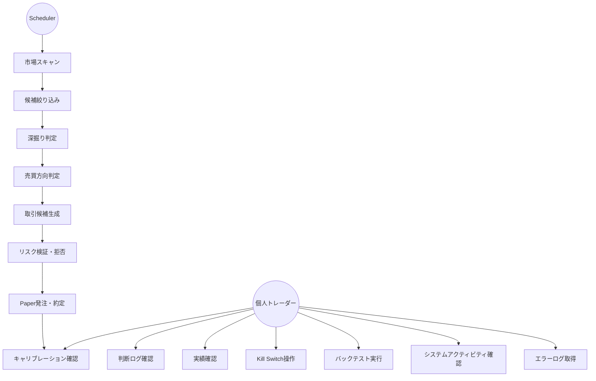
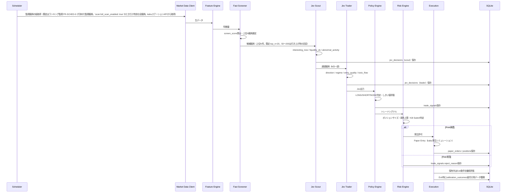
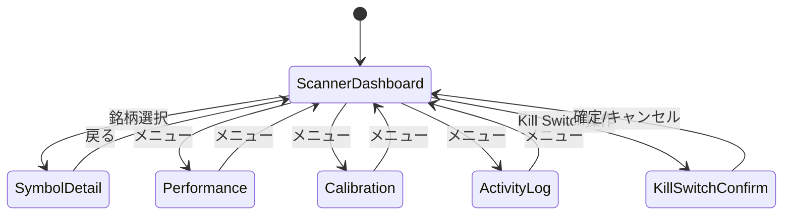

# 機能要件

## 1. ユースケース一覧

| ID | ユースケース | 主アクター | 概要 |
|----|------------|-----------|------|
| UC-1 | 市場スキャン | Scheduler | 監視銘柄（既定のランキング監視。`scan.full_scan_enabled: true`のときだけ全銘柄）を周期的にスキャンし、特徴量を算出する |
| UC-2 | 候補絞り込み | Fast Screener | 数値条件・スコアで候補銘柄を機械的に絞り込む |
| UC-3 | 深掘り判定 | Jev Scout | 候補銘柄が今分析する価値があるかを判定する |
| UC-4 | 売買方向判定 | Jev Trader | Scout通過銘柄の方向・レジーム・エントリー品質を判定する |
| UC-5 | 取引候補生成 | Policy Engine | Jev出力をルールでトレードシグナルへ変換する |
| UC-6 | リスク検証・拒否 | Risk Engine | ポジションサイズ・損失上限・取引禁止条件を強制する |
| UC-7 | Paper発注・約定 | Execution | Paper Entry/Exitを実行し、ポジション・PnLを更新する |
| UC-8 | 判断ログ確認 | 個人トレーダー | Symbol Detail画面でJevの判断根拠・履歴を確認する |
| UC-9 | 実績確認 | 個人トレーダー | Performance画面でPnL・勝率・期待値等を確認する |
| UC-10 | キャリブレーション確認 | 個人トレーダー | Calibration画面でconfidence帯別の的中率・平均リターンを確認する |
| UC-11 | Kill Switch操作 | 個人トレーダー | UIまたはサーバーから新規取引停止・強制決済を行う |
| UC-12 | バックテスト実行 | 個人トレーダー | Paper Trading開始前に過去データで戦略を検証する |
| UC-13 | システムアクティビティ確認 | 個人トレーダー | Log画面でジョブキュー実行状況・直近のJev呼び出し・Kill Switch関連イベントをリアルタイムに確認する |
| UC-14 | 環境設定 | 個人トレーダー | Settings画面でJev/ブローカー（kabuステーション・立花証券。`broker.provider`で1つを選択）/Slack/Luna/Sol/Opus/ニュースフィードの認証情報をキー単位で保存・削除する |
| UC-15 | 初回セットアップ | 個人トレーダー | 選択したブローカーの必須認証情報（既定のkabuなら`KABU_API_PASSWORD`）とJevが未設定のとき、Setup画面へ誘導され、入力を完了してから通常画面へ進む |
| UC-16 | エラーログ取得 | 個人トレーダー（運用者） | Settings画面から期間・レベルを指定してエラーログをダウンロードし、調査・共有に使う |

## 2. 主要処理フロー

## 3. 対象市場とスコープ

- 対象: 東証上場銘柄、現物またはPaper Trading
- 市場データ・ブローカー: 1プロセスで1つを選ぶ（kabuステーションAPI＝既定・フォールバック、立花証券・e支店API。FR-BROKER-1・2）。対象銘柄は両ブローカーとも東証上場銘柄で、立花証券はランキング・歩み値が無い。本システムは市況データの読み取りのみで、発注は#55まで行わない（`architecture/overview/integrations.md` §5）
- 基本時間軸: 1分足
- MVP戦略: 短期モメンタム / 出来高急増 / ブレイクアウト / VWAP乖離からの継続・反転
- 想定保有時間: 最短数分、基本5〜15分（短い保有で小さなエッジを積み上げることを「勝ち」とする。FR-CAL-5）、原則として日跨ぎしない

## 4. コンポーネント別機能要件

§4は `.linterly.yml` の300行/ファイル制限のため別ファイルに分割している（節番号・FR-ID・内容は分割前と同一）。

| 節 | ファイル |
|----|----------|
| §4.1〜§4.9（Feature Engine〜状態管理） | `docs/requirements/functional/components-pipeline.md` |
| §4.10〜§4.20（Scheduler/Worker〜エラーログのダウンロード・ブローカー選択と立花証券の運用） | `docs/requirements/functional/components-platform.md` |

## 5. 画面別機能（Wails デスクトップアプリ）

### 5.1 Scanner Dashboard

表示項目: Symbol, Price, 1m/5m Return（パーセント表示。Feature Engineの小数比を×100）, Volume Ratio, VWAP距離, Spread, Jev Direction, Jev Confidence, Entry Quality, Current Position。Jev Direction/Confidence/Entry Qualityは当該銘柄の最新Jev Trader判断（`decision_type=trader`の`timestamp`・`id`最大の1行。件数窓・経過時間の上限は設けず、Scout行が続いても古くても採用し、Symbol Detailの Jev判定パネル・`GET /api/v1/symbols/{symbol}`・`/ws/symbols/{symbol}`・Exit評価と同一定義。古い判断の扱いに上限期間は定めていない）、Current Positionは保有中ポジションの符号付き数量（LONG正/SHORT負。保有なしは空）で、候補更新サイクルごとに`internal/bootstrap/candidates`が設定する（Trader判断が未生成の銘柄は空＝判定待ち）。候補銘柄更新周期（15〜30秒）に応じてライブ更新する。

候補表の上に**スキャン状況パネル**を置く（issue #303。動作確認・「なぜこの銘柄が候補に出ないか」の調査用）:

- FR-SCAN-3: 最新サイクルの**ファネル件数**（ユニバース → 特徴量算出 → Fast Screener通過 → Scout通過）と、最終サイクルの時刻・所要時間を表示する。Scout通過は候補に対するJev Scoutの判定が済んだ分までの件数（判定済み件数も併記）。「ユニバース」はスキャン対象の銘柄数で、既定のランキング監視（FR-SCHED-9）では監視銘柄（最大45）、`scan.full_scan_enabled: true`のときだけ有効な`stock`の全件（最大約4,000）になる。パネルのラベル・ツールチップにもこの旨を示す
- FR-SCAN-4: 「スキャン対象を見る」で、ユニバース（FR-SCAN-3。`scan.full_scan_enabled: true`のときは有効な`stock`の全件・最大約4,000。既定のランキング監視ではFR-SCHED-9の監視銘柄（最大45）で、監視外の銘柄は一覧に現れず、その除外理由も付かない）のコード・名称・市場・状態（通過/除外/データ欠損）・理由・Scout結果を一覧する。検索（コード/名称）、状態・理由での絞り込み、ページング（既定50件・最大200件）を備え、1回に描画する行数を抑える
- FR-SCAN-5: 除外は落ちた条件（FR-FS-1の閾値名＋上位N件の外）を、欠損は取得できなかった値（板情報なし・履歴不足（FR-FE-5）・市況データ未取得）に加え、立会中に最新の足が古すぎる市況データ（`stale_snapshot`。ランキング監視では`domain.MaxSnapshotAge`の3分超、`scan.full_scan_enabled: true`では全件RESTが1周約8分かかるため`scan.full_scan_max_snapshot_age_seconds`（同梱620秒）超。FR-SCAN-7/FR-SCHED-9）を、理由コードと人が読めるラベルで示す。`stale_snapshot`のラベルは閾値がモード別のため秒数を含めず「許容経過時間を超過」と表し、実際の閾値は上記の設定値で確認する（Scanner行・理由フィルタ・`GET /api/v1/scanner/scan`・CSVで同一文言。issue #690/#691）。全フィルターを評価し複数の理由を併記する
  - `scan.full_scan_enabled: true`では各銘柄の足が約8分間隔のため、`stale_snapshot`の許容（同梱620秒）を通過しても短窓の履歴ベース特徴量が全銘柄で履歴不足（FR-FE-5）の欠損となり、`missing_return_5m`・`missing_volume_ratio`・`missing_realized_vol`等で全銘柄が外れて候補は空のままになる（620秒が緩めるのは最新の足の鮮度判定だけ。FR-SCHED-7・issue #693）
- FR-SCAN-6: 結果は**開いた時点のスナップショット**で、「更新」ボタン・絞り込み・ページ送りで再取得する（`/ws/scanner`には流さず、その挙動は変えない）。保持は最新1サイクル分のメモリ上のみで、再起動後・初回サイクル完了前は「まだスキャンサイクルが実行されていません」の空状態を表示する
- FR-SCAN-7: 東証の立会時間外（土日・祝日・年末年始休場・昼休み・9:00前/15:30後。判定は`marketcalendar`、`non-functional.md` §3）は、スキャン状況パネルの先頭に「現在は東証の立会時間外のため、市場データ取得・フルスキャン・Jev Scoutは停止中です。表示は保存済みデータに基づきます」旨の停止通知（`data-testid="scan-offhours"`）を、サイクル未実行の空状態・サイクルありの双方で表示し、次回の立会開始時刻（JST。前場9:00／後場12:30、土日・祝日・年末年始をスキップ）を併記する。立会時間中は表示しない。「更新」ボタンは立会時間外でも無効化せず、押下すると保存済みデータを再取得して同じ通知を再描画する（新規スキャンは走らない）。既定のランキング監視でも、立会時間外・昼休みの候補リストとスキャン対象の一覧は直前の立会時間内サイクルの監視リスト（＋保有・注文中）を保存済みデータで評価して表示し続ける（FR-SCHED-9。PUSH登録・`market-data`投入は保有・注文中の銘柄だけに停止する。プロセス再起動直後の立会時間外は直前のリストが無いため保有・注文中の銘柄だけ）。立会再開直後は、保存済みの最新の足が`domain.MaxSnapshotAge`（3分。市況コンテキストの指数バーの許容と同じ。立会時間外は判定しない）より古い銘柄（`scan.full_scan_enabled: true`では、各銘柄の足は全件RESTの1周（約8分）に1回しか更新されないため、3分ではなく`scan.full_scan_max_snapshot_age_seconds`＝1周＋次サイクルの待ち・余裕、同梱620秒を超えたものとする。issue #686）を、一覧には残したまま`stale_snapshot`（欠損）で除外しJev Scoutへ投入しない。保持した監視リストの銘柄も、`market-data`が新しい足を書くまで評価しない（issue #685）。通知はスキャン状況パネルに限り、全ページ共通のバナーにはしない
  - 上記の`scan.full_scan_max_snapshot_age_seconds`は`stale_snapshot`（最新の足の鮮度）だけの許容で、全件スキャンの履歴ベース特徴量の欠損（FR-SCHED-7・FR-FE-5）は解消しない
- FR-SCAN-8: 有効な`stock`が1件も無い（銘柄マスタ未投入）間、スキャン状況パネルは「まだスキャンサイクルが実行されていません」の代わりに「銘柄マスタが未投入です」の案内（`data-testid="scan-universe-empty"`）を表示し、銘柄マスタCSVの置き場所（`PITHA_UNIVERSE_PATH`／実行ファイルと同じディレクトリの`config/universe.csv`）と、JPXの東証上場銘柄一覧（`data_j.xlsx`）を取得して投入する選択肢を示す。取得は運用者が「JPXから取得して投入する」を押した場合に限り1回だけ行い（起動時・定期の自動取得はしない）、株式のみをCSVと同じ検証で投入して再起動なしで次のスキャンサイクルから対象にする。失敗（ネットワーク・HTTPエラー・形式変更・保存失敗）はマスタを変更せず、失敗種別ごとの固定文言とCSV投入の案内を表示する（下位エラーは画面に出さず`slog`のみに記録する。issue #700）。有効な`stock`があるときは案内も取得も提供しない（`environment/setup.md`「銘柄マスタの投入」）

### 5.2 Symbol Detail

チャート（Price/VWAP/Volume）、Jev判定（Direction/Confidence/Regime/Entry Quality/Toxic Flow/Liquidity Stress）、Risk（Allowed Position/Stop/Take Profit）、Decision historyを表示する。

### 5.3 Performance

Total PnL, Daily PnL, Win Rate, Profit Factor, Expectancy, Max Drawdown, Average Hold Time, Sharpe/Sortino参考値, Signal countを表示する。

### 5.4 Calibration

confidence帯（0.50-0.60 〜 0.90-1.00）ごとの実方向一致率、平均future returnを表示する。

### 5.5 System Activity Log

表示項目: キュー別（6キュー）の`pending`/`running`/直近`failed`件数、直近アクティビティ一覧（時刻・種別 [job/jev_scout/jev_trader/kill_switch/news_feed]・対象銘柄・詳細・latency_ms）、直近Kill Switchイベント。キュー種別・イベント種別でフィルタ可能とする。新規イベント発生に応じて`/ws/activity`経由でライブ更新する（§4.15）。

## 6. MVPフェーズ

| Phase | 内容 |
|-------|------|
| Phase 0: Data | 市場データ取得（kabuステーションAPI）、1分足保存、Feature Engine構築 |
| Phase 1: Scanner | Fast Screener、Scanner Dashboard、Top候補表示 |
| Phase 2: Jev Scout | Jev API接続、Scout Questions実装、Decision Log保存 |
| Phase 3: Jev Trader | LONG/SHORT/NONE判定、Policy Engine |
| Phase 4: Paper Trading | Entry/Exit、Position管理、Paper約定、PnL |
| Phase 5: Calibration | Outcome Labeling、Confidence bucket分析、Brier/Log Loss、RAG用embedding索引構築（§4.13） |
| Phase 6: Continuous Loop | Event-driven refresh、Open position monitoring、Kill Switch、Alert、Sol/Opusによる自己改善ループ（§4.14） |
| Phase 7: Small Live | 十分な検証後、法令・証券会社API規約を確認した上でごく小さなサイズから検討 |

## 7. MVP完了条件

- 対象銘柄マスタ（`instruments`: `stock`と`market_index`/`sector_index`）を銘柄マスタCSVから起動時に自動投入でき（kabuステーションAPIには上場銘柄一覧の取得手段が無いため。手順は`environment/setup.md`「銘柄マスタの投入」）、投入された銘柄の価格・板をkabuステーションAPI経由で自動取得できる
- ランキング監視が60秒周期で監視銘柄を更新しスキャンできる（全銘柄の60秒スキャンは`scan.full_scan_enabled: true`の明示オプトインで、FR-SCHED-7の制約付き）
- Fast Screenerで候補を絞れる
- Jev Scout / Traderを自動実行できる
- 判断結果をDB保存できる
- Risk Engineが拒否権を持つ
- Paper Tradingが動作する
- Exitが自動実行される
- PnLが集計される
- Jev判断と将来リターンを紐付けられる
- Calibration Dashboardが表示される
- Kill Switchが動作する
- RAGが類似局面をJevへの文脈として注入できる（§4.13）
- Sol/Opusの自己改善提案がシャドーバックテストで検証され、承認された場合のみ自動適用・監査ログ記録される（§4.14、Phase 6スコープ）
- System Activity Log画面でジョブキュー実行状況・直近アクティビティをリアルタイム確認できる（§4.15）

## 8. 実装時の最初の成功基準

「儲かるAI」を作ることを最初の目標にしない。最初に検証すべき問いは以下。

> Jevを通した銘柄群は、通していない銘柄群と比べて、5分後/10分後/15分後の期待リターン分布（および実現トレードPnLのconfidence別勝率・Brier Score。FR-CAL-5）が改善するか？

これが確認できた後にEntry、Exit、Position Sizingを最適化する。

## 改訂履歴

| 版 | 日付 | 変更内容 | 変更理由 |
|----|------|---------|---------|
| 1.0 | 2026-09-26 | 新規作成 | 初版 |
| 1.1 | 2026-09-26 | Risk Engine（§4.7）にPaper/Live別リミット・dead-man's switch（FR-RISK-6）・Kill Switch再開の自動/手動分類（FR-RISK-7）を追加 | Phase 7も含めた完全自動運用への方針変更 |
| 1.2 | 2026-09-26 | §4.13 Jev RAG（経験ベース文脈拡張）、§4.14 自己改善ループ（Luna/Sol/Opus連携）を追加。Phase 5/6内容とMVP完了条件を更新 | 自己学習による継続的改善を組み込む方針 |
| 1.3 | 2026-09-29 | UC-13・§4.15 System Activity Feed・§5.5 System Activity Log画面を追加。既存jobs/jev_decisions/kill_switch_eventsを集約する読み取り専用フィードとし、新規永続テーブルは追加しない | 実行中処理を可視化するログ画面の追加要望 |
| 1.4 | 2026-09-29 | §4.14にFR-SELFIMPROVE-8/9（LLM出力の機械的検証、決定的しきい値とAIレビューの併用）を追加。§4.16 Luna ニュース分類・News Ingest（FR-LUNA-1〜5）を新設。新規テーブルは追加せず既存カラム（jev_decisions.state_json等）を利用 | 現状Jevのみが実AI呼び出しであった状態の是正（AI機能実装フェーズ） |
| 1.5 | 2026-09-29 | UC-14・§4.17 環境設定（FR-SETTINGS-1〜4）を追加。Settings画面をキー単位の保存・削除へ変更 | issue #79実装 |
| 1.6 | 2026-09-29 | UC-15・§4.18 初回セットアップ誘導（FR-SETUP-1〜5）を追加。FR-SETTINGS-4の必須キー警告バナーを廃止し任意キーのみの案内へ縮小 | issue #80実装 |
| 1.7 | 2026-09-29 | §4.7にFR-RISK-2/FR-RISK-7の検知基準（market_data_down/jev_api_down/broker_api_error/db_write_failure/unexpected_position/fill_discrepancy）と1分周期の自動検知・自動再開を追記 | issue #93/#94/#95実装 |
| 1.8 | 2026-09-29 | §4を`docs/requirements/functional/`配下の章別ファイル（components-pipeline/components-platform）へ分割。節番号・FR-IDは変更なし | issue #119（300行/ファイル制限の形骸化解消） |
| 1.9 | 2026-10-01 | §4.4/§4.5のJev質問を公式APIの型（`noul`/`choice`）で明記。FR-SCOUT-3のコスト保存を「APIが課金額を返さないためNULL」へ訂正し、`question_version`の現行値を追記 | issue #263 |
| 1.10 | 2026-10-01 | UC-16・§4.19 エラーログのダウンロード（FR-ERRLOG-1〜7）を追加。既存のslogログ（`logs/`）を読み出す読み取り専用機能とし、新規永続テーブルは追加しない | issue #267 |
| 1.11 | 2026-10-02 | FR-SETTINGS-1の許可キー一覧から`UPDATE_GITHUB_TOKEN`を削除（更新確認用トークン機能の廃止） | 更新確認用トークン機能の廃止 |
| 1.12 | 2026-10-02 | FR-SETTINGS-1の許可キーへ`JEV_MODEL`を追加し、FR-SETUP-1/2/4の必須キーを3項目から2項目（`JEV_API_KEY`/`KABU_API_PASSWORD`。`JEV_BASE_URL`は既定値付きの任意上書き）へ変更（`functional/components-platform.md`） | issue #271/#291 |
| 1.13 | 2026-10-02 | FR-ERRLOG-3のマスク対象を拡張（`http://`のSlack URL、`Authorization: Basic/Digest/Negotiate`、queryの`passwd`/`secret`/`authorization`）、FR-ERRLOG-4に予算消化後の打ち切りを明記、FR-ERRLOG-5にExporter未注入時は500を明記（`functional/components-platform.md`） | issue #288/#289/#290 |
| 1.14 | 2026-10-02 | §4.17にFR-SETTINGS-5（kabuトークン発行失敗時の継続起動・自動再試行と、原因別案内を示す市況データ接続バナー）、FR-SETTINGS-6（公開リリースが無い場合を失敗ではなく専用文言で表示）を追加（`functional/components-platform.md`） | issue #295/#296（要件側の記述漏れを解消: issue #298） |
| 1.15 | 2026-10-03 | FR-SETTINGS-1/4・FR-SETUP-2を接続先別の一覧＋モーダル構成へ変更（「詳細設定（任意）」の折りたたみを廃止し、キー・URL・モデル名を接続先ごとに集約。アップデート／エラーログは「システム」節のモーダル。`functional/components-platform.md`） | issue #302 |
| 1.16 | 2026-10-03 | §5.1 にスキャン状況パネル（FR-SCAN-3〜6: ファネル件数・ユニバース銘柄一覧・除外/欠損理由・手動更新）を追加 | issue #303 |
| 1.17 | 2026-10-03 | FR-RAG-5（Decision historyの類似局面件数表示）を「将来拡張・未実装」と明記し、参照先`components/overview.md`に記述がない旨と実装時の前提を追記（`functional/components-platform.md` §4.13。`architecture/overview.md` §4のRAG Context Builder行の参照範囲をFR-RAG-1〜4へ訂正） | issue #307 |
| 1.18 | 2026-10-03 | §2の処理フロー図で、Fast Screener候補数を「50〜200」固定からFR-FS-2の上位N件（既定 top_n=20、`config/strategy.yaml`）へ訂正し、Scout通過数の固定値「10〜30」を「Nの一部」へ変更。FR-FS-2（`functional/components-pipeline.md`）へ`top_n`既定値を明記 | issue #327（仕様と同梱既定値の乖離解消。Jev APIコストを抑える側の現行既定を維持） |
| 1.19 | 2026-10-03 | §5.1 にFR-SCAN-7（立会時間外のスキャン停止通知と次回立会開始時刻の表示）を追加 | issue #367 |
| 1.20 | 2026-10-03 | §5.1の1m/5m Returnをパーセント表示（Feature Engineの小数比を×100）と明記。FR-FS-1（`functional/components-pipeline.md`）の`min_abs_return_5m_pct`の単位をパーセントと明記 | issue #364, #365 |
| 1.21 | 2026-10-04 | §2処理フローと§7 MVP完了条件の「対象銘柄を自動取得（kabuステーションAPI経由）」を、銘柄マスタは起動時の銘柄マスタCSV投入・価格/板はkabuステーションAPI取得と実装に合わせて改訂 | issue #389 |
| 1.22 | 2026-10-04 | §4.3 に候補更新サイクルからの`jev-scout`投入の銘柄別間引き（`scan.jev_scout_min_interval_seconds`・未完了ジョブの重複排除）を追記 | issue #388 |
| 1.23 | 2026-10-05 | FR-SCHED-2（`components-platform.md`）のフルスキャン対象を「有効な`stock`銘柄」から実装どおり「有効な全銘柄（`stock`＋市場コンテキスト算出用の`market_index`/`sector_index`）」へ訂正し、PUSH購読・候補更新が`stock`のみである点を明記 | issue #422 |
| 1.24 | 2026-10-05 | FR-SCHED-1（`components-platform.md`）の`feature-calc`をフルスキャンが投入しない互換ハンドラへ訂正、FR-ACT-1の`feature-calc`の注記訂正、FR-ACT-4に`job_update`を約0.5秒間でまとめて配信する旨を追記 | issue #391, #392, #417 |
| 1.25 | 2026-10-05 | FR-ACT-1に直近`failed`件数の窓（過去1時間・固定）を追記。§4.3（`components-pipeline.md`）に、孤児`running`の`jev-scout`行が固定10分超でSchedulerにより`failed`へ回復され、該当銘柄が再起動まで保留され続けない旨を追記 | issue #424, #425, #427 |
| 1.26 | 2026-10-05 | FR-SCOUT-3/FR-TRADER-1（`components-pipeline.md`）の質問セット版を`scout-v3`/`trader-v3`へ更新。FR-RAG-2/3（`components-platform.md` §4.13）の`calibration_outcomes`結合・優先採用を実装し、プロンプトが類似事例の実結果を弱い文脈として扱うよう改訂 | issue #437 |
| 1.27 | 2026-10-05 | FR-RAG-2（`components-platform.md` §4.13）に、`calibration_outcomes`紐付き済み判断を専用の近傍検索で先に取得する旨を追記（Scout判断が最近傍プールを埋めて優先採用が効かなくなる問題の修正）。§4.12（`components-platform.md`）に、Calibration集計が`question_version`で分離せず全版を混在して集計する旨を追記 | issue #440, #441, #442 |
| 1.28 | 2026-10-05 | FR-SELFIMPROVE-6（`components-platform.md` §4.14）に、適用前が負/ゼロの場合の判定（適用前の絶対値基準、改善・同値は非ロールバック）と、適用前後いずれかの窓にクローズ済みポジションが無い場合の判定不能（非ロールバック・日次で再評価）を追記 | issue #449 |
| 1.29 | 2026-10-05 | §4.7 FR-RISK-1（`components-pipeline.md`）に`config/risk.yaml`の各上限の起動時検証（範囲外・欠落は項目名付きエラーで起動失敗。Liveは`live`セクション定義時のみ検証）を追記 | issue #454 |
| 1.30 | 2026-10-05 | FR-SELFIMPROVE-5/6（`components-platform.md`）に`approved`取り残し提案の収束・通知のbest-effort化・ロールバックが後続提案の適用値を上書きしないこと、FR-POLICY-5（`components-pipeline.md`）に`trade_signals.policy_version`への適用版付加を追記 | issue #450, #451, #452, #455 |
| 1.31 | 2026-10-05 | §4.2 FR-FS-4・§4.4 FR-SCOUT-2a・§4.6 FR-POLICY-2a（`components-pipeline.md`）に`config/strategy.yaml`の`fast_screener.*`/`jev_scout.*`/`policy.*`の起動時検証（補完せず項目名付きで全件報告し起動失敗。`PITHA_POLICY_*`/`PITHA_FAST_SCREENER_*`適用後も検証）と`screener.Screen`の`top_n <= 0`防御を追記 | issue #459 |
| 1.32 | 2026-10-05 | §4.1 FR-FE-2（`components-pipeline.md`）に、逆転板（bid > ask）は`spread_bps`/`microprice`を欠損として扱いスプレッド上限ガードを素通りさせないことを追記 | issue #465 |
| 1.33 | 2026-10-05 | §4.7 FR-RISK-2（`components-pipeline.md`）`jev_api_down`に、復旧後の最初の呼び出しは古い失敗窓を破棄して新しい窓で評価し、窓が最小5件に達しエラー率がしきい値以上になるまで再発動しないことを追記 | issue #467, #472 |
| 1.34 | 2026-10-05 | §4.13 FR-RAG-2/4（`components-platform.md`）に、問い合わせ対象の状態自身（同一銘柄の現在以降の判断・直近15分のスナップショット）を類似事例から除外し、コールドスタートで文脈が空になることを追記 | issue #476 |
| 1.35 | 2026-10-05 | §4.12 FR-CAL-4（`components-platform.md`）に、水平線まで足が揃わない判断（昼休み・大引け・欠測をまたぐ）は短縮horizonでラベル付けしない（`calibration_outcomes`を作らない）ことを追記 | issue #477 |
| 1.36 | 2026-10-05 | §4.11 FR-BT-4（`components-platform.md`）にJev判断の消費（1判断＝最大1エントリー、Exit後の再利用なし）と、保有足の無いエントリーを取引に計上しない旨を追記 | issue #475, #479 |
| 1.37 | 2026-10-05 | §4.12 FR-CAL-4（`components-platform.md`）に、水平線まで足が揃わない判断は猶予後に恒久不能として終端マーカーを記録し再投入しないこと、pending/runningの同一ペアは重複enqueueしないことを追記 | issue #481 |
| 1.38 | 2026-10-05 | §4.12 FR-CAL-4（`components-platform.md`）に、再試行は判断から24時間以内に限り`PendingLabels`の下限（`now-24h`）で索引範囲走査する旨を追記 | issue #484 |
| 1.39 | 2026-10-05 | §5.1のJev Direction/Confidence/Entry QualityとCurrent Positionを、候補更新サイクルが最新Trader判断・保有ポジションから設定する旨を追記 | issue #492 |
| 1.40 | 2026-10-05 | §5.1 Scanner表示項目の「最新Jev Trader判断」を、件数窓・経過時間の上限なしの最新1行でSymbol Detail・Exit評価と同一定義と明記 | issue #496, #497, #499 |
| 1.41 | 2026-10-05 | §5.1にFR-SCAN-8（銘柄マスタ未投入時の画面案内とJPXからの確認付き自動取得）を追加 | issue #508 |
| 1.42 | 2026-10-05 | §4.8にFR-ENTRY-8（約定モデル: 呼値単位・スプレッド・滑り・手数料・昼休みは約定しない・寄り引けは板寄せの別約定）を新設し、§4.11 FR-BT-4のコストモデルをスリッページ固定5bps/手数料0bpsからPaper Tradingと共用の約定モデルへ更新 | issue #509 |
| 1.43 | 2026-10-05 | FR-FS-1に特別気配・ストップ高/安の除外、FR-POLICY-3に約定不能・貸借なしショートのNONEを追記 | issue #511 |
| 1.44 | 2026-10-05 | FR-SCHED-2（`components-platform.md`）にkabu情報APIのプロセス全体レート制限と、60秒で取り切れない銘柄の扱い（同一サイクル継続・次tickスキップ）を追記 | issue #514 |
| 1.45 | 2026-10-05 | FR-LUNA-1のNews Ingest対象をFast Screener候補＋保有銘柄に限定し、立会時間外は停止・並列度上限を設けた | issue #531 |
| 1.46 | 2026-10-05 | `functional/components-pipeline.md`のFR-FS-2（`normalized_volume_ratio`=`volume_ratio_5m`の定義）、FR-FE-5（`realized_vol_*`の欠損規則を分離）、FR-SCAN-2（再評価抑制の適用範囲を即時再評価経路に限定）、FR-POLICY-4（`PITHA_POLICY_*`環境変数とDB `runtime_settings`の優先順位）、FR-RISK-5（監査ログ対象をKill Switch発動・再開・解除に限定）を実装に合わせて修正 | 実装との乖離解消（#517/#564/#571/#572/#573） |
| 1.47 | 2026-10-06 | §4.10に FR-SCHED-7（全銘柄RESTスキャンを`scan.full_scan_enabled`で停止）・FR-SCHED-8（kabu `/ranking`計測ループ`scan.ranking_measure`。件数・`duration_ms`・`CurrentPriceTime`・HTTP/kabuコードのみをログ出力し、価格は保存・出力しない）を追加 | issue #652（#651 段階0） |
| 1.48 | 2026-10-06 | §4.10のFR-SCHED-7を既定オフ（`scan.full_scan_enabled`省略時・同梱既定を`false`へ変更。`true`明示時のみ全件投入）に改め、FR-SCHED-2をフルスキャン明示オン時の記述と明記、FR-SCHED-9（kabu `GET /ranking`の毎分取得で決めるランキング監視。PUSH最大45銘柄・保有固定枠・入れ替え毎分最大5・最低5分保持・空/失敗時は候補0件で自動復帰）を追加。寄り前監視リスト（J-Quants Light）は未実装 | PR #653 の方針変更（#651の結論に従いランキング方式を既定化。#652） |
| 1.49 | 2026-10-06 | §4.16のFR-LUNA-1/2/4とSettings（FR-SETTINGS-1）を、Luna/Sol/Opus既定=Jev・ニュースフィード既定=やのしん・`NEWS_FEED_ENABLED`・フィード失敗時のフェイルセーフ（ニュースフラグ非立て・バックオフ・Activity Feedの`news_feed`イベント）へ更新。§4.15のイベント種別に`news_feed`を追加 | issue #273 |
| 1.50 | 2026-10-07 | §4.3の周期表「全体スキャン」を既定オフ（`scan.full_scan_enabled: true`のときのみ60秒、既定はランキング監視。FR-SCHED-7/9）と併記。FR-RISK-3にKill Switch発動時の実行順序（強制決済を通知より先に実行、通知は決済失敗時も試行、通知失敗はログのみ）を追記 | issue #654, #655 |
| 1.51 | 2026-10-07 | 既定のランキング監視（FR-SCHED-9）の挙動を仕様化: FR-SCAN-3/4のユニバース・スキャン対象一覧の母集団は監視銘柄（最大45。全銘柄は`scan.full_scan_enabled: true`のみ）、FR-SCAN-7/FR-SCHED-9は立会時間外・昼休みも候補リスト・スキャン対象を直前の立会時間内の監視リスト（＋保有・注文中）で保存済みデータ表示し続け、PUSH登録・`market-data`投入だけ保有・注文中に停止、FR-SCHED-7/9・FR-FE-4は指数行（`market_index`全件・監視銘柄の`sector_index`）を毎サイクル投入し`market_breadth`は監視銘柄の集計になる旨を追記 | issue #668, #669, #670 |
| 1.52 | 2026-10-07 | FR-SETTINGS-2（`functional/components-platform.md`）の検証規則に、`NEWS_FEED_ENABLED`は`on`/`off`のみ（大文字小文字無視・小文字へ正規化して保存）で、それ以外は400とする旨を追記 | issue #675 |
| 1.53 | 2026-10-07 | FR-SCAN-5/FR-SCAN-7に理由コード`stale_snapshot`（立会中に最新の足が`domain.MaxSnapshotAge`=3分超古い銘柄をScannerに残したままJev Scoutへ投入しない）を追記し、FR-SCHED-9に立会再開後の古い保存足の扱い（Scout/Trader`HandleJob`のスキップ・Paper Entryの壁時計による立会判定）を追記 | issue #685 |
| 1.54 | 2026-10-07 | FR-SCAN-5/FR-SCAN-7の`stale_snapshot`の閾値を、ランキング監視は`domain.MaxSnapshotAge`（3分）のまま、`scan.full_scan_enabled: true`は全件REST1周（約8分）に合わせた`scan.full_scan_max_snapshot_age_seconds`（同梱620秒）へ分離。全件スキャン時に約8分周期のREST銘柄が常時除外される回帰を解消 | issue #686 |
| 1.55 | 2026-10-07 | FR-SCAN-5に、`stale_snapshot`のラベルは閾値がモード別（3分／`scan.full_scan_max_snapshot_age_seconds`）のため秒数を含めない閾値非依存の文言とし、実際の閾値は設定値で確認する旨を追記 | issue #690, #691 |
| 1.56 | 2026-10-07 | FR-FE-4の市場コンテキスト（`market_return_1m/5m`・`sector_return_5m`・`market_breadth`）の許容年齢を3分固定から`stale_snapshot`（FR-SCAN-5/7）と同じ値へ改め、ランキング監視は`domain.MaxSnapshotAge`（3分）、`scan.full_scan_enabled: true`は`scan.full_scan_max_snapshot_age_seconds`（同梱620秒）と書き分け。全件スキャン時に指数行の足が3分超古くなり`market_adverse_to_direction`が素通りする取りこぼしを解消 | issue #692 |
| 1.57 | 2026-10-07 | FR-SCHED-2/7・FR-FE-4/5・FR-SCAN-5/7に、`scan.full_scan_enabled: true`では足が約8分間隔で窓の基準バーの許容（FR-FE-5）を超えるため履歴ベース特徴量（`return_1m/3m/5m`・`volume_*`・`turnover_*`・`market_return_*`・`sector_return_5m`・`market_breadth`）が常に欠損となり候補が空・`market_adverse_to_direction`が機能しないこと、`scan.full_scan_max_snapshot_age_seconds`（620秒）は最新の足の鮮度判定だけを緩めること（#692・#686の「620秒で市況コンテキストが機能する」記述を訂正）、サポートする運用は既定のランキング監視であること、起動時のWARNログを明記 | issue #693・#694・#696 |
| 1.58 | 2026-10-07 | §1のUC-1・§2の主要処理フロー・§7のMVP完了条件を、全ユニバースの60秒スキャン前提から既定のランキング監視（監視銘柄。FR-SCHED-9）へ訂正（全銘柄スキャンは`scan.full_scan_enabled: true`の明示オプトインのみで、FR-SCHED-7の制約付き） | issue #697 |
| 1.59 | 2026-10-07 | FR-SCHED-2（`components-platform.md`）のフルスキャン時のPUSH登録を「最大50」から実装（`pushfeed.MaxRegisterSymbols`＝API登録上限50−REST回転用10）・`non-functional.md` §2.3・`architecture/overview/integrations.md` §5に合わせ「最大40（API登録上限50のうちREST回転用に10件を空ける）」へ訂正（#672の取り残し） | issue #699 |
| 1.60 | 2026-10-07 | FR-SCAN-8の失敗表示を、下位エラーの生文字列ではなく失敗種別ごとの固定文言とし、下位エラーは`slog`のみに記録する旨に訂正 | issue #700 |
| 1.61 | 2026-10-08 | FR-EXIT-2にcontinuation_probability低下Exitのしきい値`min(0.60, 方向別エントリーしきい値)`（エントリーしきい値はstrategy.yaml < env < `runtime_settings`の現行値）を追記し、エントリーしきい値を0.60未満へ下げた直後の即Exitを防ぐ | issue #714 |
| 1.62 | 2026-10-08 | FR-EXIT-2のcontinuation_probability低下Exitしきい値を、ポジション開設時の値の固定ではなく「評価時点で有効な方向別エントリーしきい値」を1回のExit評価につき1回だけ読む仕様と明記（実装コメントの「エントリー時の値」表現を訂正） | issue #716 |
| 1.63 | 2026-10-08 | FR-SCHED-4（保有ポジション監視）の板取得をPUSH優先の`pushfeed.Feed.Latest`（PUSHが古い・欠落のときだけREST）に揃え、新規FR-SCHED-10にPUSH/RESTの役割分担（REST `/board`はPUSH登録済み銘柄の薄い補完、監視リスト件数・ランキング種別をレート対策で削らない）と登録直後の初回板〜5秒の既知制限を追記（`components-platform.md`） | issue #709・#713 |
| 1.64 | 2026-10-08 | §3の想定保有時間を基本5〜15分へ、§8の評価の問いを5/10/15分後＋実現トレードPnLへ更新。FR-CAL-4（`components-platform.md`）の猶予内の未ラベルをジョブ失敗ではなくpending再試行、恒久不能をskip（`succeeded`終了）と明記しFR-ACT-1の`failed`件数に数えない旨を追記、FR-CAL-5（勝ちの定義・判定水平線5/10/15・実現トレードPnL GTの定義）を新設、FR-SCHED-1の水平線列挙を更新 | issue #710, #711 |
| 1.65 | 2026-10-08 | §4.18 FR-SETTINGS-7を追加（Settings画面の「運用設定」: バックアップ先・ログディレクトリ・Policy/Fast Screenerしきい値の編集と再起動の要否）。FR-FS-3・FR-POLICY-4・FR-EXIT-2の優先順位を`config/strategy.yaml` < `runtime_settings`（Settings/自己改善）に更新し、`PITHA_POLICY_*`/`PITHA_FAST_SCREENER_*`環境変数の上書き層を廃止 | issue #708 |
| 1.66 | 2026-10-08 | FR-SCHED-4/9/10（`functional/components-platform.md`）の「kabu `GET /ranking`」「PUSH」を、ブローカーの候補ソース（`broker.CandidateSource`）／ストリーム（`broker.StreamFeed`。既定＝kabuアダプタ）として記述。監視リスト上限45は`Capabilities.MaxStreamSymbols`由来。要件の挙動は変更なし | issue #722 |
| 1.67 | 2026-10-08 | UC-14/15をブローカー選択前提に更新、§3にブローカー選択の方針、§4.20（FR-BROKER-1〜5。ブローカー選択・kabuフォールバック・立花のセッション/再認証・API版数と書面の監視・夜間日足スクリーニングと日中EVENT受信）を追加し、FR-SCHED-9に立花選択時の扱いを追記 | issue #721（#720の決定） |
| 1.68 | 2026-10-08 | §4.17 FR-SETTINGS-1の許可キーを17件（立花の`TACHIBANA_DEMO_AUTH_ID`/`TACHIBANA_PROD_AUTH_ID`/`TACHIBANA_DEMO_SECOND_PASSWORD`を追加。本番の第二暗証番号のキーは設けず、デモの第二暗証番号を本番で読み込み・送信しない）、FR-SETTINGS-7の運用設定キーを33件（`broker.provider`と立花の接続設定8件、秘密鍵はファイル＋OS権限で保護し保存時に検証・同期フォルダ警告）へ更新 | issue #733 |
| 1.69 | 2026-10-08 | §4.17 FR-SETTINGS-1の許可キーを17件（立花の`TACHIBANA_DEMO_AUTH_ID`/`TACHIBANA_PROD_AUTH_ID`/`TACHIBANA_DEMO_SECOND_PASSWORD`を追加。本番の第二暗証番号のキーは設けず、デモの第二暗証番号を本番で読み込み・送信しない）、FR-SETTINGS-7の運用設定キーを33件（`broker.provider`と立花の接続設定8件、秘密鍵はファイル＋OS権限で保護し保存時に検証・同期フォルダ警告）へ更新 | issue #733 |
| 1.68 | 2026-10-08 | §4.18 FR-SETUP-1/2を選択ブローカー・環境依存の必須キー（kabu＝JEV_API_KEY＋KABU_API_PASSWORD、立花＝JEV_API_KEY＋選択環境の認証ID＋秘密鍵パス。立花選択時KABU_API_PASSWORDは任意）と、選択ブローカーの接続先・ブローカー選択を提示する`/setup`へ更新 | issue #734 |
