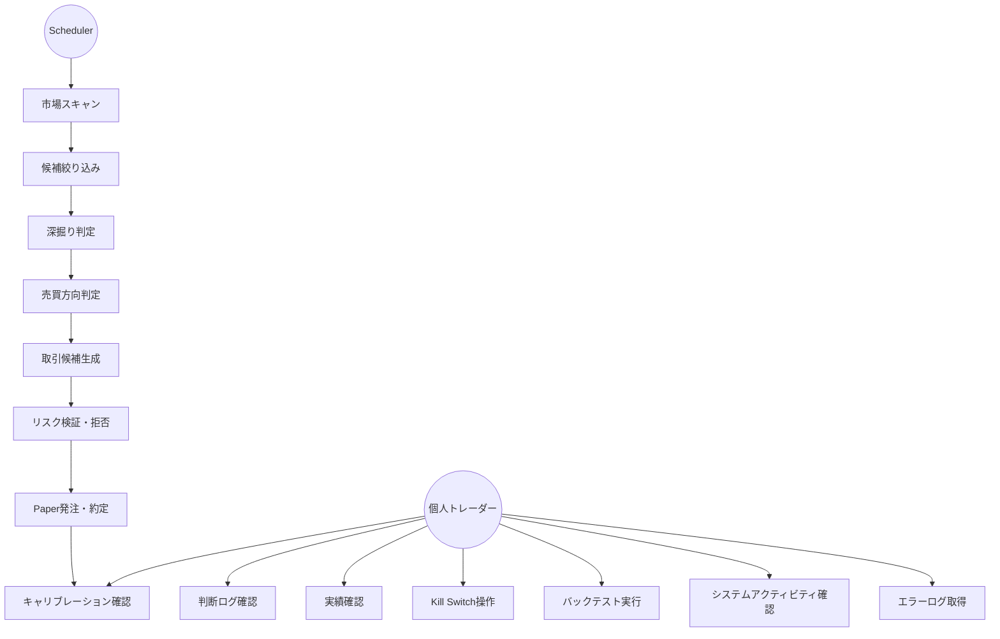
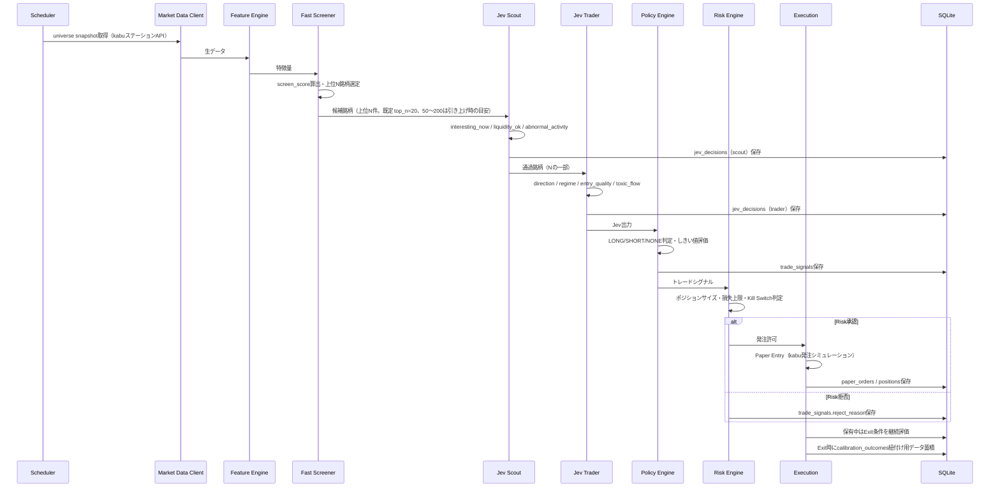
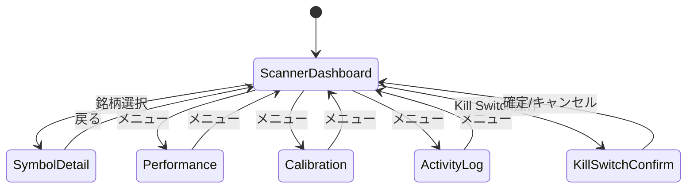

# 機能要件

## 1. ユースケース一覧

| ID | ユースケース | 主アクター | 概要 |
|----|------------|-----------|------|
| UC-1 | 市場スキャン | Scheduler | 対象ユニバースを周期的にスキャンし、特徴量を算出する |
| UC-2 | 候補絞り込み | Fast Screener | 数値条件・スコアで候補銘柄を機械的に絞り込む |
| UC-3 | 深掘り判定 | Jev Scout | 候補銘柄が今分析する価値があるかを判定する |
| UC-4 | 売買方向判定 | Jev Trader | Scout通過銘柄の方向・レジーム・エントリー品質を判定する |
| UC-5 | 取引候補生成 | Policy Engine | Jev出力をルールでトレードシグナルへ変換する |
| UC-6 | リスク検証・拒否 | Risk Engine | ポジションサイズ・損失上限・取引禁止条件を強制する |
| UC-7 | Paper発注・約定 | Execution | Paper Entry/Exitを実行し、ポジション・PnLを更新する |
| UC-8 | 判断ログ確認 | 個人トレーダー | Symbol Detail画面でJevの判断根拠・履歴を確認する |
| UC-9 | 実績確認 | 個人トレーダー | Performance画面でPnL・勝率・期待値等を確認する |
| UC-10 | キャリブレーション確認 | 個人トレーダー | Calibration画面でconfidence帯別の的中率・平均リターンを確認する |
| UC-11 | Kill Switch操作 | 個人トレーダー | UIまたはサーバーから新規取引停止・強制決済を行う |
| UC-12 | バックテスト実行 | 個人トレーダー | Paper Trading開始前に過去データで戦略を検証する |
| UC-13 | システムアクティビティ確認 | 個人トレーダー | Log画面でジョブキュー実行状況・直近のJev呼び出し・Kill Switch関連イベントをリアルタイムに確認する |
| UC-14 | 環境設定 | 個人トレーダー | Settings画面でJev/kabuステーション/Slack/Luna/Sol/Opus/ニュースフィードの認証情報をキー単位で保存・削除する |
| UC-15 | 初回セットアップ | 個人トレーダー | 必須認証情報（Jev/kabuステーション）が未設定のとき、Setup画面へ誘導され、入力を完了してから通常画面へ進む |
| UC-16 | エラーログ取得 | 個人トレーダー（運用者） | Settings画面から期間・レベルを指定してエラーログをダウンロードし、調査・共有に使う |

## 2. 主要処理フロー

## 3. 対象市場とスコープ

- 対象: 東証上場銘柄、現物またはPaper Trading
- 基本時間軸: 1分足
- MVP戦略: 短期モメンタム / 出来高急増 / ブレイクアウト / VWAP乖離からの継続・反転
- 想定保有時間: 最短数分、基本5〜30分、原則として日跨ぎしない

## 4. コンポーネント別機能要件

§4は `.linterly.yml` の300行/ファイル制限のため別ファイルに分割している（節番号・FR-ID・内容は分割前と同一）。

| 節 | ファイル |
|----|----------|
| §4.1〜§4.9（Feature Engine〜状態管理） | `docs/requirements/functional/components-pipeline.md` |
| §4.10〜§4.19（Scheduler/Worker〜エラーログのダウンロード） | `docs/requirements/functional/components-platform.md` |

## 5. 画面別機能（Wails デスクトップアプリ）

### 5.1 Scanner Dashboard

表示項目: Symbol, Price, 1m/5m Return（パーセント表示。Feature Engineの小数比を×100）, Volume Ratio, VWAP距離, Spread, Jev Direction, Jev Confidence, Entry Quality, Current Position。候補銘柄更新周期（15〜30秒）に応じてライブ更新する。

候補表の上に**スキャン状況パネル**を置く（issue #303。動作確認・「なぜこの銘柄が候補に出ないか」の調査用）:

- FR-SCAN-3: 最新サイクルの**ファネル件数**（ユニバース → 特徴量算出 → Fast Screener通過 → Scout通過）と、最終サイクルの時刻・所要時間を表示する。Scout通過は候補に対するJev Scoutの判定が済んだ分までの件数（判定済み件数も併記）
- FR-SCAN-4: 「スキャン対象を見る」で、ユニバース全銘柄（最大約4,000）のコード・名称・市場・状態（通過/除外/データ欠損）・理由・Scout結果を一覧する。検索（コード/名称）、状態・理由での絞り込み、ページング（既定50件・最大200件）を備え、1回に描画する行数を抑える
- FR-SCAN-5: 除外は落ちた条件（FR-FS-1の閾値名＋上位N件の外）を、欠損は取得できなかった値（板情報なし・履歴不足（FR-FE-5）・市況データ未取得）を、理由コードと人が読めるラベルで示す。全フィルターを評価し複数の理由を併記する
- FR-SCAN-6: 結果は**開いた時点のスナップショット**で、「更新」ボタン・絞り込み・ページ送りで再取得する（`/ws/scanner`には流さず、その挙動は変えない）。保持は最新1サイクル分のメモリ上のみで、再起動後・初回サイクル完了前は「まだスキャンサイクルが実行されていません」の空状態を表示する

### 5.2 Symbol Detail

チャート（Price/VWAP/Volume）、Jev判定（Direction/Confidence/Regime/Entry Quality/Toxic Flow/Liquidity Stress）、Risk（Allowed Position/Stop/Take Profit）、Decision historyを表示する。

### 5.3 Performance

Total PnL, Daily PnL, Win Rate, Profit Factor, Expectancy, Max Drawdown, Average Hold Time, Sharpe/Sortino参考値, Signal countを表示する。

### 5.4 Calibration

confidence帯（0.50-0.60 〜 0.90-1.00）ごとの実方向一致率、平均future returnを表示する。

### 5.5 System Activity Log

表示項目: キュー別（6キュー）の`pending`/`running`/直近`failed`件数、直近アクティビティ一覧（時刻・種別 [job/jev_scout/jev_trader/kill_switch]・対象銘柄・詳細・latency_ms）、直近Kill Switchイベント。キュー種別・イベント種別でフィルタ可能とする。新規イベント発生に応じて`/ws/activity`経由でライブ更新する（§4.15）。

## 6. MVPフェーズ

| Phase | 内容 |
|-------|------|
| Phase 0: Data | 市場データ取得（kabuステーションAPI）、1分足保存、Feature Engine構築 |
| Phase 1: Scanner | Fast Screener、Scanner Dashboard、Top候補表示 |
| Phase 2: Jev Scout | Jev API接続、Scout Questions実装、Decision Log保存 |
| Phase 3: Jev Trader | LONG/SHORT/NONE判定、Policy Engine |
| Phase 4: Paper Trading | Entry/Exit、Position管理、Paper約定、PnL |
| Phase 5: Calibration | Outcome Labeling、Confidence bucket分析、Brier/Log Loss、RAG用embedding索引構築（§4.13） |
| Phase 6: Continuous Loop | Event-driven refresh、Open position monitoring、Kill Switch、Alert、Sol/Opusによる自己改善ループ（§4.14） |
| Phase 7: Small Live | 十分な検証後、法令・証券会社API規約を確認した上でごく小さなサイズから検討 |

## 7. MVP完了条件

- 対象銘柄を自動取得できる（kabuステーションAPI経由）
- 60秒周期でスキャンできる
- Fast Screenerで候補を絞れる
- Jev Scout / Traderを自動実行できる
- 判断結果をDB保存できる
- Risk Engineが拒否権を持つ
- Paper Tradingが動作する
- Exitが自動実行される
- PnLが集計される
- Jev判断と将来リターンを紐付けられる
- Calibration Dashboardが表示される
- Kill Switchが動作する
- RAGが類似局面をJevへの文脈として注入できる（§4.13）
- Sol/Opusの自己改善提案がシャドーバックテストで検証され、承認された場合のみ自動適用・監査ログ記録される（§4.14、Phase 6スコープ）
- System Activity Log画面でジョブキュー実行状況・直近アクティビティをリアルタイム確認できる（§4.15）

## 8. 実装時の最初の成功基準

「儲かるAI」を作ることを最初の目標にしない。最初に検証すべき問いは以下。

> Jevを通した銘柄群は、通していない銘柄群と比べて、5分後/10分後/20分後の期待リターン分布が改善するか？

これが確認できた後にEntry、Exit、Position Sizingを最適化する。

## 改訂履歴

| 版 | 日付 | 変更内容 | 変更理由 |
|----|------|---------|---------|
| 1.0 | 2026-09-26 | 新規作成 | 初版 |
| 1.1 | 2026-09-26 | Risk Engine（§4.7）にPaper/Live別リミット・dead-man's switch（FR-RISK-6）・Kill Switch再開の自動/手動分類（FR-RISK-7）を追加 | Phase 7も含めた完全自動運用への方針変更 |
| 1.2 | 2026-09-26 | §4.13 Jev RAG（経験ベース文脈拡張）、§4.14 自己改善ループ（Luna/Sol/Opus連携）を追加。Phase 5/6内容とMVP完了条件を更新 | 自己学習による継続的改善を組み込む方針 |
| 1.3 | 2026-09-29 | UC-13・§4.15 System Activity Feed・§5.5 System Activity Log画面を追加。既存jobs/jev_decisions/kill_switch_eventsを集約する読み取り専用フィードとし、新規永続テーブルは追加しない | 実行中処理を可視化するログ画面の追加要望 |
| 1.4 | 2026-09-29 | §4.14にFR-SELFIMPROVE-8/9（LLM出力の機械的検証、決定的しきい値とAIレビューの併用）を追加。§4.16 Luna ニュース分類・News Ingest（FR-LUNA-1〜5）を新設。新規テーブルは追加せず既存カラム（jev_decisions.state_json等）を利用 | 現状Jevのみが実AI呼び出しであった状態の是正（AI機能実装フェーズ） |
| 1.5 | 2026-09-29 | UC-14・§4.17 環境設定（FR-SETTINGS-1〜4）を追加。Settings画面をキー単位の保存・削除へ変更 | issue #79実装 |
| 1.6 | 2026-09-29 | UC-15・§4.18 初回セットアップ誘導（FR-SETUP-1〜5）を追加。FR-SETTINGS-4の必須キー警告バナーを廃止し任意キーのみの案内へ縮小 | issue #80実装 |
| 1.7 | 2026-09-29 | §4.7にFR-RISK-2/FR-RISK-7の検知基準（market_data_down/jev_api_down/broker_api_error/db_write_failure/unexpected_position/fill_discrepancy）と1分周期の自動検知・自動再開を追記 | issue #93/#94/#95実装 |
| 1.8 | 2026-09-29 | §4を`docs/requirements/functional/`配下の章別ファイル（components-pipeline/components-platform）へ分割。節番号・FR-IDは変更なし | issue #119（300行/ファイル制限の形骸化解消） |
| 1.9 | 2026-10-01 | §4.4/§4.5のJev質問を公式APIの型（`noul`/`choice`）で明記。FR-SCOUT-3のコスト保存を「APIが課金額を返さないためNULL」へ訂正し、`question_version`の現行値を追記 | issue #263 |
| 1.10 | 2026-10-01 | UC-16・§4.19 エラーログのダウンロード（FR-ERRLOG-1〜7）を追加。既存のslogログ（`logs/`）を読み出す読み取り専用機能とし、新規永続テーブルは追加しない | issue #267 |
| 1.11 | 2026-10-02 | FR-SETTINGS-1の許可キー一覧から`UPDATE_GITHUB_TOKEN`を削除（更新確認用トークン機能の廃止） | 更新確認用トークン機能の廃止 |
| 1.12 | 2026-10-02 | FR-SETTINGS-1の許可キーへ`JEV_MODEL`を追加し、FR-SETUP-1/2/4の必須キーを3項目から2項目（`JEV_API_KEY`/`KABU_API_PASSWORD`。`JEV_BASE_URL`は既定値付きの任意上書き）へ変更（`functional/components-platform.md`） | issue #271/#291 |
| 1.13 | 2026-10-02 | FR-ERRLOG-3のマスク対象を拡張（`http://`のSlack URL、`Authorization: Basic/Digest/Negotiate`、queryの`passwd`/`secret`/`authorization`）、FR-ERRLOG-4に予算消化後の打ち切りを明記、FR-ERRLOG-5にExporter未注入時は500を明記（`functional/components-platform.md`） | issue #288/#289/#290 |
| 1.14 | 2026-10-02 | §4.17にFR-SETTINGS-5（kabuトークン発行失敗時の継続起動・自動再試行と、原因別案内を示す市況データ接続バナー）、FR-SETTINGS-6（公開リリースが無い場合を失敗ではなく専用文言で表示）を追加（`functional/components-platform.md`） | issue #295/#296（要件側の記述漏れを解消: issue #298） |
| 1.15 | 2026-10-03 | FR-SETTINGS-1/4・FR-SETUP-2を接続先別の一覧＋モーダル構成へ変更（「詳細設定（任意）」の折りたたみを廃止し、キー・URL・モデル名を接続先ごとに集約。アップデート／エラーログは「システム」節のモーダル。`functional/components-platform.md`） | issue #302 |
| 1.16 | 2026-10-03 | §5.1 にスキャン状況パネル（FR-SCAN-3〜6: ファネル件数・ユニバース銘柄一覧・除外/欠損理由・手動更新）を追加 | issue #303 |
| 1.17 | 2026-10-03 | FR-RAG-5（Decision historyの類似局面件数表示）を「将来拡張・未実装」と明記し、参照先`components/overview.md`に記述がない旨と実装時の前提を追記（`functional/components-platform.md` §4.13。`architecture/overview.md` §4のRAG Context Builder行の参照範囲をFR-RAG-1〜4へ訂正） | issue #307 |
| 1.18 | 2026-10-03 | §2の処理フロー図で、Fast Screener候補数を「50〜200」固定からFR-FS-2の上位N件（既定 top_n=20、`config/strategy.yaml`）へ訂正し、Scout通過数の固定値「10〜30」を「Nの一部」へ変更。FR-FS-2（`functional/components-pipeline.md`）へ`top_n`既定値を明記 | issue #327（仕様と同梱既定値の乖離解消。Jev APIコストを抑える側の現行既定を維持） |
