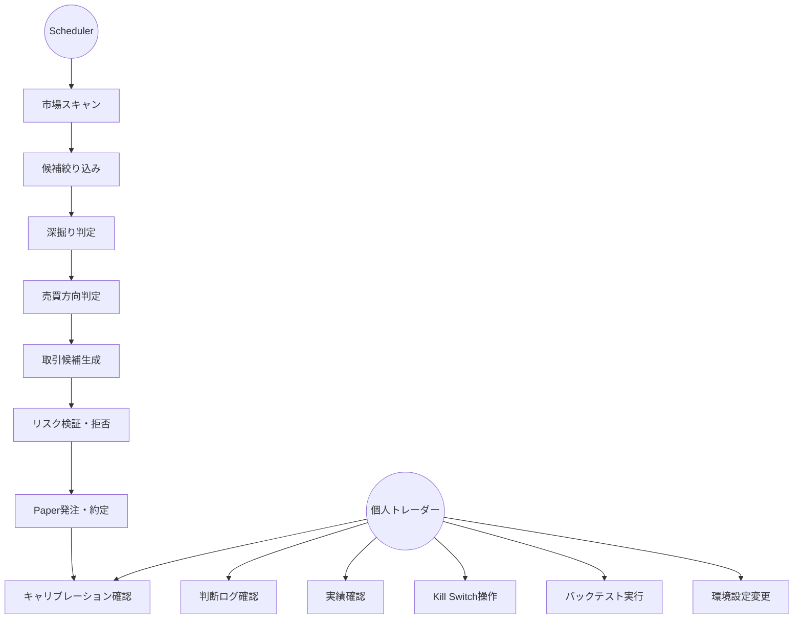
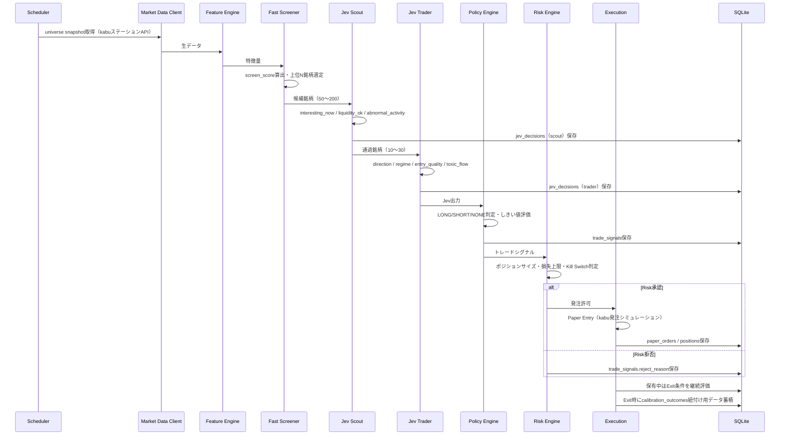
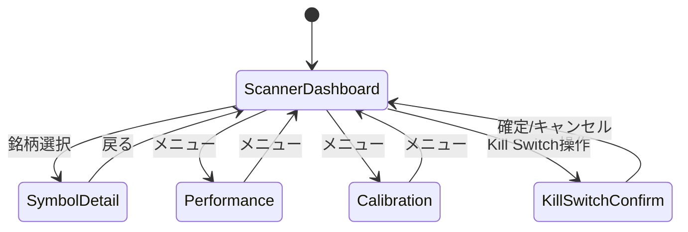

# 機能要件

## 1. ユースケース一覧

| ID | ユースケース | 主アクター | 概要 |
|----|------------|-----------|------|
| UC-1 | 市場スキャン | Scheduler | 対象ユニバースを周期的にスキャンし、特徴量を算出する |
| UC-2 | 候補絞り込み | Fast Screener | 数値条件・スコアで候補銘柄を機械的に絞り込む |
| UC-3 | 深掘り判定 | Jev Scout | 候補銘柄が今分析する価値があるかを判定する |
| UC-4 | 売買方向判定 | Jev Trader | Scout通過銘柄の方向・レジーム・エントリー品質を判定する |
| UC-5 | 取引候補生成 | Policy Engine | Jev出力をルールでトレードシグナルへ変換する |
| UC-6 | リスク検証・拒否 | Risk Engine | ポジションサイズ・損失上限・取引禁止条件を強制する |
| UC-7 | Paper発注・約定 | Execution | Paper Entry/Exitを実行し、ポジション・PnLを更新する |
| UC-8 | 判断ログ確認 | 個人トレーダー | Symbol Detail画面でJevの判断根拠・履歴を確認する |
| UC-9 | 実績確認 | 個人トレーダー | Performance画面でPnL・勝率・期待値等を確認する |
| UC-10 | キャリブレーション確認 | 個人トレーダー | Calibration画面でconfidence帯別の的中率・平均リターンを確認する |
| UC-11 | Kill Switch操作 | 個人トレーダー | UIまたはサーバーから新規取引停止・強制決済を行う |
| UC-12 | バックテスト実行 | 個人トレーダー | Paper Trading開始前に過去データで戦略を検証する |
| UC-13 | 環境設定変更 | 個人トレーダー | Settings画面で認証情報をフィールドごとに保存・削除する |



## 2. 主要処理フロー



## 3. 対象市場とスコープ

- 対象: 東証上場銘柄、現物またはPaper Trading
- 基本時間軸: 1分足
- MVP戦略: 短期モメンタム / 出来高急増 / ブレイクアウト / VWAP乖離からの継続・反転
- 想定保有時間: 最短数分、基本5〜30分、原則として日跨ぎしない

## 4. コンポーネント別機能要件

### 4.1 Feature Engine

市場データから以下の特徴量を算出する。

| カテゴリ | 特徴量 |
|---------|--------|
| 価格 | return_1m/3m/5m/15m/30m, high_distance_5m, low_distance_5m, session_high_distance, session_low_distance |
| VWAP | vwap, price_vs_vwap_bps, vwap_slope, vwap_cross_direction |
| 出来高 | volume_1m/5m, volume_ratio_1m/5m, turnover_1m/5m |
| ボラティリティ | atr_1m/5m, realized_vol_5m/15m, volatility_expansion_ratio |
| 板・約定（取得可能な場合） | best_bid, best_ask, spread_bps, bid_depth, ask_depth, orderbook_imbalance, buy_trade_ratio, sell_trade_ratio, trade_flow_imbalance, microprice |
| 市場コンテキスト | TOPIX/Nikkei225 return_1m/5m, sector_return_5m, stock_vs_sector_relative_strength, market_breadth |

- FR-FE-1: すべての特徴量は判定時点までのデータのみで算出する（look-ahead防止、§9 バックテスト参照）
- FR-FE-2: 板・約定特徴量はkabuステーションAPIから取得できない銘柄・時間帯では欠損値として扱い、依存するJev入力/スコアから除外する

### 4.2 Fast Screener

- FR-FS-1: Jev API呼び出し前に、環境変数/DB設定値（`min_price`, `max_price`, `min_turnover_5m_jpy`, `max_spread_bps`, `min_volume_ratio`, `min_abs_return_5m_pct`, `min_realized_volatility`）で明らかに対象外の銘柄を除外する
- FR-FS-2: 通過銘柄に対し以下のスコアを算出し、上位N銘柄のみJev Scoutへ送る

```text
screen_score =
  w1 * normalized_volume_ratio
+ w2 * abs(return_5m)
+ w3 * breakout_strength
+ w4 * orderbook_imbalance
+ w5 * volatility_expansion
```

- FR-FS-3: フィルター設定値・スコア重みはすべて環境変数またはDBで変更可能とする

### 4.3 スキャン頻度・イベント駆動

| 対象 | 周期 |
|------|------|
| 全体スキャン | 60秒ごと |
| 候補銘柄更新 | 15〜30秒ごと |
| ポジション保有銘柄 | 5〜15秒ごと |

- FR-SCAN-1: 以下のいずれかを満たした銘柄は通常周期を待たず再評価する: 1分リターン急変、出来高急増、スプレッド急拡大、板インバランス急変、VWAPクロス、高値/安値ブレイク、約定フロー急変、ニュースフラグ発生
- FR-SCAN-2（再評価抑制）: `abs(return_1m_change) < threshold AND volume_ratio_change < threshold AND spread_change < threshold AND no_event` の場合はJev呼び出しをスキップし、APIコストとレイテンシを削減する

### 4.4 Jev Scout

- FR-SCOUT-1: 1回のJev呼び出しで以下の質問群を評価する: `interesting_now`（yes/no型）, `momentum_quality`（weak/moderate/strong/exceptional）, `liquidity_ok`（yes/no型）, `abnormal_activity`（yes/no型）
- FR-SCOUT-2: 通過条件は `interesting_now >= 0.65 AND liquidity_ok >= 0.70 AND abnormal_activity >= 0.55`（初期値。バックテスト後に調整）
- FR-SCOUT-3: 入力・出力・状態ハッシュ・レイテンシ・モデルID・コストを`jev_decisions`（decision_type=scout）に保存する

### 4.5 Jev Trader

- FR-TRADER-1: Scout通過銘柄に対し以下を評価する: `direction`（LONG/SHORT/NONE）, `regime`（TREND/RANGE/BREAKOUT/CHAOTIC）, `entry_quality`（poor〜exceptional）, `toxic_flow`（yes/no型）, `liquidity_stressed`（yes/no型）, `continuation_probability`（yes/no型）
- FR-TRADER-2: Jevのconfidence/probabilityを実際の株価上昇確率とみなさない。実結果との対応はCalibrationで独自に検証する
- FR-TRADER-3: 入出力を`jev_decisions`（decision_type=trader）に保存する

### 4.6 Policy Engine

- FR-POLICY-1: LONG条件: `direction == LONG AND P(LONG) >= 0.68 AND entry_quality >= strong AND continuation_probability >= 0.60 AND toxic_flow <= 0.35 AND liquidity_stressed <= 0.25`
- FR-POLICY-2: SHORT条件: `direction == SHORT AND P(SHORT) >= 0.68 AND entry_quality >= strong AND continuation_probability >= 0.60 AND toxic_flow <= 0.35 AND liquidity_stressed <= 0.25`
- FR-POLICY-3: 以下のいずれかに該当する場合はNONE（取引しない）: JevがNONE、確信度不足、スプレッド過大、板が薄い、Risk Engine拒否、データ欠損、API異常、キャリブレーション対象外
- FR-POLICY-4: しきい値はCalibration結果に基づき調整する。プロンプト変更より先にポリシー側のしきい値調整を優先する
- FR-POLICY-5: 生成したトレードシグナルを`trade_signals`に保存する（policy_version、risk_passed、reject_reasonを含む）

### 4.7 Risk Engine

Risk EngineはJevより優先され、Jevから変更できない。Phase 7（実売買）移行後も人手承認を挟まず自動運用することを前提とし、その代わりPaper運用よりも厳格なLive用リミットと、後述のdead-man's switchで安全側に倒す。

| 項目 | Paper初期値 | Live初期値（Phase 7） |
|------|-----------|----------------------|
| max_position_per_symbol_pct | 2.0 | 1.0 |
| max_total_exposure_pct | 20.0 | 10.0 |
| max_daily_loss_pct | 1.0 | 0.5 |
| max_trade_loss_pct | 0.25 | 0.15 |
| max_open_positions | 5 | 3 |
| max_spread_bps | 30 | 20 |
| max_consecutive_losses | 4 | 3 |
| cooldown_after_loss_minutes | 5 | 10 |
| force_flat_before_market_close_minutes | 10 | 15 |
| heartbeat_timeout_minutes（Live専用） | 対象外 | 120 |

- FR-RISK-1: 上記制限のいずれかに抵触する場合、新規取引を拒否する
- FR-RISK-2: 以下のいずれかでKill Switch（新規取引停止）を発動する: 日次損失上限到達、連敗上限到達、市場データ停止、Jev API連続失敗、Broker API異常、想定外ポジション発生、約定差異検知、DB書き込み失敗が一定回数継続、operator_heartbeat_timeout（Live専用、FR-RISK-6参照）
- FR-RISK-3: Kill Switch発動時、必要に応じて保有ポジションをクローズする
- FR-RISK-4: Kill SwitchはUI（Wailsアプリ）とサーバー内部処理の両方から操作可能とする。Phase 7の発注確定・Kill Switch操作に人手の追加認証は要求しない（完全自動運用）
- FR-RISK-5: すべてのRisk拒否・Kill Switch発動・自動再開を監査ログ（`kill_switch_events`）に記録する
- FR-RISK-6（dead-man's switch、Live専用）: Wailsアプリの認証済みUIリクエストを「操作者ハートビート」として記録する。立会時間中に`heartbeat_timeout_minutes`（初期値120分）を超えてハートビートが途絶した場合、Risk Engineは自動的に新規エントリーを停止する（保有ポジションのExitルールは継続）。オペレーターがUIを再度操作した時点でこの停止理由は自動解消する
- FR-RISK-7（Kill Switch再開の自動/手動分類）: `kill_switch_events.reason`により再開方法を分ける

| 発動理由 | 再開方法 |
|---------|---------|
| market_data_down（データ復旧確認後） | 自動再開 |
| jev_api_down（API復旧確認後） | 自動再開 |
| operator_heartbeat_timeout（ハートビート再検知） | 自動再開 |
| cooldown_after_loss経過（連敗後クールダウン） | 自動再開 |
| daily_loss_limit（日次損失上限到達） | 手動再開のみ |
| unexpected_position（想定外ポジション） | 手動再開のみ |
| fill_discrepancy（約定差異） | 手動再開のみ |
| consecutive_losses（連敗上限到達） | 手動再開のみ |
| db_write_failure（DB書き込み失敗継続） | 手動再開のみ |
| broker_api_error（Broker API異常） | 手動再開のみ |

### 4.8 Entry / Exit

- FR-ENTRY-1: 成行想定Paper Entry・指値Paper Entryの両方を選択可能とする
- FR-ENTRY-2: 実売買へ移行する場合は原則として指値を優先する
- FR-EXIT-1: 以下のExit条件を併用する: 固定Stop Loss、固定Take Profit、Trailing Stop、Jev方向反転、continuation_probability低下、VWAP逆クロス、最大保有時間到達、引け前強制決済
- FR-EXIT-2: 初期値: `stop_loss_pct=0.6`, `take_profit_pct=1.2`, `trailing_stop_pct=0.5`, `max_holding_minutes=20`
- FR-EXIT-3: Jev API不応答時も、既存ポジションはコードベースのExit Ruleで管理を継続する（Jev不応答を理由にリスク管理を停止しない）

### 4.9 状態管理

各銘柄について以下を保持する。

```json
{
  "symbol": "XXXX",
  "last_price": 0,
  "last_scan_at": null,
  "last_jev_scout_at": null,
  "last_jev_trader_at": null,
  "last_signal": "NONE",
  "last_signal_confidence": 0,
  "position": null,
  "cooldown_until": null
}
```

### 4.10 Scheduler / Worker

- FR-SCHED-1: 以下のQueueで非同期処理する: market-data, feature-calc, jev-scout, jev-trader, risk-check, paper-execution, outcome-labeling, analytics
- FR-SCHED-2: 60秒周期でuniverse snapshot取得・特徴量算出・screen・Jev Scout enqueueを行う
- FR-SCHED-3: 15〜30秒周期でshortlist銘柄を再評価する
- FR-SCHED-4: 5〜15秒周期で保有ポジションのExit条件を評価する

### 4.11 バックテスト

Paper Trading開始前に最低限以下を検証する。

- FR-BT-1: 取引回数、勝率、平均利益、平均損失、Profit Factor、Expectancy、Max Drawdown、スリッページ込みPnL、手数料込みPnLを算出する
- FR-BT-2: Training/Calibration → Validation → Forward periodのWalk Forwardを繰り返す（全期間一括最適化しない）
- FR-BT-3: 特徴量は判定時点までのデータのみで生成する（look-ahead防止）

### 4.12 Jevキャリブレーション

- FR-CAL-1: すべてのJev判定について `state` / `decision` / `outcome` の3要素を保存する
- FR-CAL-2: 評価指標としてBrier Score、Log Loss、Expected Calibration Error、Reliability Curve、方向別平均リターン、confidence bucket別PnLを算出する
- FR-CAL-3: confidence帯（0.50-0.60, 0.60-0.70, 0.70-0.80, 0.80-0.90, 0.90-1.00）ごとに方向一致率と平均future returnを算出する
- FR-CAL-4: 判定水平線（horizon）ごとに`future_return`, `max_adverse_excursion`, `max_favorable_excursion`, `was_direction_correct`を`calibration_outcomes`に保存する

### 4.13 Jev RAG（経験ベース文脈拡張）

Jev Scout/Traderが「今の状態」だけでなく「過去の類似局面で何が起きたか」を踏まえて判断できるよう、過去データを検索し文脈として注入する。

- FR-RAG-1: `market_snapshots`（全スナップショット）および`jev_decisions`（判断が発生した局面。`calibration_outcomes`と紐付く）の各行に、標準化済み特徴量ベクトル（return_1m/5m/15m, price_vs_vwap_bps, volume_ratio_1m/5m, spread_bps, orderbook_imbalance, realized_vol_5m/15m, volatility_expansion_ratio, market_return_5m, sector_return_5m 等）を`market_snapshot_vectors`/`jev_decision_vectors`（sqlite-vec `vec0`仮想テーブル）に保存する
- FR-RAG-2: Jev Scout/Trader呼び出し直前に、現在の状態ベクトルに対しsqlite-vecで類似度上位k件（初期値k=5）を`jev_decisions`（`calibration_outcomes`紐付き済みのもの優先）および`market_snapshots`から検索する
- FR-RAG-3: 検索結果（類似局面の方向・regime・実際のfuture_return・was_direction_correct等の要約）をJevへのプロンプトにfew-shot文脈として注入する。埋め込みはLLM API呼び出しを伴わない数値特徴量ベクトルのみを用い、追加のAPIコスト・レイテンシを発生させない
- FR-RAG-4: 蓄積データが不十分な期間（コールドスタート）はRAG文脈を空のまま呼び出す（Jevの通常判断のみで動作する）
- FR-RAG-5: Symbol DetailのDecision historyに、参照した類似局面の件数を付加情報として表示できる（`components/overview.md`参照。UI必須要件ではない）

### 4.14 自己改善ループ（Luna / Sol / Opus 連携）

MVP必須要件ではないが、Phase 6（Continuous Loop）の一部として組み込む。「自己学習しながら継続的に改善する」ことを目的とし、高頻度の売買判断（Jev）とは分離した低頻度の振り返り・改善提案・検証・適用ループを構成する。

| 役割 | 用途 | 呼び出し頻度 |
|------|------|------------|
| Luna（Sense） | ニュース分類・決算要約・bullish/bearish/neutral分類・イベント抽出 | リアルタイム補助（高頻度ループ内） |
| Jev（Decide） | 個別銘柄の売買方向・レジーム判断（RAG文脈込み） | 高頻度（§4.4, §4.5） |
| Sol（Think） | 負けトレード分析・相場環境変化分析・Jev誤判定クラスタ分析を行い、Policy Engineしきい値の改善提案（rationale付き）を生成する | 低頻度（日次、引け後） |
| Opus（Govern） | Solの改善提案をレビューし、直近の実績データでシャドーバックテスト検証した上で承認/却下する | Sol提案発生時のみ |
| Risk Engine（Control） | ポジションサイズ・損失上限等の最終拒否権。Sol/Opusからは変更不可 | 常時 |
| Execution（Act） | 発注・約定 | 常時 |

- FR-SELFIMPROVE-1: Sol は日次（引け後）に、直近の負けトレード・Calibration指標（Brier Score/ECE/confidence bucket別PnL）を分析し、`policy_proposals`に改善提案（`rationale_json`, `proposed_changes_json`）を記録する
- FR-SELFIMPROVE-2: Solが変更を提案できる対象は`runtime_settings`の`policy.*`キー（Policy Engineのしきい値）に限定する。`risk.*`キー（Risk Engineのリミット値）および Jev の`prompt_version`/質問セット自体は自己改善ループの対象外とし、人手のみが変更できる（`overview.md` 非目標「AIによるリスクルール変更」を継続遵守）
- FR-SELFIMPROVE-3: 1提案あたりの変更幅は confidence系しきい値で±0.05、entry_quality等の段階型しきい値で1段階までを上限とする
- FR-SELFIMPROVE-4: Opusは提案を受け取ると、直近の`trade_signals`/`jev_decisions`/`calibration_outcomes`（直近20営業日相当）に対し提案後しきい値を適用した場合のExpectancy・Max Drawdownをシャドーバックテスト（バックテストエンジン§4.11を再利用）で算出し、既存policy_versionに対しExpectancyが悪化せずMax Drawdownの悪化が許容範囲内（相対10%以内）の場合のみ承認する
- FR-SELFIMPROVE-5: 承認された提案は新しい`policy_version`として`runtime_settings`に自動適用し、`policy_proposals.status`を`applied`に更新する。却下時は`rejected`として理由を記録する
- FR-SELFIMPROVE-6: 適用後5営業日相当のExpectancyが適用前より相対20%以上悪化した場合、自動的に直前の`policy_version`へロールバックし、Slack通知する
- FR-SELFIMPROVE-7: Sol/Opusの提案・レビュー・適用・ロールバックはすべて`policy_proposals`と`runtime_settings`の変更履歴として監査可能な形で保存する

### 4.15 環境設定（Settings）

Jev/kabuステーションAPI/Slack等の認証情報をUIから設定する。`components/overview.md` §3 `SettingsPage`、`api/endpoints.md` §4の実装詳細。

- FR-SETTINGS-1: Settings画面は認証情報フィールド（`JEV_API_KEY`/`JEV_BASE_URL`/`KABU_API_PASSWORD`/`SLACK_WEBHOOK_URL`、および将来追加される外部AI連携キー）をフィールドごとに独立した保存フォームとして表示する
- FR-SETTINGS-2: 1フィールドの保存・削除は他フィールドの値に一切影響しない。1回のリクエストは常に単一キーのみを対象とする（従来の全フィールド一括POSTで空欄送信すると他フィールドまで削除されていた問題を解消）
- FR-SETTINGS-3: 保存済みの値は再表示せず「設定済み」バッジのみ表示する（既存方針を継続、issue #57）
- FR-SETTINGS-4: 対象フィールドは`internal/config`側の許可キー一覧（allow-list）で定義する。一覧に無いキー名を指定するリクエストは400を返す

## 5. 画面別機能（Wails デスクトップアプリ）



### 5.1 Scanner Dashboard

表示項目: Symbol, Price, 1m/5m Return, Volume Ratio, VWAP距離, Spread, Jev Direction, Jev Confidence, Entry Quality, Current Position。候補銘柄更新周期（15〜30秒）に応じてライブ更新する。

### 5.2 Symbol Detail

チャート（Price/VWAP/Volume）、Jev判定（Direction/Confidence/Regime/Entry Quality/Toxic Flow/Liquidity Stress）、Risk（Allowed Position/Stop/Take Profit）、Decision historyを表示する。

### 5.3 Performance

Total PnL, Daily PnL, Win Rate, Profit Factor, Expectancy, Max Drawdown, Average Hold Time, Sharpe/Sortino参考値, Signal countを表示する。

### 5.4 Calibration

confidence帯（0.50-0.60 〜 0.90-1.00）ごとの実方向一致率、平均future returnを表示する。

### 5.5 Settings

対象フィールド（`JEV_API_KEY`/`JEV_BASE_URL`/`KABU_API_PASSWORD`/`SLACK_WEBHOOK_URL`等）をフィールドごとの入力欄＋保存ボタン＋（設定済みの場合）削除ボタンとして表示する。1フィールドの保存・削除は他フィールドに影響しない（§4.15）。

## 6. MVPフェーズ

| Phase | 内容 |
|-------|------|
| Phase 0: Data | 市場データ取得（kabuステーションAPI）、1分足保存、Feature Engine構築 |
| Phase 1: Scanner | Fast Screener、Scanner Dashboard、Top候補表示 |
| Phase 2: Jev Scout | Jev API接続、Scout Questions実装、Decision Log保存 |
| Phase 3: Jev Trader | LONG/SHORT/NONE判定、Policy Engine |
| Phase 4: Paper Trading | Entry/Exit、Position管理、Paper約定、PnL |
| Phase 5: Calibration | Outcome Labeling、Confidence bucket分析、Brier/Log Loss、RAG用embedding索引構築（§4.13） |
| Phase 6: Continuous Loop | Event-driven refresh、Open position monitoring、Kill Switch、Alert、Sol/Opusによる自己改善ループ（§4.14） |
| Phase 7: Small Live | 十分な検証後、法令・証券会社API規約を確認した上でごく小さなサイズから検討 |

## 7. MVP完了条件

- 対象銘柄を自動取得できる（kabuステーションAPI経由）
- 60秒周期でスキャンできる
- Fast Screenerで候補を絞れる
- Jev Scout / Traderを自動実行できる
- 判断結果をDB保存できる
- Risk Engineが拒否権を持つ
- Paper Tradingが動作する
- Exitが自動実行される
- PnLが集計される
- Jev判断と将来リターンを紐付けられる
- Calibration Dashboardが表示される
- Kill Switchが動作する
- RAGが類似局面をJevへの文脈として注入できる（§4.13）
- Sol/Opusの自己改善提案がシャドーバックテストで検証され、承認された場合のみ自動適用・監査ログ記録される（§4.14、Phase 6スコープ）

## 8. 実装時の最初の成功基準

「儲かるAI」を作ることを最初の目標にしない。最初に検証すべき問いは以下。

> Jevを通した銘柄群は、通していない銘柄群と比べて、5分後/10分後/20分後の期待リターン分布が改善するか？

これが確認できた後にEntry、Exit、Position Sizingを最適化する。

## 改訂履歴

| 版 | 日付 | 変更内容 | 変更理由 |
|----|------|---------|---------|
| 1.0 | 2026-09-26 | 新規作成 | 初版 |
| 1.1 | 2026-09-26 | Risk Engine（§4.7）にPaper/Live別リミット・dead-man's switch（FR-RISK-6）・Kill Switch再開の自動/手動分類（FR-RISK-7）を追加 | Phase 7も含めた完全自動運用への方針変更 |
| 1.2 | 2026-09-26 | §4.13 Jev RAG（経験ベース文脈拡張）、§4.14 自己改善ループ（Luna/Sol/Opus連携）を追加。Phase 5/6内容とMVP完了条件を更新 | 自己学習による継続的改善を組み込む方針 |
| 1.3 | 2026-09-29 | UC-13・§4.15 環境設定（Settings）（FR-SETTINGS-1〜4）・§5.5 Settings画面を追加。フィールドごとの個別保存・削除に仕様を明確化 | 一部のenvだけでも変更できるUI（環境設定UI拡張） |
